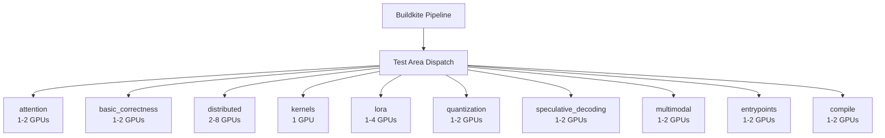

# Buildkite Test Areas

vLLM's Buildkite hardware CI organizes tests into **test areas** — logical groupings of related tests that run on real GPU hardware. Each test area targets a specific subsystem and can be run independently, enabling efficient parallelism across the hardware pool.

## Overview

Test areas map directly to subdirectories and test files within the `tests/` directory. The Buildkite pipeline dispatches each area to an appropriate hardware worker based on its requirements (number of GPUs, GPU type, memory needs).



## Test Area Descriptions

### `attention`

**Path**: `tests/` (attention-related tests)  
**Hardware**: 1–2 NVIDIA GPUs  
**Purpose**: Validates all attention backend implementations.

Tests cover:
- FlashAttention-2 correctness and performance
- FlashInfer backend
- Triton attention kernels
- MLA (Multi-head Latent Attention) for DeepSeek models
- Mamba/SSM attention
- Paged KV-cache attention correctness

```bash
# Run locally (requires GPU)
pytest tests/kernels/test_flash_attn.py -x -q
pytest tests/kernels/test_flashinfer.py -x -q
```

### `basic_correctness`

**Path**: `tests/basic_correctness/`  
**Hardware**: 1–2 NVIDIA GPUs  
**Purpose**: End-to-end correctness checks for the core inference pipeline.

This is the most critical test area — it verifies that vLLM produces numerically correct outputs compared to reference implementations (typically HuggingFace Transformers). Tests include:

- Greedy decoding correctness
- Sampling correctness (temperature, top-p, top-k)
- Chunked prefill correctness
- Prefix caching correctness
- KV cache correctness

```bash
pytest tests/basic_correctness/ -x -q
```

### `distributed`

**Path**: `tests/distributed/`  
**Hardware**: 2–8 NVIDIA GPUs (multi-GPU required)  
**Purpose**: Tests all distributed inference modes.

Covers:
- Tensor parallelism (TP=2, TP=4, TP=8)
- Pipeline parallelism (PP=2, PP=4)
- Expert parallelism for MoE models
- Data parallelism
- Multi-node inference (requires multi-node Buildkite agents)
- KV cache transfer between nodes (disaggregated prefill)

```bash
# Requires at least 2 GPUs
pytest tests/distributed/ -x -q --dist=no
```

> **Note**: Distributed tests use `pytest-forked` to isolate each test in a subprocess, preventing NCCL state from leaking between tests.

### `kernels`

**Path**: `tests/kernels/`  
**Hardware**: 1 NVIDIA GPU  
**Purpose**: Unit tests for custom CUDA/Triton kernels.

Tests cover:
- Activation functions (SiLU, GELU, etc.)
- Layer normalization (RMSNorm, LayerNorm)
- Rotary position embeddings (RoPE)
- Quantization kernels (FP8, INT8, AWQ, GPTQ)
- Paged attention kernels
- Fused kernels (fused QKV, fused MLP)
- Machete and Marlin GEMM kernels

```bash
pytest tests/kernels/ -x -q
```

### `lora`

**Path**: `tests/lora/`  
**Hardware**: 1–4 NVIDIA GPUs  
**Purpose**: LoRA adapter loading, inference, and correctness.

Tests cover:
- Single LoRA adapter loading and inference
- Multiple LoRA adapters (dynamic switching)
- LoRA with tensor parallelism
- Punica kernels for batched LoRA
- LoRA weight loading from HuggingFace Hub
- LoRA with quantized base models

```bash
pytest tests/lora/ -x -q
```

### `quantization`

**Path**: `tests/quantization/`  
**Hardware**: 1–2 NVIDIA GPUs  
**Purpose**: Quantization format correctness and performance.

Tests cover:
- FP8 (W8A8, W8A16)
- AWQ (Activation-aware Weight Quantization)
- GPTQ (with and without ExLlama kernels)
- BitsAndBytes (4-bit NF4, 8-bit)
- Compressed-Tensors
- GGUF format loading
- KV cache quantization (FP8 KV)
- MXFP4 (microscaling)

```bash
pytest tests/quantization/ -x -q
```

### `speculative_decoding`

**Path**: `tests/` (speculative decoding tests)  
**Hardware**: 1–2 NVIDIA GPUs  
**Purpose**: Speculative decoding correctness and acceptance rate validation.

Tests cover:
- EAGLE speculative decoding
- Medusa heads
- N-gram prompt lookup
- Suffix decoding (arctic-inference)
- Multi-Token Prediction (MTP)
- Draft model speculative decoding
- Acceptance rate metrics

```bash
pytest tests/spec_decode/ -x -q
```

### `multimodal`

**Path**: `tests/multimodal/`  
**Hardware**: 1–2 NVIDIA GPUs  
**Purpose**: Multimodal model correctness (vision, audio, video).

Tests cover:
- Image input processing and encoding
- Audio input processing (Whisper-style)
- Video frame processing
- Multimodal KV cache
- Vision-language model correctness (LLaVA, Qwen-VL, InternVL, etc.)
- Multi-image inputs
- Encoder budget enforcement

```bash
pytest tests/multimodal/ -x -q
```

### `entrypoints`

**Path**: `tests/entrypoints/`  
**Hardware**: 1–2 NVIDIA GPUs  
**Purpose**: OpenAI-compatible API server correctness.

Tests cover:
- Chat completions endpoint
- Text completions endpoint
- Streaming responses
- Tool calling / function calling
- Structured output (JSON schema, regex)
- Audio transcription endpoint
- Batch inference
- Authentication and SSL
- Error handling

```bash
pytest tests/entrypoints/ -x -q
```

### `compile`

**Path**: `tests/compile/`  
**Hardware**: 1–2 NVIDIA GPUs  
**Purpose**: `torch.compile` integration and piecewise compilation.

Tests cover:
- Piecewise compilation correctness
- CUDA graph capture and replay
- Compilation caching
- AOT (ahead-of-time) compilation
- `@support_torch_compile` decorator behavior

```bash
pytest tests/compile/ -x -q
```

### `models`

**Path**: `tests/models/`  
**Hardware**: 1–2 NVIDIA GPUs  
**Purpose**: Per-model correctness tests.

This is the largest test area. Each supported model architecture has at least one test. Tests are tagged with pytest markers:

| Marker | Description |
|--------|-------------|
| `core_model` | Run in every PR (fast, representative models) |
| `hybrid_model` | Models with Mamba/SSM layers |
| `cpu_model` | Models that can run on CPU |
| `distributed` | Models requiring multi-GPU |

```bash
# Run only core model tests (fast)
pytest tests/models/ -m core_model -x -q

# Run all model tests (slow, nightly)
pytest tests/models/ -x -q
```

### `rocm`

**Path**: `tests/rocm/`  
**Hardware**: AMD MI300x or MI250x  
**Purpose**: ROCm-specific tests and AMD GPU correctness.

Tests cover:
- ROCm attention backends (Triton, CK)
- ROCm-specific quantization
- ROCm distributed inference
- AMD-specific performance optimizations

### `evals`

**Path**: `tests/evals/`  
**Hardware**: 1–2 NVIDIA GPUs  
**Purpose**: Model quality evaluation using `lm-eval`.

Tests run standardized benchmarks (e.g., MMLU, HellaSwag) to catch quality regressions. These are typically run nightly rather than on every PR.

## CI Environment Variables

The following environment variables control test behavior in CI:

| Variable | Description |
|----------|-------------|
| `VLLM_CI_NO_SKIP` | `1` = run all model variants, not just the representative one |
| `VLLM_CI_DTYPE` | Override the default dtype (e.g., `float16`, `bfloat16`) |
| `VLLM_CI_HEAD_DTYPE` | Override the attention head dtype |
| `VLLM_CI_HF_DTYPE` | Override the HuggingFace reference dtype |
| `VLLM_CI_ENFORCE_EAGER` | Force eager mode (disable `torch.compile`) |

These are defined in `tests/ci_envs.py` and loaded lazily at test time.

## Pytest Markers

vLLM uses custom pytest markers (defined in `pyproject.toml`) to categorize tests:

```toml
[tool.pytest.ini_options]
markers = [
    "slow_test",
    "skip_global_cleanup",
    "core_model: enable this model test in each PR",
    "hybrid_model: models with mamba layers",
    "cpu_model: enable this model test in CPU tests",
    "cpu_test: mark test as CPU-only test",
    "split: run this test as part of a split",
    "distributed: run this test only in distributed GPU tests",
    "optional: optional tests that are automatically skipped",
]
```

To run tests with a specific marker:
```bash
pytest tests/ -m "core_model and not slow_test" -x -q
pytest tests/ -m distributed -x -q
```

## Adding a New Test Area

To add a new test area to the Buildkite pipeline:

1. Create a new test directory under `tests/` (e.g., `tests/my_feature/`)
2. Add test files following the `test_*.py` naming convention
3. Tag tests with appropriate pytest markers
4. Add the test area to the Buildkite pipeline YAML in `.buildkite/`
5. Specify hardware requirements (GPU count, GPU type, memory)
6. Update this documentation page

See [CI/CD Pipeline](ci-cd.md) for more on how the pipeline is structured.
