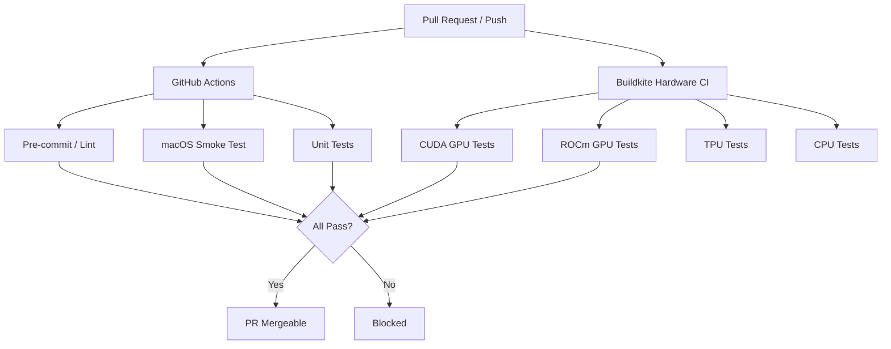
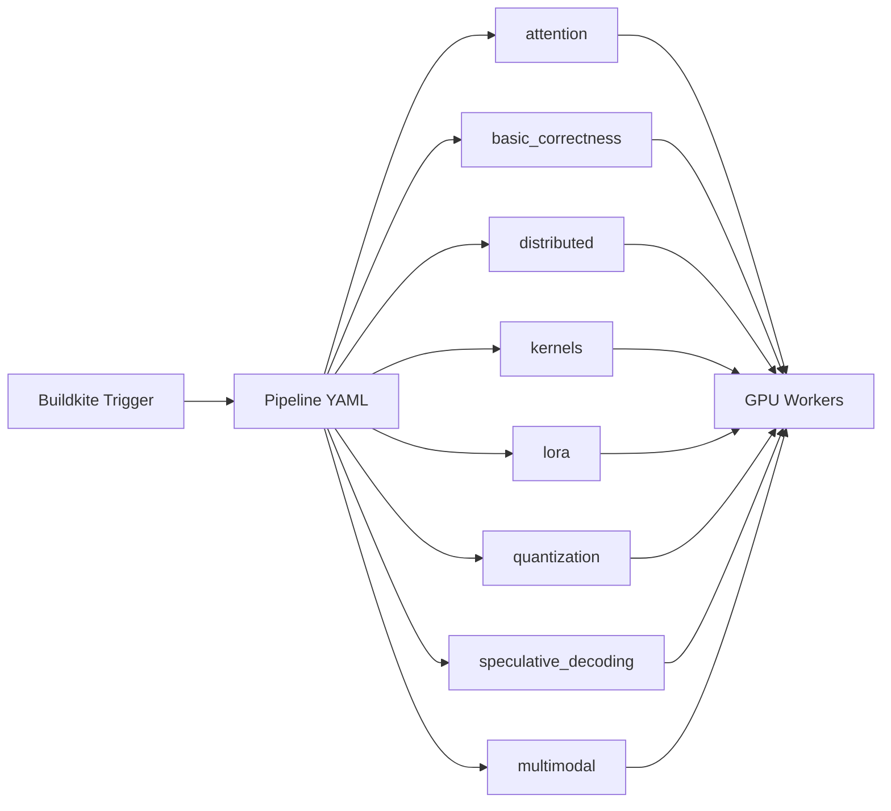

# CI/CD Pipeline

vLLM uses a two-tier CI/CD system: **GitHub Actions** for fast pre-merge checks (linting, smoke tests, unit tests) and **Buildkite** for hardware-in-the-loop testing on real GPU clusters. This page describes both tiers, their triggers, and how to interpret results.

## Architecture Overview



## GitHub Actions

GitHub Actions workflows run on every pull request and push to `main`. They are defined in `.github/workflows/` (not present in this local checkout — see the [GitHub repository](https://github.com/vllm-project/vllm/tree/main/.github/workflows)).

### Pre-Commit / Lint Workflow

The lint workflow runs the full pre-commit suite against changed files:

1. **ruff** — Python linting and formatting
2. **mypy** — Static type checking on changed files (via `tools/pre_commit/mypy.py`)
3. **check-spdx-header** — Apache 2.0 license header presence
4. **check-forbidden-imports** — No raw `pickle`/`cloudpickle` outside allowlist
5. **check-init-lazy-imports** — Lazy loading in `vllm/__init__.py`
6. **check-torch-cuda** — No `torch.cuda.*` calls outside platform files
7. **check-boolean-context-manager** — No `with a() and b():` patterns
8. **validate-config** — Config dataclasses have defaults and docstrings
9. **shellcheck** — Shell script linting
10. **typos** — Spell checking

To reproduce locally:
```bash
pre-commit run --all-files
```

### macOS Smoke Test

A lightweight smoke test runs on macOS (CPU mode) to catch import errors and basic functionality regressions without requiring GPU hardware. This test:

- Installs vLLM with `VLLM_TARGET_DEVICE=cpu`
- Runs a small set of CPU-compatible tests
- Validates that the package imports cleanly

This is particularly important because macOS is a common developer environment and CPU mode is used for development without GPUs.

### Unit Test Workflows

Several unit test workflows run on CPU-only GitHub Actions runners:

- **Config tests** (`tests/test_config.py`) — Validates all configuration dataclasses
- **Environment variable tests** (`tests/test_envs.py`) — Checks env var parsing
- **Tokenizer tests** — Fast tokenizer correctness checks
- **Standalone tests** (`tests/standalone_tests/`) — Tests that don't require a GPU

### Code Coverage

Coverage reports are uploaded to [Codecov](https://codecov.io/gh/vllm-project/vllm). The `codecov.yml` configuration maps source paths from various Docker container layouts back to the repository root:

```yaml
fixes:
  - "/vllm-workspace/src/vllm/::vllm/"
  - "/usr/local/lib/python3.*/dist-packages/vllm/::vllm/"
```

Coverage is informational — CI does not fail on coverage drops (`require_ci_to_pass: false`).

## Buildkite Hardware CI

Buildkite runs tests on real GPU hardware. It is the primary gate for GPU-specific functionality including attention kernels, distributed inference, quantization, and model correctness.

### Trigger Conditions

Buildkite jobs are triggered by:
- Pull requests that touch GPU-relevant code paths
- Pushes to `main`
- Release candidate tags (`vX.Y.Z-rc1`, `vX.Y.Z-rc2`, etc.)
- Manual triggers by maintainers

### Hardware Pools

| Pool | Hardware | Primary Use |
|------|----------|-------------|
| CUDA | NVIDIA H100, A100, A10G | Main GPU test suite |
| ROCm | AMD MI300x, MI250x | ROCm-specific tests |
| TPU | Google TPU v4/v5 | TPU backend tests |
| CPU | x86_64 Linux | CPU backend, standalone tests |

### Test Pipeline Structure

The Buildkite pipeline is organized into **test areas** — logical groupings of related tests that can be run independently. Each test area is defined in a YAML configuration file (see [Buildkite Test Areas](buildkite-test-areas.md)).



### Buildkite Test Collector

Test results are reported using the `buildkite-test-collector` package (version `0.1.9`, listed in `requirements/test.in`). This uploads JUnit XML results to Buildkite's Test Analytics dashboard, enabling:

- Flaky test detection
- Test duration tracking
- Per-test failure history

### Hardware CI Scripts

The Buildkite pipeline uses scripts in `.buildkite/scripts/hardware_ci/` (in the upstream repository) to:
1. Pull the appropriate Docker image for the target hardware
2. Mount the source tree into the container
3. Run the test area's pytest command
4. Upload results to Buildkite Test Analytics

## Release Validation CI

Before each release, additional performance validation runs on the [PyTorch CI infrastructure](https://github.com/pytorch/pytorch-integration-testing):

- **Workflow**: `vllm-benchmark.yml`
- **Models tested**: Llama3, Llama4, Mixtral
- **Hardware**: NVIDIA H100, AMD MI300x
- **Dashboard**: [hud.pytorch.org/benchmark/llms](https://hud.pytorch.org/benchmark/llms)

See [Release Process](release-process.md) for details on how this fits into the release workflow.

## Interpreting CI Results

### GitHub Actions

- ✅ Green checkmark — all checks passed
- ❌ Red X — one or more checks failed; click to see logs
- 🟡 Yellow circle — checks are still running

### Buildkite

- Click the Buildkite link in the PR status checks
- Each test area shows as a separate step
- Failed steps show the pytest output and any captured logs
- Flaky tests (intermittent failures) are tracked in Test Analytics

## Re-Running Failed Jobs

For GitHub Actions:
- Click **Re-run failed jobs** in the Actions tab

For Buildkite:
- Maintainers can trigger a re-run from the Buildkite dashboard
- Contributors can ask a maintainer to re-run by commenting on the PR

## Local CI Simulation

To simulate what CI runs before pushing:

```bash
# Run the full pre-commit suite
pre-commit run --all-files

# Run unit tests that don't need GPU
pytest tests/test_config.py tests/test_envs.py -x -q

# Run a specific test area (requires GPU)
pytest tests/basic_correctness/ -x -q

# Run distributed tests (requires multiple GPUs)
pytest tests/distributed/ -x -q --dist=no
```
