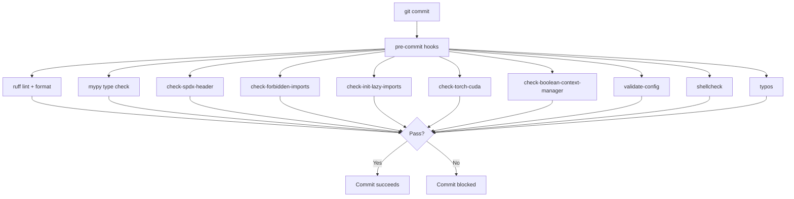

# Code Style & Linting

vLLM enforces a consistent code style through a combination of [Ruff](https://docs.astral.sh/ruff/) (linting and formatting), [mypy](https://mypy.readthedocs.io/) (static type checking), and a suite of custom pre-commit hooks. All checks run automatically on every commit via [pre-commit](https://pre-commit.com/).

## Ruff Configuration

Ruff is configured in `pyproject.toml` under `[tool.ruff.lint]`. It replaces flake8, isort, pyupgrade, and several other tools in a single fast pass.

### Enabled Rule Sets

| Rule Set | Code | Description |
|----------|------|-------------|
| pycodestyle | `E` | PEP 8 style violations |
| Pyflakes | `F` | Undefined names, unused imports |
| pyupgrade | `UP` | Modernize Python syntax |
| flake8-bugbear | `B` | Likely bugs and design issues |
| flake8-implicit-str-concat | `ISC` | Implicit string concatenation |
| flake8-simplify | `SIM` | Code simplification suggestions |
| isort | `I` | Import ordering |
| flake8-logging-format | `G` | Logging format string issues |

### Ignored Rules

| Rule | Reason |
|------|--------|
| `F405`, `F403` | Star imports are allowed in some contexts |
| `E731` | Lambda expression assignment is permitted |
| `B905` | `zip()` without `strict=` is allowed |
| `B007` | Loop control variable not used in body |
| `UP032` | f-string format not enforced |

### Per-File Ignores

Certain generated or third-party files are excluded from all rules:

```toml
[tool.ruff.lint.per-file-ignores]
"vllm/third_party/**" = ["ALL"]
"vllm/version.py" = ["F401"]
"vllm/_version.py" = ["ALL"]
"vllm/grpc/*_pb2.py" = ["ALL"]
"vllm/grpc/*_pb2_grpc.py" = ["ALL"]
"vllm/grpc/*_pb2.pyi" = ["ALL"]
```

### Docstring Formatting

Ruff also handles docstring code block formatting:

```toml
[tool.ruff.format]
docstring-code-format = true
```

### Running Ruff

```bash
# Check for issues
ruff check vllm/

# Auto-fix issues
ruff check --fix vllm/

# Format code
ruff format vllm/

# Check formatting without modifying
ruff format --check vllm/
```

## mypy Type Checking

mypy is configured in `pyproject.toml` under `[tool.mypy]`:

```toml
[tool.mypy]
plugins = ['pydantic.mypy']
ignore_missing_imports = true
check_untyped_defs = true
follow_imports = "silent"
```

### How mypy Runs in Pre-Commit

The custom script `tools/pre_commit/mypy.py` runs mypy only on **changed files**, grouping them into separate mypy invocations to avoid import-following issues:

```python
SEPARATE_GROUPS = [
    "tests",
    "vllm/lora",
    "vllm/model_executor",
]

EXCLUDE = [
    "vllm/model_executor/models",
    "vllm/model_executor/layers/fla/ops",
    "vllm/v1/attention/ops",
    "vllm/benchmarks",
    "vllm/config",
    "vllm/reasoning",
]
```

Files in `SEPARATE_GROUPS` are checked with `--follow-imports skip` to avoid cascading errors. Files in `EXCLUDE` are skipped entirely (pending fixes).

### Running mypy Manually

```bash
# Check a specific file
mypy vllm/engine/llm_engine.py --python-version 3.10

# Check a directory
mypy vllm/v1/ --follow-imports silent

# Use the pre-commit script directly
python tools/pre_commit/mypy.py 0 3.10 vllm/engine/llm_engine.py
```

## Custom Pre-Commit Hooks

Beyond Ruff and mypy, vLLM maintains several custom lint scripts in `tools/pre_commit/`:

### `check-spdx-header` — License Header Enforcement

Every Python source file must begin with the Apache 2.0 SPDX header:

```python
# SPDX-License-Identifier: Apache-2.0
# SPDX-FileCopyrightText: Copyright contributors to the vLLM project
```

The script `tools/pre_commit/check_spdx_header.py` checks for both lines and reports:
- `MISSING_LICENSE` — only the copyright line is present
- `MISSING_COPYRIGHT` — only the license line is present
- `MISSING_BOTH` — neither line is present
- `EMPTY` — empty `__init__.py` (exempt)

### `check-forbidden-imports` — Import Restrictions

`tools/pre_commit/check_forbidden_imports.py` prevents use of `pickle` and `cloudpickle` outside of an explicit allowlist. These modules can introduce security vulnerabilities and serialization fragility.

Files that legitimately need pickle (e.g., `vllm/v1/serial_utils.py`, `vllm/distributed/utils.py`) are listed in the `allowed_files` set within the script.

### `check-init-lazy-imports` — Lazy Loading in `__init__.py`

`tools/pre_commit/check_init_lazy_imports.py` ensures that `vllm/__init__.py` only imports vLLM internals inside a `TYPE_CHECKING` guard, keeping the top-level import fast:

```python
# Allowed — only at module level
from .version import __version__

# Required pattern for everything else
if typing.TYPE_CHECKING:
    from vllm.engine import LLMEngine
```

The only unconditional import allowed is `vllm.env_override`.

### `check-torch-cuda` — Platform-Agnostic API

`tools/pre_commit/check_torch_cuda.py` prevents direct use of `torch.cuda.empty_cache()` and `torch.cuda.synchronize()` outside of platform-specific files. These calls break non-CUDA backends (ROCm, XPU, CPU).

Allowed paths: `vllm/platforms/` and `vllm/device_allocator/`.

Use the platform-agnostic equivalents instead:
```python
# Instead of torch.cuda.synchronize()
from vllm.platforms import current_platform
current_platform.synchronize()
```

### `check-boolean-context-manager` — Context Manager Bug Detection

`tools/pre_commit/check_boolean_context_manager.py` catches a common Python bug where `and`/`or` is used to combine context managers:

```python
# BUG: only ctx_b() is entered as a context manager
with ctx_a() and ctx_b():
    ...

# CORRECT: both are entered
with ctx_a(), ctx_b():
    ...
```

### `validate-config` — Config Dataclass Validation

`tools/pre_commit/validate_config.py` ensures that all fields in `@config`-decorated dataclasses have:
1. A default value (so configs can be constructed without all arguments)
2. An inline docstring (for auto-generated documentation)

### `shellcheck` — Shell Script Linting

`tools/pre_commit/shellcheck.sh` runs [ShellCheck](https://www.shellcheck.net/) on all `*.sh` files in the repository. On Linux x86_64, ShellCheck is automatically downloaded if not present.

### `png-lint` — Excalidraw PNG Validation

`tools/pre_commit/png-lint.sh` ensures that `*.excalidraw.png` files were exported with **Embed Scene** enabled, so they can be re-opened and edited in Excalidraw.

### `update-dockerfile-graph` — Auto-Update Dockerfile Diagram

`tools/pre_commit/update-dockerfile-graph.sh` regenerates the Dockerfile dependency graph at `docs/assets/contributing/dockerfile-stages-dependency.png` whenever `docker/Dockerfile` changes.

## Typos Check

The `typos` tool checks for common spelling mistakes. It is configured in `pyproject.toml` under `[tool.typos]`:

```toml
[tool.typos.files]
extend-exclude = ["tests/models/fixtures/*", "tests/prompts/*", ...]
ignore-hidden = false
```

Domain-specific identifiers (like `NOOPs`, `FoPE`, `HSA`) are whitelisted in `[tool.typos.default.extend-identifiers]`.

## Summary of All Checks



## Editor Integration

### VS Code

Install the [Ruff extension](https://marketplace.visualstudio.com/items?itemName=charliermarsh.ruff) and add to `.vscode/settings.json`:

```json
{
  "[python]": {
    "editor.defaultFormatter": "charliermarsh.ruff",
    "editor.formatOnSave": true,
    "editor.codeActionsOnSave": {
      "source.fixAll.ruff": "explicit",
      "source.organizeImports.ruff": "explicit"
    }
  },
  "mypy-type-checker.enabled": true
}
```

### PyCharm / IntelliJ

Use the [Ruff plugin](https://plugins.jetbrains.com/plugin/20574-ruff) and configure mypy as an external tool pointing to `tools/pre_commit/mypy.py`.
