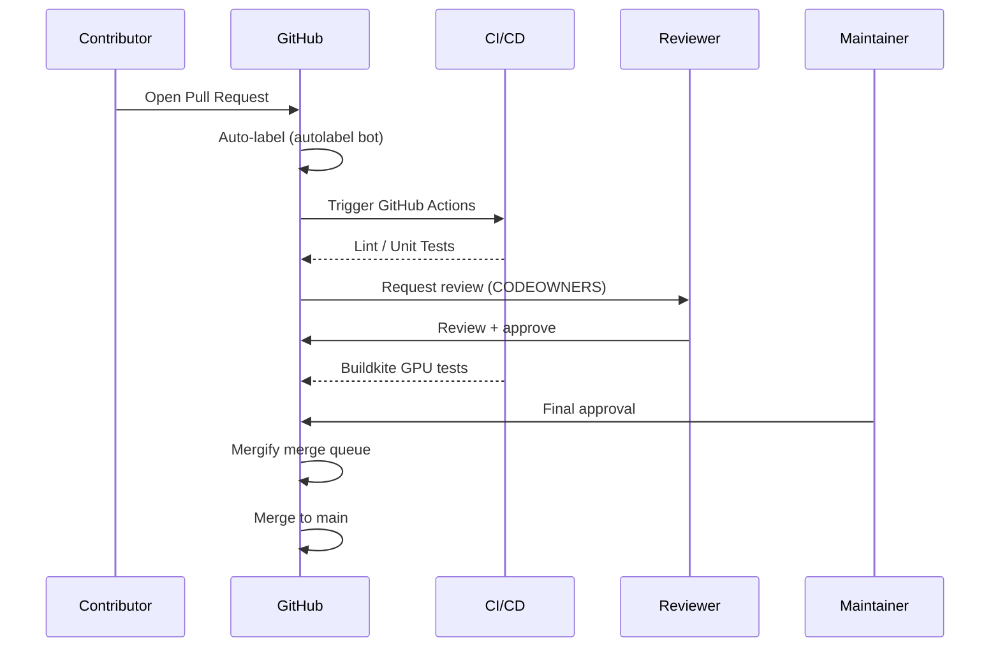

# Pull Request Process

This page describes the full lifecycle of a pull request in vLLM — from opening a PR to getting it merged. It covers code ownership, automated labeling, the merge queue, and how stale PRs are handled.

## PR Lifecycle Overview

## Opening a Pull Request

### Before You Open

1. **Sync with upstream**: `git fetch upstream && git rebase upstream/main`
2. **Run pre-commit**: `pre-commit run --all-files` — fix all issues before pushing
3. **Write tests**: New features and bug fixes should include tests
4. **Update documentation**: If you change behavior, update the relevant docs
5. **Check the SPDX header**: All new Python files need the Apache 2.0 header

### PR Title and Description

Use a clear, descriptive title. The description should include:

- **What** the PR does (summary)
- **Why** it's needed (motivation / problem being solved)
- **How** it works (implementation approach)
- **Testing** done (what tests were run, what was verified)
- **Breaking changes** (if any)

For model additions, include:
- Model name and HuggingFace model ID
- Benchmark results comparing vLLM output to HuggingFace reference
- Hardware tested on

### Draft PRs

Open a **Draft PR** for work-in-progress changes that aren't ready for review. This triggers CI but signals to reviewers that the PR is not yet ready for approval.

## CODEOWNERS

vLLM uses GitHub's CODEOWNERS feature to automatically request reviews from the appropriate team members based on which files are changed. The `CODEOWNERS` file (in `.github/CODEOWNERS` in the upstream repository) maps file paths to GitHub teams and individuals.

Key ownership areas include:

| Path Pattern | Owners |
|-------------|--------|
| `vllm/model_executor/models/` | Model team |
| `vllm/v1/` | V1 engine team |
| `vllm/distributed/` | Distributed team |
| `vllm/attention/` | Attention team |
| `vllm/entrypoints/` | Serving team |
| `docs/` | Documentation team |
| `tests/` | QA team |

When you open a PR, GitHub automatically requests reviews from the relevant code owners. You do **not** need to manually request reviews from code owners — the bot handles this.

> **Note**: You may still request additional reviewers beyond the auto-assigned code owners if you want specific feedback.

## Autolabeling

The autolabel bot automatically applies labels to PRs based on:

1. **Changed file paths** — e.g., changes to `vllm/attention/` get the `attention` label
2. **PR title keywords** — e.g., `[Model]` in the title gets the `new-model` label
3. **PR size** — `size/XS`, `size/S`, `size/M`, `size/L`, `size/XL` based on line count

Common labels and their meanings:

| Label | Meaning |
|-------|---------|
| `new-model` | Adds a new model architecture |
| `attention` | Changes to attention backends |
| `distributed` | Changes to distributed inference |
| `quantization` | Changes to quantization support |
| `lora` | Changes to LoRA support |
| `speculative-decoding` | Changes to speculative decoding |
| `multimodal` | Changes to multimodal support |
| `documentation` | Documentation-only changes |
| `bug` | Bug fix |
| `enhancement` | New feature or improvement |
| `breaking-change` | Introduces a breaking API change |
| `needs-review` | Awaiting reviewer attention |
| `ready-to-merge` | Approved and ready for merge queue |

## Review Process

### Review Requirements

Most PRs require:
- **At least 1 approval** from a code owner of the changed files
- **All CI checks passing** (GitHub Actions + Buildkite)
- **No unresolved review comments**

Large or high-impact changes (new model architectures, distributed changes, API changes) typically require **2 approvals**.

### Review Etiquette

- Respond to review comments promptly (within a few business days)
- Mark conversations as resolved after addressing feedback
- Use "Request changes" sparingly — prefer inline comments for minor issues
- If you disagree with a review comment, explain your reasoning respectfully

### Addressing Review Feedback

After pushing new commits to address review feedback:
1. Reply to each review comment explaining what you changed
2. Mark resolved conversations as resolved
3. Re-request review from the reviewer if needed

## Mergify

vLLM uses [Mergify](https://mergify.com/) to manage the merge queue and enforce merge conditions. The Mergify configuration (`.mergify.yml` in the upstream repository) defines:

### Merge Conditions

A PR is eligible for merging when:
- All required CI checks have passed
- The required number of approvals has been received
- No changes have been requested (or all change requests have been dismissed)
- The PR is not marked as a draft
- The PR is not labeled `do-not-merge`

### Merge Queue

Mergify places approved PRs into a **merge queue** rather than merging immediately. The merge queue:
1. Rebases the PR onto the latest `main`
2. Runs CI again on the rebased branch
3. Merges if CI passes

This prevents the "merge race" problem where two PRs pass CI independently but conflict when both land.

### Merge Method

vLLM uses **squash merge** for most PRs, combining all commits into a single commit on `main`. This keeps the `main` branch history clean and readable.

### Labels That Affect Mergify

| Label | Effect |
|-------|--------|
| `do-not-merge` | Prevents Mergify from merging the PR |
| `ready-to-merge` | Signals the PR is ready for the merge queue |
| `needs-rebase` | PR needs to be rebased before merging |

## Stale Bot

The stale bot automatically manages PRs and issues that have been inactive for an extended period:

### Stale PR Policy

- **After 60 days of inactivity**: The bot adds a `stale` label and posts a comment warning that the PR will be closed
- **After 7 more days without activity**: The PR is automatically closed

### Preventing Staleness

To keep a PR active:
- Push new commits
- Reply to comments
- Add a comment explaining the current status

### Reopening Closed PRs

If your PR was closed due to staleness but you want to continue working on it:
1. Reopen the PR (if it's still recent)
2. Or open a new PR with the updated changes

## Cherry-Pick Process

After a release branch is cut, changes can only be cherry-picked into the release branch if they meet the [cherry-pick criteria](release-process.md#cherry-pick-criteria). To request a cherry-pick:

1. Ensure the PR is already merged to `main`
2. Add the `cherry-pick` label to the PR
3. A maintainer will cherry-pick the commit to the release branch

## Getting Help

If your PR is stuck or you need guidance:

- **Comment on the PR** asking for help or clarification
- **Join the Slack** at [slack.vllm.ai](https://slack.vllm.ai/) and ask in the `#contributing` channel
- **Tag a maintainer** if your PR has been waiting for review for more than a week

## Common Reasons PRs Are Not Merged

1. **CI failures** — Fix all failing checks before requesting re-review
2. **Missing tests** — Add tests that cover the new functionality
3. **Missing documentation** — Update docs for user-facing changes
4. **Scope too large** — Consider splitting into smaller, focused PRs
5. **Missing SPDX header** — Add the Apache 2.0 header to all new files
6. **Conflicts with main** — Rebase onto the latest `main`
