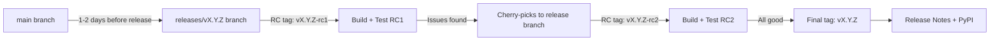

# Release Process

This page describes how vLLM releases are created, versioned, and published to PyPI. It covers the release cadence, branch management, cherry-pick criteria, performance validation, and the steps to publish a release.

## Release Cadence

vLLM targets a **regular release every 2 weeks**. Since v0.12.0, regular releases increment the **minor version** rather than the patch version.

### Version Numbering

Versions follow the format `vX.Y.Z`:

| Component | Increment When |
|-----------|---------------|
| **Major** (`X`) | Sweeping architectural changes with API breaks (e.g., like PyTorch 2.0) |
| **Minor** (`Y`) | Regular bi-weekly releases with new features and bug fixes |
| **Patch** (`Z`) | New model support, emergency fixes for critical bugs, performance issues, or security vulnerabilities |

This scheme is similar to [SemVer](https://semver.org/), but backwards compatibility is only guaranteed for a limited number of minor releases. See the [deprecation policy](https://docs.vllm.ai/en/latest/contributing/deprecation_policy) for details.

Past releases are listed at [vllm.ai/releases](https://vllm.ai/releases).

## Release Branch Management



### Branch Cut

- **Major and minor releases**: The release branch (`releases/vX.Y.Z`) is cut **1–2 days before** the release goes live
- **Patch releases**: The existing release branch from the previous minor release is reused

### Release Candidate Tags

Release builds are triggered by pushing **RC tags** to the release branch:

```bash
# Trigger a release candidate build
git tag vX.Y.Z-rc1
git push origin vX.Y.Z-rc1
```

This enables building and testing multiple release candidates before the final release. The RC build:
1. Builds the Python wheel
2. Builds Docker images for all supported platforms
3. Runs the full test suite on the release branch

### Final Tag

The final tag `vX.Y.Z` does **not** trigger a build — it is used only for:
- GitHub Release notes
- Release assets (changelog, etc.)

```bash
# Create the final release tag (after RC validation)
git tag vX.Y.Z
git push origin vX.Y.Z
```

### Monitoring for Reverts

After the branch cut, the release team monitors `main` for any reverts of recently merged PRs. If a revert lands on `main`, it is also applied to the release branch to prevent shipping known-bad code.

## Cherry-Pick Criteria

After the branch cut, only specific types of changes are allowed into the release branch via cherry-picks. This ensures the team has sufficient time for thorough testing on a stable codebase.

### Allowed Cherry-Picks

| Category | Description |
|----------|-------------|
| **Regression fixes** | Functional or performance regressions against the most recent release |
| **Critical fixes** | Silent incorrectness, backwards compatibility breaks, crashes, deadlocks, large memory leaks |
| **New feature fixes** | Fixes to features introduced in the most recent release |
| **Documentation** | Documentation improvements |
| **Release-specific** | Version identifier changes, CI fixes for the release branch |

### Not Allowed

> **No feature work is allowed in cherry-picks.** All cherry-pick candidates must first be merged to `main` (the only exception is release-branch-specific changes like version bumps).

### Cherry-Pick Process

1. Merge the fix to `main` first
2. Add the `cherry-pick` label to the PR
3. A release manager cherry-picks the commit to the release branch:
   ```bash
   git checkout releases/vX.Y.Z
   git cherry-pick <commit-sha>
   git push origin releases/vX.Y.Z
   ```

## Performance Validation

Before each release, end-to-end performance validation is run to ensure no regressions have been introduced.

### Benchmark Infrastructure

Performance validation uses the [vllm-benchmark workflow](https://github.com/pytorch/pytorch-integration-testing/actions/workflows/vllm-benchmark.yml) on PyTorch CI infrastructure.

**Current coverage:**
- **Models**: Llama3, Llama4, Mixtral
- **Hardware**: NVIDIA H100, AMD MI300x

### Validation Steps

**Step 1: Get Access**

Request write access to [pytorch/pytorch-integration-testing](https://github.com/pytorch/pytorch-integration-testing).

**Step 2: Configure the Benchmark**

Navigate to the [vllm-benchmark workflow](https://github.com/pytorch/pytorch-integration-testing/actions/workflows/vllm-benchmark.yml) and set:
- **vLLM branch**: The release branch (e.g., `releases/v0.9.2`)
- **vLLM commit**: The RC commit hash

**Step 3: Review Results**

Results appear on the [vLLM benchmark dashboard](https://hud.pytorch.org/benchmark/llms?repoName=vllm-project%2Fvllm) under the corresponding branch and commit.

**Step 4: Compare Against Previous Release**

Compare throughput and latency metrics against the previous release. Any significant regression (>5% throughput drop or >10% latency increase) must be investigated before the release proceeds.

Example comparison URL format:
```
https://hud.pytorch.org/benchmark/llms?lBranch=releases/v0.9.1&rBranch=releases/v0.9.2
```

## PyPI Publishing

vLLM is published to [PyPI](https://pypi.org/project/vllm/) as a binary wheel. The publishing process is automated via the release CI pipeline.

### Build System

The wheel is built using `setuptools` with `setuptools-scm` for version detection:

```toml
[build-system]
requires = ["cmake>=3.26.1", "ninja", "setuptools>=77.0.3,<81.0.0",
            "setuptools-scm>=8.0", "torch==2.10.0", ...]
build-backend = "setuptools.build_meta"
```

The version is automatically derived from the Git tag:
```bash
# Version is set by the tag
git tag v0.9.2
python -m build  # produces vllm-0.9.2-*.whl
```

### Supported Python Versions

The wheel is built for Python 3.10, 3.11, 3.12, and 3.13 (as declared in `pyproject.toml`).

### Docker Images

In addition to the PyPI wheel, Docker images are published to Docker Hub for each release:

| Image | Description |
|-------|-------------|
| `vllm/vllm-openai:vX.Y.Z` | CUDA image with OpenAI-compatible server |
| `vllm/vllm-openai:vX.Y.Z-rocm` | ROCm image |
| `vllm/vllm-openai:vX.Y.Z-cpu` | CPU-only image |

### Release Notes

Release notes are written in the GitHub Releases interface and include:
- Summary of new features
- Bug fixes
- Breaking changes (if any)
- Performance improvements
- New model support
- Deprecation notices

## Version Detection

The package version is embedded at build time using `setuptools-scm`. The version is accessible at runtime:

```python
import vllm
print(vllm.__version__)  # e.g., "0.9.2"
```

The `tools/check_repo.sh` script verifies that the repository has tags available for correct version detection:

```bash
#!/bin/bash
if ! git diff --quiet; then
    echo "Repo is dirty" >&2
    exit 1
fi
if ! git describe --tags; then
    echo "No tags are present. Is this a shallow clone?" >&2
    exit 1
fi
```

> **Shallow clones**: If you cloned with `--depth 1`, run `git fetch --unshallow --tags` to restore tag history and get correct version numbers.

## Deprecation Policy

vLLM maintains a deprecation policy to give users time to migrate before features are removed:

- Deprecated features are announced in release notes
- A `DeprecationWarning` is emitted at runtime
- Features are removed after a defined number of minor releases

See the full [deprecation policy](https://docs.vllm.ai/en/latest/contributing/deprecation_policy) for details.
