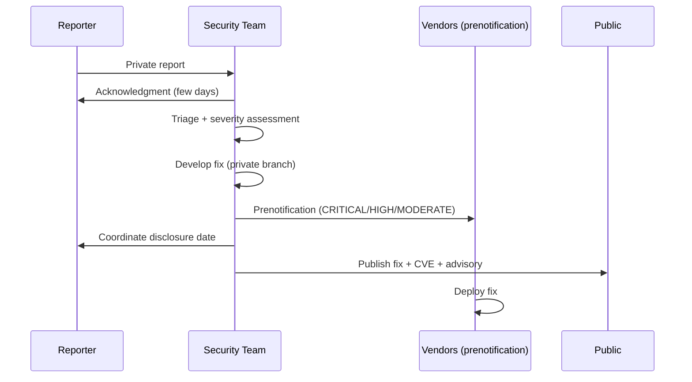

# Security Policy

This page describes vLLM's security policy, including how to report vulnerabilities, how reports are triaged, the severity classification system, and the prenotification policy for downstream vendors.

## Reporting Security Issues

> **Do not open a public GitHub issue for security vulnerabilities.** Public disclosure before a fix is available puts all vLLM users at risk.

Report security issues **privately** using the [GitHub vulnerability submission form](https://github.com/vllm-project/vllm/security/advisories/new). This creates a private GitHub Security Advisory visible only to the vLLM security team.

### What to Include in Your Report

A good vulnerability report includes:

- **Description**: Clear explanation of the vulnerability
- **Impact**: What an attacker could achieve by exploiting it
- **Affected versions**: Which vLLM versions are affected
- **Reproduction steps**: Minimal steps to reproduce the issue
- **Proof of concept**: Code or commands demonstrating the vulnerability (if safe to share)
- **Suggested fix**: If you have ideas for remediation

## Issue Triage

Reports are triaged by the [vulnerability management team](https://docs.vllm.ai/en/latest/contributing/vulnerability_management.html). The team will:

1. **Acknowledge** the report within a few business days
2. **Assess** the severity and impact
3. **Develop** a fix on a private branch
4. **Coordinate** disclosure timing with the reporter
5. **Publish** the fix and CVE simultaneously

## Severity Classification

vLLM uses a four-tier severity system based on CVSS scores and practical impact:

### CRITICAL Severity (CVSS ≥ 9.0)

Vulnerabilities that allow remote attackers to:
- Execute arbitrary code without any interaction or privileges
- Take full control of the system
- Significantly compromise confidentiality, integrity, or availability

**Examples**:
- Remote code execution via network requests
- Deserialization vulnerabilities that enable exploit chains

### HIGH Severity (CVSS 7.0–8.9)

Serious security flaws with elevated impact that require advanced conditions or some level of trust:
- RCE in specific, limited deployment contexts
- Significant data loss requiring some privileged network access
- High-impact issues in advanced deployment modes (e.g., multi-node)

### MODERATE Severity (CVSS 4.0–6.9)

Vulnerabilities causing denial of service or partial disruption without enabling arbitrary code execution or data breach:
- Denial of service attacks
- Partial system disruption with limited impact

### LOW Severity (CVSS < 4.0)

Minor issues with negligible impact:
- Informational disclosures
- Logging errors
- Non-exploitable flaws
- Weaknesses requiring local or high-privilege access
- Side-channel attacks
- Hash collisions

## Threat Model

vLLM's security assumptions and recommendations are documented in the [Security Guide](https://docs.vllm.ai/en/latest/usage/security.html). Key points:

- vLLM is designed to run in **trusted environments** — it is not designed to safely execute untrusted model weights
- The OpenAI-compatible API server should be protected by authentication in production deployments (see [Auth & SSL](../12-api-reference/auth-ssl.md))
- Multi-node deployments have a larger attack surface — see HIGH severity criteria above

For security recommendations related to PyTorch model loading, see [PyTorch's Security Policy](https://github.com/pytorch/pytorch/blob/main/SECURITY.md).

## Prenotification Policy

For CRITICAL, HIGH, and MODERATE severity issues, vLLM may prenotify certain organizations before public disclosure to allow coordinated patching.

### How Prenotification Works

- Prenotification is sent as a **private email** to registered contacts
- Security contacts may also be added to the private GitHub Security Advisory
- Prenotification typically occurs **a few days before** the public release

### Eligibility for Prenotification

Organizations and vendors are eligible if they meet **at least one** of:

| Criterion | Description |
|-----------|-------------|
| **Substantial deployment** | Significant internal deployment using upstream vLLM |
| **Security infrastructure** | Established internal security teams and compliance measures |
| **Active contribution** | Active and consistent contributions to the upstream vLLM project |

### Joining the Prenotification Group

To be added to the prenotification group, send an email to all members of the [vulnerability management team](https://docs.vllm.ai/en/latest/contributing/vulnerability_management.html). Each vendor contact is evaluated on a case-by-case basis.

### Removal from the Group

Organizations may be removed from the prenotification group if they:
- Release fixes or information about issues **before** public disclosure
- No longer meet the eligibility criteria

Group membership may also change based on policy refinements.

## GitHub Security Advisories

When a vulnerability is fixed, vLLM publishes a [GitHub Security Advisory](https://github.com/vllm-project/vllm/security/advisories) that includes:

- CVE identifier (if applicable)
- Affected versions
- Fixed version
- Description of the vulnerability
- Remediation steps

Users are encouraged to watch the repository for security advisories and upgrade promptly when fixes are available.

## Security Best Practices for Operators

When deploying vLLM in production:

1. **Enable authentication**: Use API key authentication (see [Auth & SSL](../12-api-reference/auth-ssl.md))
2. **Use TLS**: Enable SSL/TLS for all API endpoints
3. **Network isolation**: Run vLLM behind a reverse proxy or API gateway
4. **Keep updated**: Subscribe to security advisories and update regularly
5. **Limit model sources**: Only load model weights from trusted sources
6. **Monitor logs**: Enable structured logging and monitor for anomalies (see [Logging](../11-observability/logging.md))

## Coordinated Disclosure Timeline

vLLM follows a **coordinated disclosure** model:

