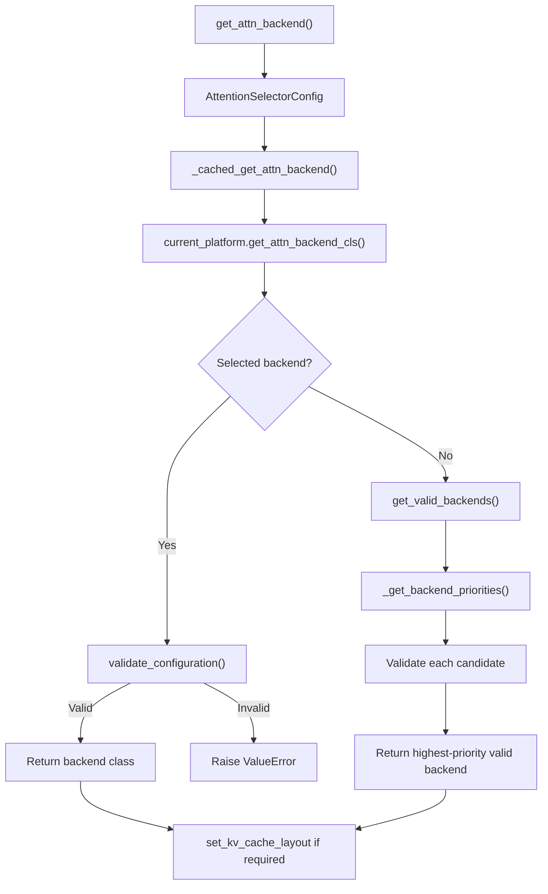
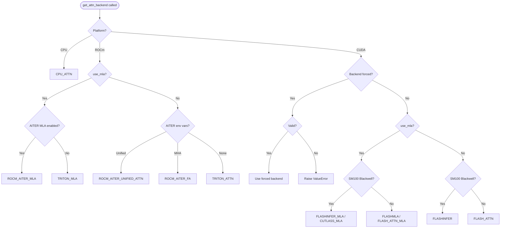

# Backend Selection

vLLM's attention backend selection is a two-stage process: a **registry** enumerates all known backends, and a **selector** picks the best one at model-load time based on hardware capabilities, model configuration, and user preferences.

## Architecture Overview



## The Selector (`selector.py`)

The public entry point is `get_attn_backend()` in `vllm/v1/attention/selector.py`:

```python
def get_attn_backend(
    head_size: int,
    dtype: torch.dtype,
    kv_cache_dtype: str | None,
    block_size: int | None,
    use_mla: bool = False,
    has_sink: bool = False,
    use_sparse: bool = False,
    use_mm_prefix: bool = False,
    use_per_head_quant_scales: bool = False,
    attn_type: str | None = None,
    num_heads: int | None = None,
) -> type[AttentionBackend]:
    """Selects which attention backend to use and lazily imports it."""
```

This function:
1. Validates `kv_cache_dtype` against the allowed `CacheDType` literals
2. Reads the current `VllmConfig` (set globally during engine initialization)
3. Builds an `AttentionSelectorConfig` named-tuple from the parameters
4. Delegates to `_cached_get_attn_backend()` (decorated with `@cache` for deduplication)

### AttentionSelectorConfig

```python
class AttentionSelectorConfig(NamedTuple):
    head_size: int
    dtype: torch.dtype
    kv_cache_dtype: CacheDType | None
    block_size: int | None
    use_mla: bool = False
    has_sink: bool = False
    use_sparse: bool = False
    use_mm_prefix: bool = False
    use_per_head_quant_scales: bool = False
    attn_type: str = AttentionType.DECODER
```

All fields participate in the `@cache` key, so different configurations get different cached results. This avoids re-running the selection logic for every attention layer in a model.

### Platform Delegation

The cached selector calls `current_platform.get_attn_backend_cls()`. Each platform implements this method:

| Platform | File |
|---|---|
| CUDA | `vllm/platforms/cuda.py` |
| ROCm | `vllm/platforms/rocm.py` |
| CPU | `vllm/platforms/cpu.py` |
| XPU | `vllm/platforms/xpu.py` |

### KV Cache Layout Side Effect

After selecting a backend, the selector checks if the backend requires a specific KV cache memory layout:

```python
required_layout = backend.get_required_kv_cache_layout()
if required_layout is not None:
    set_kv_cache_layout(required_layout)
```

For example, `FlashInferBackend` on Blackwell (SM100) forces `"HND"` layout (heads-first), while most other backends use `"NHD"` (blocks-first).

## The Registry (`registry.py`)

`vllm/v1/attention/backends/registry.py` defines two enumerations:

### AttentionBackendEnum

```python
class AttentionBackendEnum(Enum, metaclass=_AttentionBackendEnumMeta):
    FLASH_ATTN = "vllm.v1.attention.backends.flash_attn.FlashAttentionBackend"
    FLASH_ATTN_DIFFKV = "vllm.v1.attention.backends.flash_attn_diffkv.FlashAttentionDiffKVBackend"
    TRITON_ATTN = "vllm.v1.attention.backends.triton_attn.TritonAttentionBackend"
    ROCM_ATTN = "vllm.v1.attention.backends.rocm_attn.RocmAttentionBackend"
    ROCM_AITER_FA = "vllm.v1.attention.backends.rocm_aiter_fa.AiterFlashAttentionBackend"
    ROCM_AITER_UNIFIED_ATTN = "vllm.v1.attention.backends.rocm_aiter_unified_attn.RocmAiterUnifiedAttentionBackend"
    FLASHINFER = "vllm.v1.attention.backends.flashinfer.FlashInferBackend"
    FLASHINFER_MLA = "vllm.v1.attention.backends.mla.flashinfer_mla.FlashInferMLABackend"
    FLASHINFER_MLA_SPARSE = "..."
    TRITON_MLA = "vllm.v1.attention.backends.mla.triton_mla.TritonMLABackend"
    CUTLASS_MLA = "vllm.v1.attention.backends.mla.cutlass_mla.CutlassMLABackend"
    FLASHMLA = "vllm.v1.attention.backends.mla.flashmla.FlashMLABackend"
    FLASHMLA_SPARSE = "..."
    FLASH_ATTN_MLA = "vllm.v1.attention.backends.mla.flashattn_mla.FlashAttnMLABackend"
    FLEX_ATTENTION = "vllm.v1.attention.backends.flex_attention.FlexAttentionBackend"
    TREE_ATTN = "vllm.v1.attention.backends.tree_attn.TreeAttentionBackend"
    CPU_ATTN = "vllm.v1.attention.backends.cpu_attn.CPUAttentionBackend"
    NO_ATTENTION = "vllm.v1.attention.backends.no_attention.NoAttentionBackend"
    CUSTOM = None  # Must be registered before use
```

Each enum value is the **default** fully-qualified class path. The `get_class()` method resolves and imports the class lazily.

### MambaAttentionBackendEnum

A separate enum for SSM (State Space Model) backends:

```python
class MambaAttentionBackendEnum(Enum, metaclass=_AttentionBackendEnumMeta):
    MAMBA1 = "vllm.v1.attention.backends.mamba1_attn.Mamba1AttentionBackend"
    MAMBA2 = "vllm.v1.attention.backends.mamba2_attn.Mamba2AttentionBackend"
    SHORT_CONV = "vllm.v1.attention.backends.short_conv_attn.ShortConvAttentionBackend"
    LINEAR = "vllm.v1.attention.backends.linear_attn.LinearAttentionBackend"
    GDN_ATTN = "vllm.v1.attention.backends.gdn_attn.GDNAttentionBackend"
    CUSTOM = None
```

The mapping from model-reported `mamba_type` strings to enum names is:

```python
MAMBA_TYPE_TO_BACKEND_MAP = {
    "mamba1": "MAMBA1",
    "mamba2": "MAMBA2",
    "short_conv": "SHORT_CONV",
    "linear_attention": "LINEAR",
    "gdn_attention": "GDN_ATTN",
    "custom": "CUSTOM",
}
```

### Registering Custom Backends

The `register_backend()` function allows third-party code to override any backend or register a completely custom one:

```python
from vllm.v1.attention.backends.registry import (
    AttentionBackendEnum,
    register_backend,
)

# Override an existing backend
@register_backend(AttentionBackendEnum.FLASH_ATTN)
class MyCustomFlashAttn:
    ...

# Register a custom backend (must use CUSTOM slot)
@register_backend(AttentionBackendEnum.CUSTOM)
class MyCustomBackend:
    ...

# Direct string registration
register_backend(
    AttentionBackendEnum.CUSTOM,
    "my.module.MyCustomBackend"
)
```

Overrides are stored in module-level dicts (`_ATTN_OVERRIDES`, `_MAMBA_ATTN_OVERRIDES`) and respected by `get_class()` and `get_path()`.

## CUDA Backend Priority Order

On CUDA, `_get_backend_priorities()` in `vllm/platforms/cuda.py` returns an ordered list of candidates:

### Standard Attention (non-MLA)

| Priority | Ampere/Hopper (SM80–SM90) | Blackwell (SM100+) |
|---|---|---|
| 1 | `FLASH_ATTN` | `FLASHINFER` |
| 2 | `FLASHINFER` | `FLASH_ATTN` |
| 3 | `TRITON_ATTN` | `TRITON_ATTN` |
| 4 | `FLEX_ATTENTION` | `FLEX_ATTENTION` |

### MLA Attention

| Priority | Hopper (SM90) | Blackwell (SM100) |
|---|---|---|
| 1 | `FLASH_ATTN_MLA` | `FLASHINFER_MLA` (low head count) or `FLASHMLA` |
| 2 | `FLASHMLA` | `CUTLASS_MLA` |
| 3 | `FLASHINFER_MLA` | `FLASH_ATTN_MLA` |
| 4 | `TRITON_MLA` | `FLASHMLA` |
| 5 | `FLASHMLA_SPARSE` | `TRITON_MLA` |

> **Note:** "Low head count" means `num_heads <= 16`. FlashInfer MLA is preferred in this case because FlashMLA pads heads to a power of two, which wastes compute at low head counts.

## ROCm Backend Priority Order

On ROCm, `_get_backend_priorities()` in `vllm/platforms/rocm.py` uses environment variables:

```python
# Priority 1: AITER Unified Attention (if VLLM_ROCM_USE_AITER and VLLM_ROCM_USE_AITER_UNIFIED_ATTENTION)
# Priority 2: AITER Flash Attention (if VLLM_ROCM_USE_AITER and VLLM_ROCM_USE_AITER_MHA)
# Priority 3: ROCM_ATTN (if use_prefill_decode_attention config)
# Default:    TRITON_ATTN
```

For MLA on ROCm:
- If `rocm_aiter_ops.is_mla_enabled()`: `ROCM_AITER_MLA` → `TRITON_MLA` → `ROCM_AITER_TRITON_MLA`
- Otherwise: `TRITON_MLA` only

## CPU Backend

The CPU platform always returns `CPU_ATTN`. MLA and sparse attention are not supported on CPU.

## Backend Validation

Every backend implements `validate_configuration()` which checks:

- `supports_head_size(head_size)` — e.g., FlashAttention requires `head_size % 8 == 0` and `head_size <= 256`
- `supports_dtype(dtype)` — e.g., most backends support `float16` and `bfloat16`
- `supports_kv_cache_dtype(kv_cache_dtype)` — e.g., FP8 requires FA3 on SM90
- `supports_block_size(block_size)` — e.g., FlashAttention requires multiples of 16
- `supports_compute_capability(capability)` — e.g., FlashAttention requires SM80+
- `supports_sink(has_sink)` — attention sinks require FA3 or TRTLLM
- `is_mla() == use_mla` — MLA backends only work with MLA models
- `supports_attn_type(attn_type)` — encoder-decoder support varies by backend

If any check fails, the backend is excluded from the candidate list with a human-readable reason logged at DEBUG level.

## Backend Selection Decision Tree



## Forcing a Specific Backend

Set the backend via the `--attention-config` CLI option or `AttentionConfig`:

```bash
# Force FlashInfer
vllm serve meta-llama/Llama-3.1-8B \
  --attention-config '{"backend": "FLASHINFER"}'

# Force Triton attention
vllm serve meta-llama/Llama-3.1-8B \
  --attention-config '{"backend": "TRITON_ATTN"}'
```

If the forced backend fails validation, vLLM raises a `ValueError` with the specific reasons rather than silently falling back.

## See Also

- [FlashAttention Backend](./flash-attn.md)
- [FlashInfer Backend](./flashinfer.md)
- [Triton Attention](./triton-attn.md)
- [ROCm Backends](./rocm-attn.md)
- [MLA Backends](./mla-attn.md)
