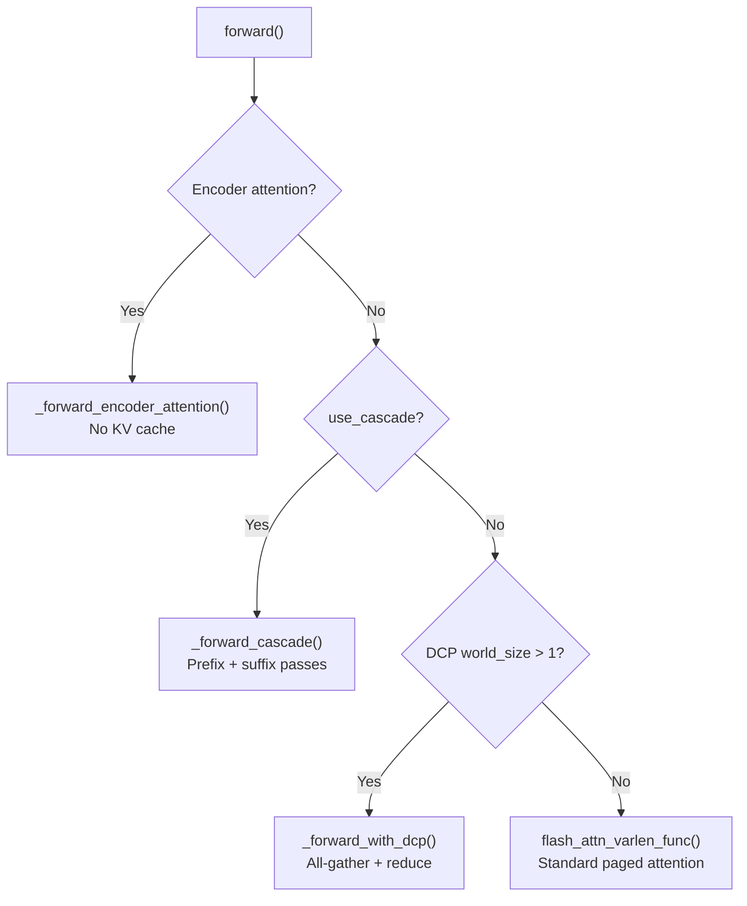

# FlashAttention Backend

The FlashAttention backend (`vllm/v1/attention/backends/flash_attn.py`) is the default attention kernel for NVIDIA GPUs on Ampere (SM80) and Hopper (SM90) architectures. It wraps vLLM's bundled `vllm_flash_attn` library and supports FA2, FA3, and FA4 depending on the GPU generation.

## Version Selection (`fa_utils.py`)

`vllm/v1/attention/backends/fa_utils.py` contains the `get_flash_attn_version()` function that selects the appropriate FA version at runtime:

```python
def get_flash_attn_version(
    requires_alibi: bool = False, head_size: int | None = None
) -> int | None:
    # SM90 (Hopper): prefer FA3
    if device_capability.major == 9 and is_fa_version_supported(3):
        fa_version = 3
    # SM100+ (Blackwell): prefer FA4
    elif device_capability.major == 10 and is_fa_version_supported(4):
        fa_version = 4
    else:
        fa_version = 2  # Fallback
```

### Version Fallback Rules

| Condition | Fallback |
|---|---|
| ALiBi positional encoding | FA3/FA4 → FA2 |
| Batch invariance mode | FA4 → FA2 |
| Blackwell + head_size > 128 | FA4 → FA2 (TMEM capacity limit) |
| FA3 not installed | FA3 → FA2 |

The version can also be overridden via `AttentionConfig.flash_attn_version`.

### Platform-Specific Sources

| Platform | Source |
|---|---|
| CUDA | `vllm.vllm_flash_attn.flash_attn_varlen_func` |
| XPU | `xpu_ops.flash_attn_varlen_func` |
| ROCm | `flash_attn.flash_attn_varlen_func` (upstream, if installed) |

## Backend Class

```python
class FlashAttentionBackend(AttentionBackend):
    accept_output_buffer: bool = True
    supported_dtypes = [torch.float16, torch.bfloat16]
    forward_includes_kv_cache_update: bool = False
```

Key properties:
- **`accept_output_buffer = True`**: The caller pre-allocates the output tensor; this is required for piecewise CUDA graph compatibility.
- **`forward_includes_kv_cache_update = False`**: KV cache writes happen separately from the attention computation (via `reshape_and_cache_flash`).

### Supported Configurations

| Property | Value |
|---|---|
| Head sizes | `head_size % 8 == 0` and `head_size <= 256` |
| Block sizes | Multiples of 16 (or 16/32/64 for hybrid Mamba models) |
| KV cache dtypes | `auto`, `bfloat16`, `fp8`/`fp8_e4m3` (FA3 on SM90 only) |
| Compute capability | SM80+ (Ampere and newer) |
| Attention types | Decoder, Encoder, Encoder-only, Encoder-Decoder |
| Attention sinks | FA3 on SM90+ only |
| Per-head quant scales | FA3+ only |

### KV Cache Shape

```python
# Shape: (2, num_blocks, block_size, num_kv_heads, head_size)
# Dimension 0: 0=keys, 1=values
```

The memory layout (stride order) depends on the configured KV cache layout:
- **NHD** (default): `(num_blocks, 2, block_size, num_kv_heads, head_size)` — blocks-first
- **HND**: `(num_blocks, num_kv_heads, 2, block_size, head_size)` — heads-first

## Attention Metadata

`FlashAttentionMetadata` carries all per-batch state needed by the kernel:

```python
@dataclass
class FlashAttentionMetadata:
    num_actual_tokens: int      # Tokens excluding padding
    max_query_len: int
    query_start_loc: torch.Tensor  # Cumulative query lengths [batch+1]
    max_seq_len: int
    seq_lens: torch.Tensor         # Per-sequence KV lengths [batch]
    block_table: torch.Tensor      # Paged KV block indices
    slot_mapping: torch.Tensor     # Token → KV slot mapping

    # Cascade attention fields
    use_cascade: bool
    common_prefix_len: int
    cu_prefix_query_lens: torch.Tensor | None
    prefix_kv_lens: torch.Tensor | None
    suffix_kv_lens: torch.Tensor | None

    # FA3 AOT scheduler
    scheduler_metadata: torch.Tensor | None
    prefix_scheduler_metadata: torch.Tensor | None
    max_num_splits: int = 0

    causal: bool = True
```

## Metadata Builder

`FlashAttentionMetadataBuilder` is instantiated once per attention layer group and reused across forward passes. Its `build()` method:

1. Reads `CommonAttentionMetadata` (shared across all layers in a batch)
2. Optionally runs the FA3 **ahead-of-time (AOT) scheduler** via `get_scheduler_metadata()`
3. Handles cascade attention by splitting prefix and suffix KV lengths
4. Handles Decode Context Parallelism (DCP) by distributing KV across ranks

### AOT Scheduling (FA3 Only)

FA3 on Hopper supports ahead-of-time tile scheduling. The scheduler metadata tensor has shape `[1 + round_up(batch_size, 4) * 4]` and encodes:
- `tile_count_semaphore` (1 slot) — synchronization
- Per-batch vectors (4 slots each): `prepare_varlen`, `dynamic_split`, `sort_batches`, `head_swizzle`

When CUDA graphs are enabled, `max_num_splits` is set to a fixed upper bound so intermediate buffers can be pre-allocated during graph capture.

## Forward Pass

The `FlashAttentionImpl.forward()` method dispatches to different paths:



### Standard Decode/Prefill Path

```python
flash_attn_varlen_func(
    q=query[:num_actual_tokens],
    k=key_cache,           # Paged KV cache (keys)
    v=value_cache,         # Paged KV cache (values)
    out=output[:num_actual_tokens],
    cu_seqlens_q=cu_seqlens_q,
    max_seqlen_q=max_seqlen_q,
    seqused_k=seqused_k,
    max_seqlen_k=max_seqlen_k,
    softmax_scale=self.scale,
    causal=attn_metadata.causal,
    alibi_slopes=self.alibi_slopes,
    window_size=sliding_window_size,
    block_table=block_table,
    softcap=self.logits_soft_cap,
    fa_version=self.vllm_flash_attn_version,
    scheduler_metadata=scheduler_metadata,
    ...
)
```

The key insight is that `flash_attn_varlen_func` handles **both prefill and decode in a single call** using variable-length (varlen) sequences. The `block_table` argument enables paged KV cache access.

### Cascade Attention (Prefix Caching)

When a common prefix exists across all sequences in a batch (`common_prefix_len > 0`), cascade attention splits the computation:

1. **Prefix pass**: All queries attend to the shared prefix KV (non-causal, single "sequence")
2. **Suffix pass**: Each query attends to its own suffix KV (causal)
3. **Merge**: `merge_attn_states()` combines the two outputs using log-sum-exp

```python
# Prefix pass (non-causal, shared KV)
flash_attn_varlen_func(..., causal=False, seqused_k=prefix_kv_lens, ...)

# Suffix pass (causal, per-sequence KV)
flash_attn_varlen_func(..., causal=True, seqused_k=suffix_kv_lens, ...)

# Merge outputs
merge_attn_states(output, prefix_out, prefix_lse, suffix_out, suffix_lse)
```

### FP8 KV Cache

When `kv_cache_dtype` starts with `"fp8"`, the key and value caches are reinterpreted as `torch.float8_e4m3fn`:

```python
key_cache = key_cache.view(torch.float8_e4m3fn)
value_cache = value_cache.view(torch.float8_e4m3fn)
```

Per-tensor dequantization scales (`_k_scale`, `_v_scale`) are passed to the kernel. FP8 KV cache requires FA3 on SM90.

### Encoder Attention

For encoder-only and encoder-decoder models, the forward pass skips the KV cache entirely and calls `flash_attn_varlen_func` directly with the Q, K, V tensors from the current layer.

## CUDA Graph Support

| FA Version | CUDA Graph Mode |
|---|---|
| FA3 | `ALWAYS` — full graphs for all batch shapes |
| FA2 | `UNIFORM_BATCH` — graphs only for uniform decode batches |

FA2 has a special `max_query_len=1` packed-GQA optimization that breaks mixed prefill-decode graphs, so it falls back to `FULL_AND_PIECEWISE` mode.

## Sliding Window Attention

Sliding window is supported via the `window_size` parameter to `flash_attn_varlen_func`. The AOT scheduler requires a **single** sliding window value across all layers; if layers have different windows, AOT scheduling is disabled.

## Attention Sinks

Attention sinks (keeping the first few tokens always in the KV cache) are supported when:
- FA version is 3 (Hopper)
- Device capability ≥ SM90

The sink tensor has shape `[num_heads]` and is passed to the kernel.

## See Also

- [Backend Selection](./backend-selection.md) — How FlashAttention is chosen
- [FlashInfer Backend](./flashinfer.md) — Alternative for Blackwell
- [Triton Attention](./triton-attn.md) — Pure-Triton fallback
- [MLA Backends](./mla-attn.md) — FlashMLA for DeepSeek models
