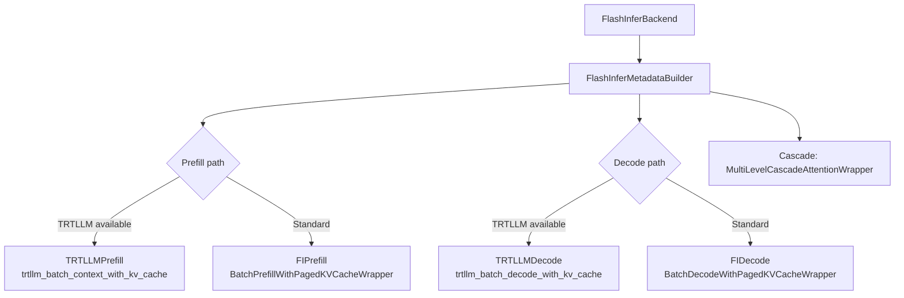

# FlashInfer Backend

The FlashInfer backend (`vllm/v1/attention/backends/flashinfer.py`) is the default attention kernel for NVIDIA Blackwell (SM100+) GPUs and a high-performance alternative on Ampere/Hopper. It wraps the [FlashInfer](https://github.com/flashinfer-ai/flashinfer) library and supports paged KV cache, FP8, FP4, and TRTLLM-gen kernels.

## Overview



## Backend Class

```python
class FlashInferBackend(AttentionBackend):
    accept_output_buffer: bool = True
    supported_dtypes = [torch.float16, torch.bfloat16]
    supported_kv_cache_dtypes = ["auto", "bfloat16", "fp8", "fp8_e4m3", "fp8_e5m2"]
    forward_includes_kv_cache_update: bool = False
```

### Supported Configurations

| Property | Value |
|---|---|
| Head sizes | 64, 128, 256 |
| Block sizes | 16, 32, 64 |
| KV cache dtypes | `auto`, `bfloat16`, `fp8`, `fp8_e4m3`, `fp8_e5m2` |
| Compute capability | SM75–SM121 |
| Attention sinks | TRTLLM path on SM100 only |

### KV Cache Shape

```python
# Shape: (num_blocks, 2, block_size, num_kv_heads, head_size)
# Note: different from FlashAttention's (2, num_blocks, ...) layout
```

On Blackwell (SM100), FlashInfer forces **HND** layout (heads-first) via `get_required_kv_cache_layout()`:

```python
@classmethod
def get_required_kv_cache_layout(cls) -> KVCacheLayoutType | None:
    capability = current_platform.get_device_capability()
    if capability is not None and capability.major == 10:
        return "HND"
    return None
```

## Workspace Management

FlashInfer uses pre-allocated workspace buffers for its plan/run API. The builder maintains several persistent buffers:

```python
# Paged KV index structures (CPU+GPU double buffers)
self.paged_kv_indptr        # [max_num_reqs + 1] — cumulative page counts
self.paged_kv_indices       # [max_num_pages] — page indices
self.paged_kv_last_page_len # [max_num_reqs] — tokens in last page

# TRTLLM workspace
trtllm_gen_workspace_buffer  # [VLLM_FLASHINFER_WORKSPACE_BUFFER_SIZE] bytes
```

For batch-invariant mode (e.g., `torch.compile`), a fixed 2 GiB workspace is used:

```python
FLASHINFER_WORKSPACE_BUFFER_SIZE_BATCH_INVARIANT = 2048 * 1024 * 1024
```

### CpuGpuBuffer

FlashInfer's plan API requires CPU tensors for index structures, while the run API needs GPU tensors. `CpuGpuBuffer` maintains synchronized CPU and GPU copies with optional pinned memory for fast async transfers.

## Prefill vs Decode Paths

FlashInfer separates prefill and decode into distinct wrappers, each with its own `plan()` + `run()` API:

### Prefill (Standard)

Uses `BatchPrefillWithPagedKVCacheWrapper` for context tokens and `BatchPrefillWithRaggedKVCacheWrapper` for new tokens:

```python
# Plan phase (CPU-side, called in metadata builder)
wrapper.plan(
    qo_indptr=qo_indptr_cpu,
    paged_kv_indptr=paged_kv_indptr_cpu,
    paged_kv_indices=paged_kv_indices,
    paged_kv_last_page_len=paged_kv_last_page_len_cpu,
    num_qo_heads=num_qo_heads,
    num_kv_heads=num_kv_heads,
    head_dim_qk=head_dim,
    page_size=page_size,
    causal=True,
    ...
)

# Run phase (GPU-side, called in forward())
output = wrapper.run(query, kv_cache, ...)
```

### Decode (Standard)

Uses `BatchDecodeWithPagedKVCacheWrapper`:

```python
wrapper.plan(
    indptr=paged_kv_indptr_cpu,
    indices=paged_kv_indices_cpu,
    last_page_len=paged_kv_last_page_len_cpu,
    num_qo_heads=num_qo_heads,
    num_kv_heads=num_kv_heads,
    head_dim=head_dim,
    page_size=page_size,
    ...
)
output = wrapper.run(query, kv_cache)
```

### TRTLLM Path (Blackwell)

On SM100 (Blackwell), FlashInfer can use TRTLLM-gen kernels via `trtllm_batch_context_with_kv_cache` and `trtllm_batch_decode_with_kv_cache`. These kernels:
- Support FP8 and FP4 quantization natively
- Enable attention sinks
- Use a separate `trtllm_gen_workspace_buffer` (lazily allocated)

The TRTLLM path is selected when `can_use_trtllm_attention(num_qo_heads, num_kv_heads)` returns True.

```python
# TRTLLM decode
trtllm_batch_decode_with_kv_cache(
    q=query,
    kv_cache=kv_cache,
    workspace_buffer=_get_trtllm_gen_workspace_buffer(),
    ...
)
```

### FP8 KV Cache with Prefill

For FP8 KV cache during prefill, FlashInfer uses a Triton kernel (`_trtllm_prefill_attn_kvfp8_dequant`) to dequantize the paged KV cache into a temporary dense buffer before running the prefill attention:

```python
mock_kv_cache, mock_block_table = trtllm_prefill_attn_kvfp8_dequant(
    kv_cache, block_tables_prefill, k_scale, v_scale, dequant_dtype
)
```

## Metadata Structure

```python
@dataclass
class FlashInferMetadata:
    num_actual_tokens: int
    slot_mapping: torch.Tensor    # [num_actual_tokens]
    q_data_type: torch.dtype

    num_decodes: int
    num_decode_tokens: int
    num_prefills: int
    num_prefill_tokens: int

    prefill: FIPrefill | TRTLLMPrefill | None
    decode: FIDecode | TRTLLMDecode | None

    use_cascade: bool
    cascade_wrapper: MultiLevelCascadeAttentionWrapper | None
```

The `prefill` and `decode` fields are typed unions — the builder selects the appropriate type based on whether TRTLLM is available.

## Cascade Attention

When a common prefix exists, FlashInfer uses `MultiLevelCascadeAttentionWrapper`:

```python
cascade_wrapper = MultiLevelCascadeAttentionWrapper(
    num_levels=2,
    workspace_buffer=workspace_buffer,
    kv_layout=kv_layout,
)
```

This handles the two-level attention (prefix + suffix) in a single optimized call.

## CUDA Graph Support

| Mode | Condition |
|---|---|
| `UNIFORM_BATCH` | TRTLLM decode available |
| `ALWAYS` | Not available (standard FlashInfer) |

When CUDA graphs are enabled with TRTLLM, a separate `BatchDecodeWithPagedKVCacheWrapper` is created for each captured batch size:

```python
self._decode_wrappers_cudagraph: dict[int, BatchDecodeWithPagedKVCacheWrapper] = {}
```

## Batch-Invariant Mode

When `vllm_is_batch_invariant()` is True (e.g., for `torch.compile`):
- Fixed split sizes: `decode_fixed_split_size=2048`, `prefill_fixed_split_size=4096`
- `disable_split_kv=True` — prevents dynamic KV splitting
- 2 GiB workspace buffer

## Decode Context Parallelism (DCP)

FlashInfer supports DCP via `BatchDCPPrefillWrapper`, which:
1. All-gathers queries across DCP ranks
2. Runs context attention on the gathered queries
3. Reduces outputs using `cp_lse_ag_out_rs` or `dcp_a2a_lse_reduce`
4. Runs new-token attention locally
5. Merges the two outputs

## See Also

- [Backend Selection](./backend-selection.md) — When FlashInfer is chosen
- [FlashAttention Backend](./flash-attn.md) — Alternative for Hopper/Ampere
- [MLA Backends](./mla-attn.md) — FlashInfer MLA variant
