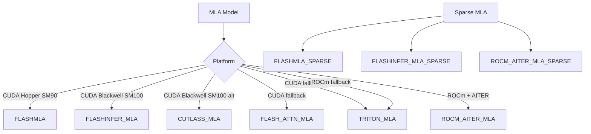

# MLA (Multi-head Latent Attention) Backends

Multi-head Latent Attention (MLA) is DeepSeek's attention mechanism that compresses the KV cache using low-rank projections. vLLM supports MLA through a family of specialized backends optimized for different hardware.

## MLA Computation Model

MLA stores a single **latent vector** per token instead of separate K and V tensors. This dramatically reduces KV cache memory usage. The computation has two paths:

### Compute-Friendly Path (Prefill / `forward_mha`)

Used when the query-to-KV ratio is near 1 (prefill). Expands the latent KV into full K and V tensors and runs standard MHA:

```
q_c      = h_t @ W_DQ                          # Compress query
q_nope   = (q_c @ W_UQ).view(Sq, N, P)         # Expand query (no-rope)
q_pe     = RoPE(q_c @ W_QR).view(Sq, N, R)     # Expand query (rope)
new_kv_c = h_t @ W_DKV                          # Compress KV
new_k_pe = RoPE(h_t @ W_KR)                    # Decoupled K position
kv_c     = cat([new_kv_c, cache_kv_c])          # Full KV latent
k_nope   = (kv_c @ W_UK).view(Skv, N, P)       # Expand K (no-rope)
v        = (kv_c @ W_UV).view(Skv, N, V)       # Expand V

# MHA: QK headdim = P + R, V headdim = V
output = scaled_dot_product_attention(
    cat([q_nope, q_pe], dim=-1),
    cat([k_nope, k_pe.expand(-1, N, -1)], dim=-1),
    v
)
```

### Data-Movement Friendly Path (Decode / `forward_mqa`)

Used when the query-to-KV ratio is large (decode). Avoids expanding K/V by absorbing `W_UK` into the query:

```
ql_nope = einsum("snh,lnh->snl", q_nope, W_UK)  # Absorb W_UK into Q

# MQA: QK headdim = Lkv + R, V headdim = Lkv
output = scaled_dot_product_attention(
    cat([ql_nope, q_pe], dim=-1),
    cat([kv_c, k_pe], dim=-1),
    kv_c
)
o = einsum("snl,lnv->snv", output, W_UV)         # Apply W_UV to output
```

### Key Dimensions (DeepSeek V3)

| Symbol | Meaning | Value |
|---|---|---|
| `Lq` | Q latent dimension | 1536 |
| `Lkv` | KV latent dimension | 512 |
| `P` | No-rope head dim | 128 |
| `R` | Rope head dim | 64 |
| `V` | V head dim | 128 |

## MLA Layer (`vllm/model_executor/layers/mla.py`)

The `MultiHeadLatentAttentionWrapper` is a `PluggableLayer` that wraps the MLA computation:

```python
@PluggableLayer.register("multi_head_latent_attention")
class MultiHeadLatentAttentionWrapper(PluggableLayer):
    def __init__(self, hidden_size, num_heads, scale,
                 qk_nope_head_dim, qk_rope_head_dim, v_head_dim,
                 q_lora_rank, kv_lora_rank, mla_modules, ...):
        self.mla_attn = MLAAttention(...)
```

The `MLAModules` dataclass bundles all MLA-specific sub-modules:

```python
@dataclass
class MLAModules:
    kv_a_layernorm: torch.nn.Module
    kv_b_proj: torch.nn.Module          # [W_UK; W_UV] concatenated
    rotary_emb: torch.nn.Module
    o_proj: torch.nn.Module             # W_O
    fused_qkv_a_proj: torch.nn.Module | None
    kv_a_proj_with_mqa: torch.nn.Module | None
    q_a_layernorm: torch.nn.Module | None
    q_b_proj: torch.nn.Module | None    # [W_UQ; W_QR] concatenated
    q_proj: torch.nn.Module | None
    indexer: torch.nn.Module | None     # For sparse MLA
    is_sparse: bool
    topk_indices_buffer: torch.Tensor | None
```

## KV Cache Format

MLA stores the compressed KV latent and decoupled K position embeddings:

```python
# KV cache shape: (num_blocks, block_size, kv_lora_rank + qk_rope_head_dim)
# = (num_blocks, block_size, 512 + 64) for DeepSeek V3
```

The cache is written via `ops.concat_and_cache_mla()` which concatenates `kv_c_normed` and `k_pe` before storing.

## Backend Overview



## FlashMLA Backend

**File:** `vllm/v1/attention/backends/mla/flashmla.py`

The `FlashMLABackend` uses the [FlashMLA](https://github.com/deepseek-ai/FlashMLA) library from DeepSeek, optimized for Hopper (SM90) and Blackwell (SM100).

### Supported Configurations

| Property | Value |
|---|---|
| Block sizes | 64 only |
| KV cache dtypes | `auto`, `bfloat16`, `fp8`, `fp8_e4m3` |
| Compute capability | SM90 (Hopper), SM100 (Blackwell) |

### Block Size Enforcement

FlashMLA requires a block size of exactly 64. vLLM automatically sets `cache_config.block_size = 64` when FlashMLA is selected:

```python
if use_flashmla and is_flashmla_dense_supported()[0] and cache_config.block_size % 64 != 0:
    cache_config.block_size = 64
```

### Decode Kernel

FlashMLA uses `flash_mla_with_kvcache()` for decode, which implements the data-movement friendly MQA path directly on the compressed KV cache without expanding to full K/V.

---

## CutlassMLA Backend

**File:** `vllm/v1/attention/backends/mla/cutlass_mla.py`

The `CutlassMLABackend` uses NVIDIA CUTLASS kernels for MLA on Blackwell (SM100).

### Supported Configurations

| Property | Value |
|---|---|
| Block sizes | 128 only |
| KV cache dtypes | `auto`, `bfloat16`, `fp8`, `fp8_e4m3` |
| Compute capability | SM100 (Blackwell) only |

### SM100 Workspace

The backend maintains an `SM100Workspace` that pre-allocates a workspace buffer and tracks the SM count for kernel launch configuration:

```python
class SM100Workspace:
    def __init__(self, initial_workspace_size):
        self._workspace_buf = torch.empty(initial_workspace_size, device="cuda", dtype=torch.uint8)
        self._block_size = 128  # Forced to 128
        self._sm_count = num_compute_units(0)
```

### CUDA Graph Support

CutlassMLA uses `AttentionCGSupport.UNIFORM_SINGLE_TOKEN_DECODE` — CUDA graphs are captured only for single-token decode batches.

---

## FlashInfer MLA Backend

**File:** `vllm/v1/attention/backends/mla/flashinfer_mla.py`

The `FlashInferMLABackend` uses FlashInfer's TRTLLM-gen MLA kernel, optimized for Blackwell (SM100).

### Supported Configurations

| Property | Value |
|---|---|
| Block sizes | 32, 64 |
| KV cache dtypes | `auto`, `bfloat16`, `fp8`, `fp8_e4m3` |
| Compute capability | SM100 (Blackwell) only |
| `qk_nope_head_dim` | Must be 128 |

### Workspace

Uses a 128 MiB workspace buffer:

```python
FLASHINFER_MLA_WORKSPACE_BUFFER_SIZE = 128 * 1024 * 1024
```

### CUDA Graph Support

Uses `AttentionCGSupport.UNIFORM_BATCH` — graphs for uniform decode batches only.

### Decode Kernel

```python
from flashinfer.decode import trtllm_batch_decode_with_kv_cache_mla
```

---

## FlashAttn MLA Backend

**File:** `vllm/v1/attention/backends/mla/flashattn_mla.py`

The `FlashAttnMLABackend` uses vLLM's bundled FlashAttention (FA3) for MLA on Hopper (SM90). It is the first-priority MLA backend on non-Blackwell GPUs.

### Requirements

- FA3 must be available (`is_fa_version_supported(3)`)
- SM90 (Hopper) only
- `qk_nope_head_dim` must be 128 (FA4 on Blackwell has TMEM limits)

---

## Triton MLA Backend

**File:** `vllm/v1/attention/backends/mla/triton_mla.py`

The `TritonMLABackend` is the universal fallback MLA backend, working on any GPU that supports Triton.

### Supported Configurations

| Property | Value |
|---|---|
| KV cache dtypes | `auto`, `bfloat16` (no FP8) |
| Compute capability | All |

### Decode Kernel

Uses `decode_attention_fwd()` from `vllm/v1/attention/ops/triton_decode_attention.py`.

---

## Sparse MLA Backends

For DeepSeek V3.2 and similar models with sparse attention (controlled by `index_topk` in the HF config), vLLM uses sparse MLA backends that only attend to a subset of KV cache entries.

### FlashMLA Sparse

**File:** `vllm/v1/attention/backends/mla/flashmla_sparse.py`

Uses FlashMLA with sparse indexing. Block size: 64.

### FlashInfer MLA Sparse

**File:** `vllm/v1/attention/backends/mla/flashinfer_mla_sparse.py`

Uses FlashInfer with sparse indexing. Block sizes: 32, 64.

### ROCm AITER MLA Sparse

**File:** `vllm/v1/attention/backends/mla/rocm_aiter_mla_sparse.py`

ROCm-specific sparse MLA using AITER ops.

---

## ROCm AITER MLA Backend

**File:** `vllm/v1/attention/backends/mla/rocm_aiter_mla.py`

The `AiterMLABackend` uses AMD's AITER library for MLA on ROCm. Selected when `rocm_aiter_ops.is_mla_enabled()` returns True.

---

## Chunked Prefill for MLA

For long-context prefill, MLA uses a chunked approach to bound memory usage. The `MLACommonImpl` in `mla_attention.py` implements this:

```python
# Process context in chunks to avoid OOM
for chunk_idx in range(cdiv(C, MCC)):
    chunk_start = chunk_idx * MCC
    chunk_end = min(chunk_start + MCC, C)
    cache_kv_c_chunk = cache_kv_c[chunk_start:chunk_end]
    cache_k_pe_chunk = cache_k_pe[chunk_start:chunk_end]

    # Expand chunk to full K/V
    cache_k_nope_chunk = (cache_kv_c_chunk @ W_UK).view(-1, N, P)
    cache_v_chunk = (cache_kv_c_chunk @ W_UV).view(-1, N, V)

    # Attend to chunk
    chunk_o, chunk_lse = scaled_dot_product_attention(...)

    # Merge with previous chunks
    curr_o, curr_lse = merge_attn_states(curr_o, curr_lse, chunk_o, chunk_lse)
```

## Selecting an MLA Backend

```bash
# Force FlashMLA (Hopper default)
vllm serve deepseek-ai/DeepSeek-V3 \
  --attention-config '{"backend": "FLASHMLA"}'

# Force CutlassMLA (Blackwell)
vllm serve deepseek-ai/DeepSeek-V3 \
  --attention-config '{"backend": "CUTLASS_MLA"}'

# Force Triton MLA (universal fallback)
vllm serve deepseek-ai/DeepSeek-V3 \
  --attention-config '{"backend": "TRITON_MLA"}'
```

## See Also

- [Backend Selection](./backend-selection.md) — MLA backend priority order
- [FlashAttention Backend](./flash-attn.md) — Standard attention for non-MLA models
- [ROCm Backends](./rocm-attn.md) — ROCm MLA backends
