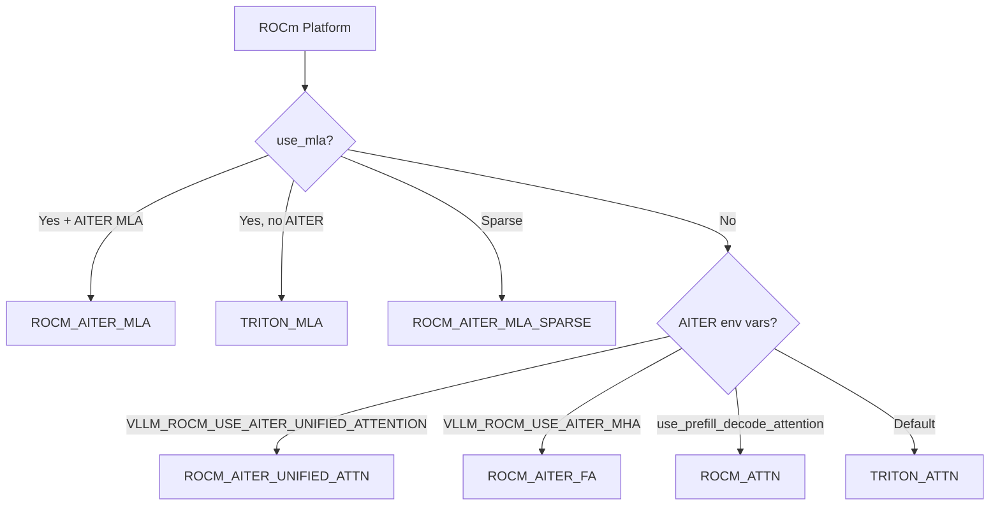

# ROCm Attention Backends

vLLM provides several ROCm-specific attention backends optimized for AMD GPUs. These backends are selected based on environment variables and the availability of the AITER (AMD Inference Triton Extension Runtime) library.

## Backend Hierarchy



## Environment Variables

| Variable | Default | Effect |
|---|---|---|
| `VLLM_ROCM_USE_AITER` | `0` | Enable AITER ops globally |
| `VLLM_ROCM_USE_AITER_UNIFIED_ATTENTION` | `0` | Use AITER unified attention (highest priority) |
| `VLLM_ROCM_USE_AITER_MHA` | `0` | Use AITER Flash Attention (MHA) |

## ROCM_ATTN Backend

**File:** `vllm/v1/attention/backends/rocm_attn.py`

The `RocmAttentionBackend` is a ROCm-specific backend that uses `chunked_prefill_paged_decode()` for the forward pass. It is selected when `use_prefill_decode_attention` is set in the attention config.

### Supported Configurations

| Property | Value |
|---|---|
| Head sizes | 32, 64, 80, 96, 128, 160, 192, 224, 256 |
| Block sizes | 16, 32, 544 (non-standard for Qwen3) |
| KV cache dtypes | `auto`, `bfloat16`, `fp8`, `fp8_e4m3`, `fp8_e5m2` |
| Attention types | All (Decoder, Encoder, Encoder-only, Encoder-Decoder) |
| Attention sinks | Yes |
| Multimodal prefix | Yes |

### KV Cache Shape

```python
# Shape: (2, num_blocks, block_size, num_kv_heads, head_size)
# Same as FlashAttention layout
```

### Forward Pass

The `RocmAttentionImpl.forward()` calls `chunked_prefill_paged_decode()` from `vllm/v1/attention/ops/chunked_prefill_paged_decode.py`, which handles both prefill and decode in a single call:

```python
chunked_prefill_paged_decode(
    query=query[:num_actual_tokens],
    key=key[:num_actual_tokens],
    value=value[:num_actual_tokens],
    output=output[:num_actual_tokens],
    kv_cache_dtype=self.kv_cache_dtype,
    key_cache=key_cache,
    value_cache=value_cache,
    block_table=block_table,
    query_start_loc=cu_seqlens_q,
    seq_lens=seqused_k,
    max_seq_len=max_seqlen_k,
    max_query_len=max_seqlen_q,
    k_scale=layer._k_scale,
    v_scale=layer._v_scale,
    alibi_slopes=self.alibi_slopes,
    sliding_window=self.sliding_window[0],
    sm_scale=self.scale,
    output_scale=output_scale,
    sinks=self.sinks,
)
```

### KV Cache Update

For standard block sizes (powers of 2), the native HIP C++ `PagedAttention.write_to_paged_cache()` is used. For non-standard block sizes (e.g., 544 for Qwen3), the Triton `triton_reshape_and_cache_flash()` kernel is used instead.

### Fused RoPE + KV Cache

When AITER ops are enabled (`rocm_aiter_ops.is_enabled()`), the backend supports fused RoPE + KV cache update via `do_rope_and_kv_cache_update()`, which avoids a separate kernel launch for positional encoding.

---

## ROCM_AITER_FA Backend

**File:** `vllm/v1/attention/backends/rocm_aiter_fa.py`

The `AiterFlashAttentionBackend` uses AMD's AITER library for high-performance Flash Attention on ROCm. It is selected when `VLLM_ROCM_USE_AITER=1` and `VLLM_ROCM_USE_AITER_MHA=1`.

### Key Features

- **Three-way split**: Separates decode, extend (chunked prefill), and prefill requests
- **Chunked context**: Processes long contexts in chunks to bound memory usage
- **Sliding window**: Supports sliding window attention with AITER-specific metadata
- **FP8 shuffle layout**: Optional shuffled KV cache layout for FP8 quantization
- **Context parallelism**: Supports CP via Triton gather kernels

### Metadata Structure

```python
@dataclass
class AiterFlashAttentionMetadata:
    num_actual_tokens: int
    num_actual_kv_tokens: int
    max_query_len: int
    query_start_loc: torch.Tensor
    max_seq_len: int
    seq_lens: torch.Tensor
    slot_mapping: torch.Tensor
    block_table: torch.Tensor

    # Three-way split
    num_decodes: int
    num_decode_tokens: int
    num_prefills: int
    num_prefill_tokens: int
    num_extends: int
    num_extend_tokens: int

    decode_metadata: AiterFlashAttentionDecodeMetadata | None
    prefill_metadata: AiterFlashAttentionPrefillMetadata | None
    extend_metadata: AiterFlashAttentionChunkPrefillMetadata | None

    # Cascade attention
    use_cascade: bool
    common_prefix_len: int
    total_tokens: int

    # FP8 shuffle layout scales
    k_scale: dict[str, torch.Tensor] | None
    v_scale: dict[str, torch.Tensor] | None
```

### Chunked Context Metadata

For long-context prefill, the builder computes `AiterChunkContextMetadata`:

```python
@dataclass
class AiterChunkContextMetadata:
    workspace: torch.Tensor         # [2, CP_TOKENS_PER_ITER, num_kv_heads, headdim]
    cu_seq_lens_chunk: torch.Tensor # Cumulative chunk lengths
    chunk_starts: torch.Tensor      # Start positions of each chunk
    token_to_batch: torch.Tensor    # Token → batch index mapping
    seq_tot: list[int]              # Total tokens per chunk
    max_seq_lens: list[int]         # Max sequence length per chunk
    seq_lens: torch.Tensor          # Per-sequence lengths
    num_chunks: int
    total_token_per_batch: list[int]
    swa_metadata: AiterChunkSlidingWindowMetadata | None
```

The workspace tensor has shape `[2, _CP_TOKENS_PER_ITER_ROCM, num_kv_heads, headdim]` where `_CP_TOKENS_PER_ITER_ROCM = 32 * 1024`.

### Context Parallelism Gather Kernel

The backend includes a custom Triton kernel `cp_mha_gather_cache_kernel` that gathers KV cache entries for context parallelism:

```python
@triton.jit
def cp_mha_gather_cache_kernel(
    key_cache_ptr,    # [num_blocks, page_size, num_head, head_size]
    value_cache_ptr,  # [num_blocks, page_size, num_head, head_size]
    key_ptr,          # [num_tokens, num_heads, head_size]
    value_ptr,        # [num_tokens, num_heads, head_size]
    block_table_ptr,  # [num_batches, max_block_num]
    cu_seqlens_kv_ptr,
    token_to_batch_ptr,
    seq_start_ptr,
    ...
    CACHE_FORMAT: tl.constexpr,  # "NHD" or "HND"
    ...
)
```

This kernel supports both NHD and HND cache layouts.

### FP8 Shuffle Layout

When `rocm_aiter_ops.is_shuffle_kv_cache_enabled()` is True and FP8 is used, the KV cache uses a shuffled layout for better memory access patterns. The `reshape_and_cache_shuffle_kernel` Triton kernel writes tokens into this layout:

```python
# Shuffled key cache: [num_blocks, num_kv_heads, head_size // x, block_size, x]
# Shuffled value cache: [num_blocks, num_kv_heads, block_size // x, head_size, x]
# where x = 16 // element_size
```

---

## ROCM_AITER_UNIFIED_ATTN Backend

**File:** `vllm/v1/attention/backends/rocm_aiter_unified_attn.py`

The `RocmAiterUnifiedAttentionBackend` extends `RocmAttentionBackend` with AITER-specific optimizations. It is the highest-priority ROCm backend when `VLLM_ROCM_USE_AITER=1` and `VLLM_ROCM_USE_AITER_UNIFIED_ATTENTION=1`.

### Differences from ROCM_ATTN

| Feature | ROCM_ATTN | ROCM_AITER_UNIFIED_ATTN |
|---|---|---|
| Block sizes | 16, 32, 544 | Multiples of 16 |
| Head sizes | Fixed list | `head_size >= 32` |
| Multimodal prefix | Yes | Yes |
| Attention sinks | Yes | Yes |
| Cascade attention | No | No |
| KV cache layout | `(2, num_blocks, ...)` | `(2, num_blocks, ...)` |

### Implementation

`RocmAiterUnifiedAttentionImpl` extends `RocmAttentionImpl` and overrides the forward pass to use AITER's unified attention kernel. The unified kernel handles both prefill and decode in a single dispatch, similar to the Triton unified attention backend.

---

## ROCM_AITER_MLA Backend

**File:** `vllm/v1/attention/backends/mla/rocm_aiter_mla.py`

The `AiterMLABackend` provides MLA (Multi-head Latent Attention) support for ROCm using AITER ops. It is selected for DeepSeek-style models on ROCm when AITER MLA is enabled.

See [MLA Backends](./mla-attn.md) for details on the MLA computation model.

---

## Choosing a ROCm Backend

```bash
# Use AITER unified attention (highest performance)
VLLM_ROCM_USE_AITER=1 VLLM_ROCM_USE_AITER_UNIFIED_ATTENTION=1 \
  vllm serve meta-llama/Llama-3.1-8B

# Use AITER Flash Attention
VLLM_ROCM_USE_AITER=1 VLLM_ROCM_USE_AITER_MHA=1 \
  vllm serve meta-llama/Llama-3.1-8B

# Use prefill-decode split (ROCM_ATTN)
vllm serve meta-llama/Llama-3.1-8B \
  --attention-config '{"use_prefill_decode_attention": true}'

# Default: Triton attention
vllm serve meta-llama/Llama-3.1-8B
```

## See Also

- [Backend Selection](./backend-selection.md) — ROCm priority order
- [Triton Attention](./triton-attn.md) — Default ROCm fallback
- [MLA Backends](./mla-attn.md) — ROCm MLA backends
