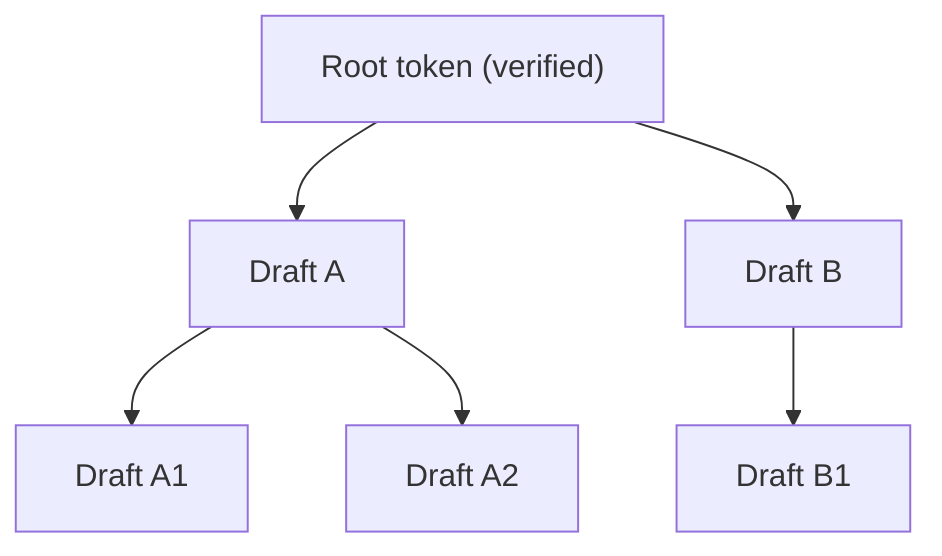

# Tree Attention Backend

The Tree Attention backend (`vllm/v1/attention/backends/tree_attn.py`) implements attention for speculative decoding with tree-structured draft token sequences. It extends standard paged attention with a **tree attention bias** that encodes the ancestor relationships in the speculative token tree.

## Overview

In speculative decoding, the draft model generates a tree of candidate tokens rather than a single sequence. Each node in the tree can attend to its ancestors (the path from root to that node) but not to sibling branches. The tree attention bias encodes this masking pattern as an additive bias to the attention logits.



In this tree:
- A1 attends to: Root, A, A1 (itself)
- A2 attends to: Root, A, A2 (itself)
- B1 attends to: Root, B, B1 (itself)
- A1 does **not** attend to B or B1

## Backend Class

```python
class TreeAttentionBackend(AttentionBackend):
    accept_output_buffer: bool = True
    supported_dtypes = [torch.float16, torch.bfloat16]
    forward_includes_kv_cache_update: bool = False
```

### Supported Configurations

| Property | Value |
|---|---|
| Head sizes | 32, 64, 96, 128, 160, 192, 224, 256 |
| Block sizes | Multiples of 16 |
| Attention types | Decoder only |
| Cascade attention | Not supported |

### KV Cache Shape

```python
# Shape: (2, num_blocks, block_size, num_kv_heads, head_size)
```

## Tree Attention Bias

The tree attention bias is a 2D tensor of shape `[tree_len, tree_len]` where `tree_len = len(tree_choices) + 1` (the +1 is for the root token).

### Construction

```python
def _prepare_tree_attn_bias(
    sorted_tree_choices: list[tuple[int, ...]],
    depth_counts: list[int],
    dtype: torch.dtype,
    device: torch.device,
) -> torch.Tensor:
    tree_len = len(sorted_tree_choices) + 1
    tree_attn_mask = torch.full((tree_len, tree_len), -torch.inf, ...)

    # Each token attends to itself
    for i in range(tree_len):
        tree_attn_mask[i, i] = 0

    # All tokens attend to root (index 0)
    tree_attn_mask[:, 0] = 0

    # Each token attends to its ancestors
    for each token:
        ancestor_idx = [sorted_tree_choices.index(ancestor_path) + 1 for ...]
        tree_attn_mask[token_idx, ancestor_idx] = 0
```

The bias uses `-inf` for non-ancestor positions (masked out) and `0` for ancestor positions (unmasked). This is added to the attention logits before softmax.

### Example

For `tree_choices = [(0,), (1,), (0, 0), (0, 1)]`:

```
         Root  A    B    A0   A1
Root  [  0,   0,   0,   0,   0  ]  # Root attends to all (or all attend to root)
A     [ -inf,  0, -inf, -inf, -inf]  # A attends to root and itself
B     [ -inf, -inf, 0, -inf, -inf]  # B attends to root and itself
A0    [ -inf,  0, -inf,  0,  -inf]  # A0 attends to root, A, and itself
A1    [ -inf,  0, -inf, -inf,  0 ]  # A1 attends to root, A, and itself
```

## Metadata

```python
@dataclass
class TreeAttentionMetadata:
    num_actual_tokens: int
    max_query_len: int
    query_start_loc: torch.Tensor
    max_seq_len: int
    seq_lens: torch.Tensor
    block_table: torch.Tensor
    slot_mapping: torch.Tensor

    num_prefill_tokens: int = 0
    num_decode_tokens: int = 0
    num_prefills: int = 0
    num_decodes: int = 0

    tree_attn_bias: torch.Tensor | None = None  # [tree_len, tree_len]

    # Cached split metadata
    _cached_prefill_metadata: TreeAttentionMetadata | None = None
    _cached_decode_metadata: TreeAttentionMetadata | None = None
```

The metadata is split into `prefill_metadata` and `decode_metadata` properties that lazily construct sub-metadata for each phase.

## Metadata Builder

The `TreeAttentionMetadataBuilder` reads the speculative token tree from `speculative_config.speculative_token_tree`:

```python
spec_token_tree: str | None = spec.speculative_token_tree
tree_choices: list[tuple[int, ...]] = (
    ast.literal_eval(spec_token_tree) if spec_token_tree is not None else [(0,)]
)
depth_counts = _get_depth_counts(tree_choices)
self.tree_attn_bias = _prepare_tree_attn_bias(
    tree_choices, depth_counts, dtype=torch.float32, device=device
)
```

The `reorder_batch_threshold` is set to `tree_attn_bias.shape[0]` — the tree length. Batches with more decode tokens than the tree length are treated as prefill.

### Drafting Support

The builder has a `build_for_drafting()` method used during the draft phase of speculative decoding:

```python
def build_for_drafting(self, common_attn_metadata, draft_index):
    if draft_index == 0:
        # Root level: use prefill (no tree bias)
        self.tree_attn_bias = torch.empty(0)
    else:
        # Slice bias for current draft depth
        start, end = 1, 1 + common_attn_metadata.max_query_len
        self.tree_attn_bias = self.tree_attn_bias[start:end, start:end].contiguous()
    return self.build(0, common_attn_metadata, fast_build=True)
```

## Forward Pass

The forward pass separates prefill and decode tokens:

```python
# Prefill tokens: standard causal attention (no tree bias)
if prefill_meta := attn_metadata.prefill_metadata:
    unified_attention(
        q=query[num_decode_tokens:num_actual_tokens],
        k=key_cache, v=value_cache,
        out=output[num_decode_tokens:num_actual_tokens],
        cu_seqlens_q=prefill_meta.query_start_loc,
        ...
        causal=True,
        # No qq_bias for prefill
    )

# Decode tokens: tree attention with bias
if decode_meta := attn_metadata.decode_metadata:
    unified_attention(
        q=query[:num_decode_tokens],
        k=key_cache, v=value_cache,
        out=output[:num_decode_tokens],
        cu_seqlens_q=decode_meta.query_start_loc,
        ...
        causal=True,
        qq_bias=decode_meta.tree_attn_bias,  # Tree attention bias!
    )
```

The `qq_bias` parameter in `unified_attention` adds the tree attention bias to the query-query attention logits, implementing the ancestor masking.

## KV Cache Update

Tree attention uses `ops.reshape_and_cache_flash()` for KV cache updates (same as FlashAttention):

```python
def do_kv_cache_update(self, layer, key, value, kv_cache, slot_mapping):
    key_cache, value_cache = kv_cache.unbind(0)
    ops.reshape_and_cache_flash(
        key, value, key_cache, value_cache,
        slot_mapping, self.kv_cache_dtype,
        layer._k_scale, layer._v_scale,
    )
```

## Speculative Decoding Integration

Tree attention is used in conjunction with vLLM's speculative decoding framework. The tree structure is defined in the speculative config:

```python
# Example tree: 2 tokens at depth 1, 2 tokens at depth 2
speculative_token_tree = "[(0,), (1,), (0, 0), (0, 1)]"
```

The tree attention backend handles the verification step where all draft tokens are evaluated simultaneously using the tree attention bias to enforce the correct ancestor masking.

## See Also

- [Backend Selection](./backend-selection.md) — When tree attention is chosen
- [Triton Attention](./triton-attn.md) — `unified_attention` kernel used by tree attention
- [FlashAttention Backend](./flash-attn.md) — Standard attention for non-speculative decoding
