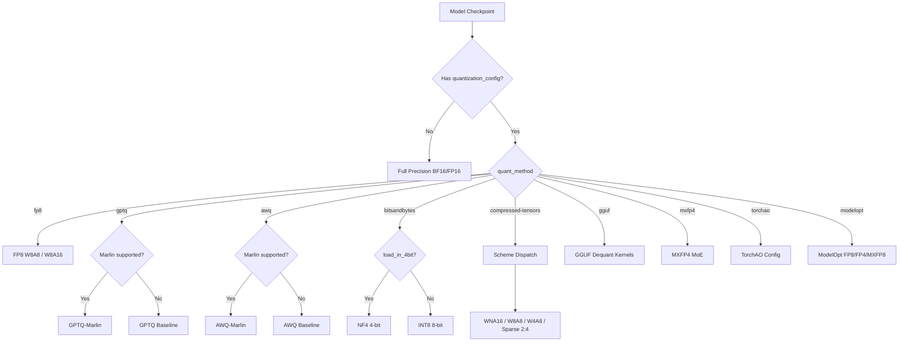
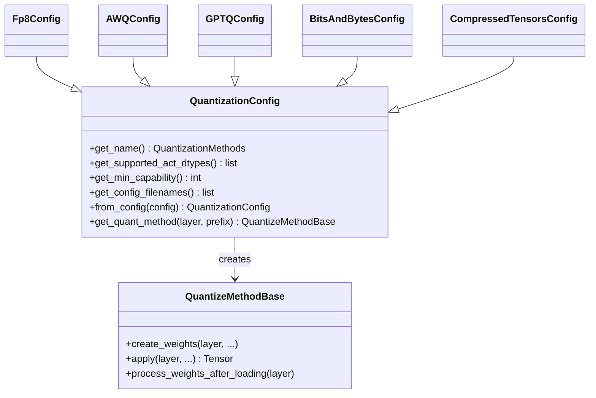

# Quantization Overview

Quantization reduces the memory footprint and increases the throughput of large language models by representing weights and/or activations in lower-precision numeric formats. vLLM supports a comprehensive suite of quantization methods — from simple weight-only schemes to sophisticated mixed-precision and microscaling formats.

## Why Quantize?

A 70B-parameter model in BF16 requires roughly 140 GB of GPU memory. Quantization can cut that to 35–70 GB (4-bit or 8-bit), enabling deployment on fewer or smaller GPUs while often maintaining near-original accuracy.

The key tradeoffs are:

| Dimension | Lower bits | Higher bits |
|-----------|-----------|-------------|
| Memory | ✅ Less | ❌ More |
| Throughput | ✅ Higher | ❌ Lower |
| Accuracy | ❌ Some loss | ✅ Better |
| Calibration | Sometimes needed | Not needed |

## Quantization Taxonomy

### Weight-Only Quantization

Only the model weights are stored in reduced precision. Activations remain in full precision (FP16/BF16) during computation. The quantized weights are dequantized on-the-fly before the matrix multiply.

**Pros:** No calibration data required for many methods; easy to apply post-training.  
**Cons:** Dequantization adds overhead; activation memory is unchanged.

**Examples in vLLM:** GPTQ, AWQ, GGUF, BitsAndBytes 4-bit NF4

### Weight + Activation Quantization (W8A8, W4A8, etc.)

Both weights and activations are quantized. The matrix multiply itself runs in reduced precision (e.g., INT8 or FP8 GEMM), giving the highest throughput gains.

**Pros:** Maximum throughput; hardware-accelerated GEMM kernels.  
**Cons:** Requires calibration data for static activation scales; more complex.

**Examples in vLLM:** FP8 (W8A8), compressed-tensors W8A8, ModelOpt FP8

### KV Cache Quantization

The key-value cache tensors are stored in FP8 instead of BF16/FP16, reducing memory pressure during long-context inference without affecting weight storage.

**Examples in vLLM:** FP8 KV cache via `kv_cache_dtype`

## Calibration

Some quantization methods require a **calibration dataset** — a small set of representative inputs used to compute optimal scaling factors:

- **Static activation quantization** (e.g., FP8 static, INT8 W8A8): Calibration determines per-tensor or per-channel activation scales that are stored in the checkpoint.
- **Dynamic activation quantization** (e.g., FP8 dynamic, AWQ): Scales are computed at runtime from each input batch; no calibration needed.
- **Weight-only methods** (GPTQ, AWQ): Calibration is used during the quantization process to minimize weight rounding error, but the resulting checkpoint is self-contained.

## Quantization Scheme Selection Flow



## Supported Quantization Methods

| Method | Key | Bits | Type | Hardware |
|--------|-----|------|------|----------|
| [FP8](fp8.md) | `fp8` | 8 | W8A8 / W8A16 | SM89+ (Ada, Hopper) |
| [FBGEMM FP8](fp8.md#fbgemm-fp8) | `fbgemm_fp8` | 8 | W8A8 | SM80+ |
| [PTPC FP8](fp8.md#ptpc-fp8) | `ptpc_fp8` | 8 | W8A8 dynamic | AMD MI300+ |
| [AWQ](awq.md) | `awq` | 4 | W4A16 | SM75+ |
| [AWQ-Marlin](awq.md#awq-marlin) | `awq_marlin` | 4 | W4A16 | SM80+ |
| [GPTQ](gptq.md) | `gptq` | 2/3/4/8 | WNA16 | SM75+ |
| [GPTQ-Marlin](gptq.md#gptq-marlin) | `gptq_marlin` | 4/8 | WNA16 | SM80+ |
| [BitsAndBytes](bitsandbytes.md) | `bitsandbytes` | 4/8 | NF4/INT8 | SM70+ |
| [compressed-tensors](compressed-tensors.md) | `compressed-tensors` | varies | W8A8/WNA16/Sparse | SM70+ |
| [GGUF](gguf.md) | `gguf` | varies | Weight-only | SM60+ |
| [MXFP4](mxfp4.md) | `mxfp4` | 4 | MoE W4A16 | SM80+ |
| [TorchAO](torchao.md) | `torchao` | varies | Configurable | SM75+ |
| [ModelOpt](modelopt.md) | `modelopt` | 8/4 | FP8/FP4/MXFP8 | SM80+ |
| [KV Cache](kv-cache.md) | via `kv_cache_dtype` | 8 | FP8 KV | SM89+ |

## Selecting a Quantization Method

```python
from vllm import LLM

# Load a pre-quantized model (quantization auto-detected from config)
llm = LLM(model="neuralmagic/Meta-Llama-3-8B-Instruct-FP8")

# Force a specific quantization method
llm = LLM(model="meta-llama/Llama-3-8B", quantization="fp8")

# Enable FP8 KV cache
llm = LLM(model="meta-llama/Llama-3-8B", kv_cache_dtype="fp8")
```

## Architecture: QuantizationConfig and QuantizeMethodBase

All quantization methods in vLLM follow a two-class pattern defined in `vllm/model_executor/layers/quantization/base_config.py`:



The `get_quant_method()` factory method inspects the layer type (`LinearBase`, `FusedMoE`, `Attention`) and returns the appropriate `QuantizeMethodBase` subclass. This allows a single config to handle linear layers, MoE layers, and KV cache layers differently.

## Registering Custom Quantization

vLLM exposes a decorator for adding custom quantization backends:

```python
from vllm.model_executor.layers.quantization import register_quantization_config
from vllm.model_executor.layers.quantization.base_config import QuantizationConfig

@register_quantization_config("my_quant")
class MyQuantConfig(QuantizationConfig):
    ...
```

## Further Reading

- [FP8 Quantization](fp8.md) — per-tensor, per-channel, dynamic, static
- [AWQ](awq.md) — Activation-aware Weight Quantization
- [GPTQ](gptq.md) — Post-training weight quantization
- [BitsAndBytes](bitsandbytes.md) — NF4 and INT8
- [compressed-tensors](compressed-tensors.md) — Neural Magic's unified format
- [GGUF](gguf.md) — llama.cpp compatible format
- [KV Cache Quantization](kv-cache.md) — FP8 KV cache
- [MXFP4](mxfp4.md) — Microscaling FP4 for MoE
- [TorchAO](torchao.md) — PyTorch-native quantization
- [ModelOpt](modelopt.md) — NVIDIA ModelOpt toolkit

## Cross-References

- [Model Loading](../04-models/model-loading.md) — loading pre-quantized checkpoints from HuggingFace Hub
- [Supported Models](../04-models/supported-models.md) — which models support which quantization methods
- [CacheConfig](../06-configuration/cache-config.md) — `kv_cache_dtype` for FP8 KV cache
- [ModelConfig](../06-configuration/model-config.md) — `quantization` and `dtype` parameters
- [Attention Backends](../14-attention-backends/README.md) — FP8 attention kernel support
- [Hardware Support](../09-hardware/README.md) — hardware capability requirements per method
- [Distributed Inference](../07-distributed/README.md) — quantization with tensor/pipeline parallelism
