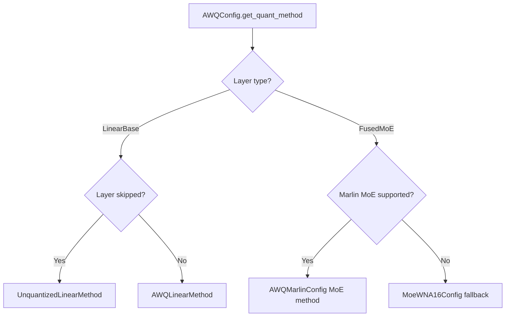

# AWQ: Activation-Aware Weight Quantization

AWQ (Activation-Aware Weight Quantization) is a post-training weight-only quantization method that achieves high accuracy at 4-bit precision by protecting the most salient weights based on activation statistics. vLLM supports three AWQ backends: the baseline GEMM kernel, the high-performance Marlin kernel, and a Triton dequantization kernel.

**Reference:** [AWQ: Activation-aware Weight Quantization for LLM Compression and Acceleration](https://arxiv.org/abs/2306.00978)

## How AWQ Works

AWQ identifies a small fraction (~1%) of weights that are most important for model quality by analyzing activation magnitudes. These salient weights are protected by per-channel scaling before quantization:

```
W_q = round((W * s) / Δ)  * Δ / s
```

where `s` is a per-channel scale derived from activation statistics and `Δ` is the quantization step size. This allows the quantized model to preserve accuracy for the most critical weights.

AWQ stores:
- `qweight`: packed INT4 weights (8 values per INT32)
- `qzeros`: packed zero-points (8 values per INT32)
- `scales`: FP16 per-group scales

## AWQConfig

Defined in `vllm/model_executor/layers/quantization/awq.py`:

```python
class AWQConfig(QuantizationConfig):
    def __init__(
        self,
        weight_bits: int,        # Must be 4
        group_size: int,         # Typically 128
        zero_point: bool,        # Whether to use zero-points
        modules_to_not_convert: list[str] | None = None,
    ) -> None:
```

### Parameters

| Parameter | Type | Description |
|-----------|------|-------------|
| `weight_bits` | int | Bit-width (only 4 is supported) |
| `group_size` | int | Number of weights per quantization group (e.g., 128) |
| `zero_point` | bool | Whether asymmetric quantization (with zero-points) is used |
| `modules_to_not_convert` | list[str] | Layer names to skip (kept in FP16) |

### Config File Keys

AWQ reads from `quant_config.json` or `quantize_config.json`:

```json
{
  "w_bit": 4,
  "q_group_size": 128,
  "zero_point": true,
  "modules_to_not_convert": ["lm_head"]
}
```

### Pack Factor

AWQ packs 8 INT4 values into a single INT32:

```python
self.pack_factor = 32 // self.weight_bits  # = 8
```

## Backend Selection

`AWQConfig.get_quant_method()` automatically selects the best backend:



For linear layers, `AWQLinearMethod` is always used. For MoE layers, the Marlin MoE kernel is preferred when supported.

## AWQ Baseline (`awq`)

The baseline AWQ implementation uses custom CUDA kernels from the `vllm._custom_ops` module.

### Weight Layout

```python
# qweight: [input_size, output_size // pack_factor] int32
# qzeros:  [num_groups, output_size // pack_factor] int32
# scales:  [num_groups, output_size] fp16
```

### Apply Method

```python
def apply(self, layer, x, bias=None):
    qweight = layer.qweight
    scales = layer.scales
    qzeros = layer.qzeros
    pack_factor = self.quant_config.pack_factor
    out_shape = (x.shape[:-1], qweight.shape[-1] * pack_factor)
    reshaped_x = x.reshape(-1, x.shape[-1])
    # Uses ops.awq_gemm for the actual computation
    out = ops.awq_gemm(reshaped_x, qweight, scales, qzeros, pack_factor)
    ...
```

## AWQ-Marlin (`awq_marlin`)

`AWQMarlinConfig` (in `awq_marlin.py`) uses the high-performance Marlin kernel for AWQ inference. Marlin is a mixed-precision GEMM kernel optimized for Ampere+ GPUs that achieves near-theoretical throughput for weight-only quantization.

```python
class AWQMarlinConfig(QuantizationConfig):
    TYPE_MAP = {4: scalar_types.uint4}

    def __init__(
        self,
        weight_bits: int,
        group_size: int,
        zero_point: bool,
        lm_head_quantized: bool,
        modules_to_not_convert: list[str] | None = None,
    ) -> None:
```

### Marlin Weight Preparation

During `process_weights_after_loading`, AWQ weights are repacked into Marlin's optimized layout:

```python
# In AWQMarlinLinearMethod.process_weights_after_loading:
marlin_qweight = ops.awq_marlin_repack(
    layer.qweight,
    size_k=input_size_per_partition,
    size_n=output_size_per_partition,
    num_bits=self.quant_config.weight_bits,
)
# Zero-points are also converted to Marlin format
marlin_zp = awq_to_marlin_zero_points(layer.qzeros, ...)
```

### Hardware Requirements

Marlin requires SM80+ (Ampere or newer). On SM75 (Turing), the baseline AWQ kernel is used.

```python
@classmethod
def get_min_capability(cls) -> int:
    return 80
```

### MoE Support

AWQ-Marlin supports MoE layers via `AWQMarlinMoEMethod`, which uses the `fused_marlin_moe` kernel:

```python
# Automatically selected for FusedMoE layers when Marlin is supported
awq_marlin_config.get_quant_method(fused_moe_layer, prefix)
# → AWQMarlinMoEMethod
```

## AWQ Triton Kernel (`awq_triton.py`)

The Triton kernel provides an alternative dequantization path, primarily for platforms where the CUDA AWQ kernel is unavailable. It implements the full AWQ dequantization in Triton JIT:

```python
AWQ_TRITON_SUPPORTED_GROUP_SIZES = [-1, 32, 64, 128]

@triton.jit
def awq_dequantize_kernel(
    qweight_ptr,   # quantized matrix
    scales_ptr,    # scales, per group
    zeros_ptr,     # zeros, per group
    group_size,
    result_ptr,    # output matrix
    num_cols,
    num_rows,
    BLOCK_SIZE_X: tl.constexpr,
    BLOCK_SIZE_Y: tl.constexpr,
):
    # Unpacks 8 INT4 values from each INT32
    # Applies AWQ reverse order: [0, 4, 1, 5, 2, 6, 3, 7]
    # Dequantizes: result = (weight - zero) * scale
```

The Triton kernel handles the AWQ-specific bit ordering (interleaved packing) and supports group sizes of -1 (per-channel), 32, 64, and 128.

## Usage Examples

### Loading a Pre-Quantized AWQ Model

```python
from vllm import LLM, SamplingParams

# AWQ model from Hugging Face Hub
llm = LLM(model="TheBloke/Llama-2-7B-Chat-AWQ")

outputs = llm.generate(
    ["What is the capital of France?"],
    SamplingParams(temperature=0.7, max_tokens=100)
)
```

### Specifying AWQ Explicitly

```python
llm = LLM(
    model="TheBloke/Llama-2-7B-Chat-AWQ",
    quantization="awq",  # or "awq_marlin" to force Marlin
)
```

### Tensor Parallel with AWQ

AWQ works with tensor parallelism. The `qweight`, `qzeros`, and `scales` tensors are sharded along the appropriate dimensions:

```python
llm = LLM(
    model="TheBloke/Llama-2-70B-AWQ",
    tensor_parallel_size=4,
    quantization="awq_marlin",
)
```

## Accuracy and Performance

AWQ 4-bit with group_size=128 typically achieves:
- **Perplexity:** Within 0.1–0.3 of FP16 baseline on most models
- **Memory:** ~2× reduction vs FP16 (4-bit weights + FP16 activations)
- **Throughput:** 1.5–2× higher than FP16 on Ampere+ with Marlin kernel

The `zero_point=True` (asymmetric) variant is slightly more accurate than `zero_point=False` (symmetric) but requires storing zero-point tensors.

## Supported Models

AWQ is supported for all standard transformer architectures including:
- LLaMA / LLaMA-2 / LLaMA-3
- Mistral / Mixtral
- Qwen / Qwen2
- Falcon
- MPT
- And many more

## Related Pages

- [GPTQ](gptq.md) — Alternative weight-only quantization
- [Quantization Overview](README.md)
