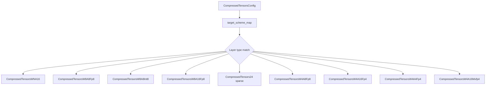

# Compressed-Tensors Quantization

Compressed-tensors is Neural Magic's unified quantization and sparsity format, providing a flexible framework that supports a wide range of quantization schemes (W8A8, W4A8, WNA16, FP8, INT8, NF4, NVFP4, MXFP4) as well as structured sparsity (2:4 sparse). It is the format used by models quantized with `llm-compressor`.

## Overview

The compressed-tensors format is implemented in `vllm/model_executor/layers/quantization/compressed_tensors/` and uses the `compressed_tensors` Python library for config parsing.



## CompressedTensorsConfig

Defined in `vllm/model_executor/layers/quantization/compressed_tensors/compressed_tensors.py`:

```python
class CompressedTensorsConfig(QuantizationConfig):
    def __init__(
        self,
        target_scheme_map: dict[str, Any],      # layer → scheme mapping
        ignore: list[str],                       # layers to skip
        quant_format: str,                       # compression format
        sparsity_scheme_map: dict[str, SparsityCompressionConfig],
        sparsity_ignore_list: list[str],
        kv_cache_scheme: dict[str, Any] | None = None,
        config: dict[str, Any] | None = None,
        transform_config: dict[str, Any] | None = None,
        total_num_heads: int | None = None,
        total_num_kv_heads: int | None = None,
    ):
```

### Config File

Compressed-tensors models store their config in `config.json` under `quantization_config`:

```json
{
  "quantization_config": {
    "quant_type": "compressed-tensors",
    "format": "dense",
    "global_compression_ratio": 1.849,
    "quantization_status": "compressed",
    "config_groups": {
      "group_0": {
        "targets": ["Linear"],
        "weights": {
          "num_bits": 8,
          "type": "float",
          "strategy": "tensor",
          "symmetric": true
        },
        "input_activations": {
          "num_bits": 8,
          "type": "float",
          "strategy": "token",
          "symmetric": true,
          "dynamic": true
        }
      }
    }
  }
}
```

## Supported Quantization Schemes

### WNA16 — Weight-Only Integer Quantization

`CompressedTensorsWNA16` handles N-bit weight quantization with FP16 activations. Supported bit-widths: 4 and 8.

```python
WNA16_SUPPORTED_BITS = [4, 8]

class CompressedTensorsWNA16(CompressedTensorsScheme):
    def __init__(
        self,
        strategy: str,          # "group" or "channel"
        num_bits: int,          # 4 or 8
        group_size: int | None, # e.g., 128
        symmetric: bool | None, # True = no zero-points
        actorder: ActivationOrdering | None,
        layer_name: str | None,
    ):
```

Uses the Marlin kernel for high-performance inference on SM80+.

### W8A8 FP8 — FP8 Weight and Activation

`CompressedTensorsW8A8Fp8` implements FP8 quantization for both weights and activations:

- **Static:** Pre-computed scales from calibration
- **Dynamic:** Runtime scale computation per token/tensor

### W8A8 INT8 — INT8 Weight and Activation

`CompressedTensorsW8A8Int8` implements INT8 quantization using CUTLASS INT8 GEMM kernels.

### W8A16 FP8 — FP8 Weight-Only

`CompressedTensorsW8A16Fp8` stores weights in FP8 but computes in FP16/BF16. Uses Marlin FP8 kernel.

### W4A8 FP8 — 4-bit Weight, FP8 Activation

`CompressedTensorsW4A8Fp8` combines 4-bit weight quantization with FP8 activations.

### W4A8 INT — 4-bit Weight, INT8 Activation

`CompressedTensorsW4A8Int` uses 4-bit weights with INT8 activations.

### W4A16 NvFP4 — NVIDIA FP4 Weight-Only

`CompressedTensorsW4A16Fp4` implements NVIDIA's FP4 format for weight-only quantization.

### W4A4 NvFP4 — NVIDIA FP4 Weight and Activation

`CompressedTensorsW4A4Fp4` uses FP4 for both weights and activations (requires Blackwell SM100+).

### W4A16 MXFP4 — Microscaling FP4

`CompressedTensorsW4A16Mxfp4` implements the OCP MX (microscaling) FP4 format.

## Sparse Quantization: 2:4 Structured Sparsity

`CompressedTensors24` implements NVIDIA's 2:4 structured sparsity (also called semi-structured sparsity), where exactly 2 out of every 4 consecutive weights are zero. This enables the NVIDIA Sparse Tensor Core acceleration.

```python
class CompressedTensors24(CompressedTensorsScheme):
    def __init__(
        self,
        quantized: bool = False,       # Whether weights are also quantized
        weight_quant: QuantizationArgs | None = None,
        input_quant: QuantizationArgs | None = None,
        model_compression_config: dict[str, Any] | None = None,
    ):
```

### Sparse + Quantized

Compressed-tensors supports combining 2:4 sparsity with quantization (e.g., sparse FP8):

```json
{
  "sparsity_config": {
    "format": "sparse_24_bitmask",
    "sparsity_structure": "2:4",
    "global_sparsity_ratio": 0.5
  },
  "quantization_config": {
    "config_groups": {
      "group_0": {
        "targets": ["Linear"],
        "weights": {"num_bits": 8, "type": "float"}
      }
    }
  }
}
```

This combination can achieve 4× compression (2× from sparsity × 2× from FP8) with hardware acceleration on Hopper+ GPUs.

## Scheme Selection Logic

`CompressedTensorsConfig.get_quant_method()` dispatches to the appropriate scheme:

```python
def get_quant_method(self, layer, prefix):
    if isinstance(layer, LinearBase):
        quant_scheme = self.get_scheme(layer=layer, layer_name=prefix)
        input_tfms, output_tfms = get_linear_transform_schemes(...)

        if quant_scheme is not None:
            layer.scheme = quant_scheme
            quant_method = CompressedTensorsLinearMethod(self)
        else:
            quant_method = UnquantizedLinearMethod()

        if any((input_tfms, output_tfms)):
            return CompressedTensorsLinearTransformMethod.from_schemes(...)
        return quant_method

    if isinstance(layer, Attention):
        return CompressedTensorsKVCacheMethod(self)
    if isinstance(layer, FusedMoE):
        return CompressedTensorsMoEMethod.get_moe_method(self, layer, ...)
```

### Target Matching

The `target_scheme_map` maps layer targets to quantization schemes. Targets can be:

- **Module class names:** `"Linear"` — matches all `nn.Linear` layers
- **Layer paths:** `"layers.0.self_attn.q_proj"` — exact layer match
- **Regex patterns:** `"re:.*\.q_proj"` — regex match

```python
def _map_target(target: str) -> str | None:
    is_layer_path = "." in target and not target.startswith("re:")
    if is_layer_path:
        return hf_to_vllm_mapper._map_name(target)
    return target  # class names and regex preserved as-is
```

## KV Cache Quantization

Compressed-tensors supports FP8 KV cache via `kv_cache_scheme`:

```json
{
  "kv_cache_scheme": {
    "type": "float",
    "num_bits": 8,
    "strategy": "tensor",
    "symmetric": true
  }
}
```

## Transform Support

Compressed-tensors supports linear transforms (e.g., Hadamard rotation for QuIP#) via `transform_config`. This is handled by `CompressedTensorsLinearTransformMethod`.

## Usage Examples

### Loading a Compressed-Tensors Model

```python
from vllm import LLM, SamplingParams

# Models quantized with llm-compressor use compressed-tensors format
llm = LLM(model="neuralmagic/Llama-3.1-8B-Instruct-quantized.w8a8")

outputs = llm.generate(
    ["What is machine learning?"],
    SamplingParams(max_tokens=100)
)
```

### W4A16 (Weight-Only 4-bit)

```python
llm = LLM(model="neuralmagic/Llama-3.1-8B-Instruct-quantized.w4a16")
```

### Sparse FP8

```python
# 2:4 sparse + FP8 quantization
llm = LLM(model="neuralmagic/Llama-3.1-8B-Instruct-sparse-fp8")
```

## Scheme Summary Table

| Scheme Class | Weights | Activations | Kernel |
|-------------|---------|-------------|--------|
| `CompressedTensorsWNA16` | INT4/INT8 | FP16 | Marlin |
| `CompressedTensorsW8A8Fp8` | FP8 | FP8 | CUTLASS FP8 |
| `CompressedTensorsW8A8Int8` | INT8 | INT8 | CUTLASS INT8 |
| `CompressedTensorsW8A16Fp8` | FP8 | FP16 | Marlin FP8 |
| `CompressedTensorsW4A8Fp8` | INT4 | FP8 | Custom |
| `CompressedTensorsW4A8Int` | INT4 | INT8 | Custom |
| `CompressedTensorsW4A16Fp4` | NvFP4 | FP16 | NvFP4 |
| `CompressedTensorsW4A4Fp4` | NvFP4 | NvFP4 | NvFP4 (SM100+) |
| `CompressedTensorsW4A16Mxfp4` | MXFP4 | FP16 | MXFP4 |
| `CompressedTensors24` | Sparse 2:4 | FP16/FP8 | Sparse CUTLASS |

## Related Pages

- [FP8 Quantization](fp8.md)
- [MXFP4](mxfp4.md)
- [Quantization Overview](README.md)
