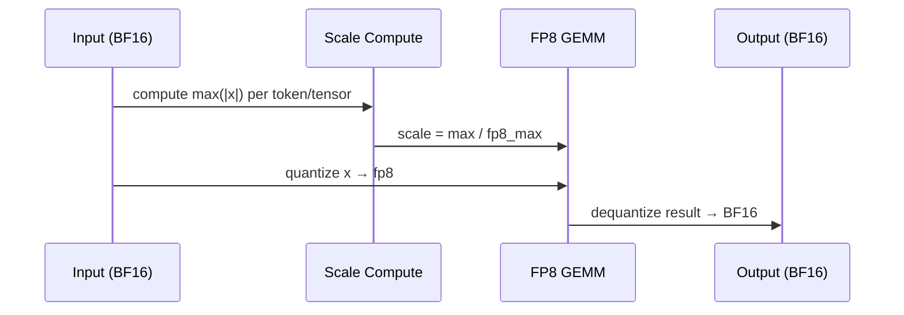

# FP8 Quantization

FP8 (8-bit floating point) quantization is vLLM's primary high-performance quantization format for modern NVIDIA and AMD GPUs. It provides near-lossless accuracy compared to BF16 while delivering significant memory savings and throughput improvements through hardware-accelerated FP8 GEMM kernels.

## Overview

FP8 uses the E4M3 format (`torch.float8_e4m3fn`) on NVIDIA hardware and E4M3FNUZ on AMD ROCm. The E4M3 format has 4 exponent bits and 3 mantissa bits, giving a dynamic range suitable for neural network weights and activations.

vLLM implements three FP8 variants:

| Variant | Key | File | Platform |
|---------|-----|------|----------|
| Standard FP8 | `fp8` | `fp8.py` | NVIDIA SM89+, AMD MI300+ |
| FBGEMM FP8 | `fbgemm_fp8` | `fbgemm_fp8.py` | NVIDIA SM80+ |
| PTPC FP8 | `ptpc_fp8` | `ptpc_fp8.py` | AMD MI300+ only |

> **Note:** `fbgemm_fp8` and `ptpc_fp8` are deprecated in favor of the unified `fp8` method. They remain supported for backward compatibility.

## Fp8Config

Defined in `vllm/model_executor/layers/quantization/fp8.py`:

```python
class Fp8Config(QuantizationConfig):
    def __init__(
        self,
        is_checkpoint_fp8_serialized: bool = False,
        activation_scheme: str = "dynamic",
        ignored_layers: list[str] | None = None,
        weight_block_size: list[int] | None = None,
    ) -> None:
```

### Parameters

| Parameter | Type | Default | Description |
|-----------|------|---------|-------------|
| `is_checkpoint_fp8_serialized` | bool | `False` | Whether the checkpoint already contains FP8 weights and scales |
| `activation_scheme` | str | `"dynamic"` | `"dynamic"` or `"static"` activation quantization |
| `ignored_layers` | list[str] | `None` | Layer name prefixes to skip quantization |
| `weight_block_size` | list[int] | `None` | Block size for block-wise weight quantization (e.g., `[128, 128]`) |

### Config File Keys

The `fp8` method reads from the model's `quantize_config.json` or `config.json`:

```json
{
  "quant_method": "fp8",
  "activation_scheme": "dynamic",
  "ignored_layers": ["lm_head"],
  "weight_block_size": [128, 128]
}
```

## Activation Schemes

### Dynamic Activation Quantization

In dynamic mode, activation scales are computed at runtime from each input tensor. No calibration data is required. This is the default and recommended mode for most use cases.



### Static Activation Quantization

In static mode, activation scales are pre-computed during calibration and stored in the checkpoint. This avoids runtime scale computation overhead but requires calibration.

Static scales are stored as `input_scale` parameters in the checkpoint and loaded via `PerTensorScaleParameter`.

## Per-Tensor vs Per-Channel vs Block-Wise

### Per-Tensor Scaling

A single scalar scale factor applies to the entire weight tensor:

```
W_fp8 = round(W_bf16 / scale)
scale = max(|W_bf16|) / fp8_max
```

### Per-Channel Scaling

Each output channel has its own scale factor. This is more accurate for weights with varying magnitudes across channels:

```
W_fp8[i, :] = round(W_bf16[i, :] / scale[i])
scale[i] = max(|W_bf16[i, :]|) / fp8_max
```

### Block-Wise Scaling (DeepSeek-style)

When `weight_block_size` is set (e.g., `[128, 128]`), each 128×128 block of the weight matrix has its own scale. This is used by models like DeepSeek-V3:

```python
# Only supported with serialized FP8 checkpoints
Fp8Config(
    is_checkpoint_fp8_serialized=True,
    activation_scheme="dynamic",  # block-wise requires dynamic
    weight_block_size=[128, 128],
)
```

Block-wise quantization uses `BlockQuantScaleParameter` and requires CUTLASS block FP8 support (`cutlass_block_fp8_supported()`).

## Layer Method Dispatch

`Fp8Config.get_quant_method()` dispatches to different method classes based on layer type:

```python
def get_quant_method(self, layer, prefix):
    if isinstance(layer, LinearBase):
        if not self.is_checkpoint_fp8_serialized:
            return Fp8OnlineLinearMethod(self)   # dynamic, no checkpoint
        else:
            return Fp8LinearMethod(self)          # serialized checkpoint
    elif isinstance(layer, FusedMoE):
        if self.is_checkpoint_fp8_serialized:
            return Fp8MoEMethod(self, layer)
        else:
            return Fp8OnlineMoEMethod(self, layer)
    elif isinstance(layer, Attention):
        return Fp8KVCacheMethod(self)             # KV cache scaling
```

## Marlin Fallback

On GPUs without native FP8 hardware support (SM < 89), vLLM automatically falls back to the Marlin kernel for weight-only FP8 dequantization:

```python
# In Fp8LinearMethod.process_weights_after_loading:
if self.use_marlin:
    prepare_fp8_layer_for_marlin(layer)
```

The Marlin FP8 path is implemented in `utils/marlin_utils_fp8.py`.

## FBGEMM FP8 (`fbgemm_fp8`)

`FBGEMMFp8Config` (in `fbgemm_fp8.py`) is a legacy variant that uses per-channel weight scales and per-token activation scales. It was originally designed for Meta's FBGEMM library.

```python
class FBGEMMFp8Config(QuantizationConfig):
    def __init__(self, ignore_list: list[str], input_scale_ub: float):
        self.ignore_list = ignore_list
        self.input_scale_ub = input_scale_ub
        # Falls back to Marlin on GPUs without FP8 hardware (SM < 89)
        self.use_marlin = not current_platform.has_device_capability(89)
```

Config keys: `modules_to_not_convert`, `activation_scale_ub`

> **Deprecated:** Use `fp8` instead. `fbgemm_fp8` is listed in `DEPRECATED_QUANTIZATION_METHODS`.

## PTPC FP8 (`ptpc_fp8`)

`PTPCFp8Config` (in `ptpc_fp8.py`) implements **Per-Token Per-Channel** dynamic FP8 quantization, exclusively for AMD ROCm MI300+ GPUs:

```python
class PTPCFp8Config(Fp8Config):
    """Config class for Per-Token-Per-Channel Dynamic Quantization Fp8."""
    # Only supported on ROCm with device capability >= 94 (MI300)
    # Only supports dynamic activation scheme
```

This variant uses per-token activation scales (one scale per token in the sequence) and per-channel weight scales, which can improve accuracy for certain workloads on AMD hardware.

> **Deprecated:** Use `fp8` instead. `ptpc_fp8` is listed in `DEPRECATED_QUANTIZATION_METHODS`.

## KV Cache Scaling

FP8 quantization also supports KV cache scaling via `Fp8KVCacheMethod`, which inherits from `BaseKVCacheMethod` (see [KV Cache Quantization](kv-cache.md)):

```python
# Scales loaded from checkpoint:
layer.k_scale  # per-tensor scale for key cache
layer.v_scale  # per-tensor scale for value cache
layer.q_scale  # per-tensor scale for query (optional)
```

## Usage Examples

### Loading a Pre-Quantized FP8 Model

```python
from vllm import LLM, SamplingParams

# Auto-detected from quantization_config in model card
llm = LLM(model="neuralmagic/Meta-Llama-3-8B-Instruct-FP8")

outputs = llm.generate(["Hello, world!"], SamplingParams(max_tokens=50))
```

### Online FP8 Quantization (No Checkpoint)

```python
# Quantize weights on-the-fly during loading (dynamic activations)
llm = LLM(
    model="meta-llama/Llama-3-8B-Instruct",
    quantization="fp8",
)
```

### Static FP8 with Calibration

To create a static FP8 checkpoint, use llm-compressor or similar tools, then load:

```python
llm = LLM(model="path/to/static-fp8-checkpoint")
# quantization_config in config.json will have activation_scheme="static"
```

### Block-Wise FP8 (DeepSeek-V3 style)

```python
# DeepSeek-V3 uses block-wise FP8 with 128x128 blocks
llm = LLM(model="deepseek-ai/DeepSeek-V3")
# weight_block_size=[128, 128] is read from the model's config
```

## Hardware Requirements

| GPU Family | Compute Capability | FP8 Support |
|------------|-------------------|-------------|
| Ada Lovelace (RTX 40xx, L40S) | SM89 | ✅ Native FP8 GEMM |
| Hopper (H100, H200) | SM90 | ✅ Native FP8 GEMM |
| Blackwell (B100, B200) | SM100 | ✅ Native FP8 GEMM |
| Ampere (A100, A10) | SM80 | ⚠️ Marlin fallback |
| AMD MI300X | gfx942 | ✅ FP8 FNUZ |

## Performance Notes

- FP8 W8A8 with static scales provides the highest throughput (hardware GEMM)
- FP8 W8A8 with dynamic scales has slight overhead for scale computation but no calibration
- FP8 W8A16 (weight-only) is slower than W8A8 but requires no activation calibration
- Block-wise FP8 uses CUTLASS kernels and requires SM89+

## Related Pages

- [KV Cache Quantization](kv-cache.md)
- [ModelOpt FP8](modelopt.md)
- [Quantization Overview](README.md)
