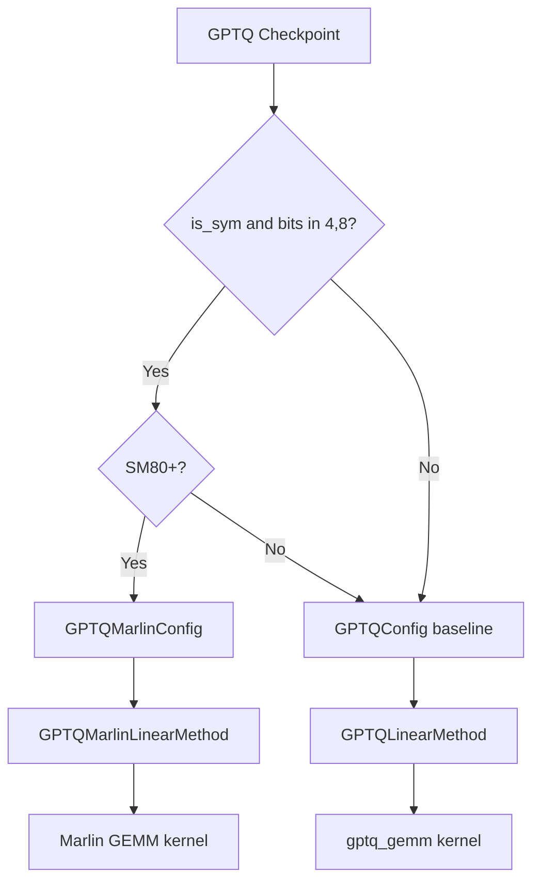

# GPTQ Quantization

GPTQ (Generative Pre-trained Transformer Quantization) is a one-shot post-training quantization method that uses second-order information (Hessians) to minimize quantization error. It supports 2, 3, 4, and 8-bit weight quantization with optional activation reordering. vLLM provides two GPTQ backends: the baseline GPTQ kernel and the high-performance Marlin kernel.

**Reference:** [GPTQ: Accurate Post-Training Quantization for Generative Pre-trained Transformers](https://arxiv.org/abs/2210.17323)

## How GPTQ Works

GPTQ quantizes weights layer-by-layer using the Optimal Brain Quantization (OBQ) framework. For each weight matrix, it:

1. Computes the Hessian of the layer's output with respect to the weights using calibration data
2. Quantizes weights one column at a time, updating remaining weights to compensate for quantization error
3. Optionally reorders columns by activation magnitude (`desc_act=True`) for better accuracy

The result is a checkpoint with:
- `qweight`: packed integer weights
- `scales`: per-group FP16 scales
- `qzeros`: per-group zero-points (for asymmetric quantization)
- `g_idx`: group index per weight column (when `desc_act=True`)

## GPTQConfig

Defined in `vllm/model_executor/layers/quantization/gptq.py`:

```python
class GPTQConfig(QuantizationConfig):
    def __init__(
        self,
        weight_bits: int,          # 2, 3, 4, or 8
        group_size: int,           # e.g., 128; -1 for per-channel
        desc_act: bool,            # activation reordering
        lm_head_quantized: bool,   # whether lm_head is quantized
        dynamic: dict[str, dict[str, int | bool]],  # per-layer overrides
        autoround_version: str = "",
        modules_in_block_to_quantize: list[str] | None = None,
        checkpoint_format: str = "",
    ) -> None:
```

### Parameters

| Parameter | Type | Description |
|-----------|------|-------------|
| `weight_bits` | int | Quantization bit-width: 2, 3, 4, or 8 |
| `group_size` | int | Weights per quantization group; -1 = per-channel |
| `desc_act` | bool | Activation reordering (improves accuracy, requires `g_idx`) |
| `lm_head_quantized` | bool | Whether the language model head is quantized |
| `dynamic` | dict | Per-layer quantization overrides (GPTQModel feature) |

### Config File Keys

GPTQ reads from `quantize_config.json`:

```json
{
  "bits": 4,
  "group_size": 128,
  "desc_act": false,
  "sym": true,
  "lm_head": false
}
```

### Dynamic Per-Layer Configuration

GPTQModel supports per-layer quantization overrides via the `dynamic` field:

```python
# Example: layers 10-15 use 8-bit, layers 16-21 use 8-bit with group_size=64
# MoE layers are skipped entirely
dynamic = {
    r"+:.*\.(?:1[0-5])\..*": {"bits": 8},
    r"+:.*\.(?:1[6-9]|20|21)\..*": {"bits": 8, "group_size": 64},
    r"-:.*\.moe\..*": {},  # negative match = skip
}
```

## GPTQ Baseline (`gptq`)

The baseline GPTQ implementation uses custom CUDA kernels. Note that the 4-bit `gptq_gemm` kernel has known issues; vLLM will warn and recommend using `gptq_marlin` instead:

```python
if self.weight_bits == 4:
    logger.warning_once(
        "Currently, the 4-bit gptq_gemm kernel for GPTQ is buggy. "
        "Use gptq_marlin for better performance and accuracy."
    )
```

### Supported Bit-Widths

```python
if self.weight_bits not in [2, 3, 4, 8]:
    raise ValueError(
        "Currently, only 2/3/4/8-bit weight quantization is "
        f"supported for GPTQ, but got {self.weight_bits} bits."
    )
```

## GPTQ-Marlin (`gptq_marlin`)

`GPTQMarlinConfig` (in `gptq_marlin.py`) uses the Marlin kernel for high-performance GPTQ inference. Marlin is specifically optimized for weight-only quantization on Ampere+ GPUs.

```python
class GPTQMarlinConfig(QuantizationConfig):
    # (num_bits, is_sym) -> quant_type
    TYPE_MAP = {
        (4, True): scalar_types.uint4b8,
        (8, True): scalar_types.uint8b128,
    }

    def __init__(
        self,
        weight_bits: int,
        group_size: int,
        desc_act: bool,
        is_sym: bool,
        lm_head_quantized: bool,
        dynamic: dict[str, dict[str, int | bool]],
        full_config: dict[str, Any],
        modules_in_block_to_quantize: list[str] | None = None,
    ) -> None:
```

### Supported Configurations

| Bits | Symmetric | Marlin Type |
|------|-----------|-------------|
| 4 | Yes | `uint4b8` |
| 8 | Yes | `uint8b128` |

> **Note:** Asymmetric (non-symmetric) GPTQ is not supported by the Marlin kernel. Use the baseline GPTQ kernel for asymmetric quantization.

### Hardware Requirements

```python
@classmethod
def get_min_capability(cls) -> int:
    return 80  # Ampere or newer
```

### Marlin Weight Repacking

During model loading, GPTQ weights are repacked into Marlin's optimized layout:

```python
# In GPTQMarlinLinearMethod.process_weights_after_loading:
# 1. Repack qweight into Marlin format
marlin_qweight = ops.gptq_marlin_repack(
    layer.qweight,
    perm=layer.g_idx_sort_indices,
    size_k=input_size_per_partition,
    size_n=output_size_per_partition,
    num_bits=self.quant_config.weight_bits,
)
# 2. Permute scales for Marlin
marlin_scales = marlin_permute_scales(layer.scales, ...)
```

### Activation Reordering with Marlin

When `desc_act=True`, GPTQ stores a `g_idx` tensor that maps each weight column to its quantization group. Marlin handles this via sort indices:

```python
# g_idx_sort_indices: argsort of g_idx, used to reorder weights
# This allows Marlin to process weights in group order for efficiency
```

### MoE Support

GPTQ-Marlin supports MoE layers via `GPTQMarlinMoEMethod`:

```python
def get_moe_quant_method(config, layer, prefix, moe_method_cls):
    if isinstance(layer, FusedMoE):
        # Check dynamic overrides for this layer
        if get_dynamic_override(config, layer_name=prefix) == False:
            return UnquantizedFusedMoEMethod(layer.moe_config)
        override_config(config, prefix=prefix)
        return moe_method_cls(config, layer.moe_config)
```

## Backend Selection Flow



vLLM automatically selects the Marlin backend when:
1. The GPU supports SM80+
2. The quantization is symmetric (no zero-points)
3. The bit-width is 4 or 8

## Usage Examples

### Loading a Pre-Quantized GPTQ Model

```python
from vllm import LLM, SamplingParams

# 4-bit GPTQ model
llm = LLM(model="TheBloke/Llama-2-7B-GPTQ")

outputs = llm.generate(
    ["Explain quantum computing in simple terms."],
    SamplingParams(temperature=0.8, max_tokens=200)
)
```

### Forcing Marlin Backend

```python
llm = LLM(
    model="TheBloke/Llama-2-7B-GPTQ",
    quantization="gptq_marlin",
)
```

### Tensor Parallel GPTQ

```python
llm = LLM(
    model="TheBloke/Llama-2-70B-GPTQ",
    tensor_parallel_size=4,
    quantization="gptq_marlin",
)
```

### AutoRound Models

GPTQ-Marlin supports models quantized with AutoRound (Intel's auto-round library):

```python
# AutoRound models have autoround_version in their config
llm = LLM(model="Intel/neural-chat-7b-v3-3-int4-inc")
```

## Accuracy and Performance

| Bits | Group Size | Perplexity vs FP16 | Memory Reduction |
|------|-----------|-------------------|-----------------|
| 8 | 128 | ~0.01 | ~2× |
| 4 | 128 | ~0.1–0.3 | ~4× |
| 4 | 64 | ~0.05–0.15 | ~4× |
| 3 | 128 | ~0.5–1.0 | ~5× |
| 2 | 128 | ~2–5 | ~8× |

Activation reordering (`desc_act=True`) improves accuracy by ~0.05–0.1 perplexity at the cost of slightly more complex weight loading.

## Comparison: GPTQ vs AWQ

| Feature | GPTQ | AWQ |
|---------|------|-----|
| Bit-widths | 2, 3, 4, 8 | 4 only |
| Calibration | Required | Required |
| Accuracy | Slightly lower | Slightly higher |
| Marlin support | ✅ 4/8-bit sym | ✅ 4-bit |
| MoE support | ✅ | ✅ |
| Asymmetric | ✅ | ✅ |

## Related Pages

- [AWQ](awq.md) — Activation-aware weight quantization
- [Quantization Overview](README.md)
