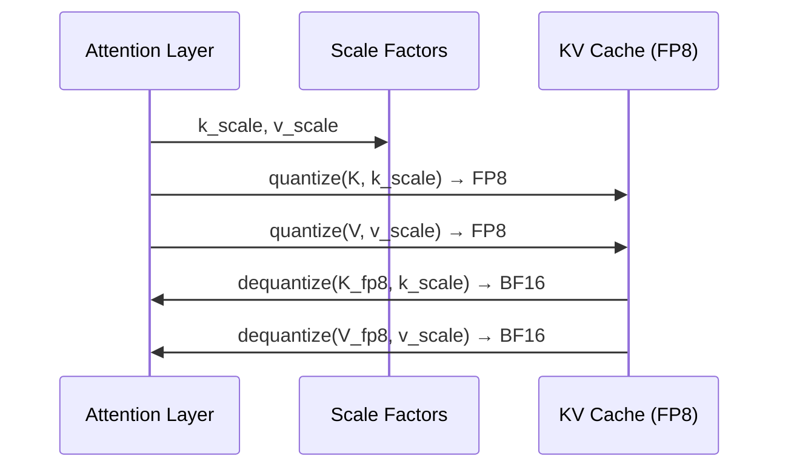

# KV Cache Quantization

KV cache quantization reduces the memory footprint of the key-value cache by storing cached tensors in FP8 instead of BF16/FP16. This is particularly valuable for long-context inference where the KV cache can dominate GPU memory usage.

## Overview

KV cache quantization is implemented in `vllm/model_executor/layers/quantization/kv_cache.py`. It is orthogonal to weight quantization — you can use FP8 KV cache with any weight quantization method (or none at all).

## How KV Cache Quantization Works

During attention computation:

1. **Quantize on write:** When storing K/V tensors to the cache, they are quantized from BF16/FP16 to FP8 using a per-tensor scale factor
2. **Dequantize on read:** When reading from the cache for attention computation, K/V tensors are dequantized back to BF16/FP16



## BaseKVCacheMethod

All quantization configs that support KV cache quantization use `BaseKVCacheMethod`:

```python
class BaseKVCacheMethod(QuantizeMethodBase):
    """
    Adds k_scale, v_scale, q_scale, and prob_scale attributes to the
    Attention layer for loading scaling factors from checkpoints.
    """

    def create_weights(self, layer: torch.nn.Module):
        # Initialize scales to -1.0 (invalid sentinel value)
        layer.q_scale = torch.nn.Parameter(torch.tensor(-1.0), requires_grad=False)
        layer.k_scale = torch.nn.Parameter(torch.tensor(-1.0), requires_grad=False)
        layer.v_scale = torch.nn.Parameter(torch.tensor(-1.0), requires_grad=False)
        layer.prob_scale = torch.nn.Parameter(torch.tensor(-1.0), requires_grad=False)
```

### Scale Parameters

| Parameter | Description |
|-----------|-------------|
| `k_scale` | Per-tensor scale for key cache quantization |
| `v_scale` | Per-tensor scale for value cache quantization |
| `q_scale` | Per-tensor scale for query quantization (FP8 attention backends) |
| `prob_scale` | Per-tensor scale for attention probability (softmax output) |

## Scale Loading Logic

`process_weights_after_loading` handles several cases for scale initialization:

```python
def process_weights_after_loading(self, layer):
    if is_quantized_kv_cache(layer.kv_cache_dtype) and not layer.calculate_kv_scales:
        if layer.k_scale > 0.0 and layer.v_scale > 0.0:
            # Case 1: Separate k_scale and v_scale in checkpoint
            k_scale = layer.k_scale.to("cpu").tolist()
            v_scale = layer.v_scale.to("cpu").tolist()
        elif layer.k_scale < 0.0 and layer.v_scale < 0.0:
            # Case 2: No scales in checkpoint → use default 1.0
            k_scale = 1.0
            v_scale = 1.0
        else:
            # Case 3: Single kv_scale → duplicate to both k and v
            scale_to_duplicate = max(layer.k_scale, layer.v_scale)
            k_scale = scale_to_duplicate.to("cpu").tolist()
            v_scale = scale_to_duplicate.to("cpu").tolist()

        # AMD ROCm FP8 FNUZ requires 2× scale adjustment
        if current_platform.is_fp8_fnuz():
            k_scale *= 2
            v_scale *= 2
```

### Scale Validation

Only per-tensor (scalar) scales are supported:

```python
if not isinstance(k_scale, float) or not isinstance(v_scale, float):
    raise ValueError("Only support per-tensor scaling factor for fp8 KV cache")
```

## FP8 Formats

### NVIDIA: E4M3FN

On NVIDIA GPUs (SM89+), the KV cache uses `torch.float8_e4m3fn`:
- 4 exponent bits, 3 mantissa bits
- Range: ±448.0
- Supported natively on Ada Lovelace, Hopper, Blackwell

### AMD: E4M3FNUZ

On AMD ROCm (MI300+), the KV cache uses `torch.float8_e4m3fnuz` (unsigned zero):
- Same bit layout but different NaN/Inf encoding
- Scale factors are multiplied by 2 to account for the different dynamic range

```python
if current_platform.is_fp8_fnuz():
    k_scale *= 2
    v_scale *= 2
```

## Enabling FP8 KV Cache

### Via Command Line

```bash
vllm serve meta-llama/Llama-3-8B-Instruct \
    --kv-cache-dtype fp8
```

### Via Python API

```python
from vllm import LLM, SamplingParams

llm = LLM(
    model="meta-llama/Llama-3-8B-Instruct",
    kv_cache_dtype="fp8",
)
```

### With Pre-Calibrated Scales

If the model checkpoint contains pre-calibrated KV cache scales (e.g., from llm-compressor), they are automatically loaded:

```python
# Model with calibrated KV scales in checkpoint
llm = LLM(
    model="neuralmagic/Meta-Llama-3-8B-Instruct-FP8-KV",
    kv_cache_dtype="fp8",
)
```

### Combined with Weight Quantization

FP8 KV cache can be combined with any weight quantization:

```python
# FP8 weights + FP8 KV cache
llm = LLM(
    model="neuralmagic/Meta-Llama-3-8B-Instruct-FP8",
    kv_cache_dtype="fp8",
)

# AWQ weights + FP8 KV cache
llm = LLM(
    model="TheBloke/Llama-2-7B-Chat-AWQ",
    kv_cache_dtype="fp8",
)
```

## Dynamic vs Static KV Scales

### Static Scales (from checkpoint)

When the checkpoint contains calibrated scales, they are loaded and used directly. This provides the best accuracy since scales are optimized for the model's actual activation distribution.

Scale names in checkpoints follow these patterns (handled by `Fp8Config.get_cache_scale()`):

```python
# Compressed-tensors style:
".k_proj.output_scale" → ".attn.k_scale"
".v_proj.output_scale" → ".attn.v_scale"
".q_proj.output_scale" → ".attn.q_scale"
".prob_output_scale"   → ".attn.prob_scale"
```

### Dynamic Scales (calculated at runtime)

When `calculate_kv_scales=True` (or no scales in checkpoint), scales are computed dynamically from the actual K/V tensors during inference. This requires no calibration but may be slightly less accurate.

```python
# Enabled via environment variable or config
# VLLM_CALCULATE_KV_SCALES=1
```

## Memory Savings

FP8 KV cache reduces memory by approximately 2× compared to BF16:

| Context Length | BF16 KV Cache | FP8 KV Cache | Savings |
|---------------|---------------|--------------|---------|
| 4K tokens | ~0.5 GB | ~0.25 GB | 50% |
| 32K tokens | ~4 GB | ~2 GB | 50% |
| 128K tokens | ~16 GB | ~8 GB | 50% |

*(Approximate values for a 7B model with 32 heads, 128 head dim)*

This allows serving longer contexts or more concurrent requests with the same GPU memory.

## Accuracy Considerations

FP8 KV cache introduces quantization error in the attention computation. The impact depends on:

1. **Scale quality:** Pre-calibrated scales from the checkpoint are more accurate than default 1.0 scales
2. **Model size:** Larger models are generally more robust to KV cache quantization
3. **Task type:** Tasks requiring precise attention over long contexts may be more sensitive

> **Warning:** Using `kv_cache_dtype="fp8"` with default scale 1.0 (no calibrated scales) may cause accuracy degradation. vLLM logs a warning in this case:
> ```
> Using KV cache scaling factor 1.0 for fp8_e4m3. If this is unintended,
> verify that k/v_scale scaling factors are properly set in the checkpoint.
> ```

## Supported Quantization Configs

The following quantization configs support KV cache quantization:

| Config | KV Cache Method |
|--------|----------------|
| `Fp8Config` | `Fp8KVCacheMethod` |
| `FBGEMMFp8Config` | `FBGEMMFp8KVCacheMethod` |
| `PTPCFp8Config` | `Fp8KVCacheMethod` |
| `ModelOptFp8Config` | `ModelOptFp8KVCacheMethod` |
| `CompressedTensorsConfig` | `CompressedTensorsKVCacheMethod` |

## Related Pages

- [FP8 Quantization](fp8.md)
- [ModelOpt](modelopt.md)
- [Quantization Overview](README.md)
