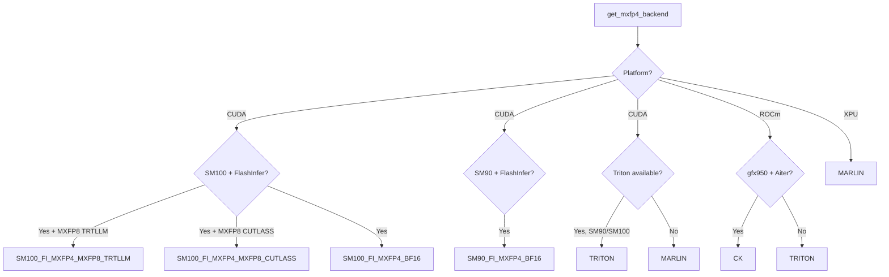

# MXFP4: Microscaling FP4 Quantization

MXFP4 (Microscaling Float 4-bit) is a quantization format based on the OCP (Open Compute Project) MX (Microscaling) specification. It uses 4-bit floating-point values with shared block-level scale factors, providing excellent accuracy at extreme compression ratios. In vLLM, MXFP4 is primarily used for MoE (Mixture of Experts) layer quantization.

## Overview

MXFP4 is implemented in `vllm/model_executor/layers/quantization/mxfp4.py`. The format uses:
- **4-bit values:** Each weight is stored as a 4-bit floating point (E2M1 format)
- **Block-level scales:** Groups of 32 values share a single 8-bit scale factor (E8M0 format)
- **Microscaling:** The scale is applied at a fine granularity (32 elements), giving much better accuracy than per-tensor or per-channel scaling

## Mxfp4Config

```python
class Mxfp4Config(QuantizationConfig):
    def __init__(self, ignored_layers: list[str] | None = None):
        super().__init__()
        self.ignored_layers = ignored_layers

    @classmethod
    def get_min_capability(cls) -> int:
        return 80  # Ampere or newer

    @classmethod
    def get_supported_act_dtypes(cls) -> list[torch.dtype]:
        return [torch.bfloat16]  # BF16 activations only
```

> **Note:** MXFP4 linear layers are not yet fully implemented in vLLM's open-source release. The primary use case is MoE layers. For MXFP4 linear layers, refer to AMD-Quark's implementation.

## Backend Selection

MXFP4 supports multiple compute backends depending on the hardware and available libraries:

```python
class Mxfp4Backend(Enum):
    NONE = 0
    SM100_FI_MXFP4_MXFP8_TRTLLM = 1   # FlashInfer + TRT-LLM on Blackwell
    SM100_FI_MXFP4_MXFP8_CUTLASS = 2   # FlashInfer + CUTLASS on Blackwell
    SM100_FI_MXFP4_BF16 = 3             # FlashInfer BF16 on Blackwell
    SM90_FI_MXFP4_BF16 = 4             # FlashInfer BF16 on Hopper
    MARLIN = 5                           # Marlin kernel (SM80+)
    TRITON = 6                           # Triton kernel (SM90/SM100)
    CK = 7                               # AMD Composable Kernel (gfx950)
```

### Backend Selection Logic



### LoRA Compatibility

Not all backends support LoRA. When LoRA is enabled, the backend selection is more conservative:

```python
def get_mxfp4_backend_with_lora() -> Mxfp4Backend:
    # Only Triton and Marlin backends support LoRA
    if not current_platform.is_cuda():
        return Mxfp4Backend.NONE
    if has_triton_kernels() and SM90 <= capability < SM110:
        return Mxfp4Backend.TRITON
    return Mxfp4Backend.MARLIN
```

## MoE Method

`Mxfp4MoEMethod` handles MXFP4 quantization for Mixture of Experts layers:

```python
class Mxfp4MoEMethod(FusedMoEMethodBase):
    """MXFP4 MoE quantization method."""

    def __init__(self, moe: FusedMoEConfig):
        super().__init__(moe)
        self.weight_dtype = "mxfp4"
        self.mxfp4_backend = get_mxfp4_backend(moe.is_lora_enabled)
```

### Weight Layout

MXFP4 weights are stored with swizzled scale factors for efficient GPU access:

```python
# From mxfp4_utils.py:
def _swizzle_mxfp4(weight_scale: torch.Tensor) -> torch.Tensor:
    """Swizzle MXFP4 scale factors for GPU memory access patterns."""
    ...
```

The `CK_MXFP4_MOE_DIM_ALIGNMENT` constant defines the alignment requirements for the AMD CK backend.

## XPU Support

For Intel XPU (Gaudi/Arc), a separate `XpuMxfp4MoEMethod` is provided:

```python
elif current_platform.is_xpu():
    return XpuMxfp4MoEMethod(layer.moe_config)
```

## Usage Examples

### Loading an MXFP4 Model

MXFP4 models are typically quantized using llm-compressor or AMD-Quark and stored in the compressed-tensors format:

```python
from vllm import LLM, SamplingParams

# MXFP4 MoE model (e.g., Mixtral or DeepSeek with MXFP4 experts)
llm = LLM(
    model="path/to/mxfp4-model",
    quantization="mxfp4",
)

outputs = llm.generate(
    ["Explain the transformer architecture."],
    SamplingParams(max_tokens=200)
)
```

### Environment Variables for Backend Selection

```bash
# Force Marlin backend (useful for debugging)
VLLM_MXFP4_USE_MARLIN=1 vllm serve model-name

# Enable FlashInfer MXFP4 MXFP8 backend on SM100
VLLM_USE_FLASHINFER_MOE_MXFP4_MXFP8=1 vllm serve model-name

# Enable FlashInfer MXFP4 MXFP8 CUTLASS backend on SM100
VLLM_USE_FLASHINFER_MOE_MXFP4_MXFP8_CUTLASS=1 vllm serve model-name

# Enable FlashInfer MXFP4 BF16 backend on SM90
VLLM_USE_FLASHINFER_MOE_MXFP4_BF16=1 vllm serve model-name
```

## OCP MX Specification

MXFP4 follows the OCP Microscaling Formats (MX) specification:

- **Block size:** 32 elements per scale
- **Scale format:** E8M0 (8-bit, exponent-only, no mantissa)
- **Value format:** E2M1 (2 exponent bits, 1 mantissa bit)
- **Scale granularity:** Per-block (32 elements share one scale)

This is different from standard per-tensor or per-channel quantization — the fine-grained block scales allow MXFP4 to achieve much better accuracy than INT4 at the same bit-width.

## Accuracy vs Performance

| Format | Bits | Accuracy | Throughput |
|--------|------|----------|------------|
| BF16 | 16 | Reference | 1× |
| FP8 W8A8 | 8 | ~99% | ~2× |
| MXFP4 | 4+scale | ~97-98% | ~3-4× |
| INT4 | 4 | ~95-97% | ~3-4× |

MXFP4 typically outperforms INT4 in accuracy due to the floating-point representation and fine-grained block scales.

## Hardware Support

| Platform | Backend | Notes |
|----------|---------|-------|
| NVIDIA Blackwell (SM100) | FlashInfer MXFP4 | Best performance |
| NVIDIA Hopper (SM90) | FlashInfer / Triton | Good performance |
| NVIDIA Ampere (SM80) | Marlin | Fallback |
| AMD MI350 (gfx950) | CK (Aiter) | ROCm native |
| AMD MI300 (gfx942) | Triton | ROCm fallback |
| Intel XPU | Marlin | XPU support |

## Related Pages

- [compressed-tensors](compressed-tensors.md) — MXFP4 via compressed-tensors format
- [ModelOpt](modelopt.md) — NVIDIA ModelOpt MXFP8
- [Quantization Overview](README.md)
