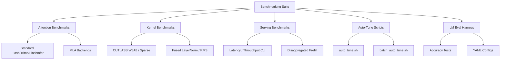

# Benchmarking & Performance

vLLM ships a comprehensive benchmarking suite covering every layer of the stack — from individual CUDA kernels to end-to-end serving throughput. This section documents all benchmark tools, how to run them, how to interpret results, and how to tune vLLM for maximum performance.

## Overview



## Sections

| Page | Description |
|------|-------------|
| [Attention Benchmarks](attention-benchmarks.md) | `benchmark.py`, `runner.py`, MLA benchmarks, YAML configs |
| [Kernel Benchmarks](kernel-benchmarks.md) | CUTLASS sparse/W8A8, fused layernorm/RMS kernels |
| [Disaggregated Serving Benchmarks](disagg-benchmarks.md) | `disagg_performance_benchmark.sh`, proxy servers |
| [Auto-Tune Scripts](auto-tune.md) | `auto_tune.sh`, `batch_auto_tune.sh` |
| [Serving Benchmarks](serving-benchmarks.md) | `vllm bench latency/throughput/serve`, genai-perf |
| [LM Eval Harness](lm-eval.md) | Accuracy testing with `lm_eval`, YAML configs |
| [Performance Tuning Guide](performance-tuning.md) | GPU memory, batch sizes, chunked prefill |
| [Result Interpretation](result-interpretation.md) | Reading metrics, percentiles, goodput |

## Quick Start

```bash
# Latency benchmark (offline)
vllm bench latency --model meta-llama/Llama-3.1-8B --input-len 512 --output-len 128

# Throughput benchmark (offline)
vllm bench throughput --model meta-llama/Llama-3.1-8B --dataset-name random

# Online serving benchmark
vllm serve meta-llama/Llama-3.1-8B &
vllm bench serve --model meta-llama/Llama-3.1-8B --request-rate 10

# Attention backend comparison
cd benchmarks/attention_benchmarks
python benchmark.py --config configs/standard_attention.yaml

# Auto-tune server parameters
cd benchmarks/auto_tune
bash auto_tune.sh
```

## Benchmark Locations

| Directory | Contents |
|-----------|----------|
| `benchmarks/attention_benchmarks/` | Attention backend benchmarks |
| `benchmarks/cutlass_benchmarks/` | CUTLASS GEMM benchmarks |
| `benchmarks/fused_kernels/` | Fused kernel benchmarks |
| `benchmarks/disagg_benchmarks/` | Disaggregated prefill benchmarks |
| `benchmarks/auto_tune/` | Auto-tuning scripts |
| `benchmarks/kernels/` | Individual kernel micro-benchmarks |
| `vllm/benchmarks/` | Core benchmark implementations (CLI) |
| `tests/entrypoints/llm/test_accuracy.py` | LM Eval accuracy tests |

## Cross-References

- [Performance Tuning Guide](performance-tuning.md) — tuning recommendations based on benchmark results
- [Deployment Guide](../15-deployment/README.md) — deploying optimized configurations
- [Distributed Inference](../07-distributed/README.md) — benchmarking distributed configurations
- [Speculative Decoding](../10-speculative-decoding/README.md) — measuring speculative decoding speedup
- [Quantization](../14-quantization/README.md) — benchmarking quantized models
- [Compilation & Optimization](../10-compilation/README.md) — compilation impact on performance
- [Observability](../11-observability/README.md) — production metrics for ongoing monitoring
