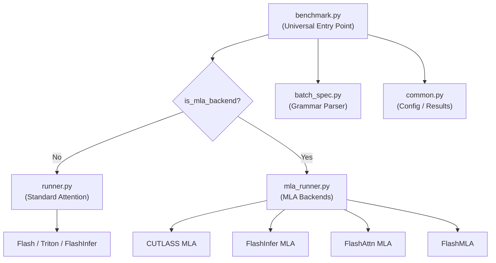

# Attention Benchmarks

The attention benchmarking suite (`benchmarks/attention_benchmarks/`) provides a unified framework for measuring the performance of every attention backend supported by vLLM — from standard Flash/Triton/FlashInfer backends to the specialized MLA (Multi-head Latent Attention) backends used by DeepSeek models.

## Architecture



All benchmarks share the same `BenchmarkConfig` / `BenchmarkResult` data classes and the `ResultsFormatter` for consistent tabular output.

## Quick Start

```bash
cd benchmarks/attention_benchmarks

# Run a pre-configured YAML benchmark
python benchmark.py --config configs/standard_attention.yaml
python benchmark.py --config configs/mla_decode.yaml
python benchmark.py --config configs/mla_mixed_batch.yaml
python benchmark.py --config configs/speculative_decode.yaml
python benchmark.py --config configs/reorder_threshold.yaml

# Custom CLI benchmark
python benchmark.py \
    --backends FLASH_ATTN TRITON_ATTN FLASHINFER \
    --batch-specs "q2k" "8q1s1k" "2q2k_32q1s1k" \
    --output-csv results.csv
```

## Batch Specification Grammar

The suite uses a compact domain-specific language to describe workloads without needing separate "prefill", "decode", or "speculative" modes — they are all just different query lengths.

### Grammar Rule

```
Format: (<count>?) q<q_len>(k?) (s<seq_len>(k?))?

- count:   Number of identical requests (optional, default=1)
- q_len:   Query length (number of new tokens)
- seq_len: Total sequence length (optional, defaults to q_len for prefill)
- 'k':     Multiplies value by 1024

Mixed batches: Use _ to combine segments
```

### Examples

| Spec | Meaning | Use Case |
|------|---------|----------|
| `q2k` | 1 request, 2048 query tokens, 2048 seq | Pure prefill |
| `q1s1k` | 1 request, 1 query token, 1024 seq | Single decode |
| `8q1s1k` | 8 requests, 1 token each, 1024 seq | Batch decode |
| `q4s1k` | 1 request, 4 query tokens, 1024 seq | Speculative decode |
| `16q4s1k` | 16 requests, 4 tokens each, 1024 seq | Batch spec decode |
| `2q2k_32q1s1k` | 2 prefills + 32 decodes | Mixed batch |
| `q1ks2k` | 1 request, 1024 query, 2048 seq | Chunked prefill |

### Python API

```python
from batch_spec import parse_batch_spec, format_batch_spec, get_batch_stats

requests = parse_batch_spec("2q2k_32q1s1k")
print(format_batch_spec(requests))
# "2 prefill (2x2k), 32 decode (32x1k)"

stats = get_batch_stats(requests)
print(f"Total tokens: {stats['total_tokens']}")
print(f"Num decode: {stats['num_decode']}, Num prefill: {stats['num_prefill']}")
```

## `benchmark.py` — Universal Entry Point

`benchmark.py` is the single script that handles all backends. It dispatches to `runner.py` for standard attention or `mla_runner.py` for MLA backends based on the backend name.

### Key Functions

| Function | Description |
|----------|-------------|
| `run_benchmark(config, **kwargs)` | Dispatch to correct runner; catches exceptions |
| `run_standard_attention_benchmark(config)` | Calls `runner.run_attention_benchmark` |
| `run_mla_benchmark(config, **kwargs)` | Calls `mla_runner.run_mla_benchmark` |
| `run_parameter_sweep(...)` | Sweep a single backend parameter (e.g., `num_kv_splits`) |
| `run_model_parameter_sweep(...)` | Sweep a model parameter (e.g., `num_q_heads` for TP simulation) |

### Command-Line Options

```
--config CONFIG                     YAML config file (overrides all other args)
--backends BACKEND [BACKEND ...]    Backends to compare
--backend BACKEND                   Single backend
--batch-specs SPEC [SPEC ...]       Batch specifications

# Model configuration
--num-layers N                      Number of transformer layers
--head-dim N                        Head dimension
--num-q-heads N                     Number of query heads
--num-kv-heads N                    Number of KV heads
--block-size N                      KV cache block size

# Benchmark settings
--device DEVICE                     Target device (default: cuda:0)
--repeats N                         Number of timed repetitions
--warmup-iters N                    Warmup iterations before timing
--profile-memory                    Profile GPU memory usage

# Parameter sweeps
--sweep-param PARAM                 Parameter name to sweep
--sweep-values N [N ...]            Values to test

# Output
--output-csv FILE                   Save results to CSV
--output-json FILE                  Save results to JSON
```

## `runner.py` — Standard Attention Runner

`runner.py` implements the benchmark loop for Flash, Triton, and FlashInfer backends. It creates a real `VllmConfig` (with mock model methods to avoid downloading weights) and exercises the actual vLLM attention infrastructure.

### Key Steps

1. **Build `CommonAttentionMetadata`** — constructs `query_start_loc`, `seq_lens`, `block_table_tensor`, and `slot_mapping` tensors from the parsed batch spec.
2. **Create `VllmConfig`** — uses `meta-llama/Meta-Llama-3-8B` as a placeholder model config; mock methods are injected to avoid HuggingFace downloads.
3. **Instantiate backend** — resolves the backend class via `AttentionBackendEnum`.
4. **Timed loop** — runs `warmup_iters` then `repeats` timed iterations using `torch.cuda.synchronize()` for accurate GPU timing.

### Backend Names

| CLI Name | Backend |
|----------|---------|
| `FLASH_ATTN` | FlashAttention-2/3 |
| `TRITON_ATTN` | Triton paged attention |
| `FLASHINFER` | FlashInfer |

## `mla_runner.py` — MLA Benchmark Runner

`mla_runner.py` benchmarks the four MLA backends used for DeepSeek-V2/V3 models. It creates a minimal `VllmConfig` with mock HuggingFace config to avoid downloading model weights.

### MLA Backends

| Backend Name | Hardware | Notes |
|-------------|----------|-------|
| `CUTLASS_MLA` | Blackwell (SM100+) | Supports `num_kv_splits` tuning |
| `FLASHINFER_MLA` | Any CUDA GPU | Most portable |
| `FLASH_ATTN_MLA` | Hopper (SM90+) | Supports `reorder_batch_threshold` |
| `FLASHMLA` | Hopper (SM90+) | Supports `reorder_batch_threshold` |

### Python API

```python
from mla_runner import run_mla_benchmark
from common import BenchmarkConfig

config = BenchmarkConfig(
    backend="CUTLASS_MLA",
    batch_spec="64q1s4k",
    num_layers=10,
    head_dim=576,
    num_q_heads=128,
    num_kv_heads=1,
    block_size=128,
    device="cuda:0",
    repeats=5,
    warmup_iters=3,
)

# CUTLASS MLA with specific num_kv_splits
result = run_mla_benchmark("CUTLASS_MLA", config, num_kv_splits=4)
print(f"Mean time: {result.mean_time:.6f}s")

# FlashAttn MLA (Hopper SM90+)
result = run_mla_benchmark("FLASH_ATTN_MLA", config, reorder_batch_threshold=64)
```

## Pre-configured YAML Benchmarks

All YAML configs live in `benchmarks/attention_benchmarks/configs/`.

### `standard_attention.yaml`

Tests Flash, Triton, and FlashInfer across pure prefill, decode, mixed, speculative decode, and chunked prefill workloads.

```yaml
model:
  num_layers: 32
  num_q_heads: 32
  num_kv_heads: 8   # GQA 4:1 ratio
  head_dim: 128
  block_size: 16

batch_specs:
  - "q512"          # Small prefill
  - "q2k"           # Medium prefill
  - "8q1s1k"        # 8 decode requests
  - "16q4s1k"       # Speculative decode
  - "2q2k_8q1s1k"   # Mixed batch

backends: [FLASH_ATTN, TRITON_ATTN, FLASHINFER]
repeats: 5
warmup_iters: 3
```

### `mla_decode.yaml`

Tests all four MLA backends for DeepSeek-V3 decode workloads. Includes a **model parameter sweep** to simulate tensor parallelism by varying `num_q_heads`.

```yaml
model:
  name: "deepseek-v3"
  num_layers: 60
  num_q_heads: 128   # TP=1
  num_kv_heads: 1    # MLA uses single latent KV
  head_dim: 576
  kv_lora_rank: 512
  qk_nope_head_dim: 128
  qk_rope_head_dim: 64
  v_head_dim: 128
  block_size: 128

# Simulate TP=1/2/4/8 by varying num_q_heads
model_parameter_sweep:
  param_name: "num_q_heads"
  values: [128, 64, 32, 16]

backends: [CUTLASS_MLA, FLASHINFER_MLA, FLASH_ATTN_MLA, FLASHMLA]
repeats: 100
warmup_iters: 10
profile_memory: true
```

### `mla_mixed_batch.yaml`

Tests chunked prefill with mixed prefill + decode batches for MLA backends.

### `speculative_decode.yaml`

Tests K-token verification scenarios and `reorder_batch_threshold` optimization for speculative decoding.

### `reorder_threshold.yaml`

Answers the question: *"At what query length does the prefill pipeline become faster than the decode pipeline?"* Tests query lengths from 1–1024 across 9 batch sizes using `decode_vs_prefill` mode.

## Parameter Sweeps

### Sweep a Backend Parameter

Find the optimal `num_kv_splits` for CUTLASS MLA:

```bash
python benchmark.py \
    --backend CUTLASS_MLA \
    --batch-specs "64q1s1k" "64q1s4k" "64q1s16k" \
    --sweep-param num_kv_splits \
    --sweep-values 1 2 4 8 16 \
    --output-json optimal_splits.json
```

### Sweep a Model Parameter

Simulate different tensor-parallel sizes:

```bash
python benchmark.py \
    --backends CUTLASS_MLA FLASHINFER_MLA \
    --batch-specs "64q1s4k" \
    --sweep-param num_q_heads \
    --sweep-values 128 64 32 16
```

## Hardware Requirements

| Backend | Minimum Hardware |
|---------|-----------------|
| `FLASH_ATTN` | Any CUDA GPU |
| `TRITON_ATTN` | Any CUDA GPU |
| `FLASHINFER` | Any CUDA GPU |
| `FLASHINFER_MLA` | Any CUDA GPU |
| `CUTLASS_MLA` | Blackwell (SM100+) |
| `FLASH_ATTN_MLA` | Hopper (SM90+) |
| `FLASHMLA` | Hopper (SM90+) |

## Tips for Reliable Results

> **Warmup matters** — GPU kernels have JIT compilation overhead on first run. Use `--warmup-iters 10` or more for stable measurements.

> **Multiple repeats** — Use `--repeats 20` or higher to reduce variance from GPU scheduling noise.

> **Save results** — Always use `--output-csv` or `--output-json` to preserve results for comparison.

> **Test incrementally** — Start with `--num-layers 1 --repeats 1` to verify correctness before long runs.

## Related Pages

- [Attention Backends](../14-attention-backends/README.md) — Backend architecture and selection
- [MLA Attention](../14-attention-backends/mla-attn.md) — MLA backend details
- [Kernel Benchmarks](kernel-benchmarks.md) — Low-level kernel benchmarks
