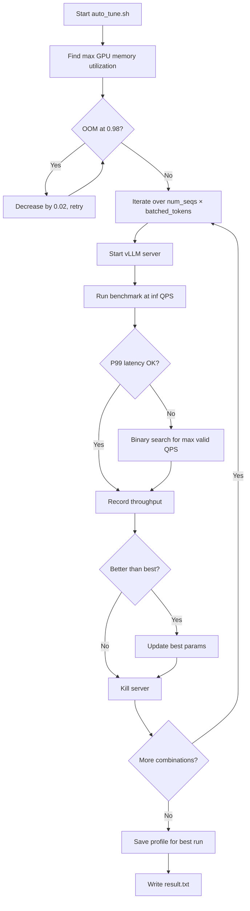

# Auto-Tune Scripts

The auto-tune scripts (`benchmarks/auto_tune/`) automate the search for optimal vLLM server parameters — specifically `max-num-seqs` and `max-num-batched-tokens` — to maximize throughput for a given workload, optionally subject to latency and prefix cache hit rate constraints.

## Overview



## `auto_tune.sh`

**Location:** `benchmarks/auto_tune/auto_tune.sh`

### Configuration Variables

Set these at the top of the script or pass as environment variables:

| Variable | Required | Default | Description |
|----------|----------|---------|-------------|
| `BASE` | Yes | Script parent dir | Absolute path to parent of vLLM repo |
| `MODEL` | Yes | `meta-llama/Llama-3.1-8B-Instruct` | HuggingFace model ID |
| `SYSTEM` | Yes | `TPU` | Hardware type: `TPU` or `GPU` |
| `TP` | Yes | `1` | Tensor parallelism size |
| `DOWNLOAD_DIR` | Yes | `""` | Model weights download directory |
| `INPUT_LEN` | Yes | `4000` | Request input token length |
| `OUTPUT_LEN` | Yes | `16` | Request output token length |
| `MAX_MODEL_LEN` | Yes | `4096` | Maximum model context length |
| `MIN_CACHE_HIT_PCT` | No | `0` | Minimum prefix cache hit rate (0–100) |
| `MAX_LATENCY_ALLOWED_MS` | No | `100000000000` | Maximum P99 E2E latency in ms |
| `NUM_SEQS_LIST` | No | `"128 256"` | Space-separated `max-num-seqs` values |
| `NUM_BATCHED_TOKENS_LIST` | No | `"512 1024 2048 4096"` | Space-separated `max-num-batched-tokens` values |
| `VLLM_LOGGING_LEVEL` | No | `INFO` | vLLM log level |

### Running

```bash
cd benchmarks/auto_tune

# Basic run with defaults
bash auto_tune.sh

# Override via environment variables
MODEL=meta-llama/Llama-3.3-70B-Instruct \
SYSTEM=GPU \
TP=4 \
INPUT_LEN=1800 \
OUTPUT_LEN=20 \
MAX_MODEL_LEN=2048 \
MAX_LATENCY_ALLOWED_MS=500 \
NUM_SEQS_LIST="64 128 256" \
NUM_BATCHED_TOKENS_LIST="1024 2048 4096 8192" \
bash auto_tune.sh
```

> **Tip:** Run inside `tmux` or `screen` to prevent interruption from SSH disconnects, as the script can run for hours.

> **Warning:** Do not run with a path containing the word `vllm` (e.g., `bash /home/user/vllm/auto_tune.sh`) because the script uses `pkill -f vllm` to kill server processes, which would also kill the script itself.

### How It Works

**Step 1 — Find max GPU memory utilization:**
The script starts at `gpu-memory-utilization=0.98` and decreases by 0.02 until the server starts without OOM. This ensures maximum KV cache allocation.

**Step 2 — Iterate over parameter combinations:**
For each `(max_num_seqs, max_num_batched_tokens)` pair:

1. Start the vLLM server with `--load-format dummy` (no actual weights downloaded)
2. Run `vllm bench serve` at `--request-rate inf`
3. If P99 latency ≤ `MAX_LATENCY_ALLOWED_MS`, record throughput
4. If latency is too high, binary-search for the highest QPS that meets the constraint
5. Track the best-performing combination

**Step 3 — Profile collection:**
For the best run, the script saves a profiler trace (`.xplane.pb` for TPU, `.json` for GPU).

### Output

Results are written to `$BASE/auto-benchmark/YYYY_MM_DD_HH_MM/`:

```
auto-benchmark/2024_08_01_10_30/
├── result.txt              # Summary of all runs + best params
├── vllm_log_128_2048.txt   # vLLM server log for each combination
├── bm_log_128_2048.txt     # Benchmark log for each combination
└── profile/                # Profiler trace from best run
```

**`result.txt` format:**

```
hash:a1b2c3d4...
max_num_seqs: 128, max_num_batched_tokens: 2048, request_rate: 10.0, e2el: 450.5, throughput: 9.8, goodput: 9.8
max_num_seqs: 128, max_num_batched_tokens: 4096 does not meet latency requirement 500
...
best_max_num_seqs: 256, best_num_batched_tokens: 2048, best_throughput: 12.5, profile saved in: /home/user/vllm/auto-benchmark/2024_08_01_10_30/profile
```

If no valid configuration is found: `best_max_num_seqs: 0, best_num_batched_tokens: 0, best_throughput: 0`

### Example Use Cases

**Maximize throughput (no latency constraint):**
```bash
INPUT_LEN=1800 OUTPUT_LEN=20 MAX_MODEL_LEN=2048 \
MAX_LATENCY_ALLOWED_MS=100000000000 \
bash auto_tune.sh
```

**Maximize throughput with P99 latency ≤ 500ms:**
```bash
INPUT_LEN=1800 OUTPUT_LEN=20 MAX_MODEL_LEN=2048 \
MAX_LATENCY_ALLOWED_MS=500 \
bash auto_tune.sh
```

**With prefix caching (60% hit rate) and latency constraint:**
```bash
INPUT_LEN=1800 OUTPUT_LEN=20 MAX_MODEL_LEN=2048 \
MIN_CACHE_HIT_PCT=60 MAX_LATENCY_ALLOWED_MS=500 \
bash auto_tune.sh
```

**TPU with Llama-3.3-70B:**
```bash
MODEL=meta-llama/Llama-3.3-70B-Instruct \
SYSTEM=TPU TP=8 \
INPUT_LEN=128 OUTPUT_LEN=2048 MAX_MODEL_LEN=2300 \
NUM_SEQS_LIST="128 256" \
NUM_BATCHED_TOKENS_LIST="1024 2048 4096" \
bash auto_tune.sh
```

## `batch_auto_tune.sh`

**Location:** `benchmarks/auto_tune/batch_auto_tune.sh`

Runs multiple `auto_tune.sh` experiments sequentially from a JSON configuration file. Useful for systematic sweeps across models, hardware configurations, or workload types.

### Prerequisites

- `jq` — for JSON parsing
- `gcloud` — only if uploading results to Google Cloud Storage

### Usage

```bash
bash batch_auto_tune.sh <path_to_json_file> [gcs_upload_path]
```

### JSON Configuration File

Each object in the array maps to one `auto_tune.sh` run. Keys are lowercase versions of the environment variable names:

```json
[
  {
    "base": "/home/user",
    "model": "meta-llama/Llama-3.1-8B-Instruct",
    "system": "GPU",
    "tp": 1,
    "input_len": 1800,
    "output_len": 20,
    "max_model_len": 2048,
    "num_seqs_list": "128 256",
    "num_batched_tokens_list": "1024 2048 4096"
  },
  {
    "base": "/home/user",
    "model": "meta-llama/Llama-3.1-70B-Instruct",
    "system": "GPU",
    "tp": 4,
    "input_len": 4000,
    "output_len": 16,
    "max_model_len": 4096,
    "num_seqs_list": "64 128",
    "num_batched_tokens_list": "4096 8192",
    "max_latency_allowed_ms": 500
  }
]
```

### Output

The script modifies the input JSON file in place, adding result fields to each object:

| Field | Description |
|-------|-------------|
| `run_id` | Timestamp-based unique identifier |
| `status` | `SUCCESS`, `FAILURE`, or `WARNING_NO_RESULT_FILE` |
| `results` | Content of `result.txt` from the run |
| `gcs_results` | GCS URL where artifacts were uploaded (if provided) |

A summary is printed at the end:

```
====================== SUMMARY ======================
Successful runs: 3
Failed runs:     1
=====================================================
```

### GCS Upload

If a GCS path is provided, each run's artifacts (logs, profile, result.txt) are uploaded:

```bash
bash batch_auto_tune.sh runs_config.json gs://my-bucket/benchmark-results
```

## Parameter Selection Guidelines

| Workload | Recommended `max-num-seqs` | Recommended `max-num-batched-tokens` |
|----------|---------------------------|--------------------------------------|
| Short I/O (20 in, 20 out) | 512–2048 | 4096–16384 |
| Medium I/O (512 in, 128 out) | 128–512 | 2048–8192 |
| Long input (4000 in, 16 out) | 64–256 | 4096–8192 |
| Long output (128 in, 2048 out) | 128–512 | 1024–4096 |

> **Note:** The default `NUM_SEQS_LIST` and `NUM_BATCHED_TOKENS_LIST` are tuned for medium-sized inputs/outputs. For very short contexts, test larger `max-num-seqs` values.

## Related Pages

- [Scheduler Configuration](../06-configuration/scheduler-config.md) — `max_num_seqs`, `max_num_batched_tokens`
- [Performance Tuning Guide](performance-tuning.md) — Manual tuning strategies
- [Serving Benchmarks](serving-benchmarks.md) — `vllm bench serve` reference
