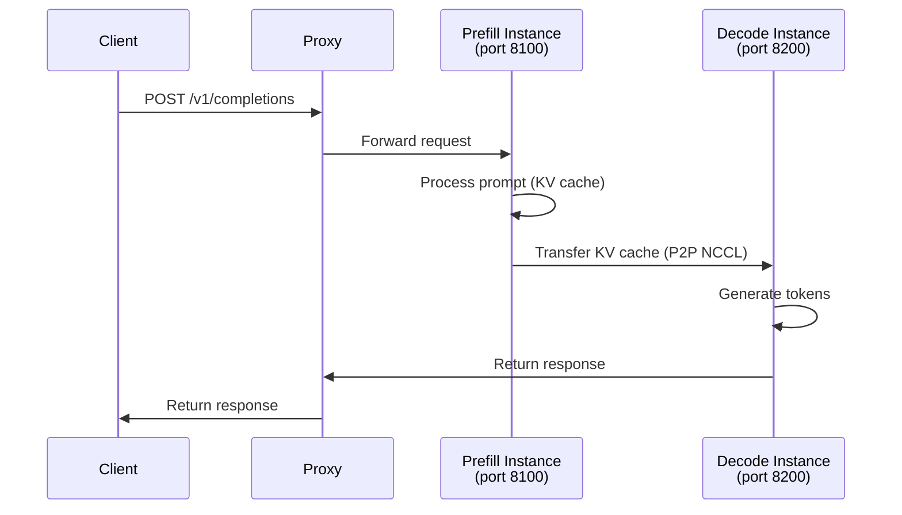

# Disaggregated Serving Benchmarks

The disaggregated serving benchmarks (`benchmarks/disagg_benchmarks/`) measure the performance of vLLM's disaggregated prefill architecture, where prefill and decode phases run on separate GPU instances connected via KV cache transfer.

## What Is Disaggregated Prefill?

In standard serving, a single vLLM instance handles both prefill (processing the input prompt) and decode (generating output tokens). In disaggregated prefill:

- A **prefill instance** processes the input prompt and produces KV cache
- The KV cache is transferred to a **decode instance** via P2P NCCL or NIXL
- The **decode instance** generates output tokens using the transferred KV cache

This separation allows independent scaling of prefill and decode capacity.



## Benchmark Script: `disagg_performance_benchmark.sh`

**Location:** `benchmarks/disagg_benchmarks/disagg_performance_benchmark.sh`

This script compares two approaches on 2 GPUs:

1. **Chunked prefill** — Two independent vLLM instances with chunked prefill enabled, load-balanced via a round-robin proxy
2. **Disaggregated prefill** — One prefill instance + one decode instance connected via P2P NCCL KV transfer

### Configuration

| Parameter | Value |
|-----------|-------|
| Model | `meta-llama/Meta-Llama-3.1-8B-Instruct` |
| Input length | 1024 tokens |
| Output length | 6 tokens |
| QPS tested | 2, 4, 6, 8 |
| Number of prompts | 100 per QPS level |
| Dataset | Sonnet (4x repeated for long prompts) |
| GPU memory utilization | 0.6 per instance |

### Running the Benchmark

```bash
# Requirements: 2x GPUs, Python packages: quart httpx matplotlib aiohttp datasets
cd benchmarks/disagg_benchmarks
bash disagg_performance_benchmark.sh
```

The script automatically:
1. Installs required packages (`quart`, `httpx`, `matplotlib`, `aiohttp`, `datasets`)
2. Creates a 4x-repeated sonnet dataset for 2048-token sampling
3. Launches chunked prefill setup, runs benchmarks at QPS 2/4/6/8
4. Kills GPU processes, launches disaggregated prefill setup
5. Runs benchmarks at the same QPS levels
6. Generates comparison plots via `visualize_benchmark_results.py`

### Chunked Prefill Setup

```bash
# Two independent instances with chunked prefill
CUDA_VISIBLE_DEVICES=0 vllm serve meta-llama/Meta-Llama-3.1-8B-Instruct \
    --port 8100 \
    --max-model-len 10000 \
    --enable-chunked-prefill \
    --gpu-memory-utilization 0.6

CUDA_VISIBLE_DEVICES=1 vllm serve meta-llama/Meta-Llama-3.1-8B-Instruct \
    --port 8200 \
    --max-model-len 10000 \
    --enable-chunked-prefill \
    --gpu-memory-utilization 0.6

# Round-robin proxy on port 8000
python3 round_robin_proxy.py
```

### Disaggregated Prefill Setup

```bash
# Prefill instance (KV producer)
CUDA_VISIBLE_DEVICES=0 vllm serve meta-llama/Meta-Llama-3.1-8B-Instruct \
    --port 8100 \
    --max-model-len 10000 \
    --gpu-memory-utilization 0.6 \
    --kv-transfer-config \
    '{"kv_connector":"P2pNcclConnector","kv_role":"kv_producer","kv_rank":0,"kv_parallel_size":2,"kv_buffer_size":5e9}'

# Decode instance (KV consumer)
CUDA_VISIBLE_DEVICES=1 vllm serve meta-llama/Meta-Llama-3.1-8B-Instruct \
    --port 8200 \
    --max-model-len 10000 \
    --gpu-memory-utilization 0.6 \
    --kv-transfer-config \
    '{"kv_connector":"P2pNcclConnector","kv_role":"kv_consumer","kv_rank":1,"kv_parallel_size":2,"kv_buffer_size":5e9}'

# Disaggregated prefill proxy on port 8000
python3 disagg_prefill_proxy_server.py
```

## Overhead Benchmark: `disagg_overhead_benchmark.sh`

**Location:** `benchmarks/disagg_benchmarks/disagg_overhead_benchmark.sh`

Measures the overhead of KV cache transfer in isolation to quantify the cost of disaggregation.

## Proxy Servers

### `disagg_prefill_proxy_server.py`

A Quart-based async HTTP proxy that routes requests to the prefill instance and then forwards the KV-transferred request to the decode instance. It handles:

- Request routing between prefill and decode instances
- Streaming response forwarding
- Error handling and retry logic

### `round_robin_proxy.py`

A simple round-robin load balancer for the chunked prefill baseline. Routes requests alternately to port 8100 and 8200.

## Benchmark Execution

The `benchmark()` function in the script uses `vllm bench serve`:

```bash
vllm bench serve \
    --backend vllm \
    --model meta-llama/Meta-Llama-3.1-8B-Instruct \
    --dataset-name sonnet \
    --dataset-path ../sonnet_4x.txt \
    --sonnet-input-len 1024 \
    --sonnet-output-len 6 \
    --sonnet-prefix-len 50 \
    --num-prompts 100 \
    --port 8000 \
    --save-result \
    --result-dir ./results \
    --result-filename disagg_prefill-qps-4.json \
    --request-rate 4
```

## Visualizing Results

After the benchmark completes, `visualize_benchmark_results.py` generates comparison plots from the JSON result files in `./results/`:

```bash
python3 visualize_benchmark_results.py
```

The plots compare:
- **Request throughput** (req/s) vs QPS
- **Time to First Token (TTFT)** vs QPS
- **End-to-end latency** vs QPS

## Expected Results

Disaggregated prefill typically shows:
- **Lower TTFT** — prefill instance is dedicated to prompt processing
- **Higher throughput** at high QPS — decode instance is not blocked by prefill
- **Trade-off** — KV transfer adds latency overhead for short outputs

> **Note:** The benchmark uses `output_len=6` (very short outputs) to stress-test the prefill path. For longer outputs, the relative advantage of disaggregated prefill may differ.

## KV Transfer Configuration

The `--kv-transfer-config` JSON supports:

| Field | Description |
|-------|-------------|
| `kv_connector` | Connector type: `P2pNcclConnector`, `NixlConnector` |
| `kv_role` | `kv_producer` (prefill) or `kv_consumer` (decode) |
| `kv_rank` | Rank within the KV transfer group |
| `kv_parallel_size` | Total number of instances in the group |
| `kv_buffer_size` | KV transfer buffer size in bytes (e.g., `5e9` = 5 GB) |

## Related Pages

- [KV Transfer](../07-distributed/kv-transfer.md) — KV cache transfer architecture
- [Serving Benchmarks](serving-benchmarks.md) — `vllm bench serve` reference
- [Performance Tuning Guide](performance-tuning.md) — Optimization strategies
