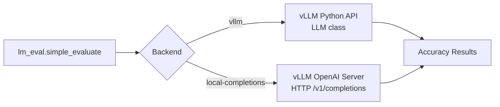

# LM Eval Harness Integration

vLLM integrates with the [LM Evaluation Harness](https://github.com/EleutherAI/lm-evaluation-harness) (`lm_eval`) to measure model accuracy on standard benchmarks. This ensures that performance optimizations (quantization, speculative decoding, etc.) do not degrade model quality.

## Overview

The LM Eval integration is used in two modes:

1. **Offline mode** — Uses the `vllm` model backend in `lm_eval` to evaluate directly via the Python API
2. **Server mode** — Uses the `local-completions` backend to evaluate against a running vLLM OpenAI-compatible server



## Test Files

### `tests/entrypoints/llm/test_accuracy.py`

Tests accuracy via the vLLM Python API (`LLM` class) using the `vllm` backend.

```python
import lm_eval

EXPECTED_VALUES = {
    "Qwen/Qwen3-1.7B": 0.68,
    "google/gemma-3-1b-it": 0.25,
}
RTOL = 0.03  # ±3% tolerance

def run_test(model_name, more_args=None):
    model_args = f"pretrained={model_name},max_model_len=4096"
    if more_args:
        model_args = f"{model_args},{more_args}"

    results = lm_eval.simple_evaluate(
        model="vllm",
        model_args=model_args,
        tasks="gsm8k",
        batch_size="auto",
    )

    measured_value = results["results"]["gsm8k"]["exact_match,strict-match"]
    expected_value = EXPECTED_VALUES[model_name]
    assert abs(measured_value - expected_value) <= RTOL
```

**Test functions:**

| Function | Description |
|----------|-------------|
| `test_lm_eval_accuracy_v1_engine(model)` | Standard accuracy test |
| `test_lm_eval_accuracy_v1_engine_fp8_kv_cache(model)` | Accuracy with FP8 KV cache |

### `tests/entrypoints/openai/correctness/test_lmeval.py`

Tests accuracy via the OpenAI-compatible server using the `local-completions` backend. This validates the full serving stack including ZMQ frontend, async engine, and API compatibility.

```python
MODEL_NAME = "Qwen/Qwen2-1.5B-Instruct"
NUM_CONCURRENT = 500
TASK = "gsm8k"
FILTER = "exact_match,strict-match"
EXPECTED_VALUE = 0.54
RTOL = 0.03

def run_test(more_args):
    with RemoteOpenAIServer(MODEL_NAME, args) as remote_server:
        url = f"{remote_server.url_for('v1')}/completions"

        model_args = (
            f"model={MODEL_NAME},"
            f"base_url={url},"
            f"num_concurrent={NUM_CONCURRENT},tokenized_requests=False"
        )

        results = lm_eval.simple_evaluate(
            model="local-completions",
            model_args=model_args,
            tasks=TASK,
        )

        measured_value = results["results"][TASK][FILTER]
        assert abs(measured_value - EXPECTED_VALUE) <= RTOL
```

**Test functions:**

| Function | Description |
|----------|-------------|
| `test_lm_eval_accuracy_v1_engine()` | Default server args |
| (via `MORE_ARGS_LIST`) | With `--enable-chunked-prefill` |

## Running LM Eval Tests

### Prerequisites

```bash
pip install lm-eval
```

### Offline Evaluation (Python API)

```bash
# Run accuracy test for Qwen3-1.7B
pytest tests/entrypoints/llm/test_accuracy.py::test_lm_eval_accuracy_v1_engine \
    -k "Qwen3-1.7B" -v

# Run with FP8 KV cache
pytest tests/entrypoints/llm/test_accuracy.py::test_lm_eval_accuracy_v1_engine_fp8_kv_cache \
    -k "Qwen3-1.7B" -v
```

### Server Evaluation (OpenAI API)

```bash
# Run server-based accuracy test
pytest tests/entrypoints/openai/correctness/test_lmeval.py::test_lm_eval_accuracy_v1_engine -v
```

### Direct `lm_eval` Usage

You can also run `lm_eval` directly against vLLM:

```bash
# Using vllm backend (offline)
lm_eval \
    --model vllm \
    --model_args pretrained=meta-llama/Llama-3.1-8B-Instruct,max_model_len=4096 \
    --tasks gsm8k,mmlu \
    --batch_size auto \
    --output_path ./results

# Using local-completions backend (server)
vllm serve meta-llama/Llama-3.1-8B-Instruct &

lm_eval \
    --model local-completions \
    --model_args model=meta-llama/Llama-3.1-8B-Instruct,base_url=http://localhost:8000/v1/completions,num_concurrent=100 \
    --tasks gsm8k \
    --output_path ./results
```

## Supported Tasks

The tests primarily use `gsm8k` (grade school math), but `lm_eval` supports hundreds of tasks:

| Task | Metric | Description |
|------|--------|-------------|
| `gsm8k` | `exact_match,strict-match` | Grade school math word problems |
| `mmlu` | `acc,none` | Massive Multitask Language Understanding |
| `hellaswag` | `acc_norm,none` | Commonsense NLI |
| `arc_easy` | `acc,none` | AI2 Reasoning Challenge (easy) |
| `arc_challenge` | `acc_norm,none` | AI2 Reasoning Challenge (hard) |
| `truthfulqa_mc1` | `acc,none` | TruthfulQA multiple choice |
| `winogrande` | `acc,none` | Winograd schema challenge |

## Accuracy Baselines

The test suite maintains expected accuracy values with ±3% tolerance:

| Model | Task | Expected | Tolerance |
|-------|------|----------|-----------|
| `Qwen/Qwen3-1.7B` | gsm8k | 0.68 | ±0.03 |
| `google/gemma-3-1b-it` | gsm8k | 0.25 | ±0.03 |
| `Qwen/Qwen2-1.5B-Instruct` | gsm8k | 0.54 | ±0.03 |

## Quantization Accuracy Tests

Additional accuracy tests for quantized models are in `tests/quantization/`:

### `tests/quantization/test_mixed_precision.py`

Tests accuracy of mixed-precision quantized models.

### `tests/quantization/test_quark.py`

Tests accuracy of Quark-quantized models:

```python
results = lm_eval.simple_evaluate(
    model="vllm",
    model_args=f"pretrained={model_name},quantization=quark,...",
    tasks="gsm8k",
)
```

### `tests/models/quantization/test_gpt_oss.py`

Tests GPT-style quantized models:

```python
lm_eval_out = lm_eval.simple_evaluate(
    model="vllm",
    model_args=f"pretrained={model_name},...",
    tasks=["gsm8k_platinum"],
)
score = lm_eval_out["results"]["gsm8k_platinum"]["exact_match,flexible-extract"]
```

## Distributed Accuracy Tests

`tests/distributed/test_eplb_spec_decode.py` tests accuracy with elastic pipeline load balancing and speculative decoding:

```python
results = lm_eval.simple_evaluate(
    model="vllm",
    model_args=f"pretrained={model_name},tensor_parallel_size=4,...",
    tasks="gsm8k",
)
```

## TPU-Specific Configuration

On TPU, tests use reduced settings to limit compilation time:

```python
if current_platform.is_tpu():
    more_args = "max_model_len=2048,max_num_seqs=64"
```

For FP8 KV cache on TPU:
```python
more_args = "max_model_len=2048,max_num_seqs=128,kv_cache_dtype=fp8"
```

## Integration with CI

The LM Eval tests are run as part of vLLM's correctness test suite to catch regressions from:
- New model implementations
- Quantization changes
- Attention backend changes
- Scheduler changes

Results are compared against stored baselines with a ±3% relative tolerance to account for non-determinism in sampling.

## Related Pages

- [Quantization](../14-quantization/README.md) — Quantization methods
- [Speculative Decoding](../10-speculative-decoding/README.md) — Speculative decoding accuracy
- [Result Interpretation](result-interpretation.md) — Understanding benchmark metrics
