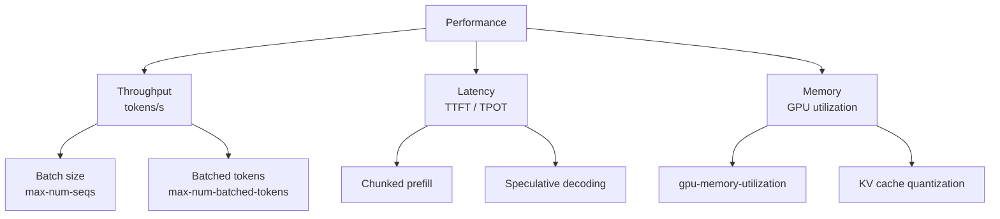

# Performance Tuning Guide

This guide covers the key knobs for maximizing vLLM performance across different hardware configurations and workload types. The recommendations are based on the benchmark tools described in this section.

## Key Performance Dimensions



## GPU Memory Utilization

`--gpu-memory-utilization` (default: `0.90`) controls what fraction of GPU memory is reserved for the KV cache. Higher values allow more concurrent requests but risk OOM errors.

### Recommendations

| Scenario | Recommended Value |
|----------|------------------|
| Production serving | `0.90` (default) |
| Maximum throughput | `0.95`–`0.98` |
| Multi-model on same GPU | `0.40`–`0.60` |
| Disaggregated prefill | `0.60` per instance |
| Development/testing | `0.80` |

### Finding the Safe Maximum

The `auto_tune.sh` script automatically finds the highest safe value:

```bash
# auto_tune.sh starts at 0.98 and decreases until no OOM
bash benchmarks/auto_tune/auto_tune.sh
```

Or manually:

```bash
# Test if 0.95 works
vllm serve meta-llama/Llama-3.1-8B-Instruct \
    --gpu-memory-utilization 0.95 \
    --max-model-len 4096
```

## Batch Size Tuning

### `--max-num-seqs`

Controls the maximum number of sequences processed simultaneously. Higher values increase throughput but also increase memory usage and latency.

```bash
# Throughput-optimized (high concurrency)
vllm serve model --max-num-seqs 512

# Latency-optimized (low concurrency)
vllm serve model --max-num-seqs 32
```

**Guidelines by workload:**

| Workload | `max-num-seqs` |
|----------|---------------|
| Short I/O (chat) | 256–1024 |
| Long input, short output | 64–256 |
| Long output (generation) | 128–512 |
| Embedding | 512–2048 |

### `--max-num-batched-tokens`

Controls the maximum total tokens processed in one scheduler step. This is the primary knob for controlling prefill throughput.

```bash
vllm serve model \
    --max-num-seqs 256 \
    --max-num-batched-tokens 4096
```

**Guidelines:**

| Input length | `max-num-batched-tokens` |
|-------------|--------------------------|
| Short (< 256 tokens) | 2048–8192 |
| Medium (256–2048 tokens) | 4096–16384 |
| Long (> 2048 tokens) | 8192–32768 |

> **Rule of thumb:** Set `max-num-batched-tokens` ≥ `max-num-seqs × average_input_length` to avoid prefill bottlenecks.

## Chunked Prefill

Chunked prefill (`--enable-chunked-prefill`) splits long prefill requests into smaller chunks, allowing decode requests to be interleaved. This reduces TTFT variance and improves latency fairness.

```bash
vllm serve model \
    --enable-chunked-prefill \
    --max-num-batched-tokens 2048  # Chunk size
```

### When to Enable

| Scenario | Recommendation |
|----------|---------------|
| Mixed prefill + decode traffic | ✅ Enable |
| Long prompts (> 2048 tokens) | ✅ Enable |
| Latency-sensitive applications | ✅ Enable |
| Pure throughput (offline) | ❌ Disable |
| Short prompts only | ❌ Disable |

### Chunk Size Selection

The chunk size is controlled by `--max-num-batched-tokens`. Smaller chunks reduce TTFT but increase overhead:

```bash
# Aggressive chunking (low TTFT, higher overhead)
--enable-chunked-prefill --max-num-batched-tokens 512

# Balanced chunking
--enable-chunked-prefill --max-num-batched-tokens 2048

# Large chunks (higher TTFT, lower overhead)
--enable-chunked-prefill --max-num-batched-tokens 8192
```

## Prefix Caching

Enable prefix caching to reuse KV cache across requests with shared prefixes (system prompts, few-shot examples):

```bash
vllm serve model --enable-prefix-caching
```

### Measuring Cache Hit Rate

```bash
# Check cache hit rate via metrics endpoint
curl http://localhost:8000/metrics | grep prefix_cache_hit_rate
```

### Benchmarking with Prefix Caching

```bash
# Benchmark with 60% cache hit rate simulation
cd benchmarks/auto_tune
MIN_CACHE_HIT_PCT=60 bash auto_tune.sh
```

## Tensor Parallelism

Distribute the model across multiple GPUs to fit larger models or increase throughput:

```bash
# 4-GPU tensor parallelism
vllm serve meta-llama/Llama-3.1-70B-Instruct \
    --tensor-parallel-size 4

# 8-GPU for very large models
vllm serve meta-llama/Llama-3.1-405B-Instruct \
    --tensor-parallel-size 8
```

### TP Scaling Efficiency

Use the attention benchmark to measure TP efficiency:

```bash
cd benchmarks/attention_benchmarks
python benchmark.py \
    --backends CUTLASS_MLA FLASHINFER_MLA \
    --batch-specs "64q1s4k" \
    --sweep-param num_q_heads \
    --sweep-values 128 64 32 16  # Simulates TP=1/2/4/8
```

## Quantization for Performance

Quantization reduces memory usage and can increase throughput:

| Method | Memory Reduction | Throughput Impact |
|--------|-----------------|-------------------|
| FP8 weights | ~50% | +20–40% on H100 |
| INT8 (W8A8) | ~50% | +10–30% |
| AWQ (W4A16) | ~75% | +5–15% |
| GPTQ (W4A16) | ~75% | +5–15% |
| FP8 KV cache | ~50% KV | +10–20% (more seqs) |

```bash
# FP8 quantization
vllm serve model --quantization fp8

# FP8 KV cache
vllm serve model --kv-cache-dtype fp8

# Combined
vllm serve model --quantization fp8 --kv-cache-dtype fp8
```

## Speculative Decoding

For latency-sensitive workloads with short outputs, speculative decoding can reduce TPOT:

```bash
# N-gram speculative decoding (no draft model needed)
vllm serve model \
    --speculative-model "[ngram]" \
    --num-speculative-tokens 5 \
    --ngram-prompt-lookup-max 4

# Eagle speculative decoding
vllm serve model \
    --speculative-model eagle-model \
    --num-speculative-tokens 3
```

### Benchmarking Speculative Decoding

```bash
cd benchmarks/attention_benchmarks
python benchmark.py --config configs/speculative_decode.yaml
```

## Attention Backend Selection

The attention backend significantly impacts performance. vLLM auto-selects the best backend, but you can override:

```bash
# Force FlashInfer (often best for decode-heavy workloads)
VLLM_ATTENTION_BACKEND=FLASHINFER vllm serve model

# Force Flash Attention (often best for prefill-heavy workloads)
VLLM_ATTENTION_BACKEND=FLASH_ATTN vllm serve model
```

### Benchmarking Backends

```bash
cd benchmarks/attention_benchmarks
python benchmark.py \
    --backends FLASH_ATTN TRITON_ATTN FLASHINFER \
    --batch-specs "q2k" "8q1s1k" "2q2k_32q1s1k" \
    --output-csv backend_comparison.csv
```

## Compilation and CUDA Graphs

vLLM uses CUDA graphs and torch.compile for reduced kernel launch overhead:

```bash
# Disable CUDA graphs (for debugging)
vllm serve model --enforce-eager

# Control compilation level
vllm serve model --compilation-config '{"level": 3}'
```

## Profiling

### Built-in Profiler

```bash
# Profile a latency benchmark
vllm bench latency \
    --model meta-llama/Llama-3.1-8B-Instruct \
    --profile \
    --output-json latency.json
```

### Server-side Profiling

```bash
# Start profiling
curl -X POST http://localhost:8000/start_profile

# Run benchmark
vllm bench serve --model model --num-prompts 100

# Stop profiling
curl -X POST http://localhost:8000/stop_profile
```

### Profiling via `vllm bench serve`

```bash
vllm bench serve \
    --model model \
    --profile \
    --num-prompts 100
```

## Workload-Specific Recommendations

### Chat / Interactive Applications

```bash
vllm serve model \
    --max-num-seqs 256 \
    --max-num-batched-tokens 4096 \
    --enable-chunked-prefill \
    --enable-prefix-caching \
    --gpu-memory-utilization 0.90
```

### Batch Inference / Offline Processing

```bash
vllm serve model \
    --max-num-seqs 512 \
    --max-num-batched-tokens 16384 \
    --gpu-memory-utilization 0.95 \
    --disable-log-requests
```

### Long Context (RAG, Document QA)

```bash
vllm serve model \
    --max-model-len 32768 \
    --max-num-seqs 64 \
    --max-num-batched-tokens 8192 \
    --enable-chunked-prefill \
    --enable-prefix-caching \
    --kv-cache-dtype fp8
```

### High-Throughput Code Generation

```bash
vllm serve model \
    --max-num-seqs 256 \
    --max-num-batched-tokens 8192 \
    --enable-prefix-caching \
    --quantization fp8
```

## Systematic Tuning with auto_tune.sh

For production deployments, use `auto_tune.sh` to systematically find optimal parameters:

```bash
cd benchmarks/auto_tune

# Define your workload
INPUT_LEN=1800      # Typical input length
OUTPUT_LEN=20       # Typical output length
MAX_MODEL_LEN=2048  # Model context limit

# Define constraints
MAX_LATENCY_ALLOWED_MS=500  # P99 E2E latency SLO

# Define search space
NUM_SEQS_LIST="64 128 256 512"
NUM_BATCHED_TOKENS_LIST="1024 2048 4096 8192"

bash auto_tune.sh
```

## Related Pages

- [Auto-Tune Scripts](auto-tune.md) — Automated parameter search
- [Serving Benchmarks](serving-benchmarks.md) — Measuring performance
- [Result Interpretation](result-interpretation.md) — Understanding metrics
- [Configuration Reference](../06-configuration/README.md) — All configuration options
- [Scheduler Configuration](../06-configuration/scheduler-config.md) — Scheduler parameters
