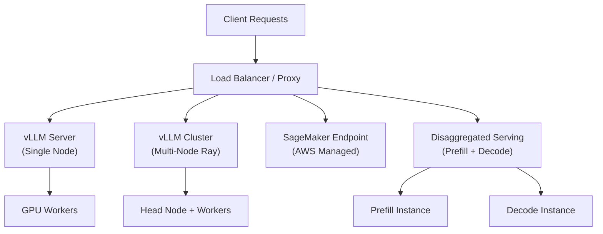

# Deployment Guide

This section covers all deployment scenarios for vLLM — from single-GPU Docker containers to multi-node Kubernetes clusters, AWS SageMaker, and advanced disaggregated serving topologies.

## Contents

| Page | Description |
|------|-------------|
| [Docker Deployment](docker.md) | `docker run` commands, environment variables, GPU passthrough |
| [Multi-Stage Docker Builds](docker-bake.md) | `docker-bake.hcl`, image variants, build targets |
| [Kubernetes Deployment](kubernetes.md) | Resource requests, GPU node selectors, health probes |
| [AWS SageMaker](sagemaker.md) | Container standards, `/ping`, `/invocations` endpoints |
| [Disaggregated Prefill](disaggregated-prefill.md) | Prefill-only vs decode-only instances, proxy server |
| [Elastic Expert Parallelism](elastic-ep.md) | Scaling MoE experts dynamically |
| [Multi-Node Deployment](multi-node.md) | Ray cluster setup, multi-node serving script |
| [SSL/TLS Configuration](ssl-tls.md) | Certificate management, hot-reload |

## Deployment Topology Overview



## Quick Reference

### Minimal Docker Run

```bash
docker run --runtime nvidia --gpus all \
  -v ~/.cache/huggingface:/root/.cache/huggingface \
  -p 8000:8000 \
  --ipc=host \
  vllm/vllm-openai:latest \
  --model meta-llama/Meta-Llama-3.1-8B-Instruct
```

### Multi-Node with Ray

```bash
# Head node
./examples/online_serving/run_cluster.sh vllm/vllm-openai <HEAD_IP> --head /hf/cache

# Worker nodes
./examples/online_serving/run_cluster.sh vllm/vllm-openai <HEAD_IP> --worker /hf/cache
```

### Disaggregated Prefill

```bash
# Start prefill + decode instances, then proxy
bash examples/online_serving/disaggregated_prefill.sh
```

## Related Documentation

- [Distributed Inference](../07-distributed/README.md) — tensor/pipeline/expert parallelism
- [Configuration Reference](../06-configuration/README.md) — all configuration options
- [API Reference](../12-api-reference/README.md) — endpoint documentation
- [Hardware Support](../09-hardware/README.md) — GPU/CPU/TPU platform notes
- [Benchmarking](../15-benchmarking/README.md) — performance benchmarks for deployed configurations
- [Observability](../11-observability/README.md) — monitoring deployed instances
- [Auth & SSL](../12-api-reference/auth-ssl.md) — securing deployed endpoints
