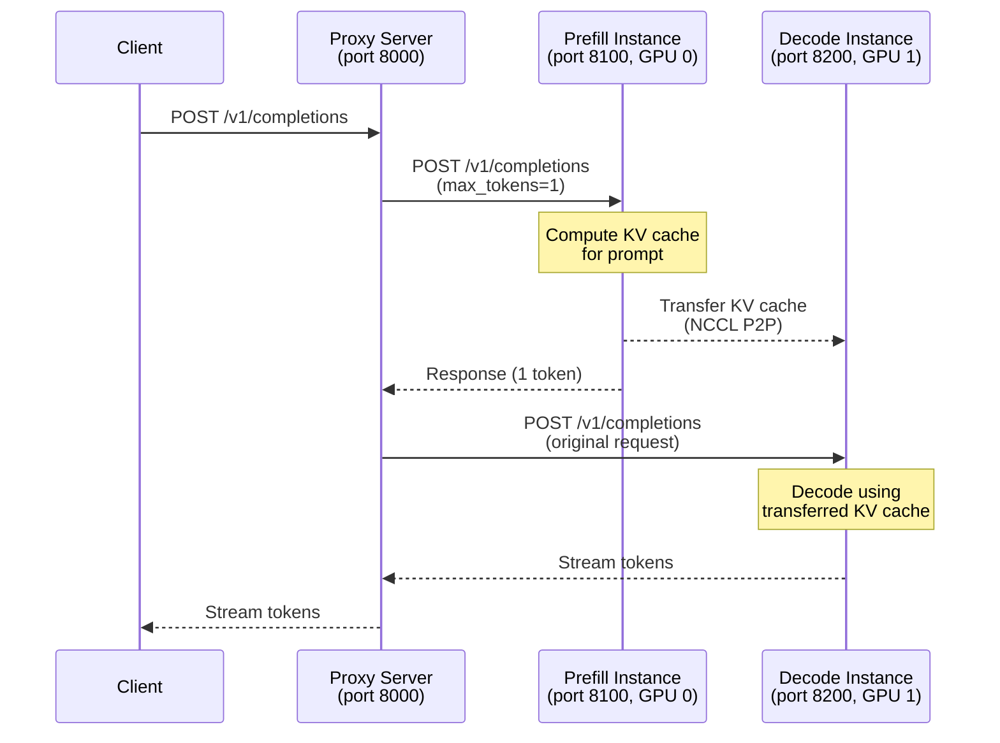

# Disaggregated Prefill Deployment

Disaggregated prefill separates the **prefill** (prompt processing) and **decode** (token generation) phases of LLM inference onto dedicated instances. This allows each phase to be independently scaled and optimized, reducing time-to-first-token (TTFT) and improving overall throughput.

> **Note:** Disaggregated prefill is experimental and subject to change.

## Architecture

In standard serving, a single vLLM instance handles both prefill and decode. In disaggregated serving:

1. A **prefill instance** (`kv_producer`) processes the prompt and computes KV caches
2. The KV cache is transferred to a **decode instance** (`kv_consumer`) via a KV connector
3. The **decode instance** generates tokens using the transferred KV cache
4. A **proxy server** orchestrates the two-phase request flow



## KV Transfer Configuration

The `KVTransferConfig` class (in `vllm/config/kv_transfer.py`) controls disaggregated prefill behavior:

```python
from vllm.config import KVTransferConfig

# Prefill instance (KV producer)
ktc_prefill = KVTransferConfig(
    kv_connector="P2pNcclConnector",
    kv_role="kv_producer",
    kv_rank=0,
    kv_parallel_size=2,
    kv_buffer_size=1e9,   # 1 GB buffer
    kv_port=14579,
)

# Decode instance (KV consumer)
ktc_decode = KVTransferConfig(
    kv_connector="P2pNcclConnector",
    kv_role="kv_consumer",
    kv_rank=1,
    kv_parallel_size=2,
    kv_buffer_size=1e10,  # 10 GB buffer
    kv_port=14580,
)
```

### Configuration Fields

| Field | Type | Description |
|-------|------|-------------|
| `kv_connector` | `str` | Connector type (e.g., `P2pNcclConnector`) |
| `kv_role` | `str` | `kv_producer`, `kv_consumer`, or `kv_both` |
| `kv_rank` | `int` | Rank in the KV transfer group (0=prefill, 1=decode) |
| `kv_parallel_size` | `int` | Number of parallel instances (2 for P2pNcclConnector) |
| `kv_buffer_size` | `float` | Buffer size in bytes |
| `kv_ip` | `str` | IP for distributed connection (default `127.0.0.1`) |
| `kv_port` | `int` | Port for KV transfer (default `14579`) |
| `kv_buffer_device` | `str` | Buffer device: `cuda` or `cpu` |
| `kv_connector_extra_config` | `dict` | Connector-specific extra config |
| `kv_connector_module_path` | `str` | Python module path for custom connectors |
| `kv_load_failure_policy` | `str` | `recompute` or `fail` on KV load failure |

## Online Serving Setup

### Step 1: Start the Prefill Instance

```bash
CUDA_VISIBLE_DEVICES=0 vllm serve meta-llama/Meta-Llama-3.1-8B-Instruct \
    --host 0.0.0.0 \
    --port 8100 \
    --max-model-len 100 \
    --gpu-memory-utilization 0.8 \
    --kv-transfer-config \
    '{"kv_connector":"P2pNcclConnector",
      "kv_role":"kv_producer",
      "kv_rank":0,
      "kv_parallel_size":2,
      "kv_buffer_size":"1e9",
      "kv_port":"14579",
      "kv_connector_extra_config":{
        "proxy_ip":"127.0.0.1",
        "proxy_port":"30001",
        "http_ip":"127.0.0.1",
        "http_port":"8100",
        "send_type":"PUT_ASYNC"
      }}'
```

### Step 2: Start the Decode Instance

```bash
CUDA_VISIBLE_DEVICES=1 vllm serve meta-llama/Meta-Llama-3.1-8B-Instruct \
    --host 0.0.0.0 \
    --port 8200 \
    --max-model-len 100 \
    --gpu-memory-utilization 0.8 \
    --kv-transfer-config \
    '{"kv_connector":"P2pNcclConnector",
      "kv_role":"kv_consumer",
      "kv_rank":1,
      "kv_parallel_size":2,
      "kv_buffer_size":"1e10",
      "kv_port":"14580",
      "kv_connector_extra_config":{
        "proxy_ip":"127.0.0.1",
        "proxy_port":"30001",
        "http_ip":"127.0.0.1",
        "http_port":"8200",
        "send_type":"PUT_ASYNC"
      }}'
```

### Step 3: Start the Proxy Server

The proxy server (`benchmarks/disagg_benchmarks/disagg_prefill_proxy_server.py`) orchestrates the two-phase request flow:

```bash
# Install dependency
pip install quart

# Start proxy (listens on port 8000)
python benchmarks/disagg_benchmarks/disagg_prefill_proxy_server.py \
    --port 8000 \
    --prefill-url http://localhost:8100 \
    --decode-url http://localhost:8200 \
    --kv-host localhost \
    --prefill-kv-port 14579 \
    --decode-kv-port 14580
```

### Step 4: Send Requests

```bash
curl -X POST http://localhost:8000/v1/completions \
  -H "Content-Type: application/json" \
  -d '{
    "model": "meta-llama/Meta-Llama-3.1-8B-Instruct",
    "prompt": "San Francisco is a",
    "max_tokens": 10,
    "temperature": 0
  }'
```

### Using the Example Script

The complete setup is automated in `examples/online_serving/disaggregated_prefill.sh`:

```bash
export VLLM_HOST_IP=127.0.0.1
bash examples/online_serving/disaggregated_prefill.sh
```

## Offline Inference Setup

For offline (batch) inference with disaggregated prefill:

```python
import os
from multiprocessing import Event, Process
from vllm import LLM, SamplingParams
from vllm.config import KVTransferConfig

def run_prefill(prefill_done):
    os.environ["CUDA_VISIBLE_DEVICES"] = "0"
    
    ktc = KVTransferConfig(
        kv_connector="P2pNcclConnector",
        kv_role="kv_producer",
        kv_rank=0,
        kv_parallel_size=2,
    )
    llm = LLM(
        model="meta-llama/Meta-Llama-3.1-8B-Instruct",
        kv_transfer_config=ktc,
        max_model_len=2000,
        gpu_memory_utilization=0.8,
    )
    prompts = ["Hello, my name is", "Tell me a story"]
    llm.generate(prompts, SamplingParams(temperature=0, max_tokens=1))
    prefill_done.set()

def run_decode(prefill_done):
    os.environ["CUDA_VISIBLE_DEVICES"] = "1"
    
    ktc = KVTransferConfig(
        kv_connector="P2pNcclConnector",
        kv_role="kv_consumer",
        kv_rank=1,
        kv_parallel_size=2,
    )
    llm = LLM(
        model="meta-llama/Meta-Llama-3.1-8B-Instruct",
        kv_transfer_config=ktc,
        max_model_len=2000,
        gpu_memory_utilization=0.8,
    )
    prefill_done.wait()  # Wait for KV cache transfer
    prompts = ["Hello, my name is", "Tell me a story"]
    outputs = llm.generate(prompts, SamplingParams(temperature=0))
    for output in outputs:
        print(f"Prompt: {output.prompt!r}")
        print(f"Generated: {output.outputs[0].text!r}")

if __name__ == "__main__":
    prefill_done = Event()
    p1 = Process(target=run_prefill, args=(prefill_done,))
    p2 = Process(target=run_decode, args=(prefill_done,))
    p1.start()
    p2.start()
    p2.join()
    p1.terminate()
```

## Proxy Server Details

The proxy server (`benchmarks/disagg_benchmarks/disagg_prefill_proxy_server.py`) implements the two-phase protocol:

1. **Receive** the original request from the client
2. **Prefill phase**: Forward to the prefill instance with `max_tokens=1`
   - Sets `X-Request-Id` header encoding KV socket addresses
   - Sets `X-KV-Target` header pointing to the decode instance
3. **Decode phase**: Forward the original request to the decode instance
   - The decode instance uses the already-transferred KV cache
   - Streams the response back to the client

```python
# Request ID encodes KV addresses for NCCL routing
request_id = (
    f"___prefill_addr_{PREFILL_KV_ADDR}___decode_addr_"
    f"{DECODE_KV_ADDR}_{uuid.uuid4().hex}"
)
```

### Proxy CLI Arguments

| Argument | Default | Description |
|----------|---------|-------------|
| `--port` | `8000` | Proxy server port |
| `--prefill-url` | `http://localhost:8100` | Prefill instance URL |
| `--decode-url` | `http://localhost:8200` | Decode instance URL |
| `--kv-host` | `localhost` | KV transfer hostname |
| `--prefill-kv-port` | `14579` | Prefill KV port |
| `--decode-kv-port` | `14580` | Decode KV port |
| `--timeout` | `21600` | Request timeout in seconds |

## KV Load Failure Policy

If KV cache transfer fails, the behavior is controlled by `kv_load_failure_policy`:

| Policy | Behavior |
|--------|----------|
| `fail` (default) | Immediately fail the request with an error |
| `recompute` | Reschedule the request to recompute failed blocks |

```bash
vllm serve mymodel \
    --kv-transfer-config '{"kv_connector":"P2pNcclConnector","kv_role":"kv_consumer","kv_load_failure_policy":"recompute",...}'
```

## Multi-Node Disaggregated Prefill

For cross-node KV transfer, set `kv_ip` and `kv_port` to the remote node's address:

```bash
# On prefill node (192.168.1.10)
VLLM_HOST_IP=192.168.1.10 vllm serve mymodel \
    --kv-transfer-config \
    '{"kv_connector":"P2pNcclConnector","kv_role":"kv_producer","kv_rank":0,
      "kv_parallel_size":2,"kv_ip":"192.168.1.10","kv_port":14579}'

# On decode node (192.168.1.11)
VLLM_HOST_IP=192.168.1.11 vllm serve mymodel \
    --kv-transfer-config \
    '{"kv_connector":"P2pNcclConnector","kv_role":"kv_consumer","kv_rank":1,
      "kv_parallel_size":2,"kv_ip":"192.168.1.10","kv_port":14579}'
```

## Related Pages

- [KV Transfer Configuration](../07-distributed/kv-transfer.md) — KV connector internals
- [Distributed Inference](../07-distributed/README.md) — parallelism strategies
- [Multi-Node Deployment](multi-node.md) — Ray cluster setup
