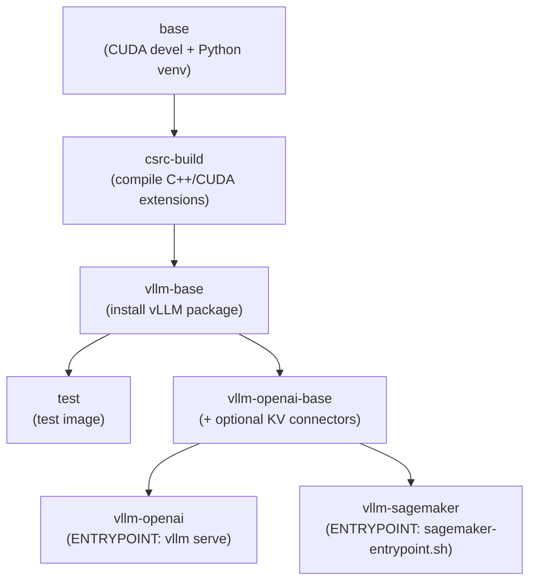

# Multi-Stage Docker Builds

vLLM uses a multi-stage Dockerfile (`docker/Dockerfile`) and a BuildKit Bake configuration (`docker/docker-bake.hcl`) to produce optimized, reproducible images. This page explains the build stages, image variants, and how to use `docker buildx bake`.

## Dockerfile Stages

The Dockerfile is organized into named stages that build on each other:



### Stage: `base`

**Base image:** `nvidia/cuda:<CUDA_VERSION>-devel-ubuntu20.04`

Installs system dependencies, GCC 10, and creates a Python virtual environment using `uv`. Also installs PyTorch and core CUDA requirements.

Key build arguments:
- `CUDA_VERSION` — default `12.9.1`
- `PYTHON_VERSION` — default `3.12`
- `BUILD_BASE_IMAGE` — override the base CUDA image
- `PYTORCH_NIGHTLY` — set to `1` to install nightly PyTorch
- `TORCH_CUDA_ARCH_LIST` — CUDA architectures to compile for

### Stage: `csrc-build`

Compiles vLLM's C++/CUDA extensions (attention kernels, custom ops). This is the most time-consuming stage and benefits most from build caching.

Key build arguments:
- `MAX_JOBS` — parallel compile jobs (default `16`)
- `NVCC_THREADS` — NVCC threads per job (default `8`)

### Stage: `vllm-base`

Installs the vLLM Python package from the compiled extensions. This is the base for all serving images.

### Stage: `vllm-openai-base`

Extends `vllm-base` with optional KV connector libraries:
- `INSTALL_KV_CONNECTORS=true` — installs LMCache, NIXL, and other connectors from `requirements/kv_connectors.txt`

Sets `VLLM_USAGE_SOURCE=production-docker-image`.

### Stage: `vllm-openai`

The default production image. Entrypoint is `vllm serve`.

### Stage: `vllm-sagemaker`

SageMaker-compatible image. Entrypoint is `sagemaker-entrypoint.sh` which translates `SM_VLLM_*` environment variables into CLI arguments.

### Stage: `test`

Used in CI. Includes source code for Python-only compilation tests.

## Build Arguments Reference

| Argument | Default | Description |
|----------|---------|-------------|
| `CUDA_VERSION` | `12.9.1` | CUDA toolkit version |
| `PYTHON_VERSION` | `3.12` | Python version |
| `BUILD_BASE_IMAGE` | `nvidia/cuda:${CUDA_VERSION}-devel-ubuntu20.04` | Build base image |
| `FINAL_BASE_IMAGE` | `nvidia/cuda:${CUDA_VERSION}-base-ubuntu22.04` | Runtime base image |
| `PYTORCH_NIGHTLY` | — | Set to `1` for nightly PyTorch |
| `PYTORCH_CUDA_INDEX_BASE_URL` | `https://download.pytorch.org/whl` | PyTorch index URL |
| `torch_cuda_arch_list` | `7.0 7.5 8.0 8.9 9.0 10.0 12.0` | CUDA arch list |
| `MAX_JOBS` | `16` | Parallel compile jobs |
| `NVCC_THREADS` | `8` | NVCC threads |
| `INSTALL_KV_CONNECTORS` | `false` | Install KV connector libs |
| `PIP_INDEX_URL` | — | Custom pip index |
| `PIP_EXTRA_INDEX_URL` | — | Extra pip index |
| `GET_PIP_URL` | PyPA bootstrap URL | Custom get-pip.py URL |
| `DEADSNAKES_MIRROR_URL` | — | Custom Deadsnakes PPA mirror |

## `docker-bake.hcl`

The `docker/docker-bake.hcl` file defines build targets for `docker buildx bake`. It reads from `docker/versions.json` for pinned version defaults.

```hcl
# docker/docker-bake.hcl

variable "MAX_JOBS" {
  default = 16
}

variable "NVCC_THREADS" {
  default = 8
}

variable "TORCH_CUDA_ARCH_LIST" {
  default = "8.0 8.9 9.0 10.0"
}

variable "COMMIT" {
  default = ""
}

group "default" {
  targets = ["openai"]
}

target "_common" {
  dockerfile = "docker/Dockerfile"
  context    = "."
  args = {
    max_jobs             = MAX_JOBS
    nvcc_threads         = NVCC_THREADS
    torch_cuda_arch_list = TORCH_CUDA_ARCH_LIST
  }
}

target "openai" {
  inherits = ["_common", "_labels"]
  target   = "vllm-openai"
  tags     = ["vllm:openai"]
  output   = ["type=docker"]
}

target "test" {
  inherits = ["_common", "_labels"]
  target   = "test"
  tags     = ["vllm:test"]
  output   = ["type=docker"]
}
```

### Image Labels

The `_labels` target applies OCI-standard labels:

| Label | Value |
|-------|-------|
| `org.opencontainers.image.source` | `https://github.com/vllm-project/vllm` |
| `org.opencontainers.image.vendor` | `vLLM` |
| `org.opencontainers.image.licenses` | `Apache-2.0` |
| `org.opencontainers.image.revision` | Git commit SHA |

## Building with `docker buildx bake`

### Default Build (openai target)

```bash
cd /path/to/vllm
docker buildx bake -f docker/docker-bake.hcl -f docker/versions.json
```

This builds the `vllm-openai` image and loads it into the local Docker daemon.

### Build Specific Target

```bash
# Build the test image
docker buildx bake -f docker/docker-bake.hcl test

# Build the openai image explicitly
docker buildx bake -f docker/docker-bake.hcl openai
```

### Override Variables

```bash
# Build with fewer parallel jobs (useful on machines with limited RAM)
MAX_JOBS=4 docker buildx bake -f docker/docker-bake.hcl openai

# Build for specific CUDA architectures only
TORCH_CUDA_ARCH_LIST="8.0 9.0" docker buildx bake -f docker/docker-bake.hcl openai

# Build with a specific commit label
COMMIT=$(git rev-parse HEAD) docker buildx bake -f docker/docker-bake.hcl openai
```

### Preview Resolved Config

```bash
docker buildx bake --print -f docker/docker-bake.hcl openai
```

### Multi-Platform Build

```bash
docker buildx bake \
  --platform linux/amd64 \
  -f docker/docker-bake.hcl \
  openai
```

## Direct `docker build` Commands

For builds without bake:

```bash
# Standard build
docker build \
  --build-arg MAX_JOBS=16 \
  --build-arg NVCC_THREADS=8 \
  --build-arg torch_cuda_arch_list="8.0 8.9 9.0" \
  -f docker/Dockerfile \
  --target vllm-openai \
  -t vllm/vllm-openai:custom \
  .

# With KV connectors
docker build \
  --build-arg INSTALL_KV_CONNECTORS=true \
  -f docker/Dockerfile \
  --target vllm-openai \
  -t vllm/vllm-openai:kv \
  .

# Nightly PyTorch
docker build \
  --build-arg PYTORCH_NIGHTLY=1 \
  -f docker/Dockerfile \
  --target vllm-openai \
  -t vllm/vllm-openai:nightly \
  .
```

## Version Management

Version pins are stored in `docker/Dockerfile` as `ARG` defaults and auto-generated into `docker/versions.json`:

```bash
# After updating ARG defaults in Dockerfile, regenerate versions.json:
python tools/generate_versions_json.py

# Query a version programmatically:
jq -r '.variable.CUDA_VERSION.default' docker/versions.json
```

## Platform-Specific Dockerfiles

Additional Dockerfiles exist for non-CUDA platforms:

| File | Platform |
|------|----------|
| `docker/Dockerfile.cpu` | CPU-only inference |
| `docker/Dockerfile.rocm` | AMD ROCm GPUs |
| `docker/Dockerfile.xpu` | Intel XPU |
| `docker/Dockerfile.tpu` | Google TPU |
| `docker/Dockerfile.s390x` | IBM s390x |
| `docker/Dockerfile.ppc64le` | IBM POWER |

See [Hardware Support](../09-hardware/README.md) for platform-specific deployment notes.

## Related Pages

- [Docker Deployment](docker.md) — `docker run` commands and environment variables
- [Kubernetes Deployment](kubernetes.md) — deploying images in Kubernetes
- [AWS SageMaker](sagemaker.md) — SageMaker image variant
