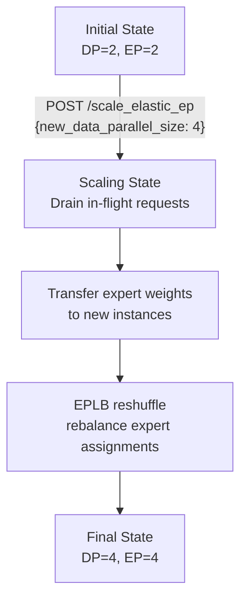

# Elastic Expert Parallelism Deployment

Elastic Expert Parallelism (Elastic EP) allows vLLM to dynamically scale the number of data-parallel (DP) instances serving a Mixture-of-Experts (MoE) model — without restarting the server. This enables cost-efficient scaling in response to changing traffic patterns.

Source: `vllm/distributed/elastic_ep/`, `vllm/entrypoints/serve/elastic_ep/`

## Overview

In standard expert parallelism, the number of DP instances is fixed at startup. Elastic EP adds:

1. **Dynamic scaling** — add or remove DP instances at runtime via an API call
2. **Expert weight transfer** — weights are transferred between instances during scaling
3. **EPLB reshuffling** — Expert Parallel Load Balancing (EPLB) rebalances expert assignments after scaling
4. **Zero-downtime scaling** — in-flight requests drain before the topology changes



## Prerequisites

- MoE model (e.g., DeepSeek-V2, Mixtral)
- Ray distributed executor backend (`--data-parallel-backend ray`)
- Expert parallelism enabled (`--enable-expert-parallel`)
- EPLB enabled (`--enable-eplb`)
- Elastic EP enabled (`--enable-elastic-ep`)

## Starting a Server with Elastic EP

```bash
vllm serve deepseek-ai/DeepSeek-V2-Lite \
    --data-parallel-size 4 \
    --data-parallel-size-local 4 \
    --data-parallel-backend ray \
    --enable-expert-parallel \
    --enable-eplb \
    --enable-elastic-ep \
    --all2all-backend allgather_reducescatter \
    --num-redundant-experts 0 \
    --trust-remote-code \
    --host 0.0.0.0 \
    --port 8006
```

See `examples/online_serving/elastic_ep/serve_deepseek_v2.sh` for a complete example.

### Key Arguments

| Argument | Description |
|----------|-------------|
| `--data-parallel-size N` | Initial number of DP instances |
| `--data-parallel-size-local N` | DP instances on the local node |
| `--data-parallel-backend ray` | Required for elastic EP |
| `--enable-expert-parallel` | Enable expert parallelism |
| `--enable-eplb` | Enable Expert Parallel Load Balancing |
| `--enable-elastic-ep` | Enable elastic scaling of DP/EP groups |
| `--all2all-backend` | All-to-all communication backend |
| `--num-redundant-experts N` | Number of redundant expert replicas |

### All-to-All Backends

| Backend | Description |
|---------|-------------|
| `allgather_reducescatter` | Default; uses allgather + reduce-scatter |
| `deepep_low_latency` | DeepEP low-latency all-to-all |
| `deepep_high_throughput` | DeepEP high-throughput all-to-all |
| `flashinfer_all2allv` | FlashInfer mnnvl all-to-all |

## Scaling API

When `--enable-elastic-ep` is set, vLLM exposes two additional endpoints:

### `POST /scale_elastic_ep`

Triggers a scaling operation to change the number of DP instances:

```bash
curl -X POST http://localhost:8006/scale_elastic_ep \
  -H "Content-Type: application/json" \
  -d '{
    "new_data_parallel_size": 8,
    "drain_timeout": 120
  }'
```

**Request body:**

| Field | Type | Required | Description |
|-------|------|----------|-------------|
| `new_data_parallel_size` | `int` | Yes | Target number of DP instances (must be positive) |
| `drain_timeout` | `int` | No | Seconds to wait for in-flight requests to drain (default: 120) |

**Response:**

```json
{
  "message": "Scaled to 8 data parallel engines"
}
```

**Error responses:**

| Status | Condition |
|--------|-----------|
| `400` | Invalid `new_data_parallel_size` or `drain_timeout` |
| `408` | Request drain timed out |
| `500` | Internal scaling error |

### `POST /is_scaling_elastic_ep`

Check whether a scaling operation is currently in progress:

```bash
curl -X POST http://localhost:8006/is_scaling_elastic_ep
```

**Response:**

```json
{
  "is_scaling_elastic_ep": false
}
```

During scaling, new inference requests receive a `503 Service Unavailable` response (controlled by the scaling middleware in `vllm/entrypoints/serve/elastic_ep/middleware.py`).

## Scaling State Machine

The scaling process is managed by `ElasticEPScalingState` in `vllm/distributed/elastic_ep/elastic_state.py`. The state machine differs based on whether the instance is an existing engine, a new engine being added, or an engine being removed.

### Scale-Up (Existing Engine)

```
WAIT_NEW_CORE_ENGINES_INIT
  → CREATE_STANDBY_GROUPS
  → TRANSFER_EXPERT_MAPPING
  → WAIT_NEW_CORE_ENGINES_WEIGHTS_INIT
  → TRANSFER_WEIGHTS
  → SYNC_KV_CACHE_MEMORY_SIZE
  → SWITCH_AND_PREPARE
  → EPLB_RESHUFFLE
  → COMPLETE
```

### Scale-Up (New Engine)

```
PREPARE
  → EPLB_RESHUFFLE
  → COMPLETE
```

### Scale-Down (Remaining Engine)

```
PREPARE
  → EPLB_RESHUFFLE
  → SWITCH_AND_PREPARE
  → COMPLETE
```

### Scale-Down (Removing Engine)

```
PREPARE
  → EPLB_RESHUFFLE
  → COMPLETE
```

## Expert Weight Transfer

During scale-up, expert weights are transferred from existing engines to new engines using P2P NCCL operations (`vllm/distributed/elastic_ep/elastic_execute.py`):

```python
def batch_transfer_weights(
    model: nn.Module,
    is_sender: bool,
    peer_rank: int,
    dp_group: StatelessGroupCoordinator,
    expert_weights: Sequence[Iterable[torch.Tensor]],
) -> None:
    # Collect all non-expert-map parameters
    # Transfer via P2P NCCL isend/irecv operations
    ...
```

The transfer uses stateless NCCL groups (separate from the main inference groups) to avoid deadlocks. Port lists for these groups are pre-allocated in `ParallelConfig`:

- `_stateless_dp_group_port_list` — DP group ports
- `_stateless_ep_group_port_list` — EP group ports
- `_stateless_eplb_group_port_list` — EPLB group ports
- `_stateless_world_group_port_list` — World group ports

## EPLB Reshuffling

After scaling, EPLB (Expert Parallel Load Balancing) reshuffles expert assignments to balance load across the new topology. This is triggered automatically as part of the scaling state machine.

EPLB uses redundant expert replicas (`--num-redundant-experts`) to provide flexibility in assignment. More redundant experts allow better load balancing but consume more GPU memory.

## Benchmarking

Use the provided benchmark script to measure throughput before and after scaling:

```bash
# Start the server
bash examples/online_serving/elastic_ep/serve_deepseek_v2.sh --dp 4

# Run benchmark
bash examples/online_serving/elastic_ep/bench.sh \
    --model deepseek-ai/DeepSeek-V2-Lite \
    --num-prompts 20 \
    --request-rate 5

# Scale up
curl -X POST http://localhost:8006/scale_elastic_ep \
  -H "Content-Type: application/json" \
  -d '{"new_data_parallel_size": 8}'

# Benchmark again
bash examples/online_serving/elastic_ep/bench.sh \
    --model deepseek-ai/DeepSeek-V2-Lite \
    --num-prompts 20 \
    --request-rate 5
```

## Configuration Reference

The `ParallelConfig` fields relevant to elastic EP (from `vllm/config/parallel.py`):

| Field | Default | Description |
|-------|---------|-------------|
| `enable_elastic_ep` | `False` | Enable elastic expert parallelism |
| `enable_expert_parallel` | `False` | Enable expert parallelism |
| `enable_eplb` | `False` | Enable EPLB load balancing |
| `num_redundant_experts` | `0` | Number of redundant expert replicas |
| `all2all_backend` | — | All-to-all communication backend |

## Related Pages

- [Expert Parallelism](../07-distributed/expert-parallelism.md) — static expert parallelism
- [Elastic EP Internals](../07-distributed/elastic-ep.md) — implementation details
- [Data Parallelism](../07-distributed/data-parallelism.md) — DP configuration
- [Distributed Inference](../07-distributed/README.md) — overview of parallelism strategies
