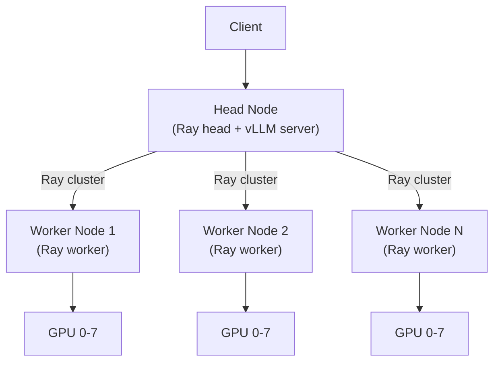

# Multi-Node Deployment

Multi-node deployment allows vLLM to serve very large models (e.g., 405B parameter models) that exceed the memory of a single node by distributing inference across multiple machines using Ray.

## Architecture



All nodes must:
- Run the same vLLM Docker image
- Have network connectivity to each other
- Be reachable at their respective IP addresses

## Method 1: Docker-Based Ray Cluster (`run_cluster.sh`)

The `examples/online_serving/run_cluster.sh` script launches Ray nodes inside Docker containers and connects them into a cluster.

### Head Node

```bash
bash examples/online_serving/run_cluster.sh \
    vllm/vllm-openai:latest \
    <HEAD_NODE_IP> \
    --head \
    /path/to/huggingface/cache \
    -e VLLM_HOST_IP=<HEAD_NODE_IP>
```

### Worker Nodes

Run on each worker machine:

```bash
bash examples/online_serving/run_cluster.sh \
    vllm/vllm-openai:latest \
    <HEAD_NODE_IP> \
    --worker \
    /path/to/huggingface/cache \
    -e VLLM_HOST_IP=<WORKER_NODE_IP>
```

> **Important:** Each worker must have a unique `VLLM_HOST_IP` set to its own IP address.

### Start vLLM on the Head Node

After all workers have joined, open a shell in the head node container and start vLLM:

```bash
# Get the container name (format: node-<random>)
docker ps

# Open a shell in the head container
docker exec -it node-<random_suffix> /bin/bash

# Start vLLM with pipeline and tensor parallelism
vllm serve meta-llama/Meta-Llama-3.1-405B-Instruct \
    --port 8080 \
    --tensor-parallel-size 8 \
    --pipeline-parallel-size 2
```

### How `run_cluster.sh` Works

The script:
1. Parses `--head` or `--worker` mode
2. Generates a unique container name (`node-<RANDOM>`)
3. Runs `docker run` with:
   - `--network host` — direct host networking for Ray communication
   - `--shm-size 10.24g` — shared memory for PyTorch
   - `--gpus all` — all GPUs exposed
   - `-v <HF_HOME>:/root/.cache/huggingface` — model cache mount
4. Executes `ray start --block` inside the container

```bash
docker run \
    --entrypoint /bin/bash \
    --network host \
    --name "${CONTAINER_NAME}" \
    --shm-size 10.24g \
    --gpus all \
    -v "${PATH_TO_HF_HOME}:/root/.cache/huggingface" \
    "${ADDITIONAL_ARGS[@]}" \
    "${DOCKER_IMAGE}" -c "${RAY_START_CMD}"
```

## Method 2: Manual Ray Cluster (`multi-node-serving.sh`)

The `examples/online_serving/multi-node-serving.sh` script manages Ray cluster initialization without Docker.

### Head Node

```bash
./examples/online_serving/multi-node-serving.sh leader \
    --ray_port=6379 \
    --ray_cluster_size=3   # total nodes (head + 2 workers)
```

The script:
1. Starts `ray start --head --port=6379`
2. Polls until all `ray_cluster_size` nodes are active
3. Exits 0 when the cluster is ready

### Worker Nodes

```bash
./examples/online_serving/multi-node-serving.sh worker \
    --ray_address=<HEAD_NODE_IP> \
    --ray_port=6379
```

The script retries `ray start --address=<HEAD>:<PORT> --block` until it connects or times out.

### Start vLLM After Cluster is Ready

```bash
# On the head node, after multi-node-serving.sh leader exits successfully:
vllm serve meta-llama/Meta-Llama-3.1-405B-Instruct \
    --port 8080 \
    --tensor-parallel-size 8 \
    --pipeline-parallel-size 2
```

### Script Arguments

| Argument | Default | Description |
|----------|---------|-------------|
| `--ray_port` | `6379` | Ray head node port |
| `--ray_cluster_size` | — | Total nodes (head + workers) |
| `--ray_init_timeout` | `300` | Seconds to wait for cluster formation |
| `--ray_address` | — | Head node IP (worker mode only) |

## Method 3: Multiprocessing Backend (No Ray)

For multi-node without Ray, use the multiprocessing executor with explicit node configuration:

```bash
# On the head node (node_rank=0)
vllm serve meta-llama/Meta-Llama-3.1-70B-Instruct \
    --distributed-executor-backend mp \
    --tensor-parallel-size 8 \
    --pipeline-parallel-size 2 \
    --nnodes 2 \
    --node-rank 0 \
    --master-addr <HEAD_NODE_IP> \
    --master-port 29501

# On worker node (node_rank=1)
vllm serve meta-llama/Meta-Llama-3.1-70B-Instruct \
    --distributed-executor-backend mp \
    --tensor-parallel-size 8 \
    --pipeline-parallel-size 2 \
    --nnodes 2 \
    --node-rank 1 \
    --master-addr <HEAD_NODE_IP> \
    --master-port 29501
```

### Multiprocessing Configuration Fields

From `vllm/config/parallel.py`:

| Field | Default | Description |
|-------|---------|-------------|
| `master_addr` | `127.0.0.1` | Distributed master address |
| `master_port` | `29501` | Distributed master port |
| `node_rank` | `0` | This node's rank |
| `nnodes` | `1` | Total number of nodes |
| `distributed_timeout_seconds` | `None` | Timeout for distributed ops (default: PyTorch 600s) |

> **Tip:** Increase `--distributed-timeout-seconds` for multi-node setups where model downloads may be slow.

## Parallelism Strategy for Multi-Node

Choose parallelism based on model size and hardware:

| Model Size | Nodes | GPUs/Node | Recommended Strategy |
|------------|-------|-----------|---------------------|
| 70B | 1 | 8× A100 | `--tensor-parallel-size 8` |
| 70B | 2 | 4× A100 | `--tensor-parallel-size 4 --pipeline-parallel-size 2` |
| 405B | 2 | 8× A100 | `--tensor-parallel-size 8 --pipeline-parallel-size 2` |
| 405B | 4 | 8× A100 | `--tensor-parallel-size 8 --pipeline-parallel-size 4` |

See [Tensor Parallelism](../07-distributed/tensor-parallelism.md) and [Pipeline Parallelism](../07-distributed/pipeline-parallelism.md) for details.

## Environment Variables for Multi-Node

| Variable | Description |
|----------|-------------|
| `VLLM_HOST_IP` | IP address of this node (required for inter-node communication) |
| `VLLM_PORT` | Override the internal RPC port |
| `NCCL_SOCKET_IFNAME` | Network interface for NCCL (e.g., `eth0`) |
| `NCCL_IB_DISABLE` | Set to `1` to disable InfiniBand |
| `GLOO_SOCKET_IFNAME` | Network interface for Gloo |

```bash
export VLLM_HOST_IP=$(hostname -I | awk '{print $1}')
export NCCL_SOCKET_IFNAME=eth0
```

## Networking Requirements

| Port | Protocol | Purpose |
|------|----------|---------|
| `6379` | TCP | Ray head node |
| `8265` | TCP | Ray dashboard |
| `29501` | TCP | PyTorch distributed (multiprocessing) |
| `8000` | TCP | vLLM API server |
| `14579-14580` | TCP | KV transfer (disaggregated prefill) |

Ensure these ports are open between all nodes in the cluster.

## Troubleshooting

### Workers Not Joining

```bash
# Check Ray cluster status
ray status

# Check node connectivity
ping <HEAD_NODE_IP>

# Check Ray logs
ray logs
```

### NCCL Errors

```bash
# Enable NCCL debug logging
export NCCL_DEBUG=INFO
export NCCL_DEBUG_SUBSYS=ALL

# Try disabling InfiniBand if not available
export NCCL_IB_DISABLE=1
```

### Timeout During Model Loading

Increase the distributed timeout:

```bash
vllm serve mymodel \
    --distributed-timeout-seconds 3600 \
    ...
```

## Related Pages

- [Docker Deployment](docker.md) — container image and `docker run`
- [Kubernetes Deployment](kubernetes.md) — Kubernetes with KubeRay
- [Ray Executor](../07-distributed/ray-executor.md) — Ray executor internals
- [Pipeline Parallelism](../07-distributed/pipeline-parallelism.md) — PP configuration
- [Tensor Parallelism](../07-distributed/tensor-parallelism.md) — TP configuration
