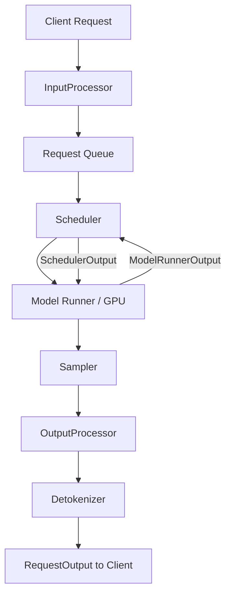

# Engine & Scheduler Internals

This section documents the internal architecture of vLLM's v1 engine and scheduler — the core components responsible for orchestrating inference from request arrival to token delivery.

## Overview

vLLM's v1 engine is a complete redesign of the original engine, built around a clean separation of concerns:

- **Scheduler** — decides which requests to process and how many tokens to compute per step
- **Input Processor** — tokenizes prompts and preprocesses multimodal inputs
- **Output Processor** — computes logprobs, checks stop conditions, and assembles `RequestOutput`
- **Detokenizer** — incrementally converts token IDs to text
- **Sampler** — applies temperature, top-k/p, penalties, and samples the next token

## In This Section

| Page | Description |
|------|-------------|
| [Scheduler Algorithm](scheduler-algorithm.md) | Prefill, decode, chunked prefill, preemption |
| [SchedulerOutput](scheduler-output.md) | Data structures produced by each scheduling step |
| [Request Queue](request-queue.md) | FCFS and priority queue implementations |
| [Input Processor](input-processor.md) | Tokenization and multimodal preprocessing |
| [Output Processor](output-processor.md) | Logprob computation and stop conditions |
| [Detokenizer](detokenizer.md) | Incremental detokenization internals |
| [Sampling](sampling.md) | SamplingParams, top-k/p, temperature, beam search |
| [KV Offloading](kv-offloading.md) | CPU offload for long-context KV caches |
| [Tokenizer Internals](tokenizer-internals.md) | Caching, fast tokenizers, registry |

## Key Source Directories

| Directory | Purpose |
|-----------|---------|
| `vllm/v1/core/sched/` | Scheduler, request queue, output dataclasses |
| `vllm/v1/engine/` | Input/output processors, detokenizer, engine core |
| `vllm/v1/sample/` | Sampler, top-k/p ops, logprobs |
| `vllm/v1/kv_offload/` | CPU KV offloading infrastructure |
| `vllm/tokenizers/` | Tokenizer registry, caching, HF integration |

## Cross-References

- [Architecture Overview](../03-architecture/README.md) — full V1 engine architecture including ZMQ IPC
- [SchedulerConfig](../06-configuration/scheduler-config.md) — scheduler configuration options
- [CacheConfig](../06-configuration/cache-config.md) — KV cache configuration
- [Speculative Decoding](../10-speculative-decoding/README.md) — how speculative decoding integrates with the scheduler
- [Distributed Inference](../07-distributed/README.md) — distributed execution from the scheduler's perspective
- [Observability: Metrics](../11-observability/metrics.md) — scheduler-level Prometheus metrics
