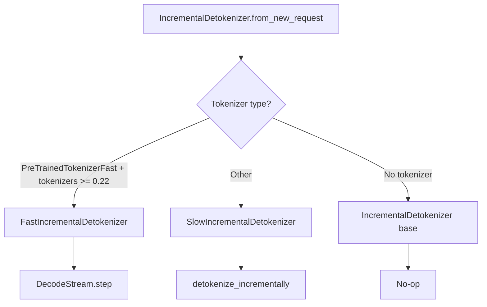

# Detokenizer

The detokenizer converts token IDs back into human-readable text incrementally, one token at a time, without re-decoding the entire sequence on each step. vLLM v1 provides two implementations: a fast path using the `tokenizers` library's native `DecodeStream`, and a slower Python-based fallback.

**Source**: `vllm/v1/engine/detokenizer.py`

## Architecture



## Base Class: IncrementalDetokenizer

The base class provides a no-op implementation used when detokenization is disabled (`detokenize=False` in `SamplingParams`):

```python
class IncrementalDetokenizer:
    def __init__(self):
        self.token_ids: list[int] = []

    def update(self, new_token_ids: list[int], stop_terminated: bool) -> str | None:
        self.token_ids.extend(new_token_ids)
        return None  # No stop string detection

    def get_next_output_text(self, finished: bool, delta: bool) -> str:
        return ""  # No text output
```

### Factory Method

The appropriate detokenizer is selected at request creation time:

```python
@classmethod
def from_new_request(
    cls,
    tokenizer: TokenizerLike | None,
    request: EngineCoreRequest,
) -> "IncrementalDetokenizer":
    if tokenizer is None:
        return IncrementalDetokenizer()  # No-op

    if USE_FAST_DETOKENIZER and isinstance(tokenizer, PreTrainedTokenizerFast):
        return FastIncrementalDetokenizer(tokenizer, request)

    return SlowIncrementalDetokenizer(tokenizer, request)
```

The fast path requires `tokenizers >= 0.22.0`:

```python
USE_FAST_DETOKENIZER = version.parse(tokenizers.__version__) >= version.parse("0.22.0")
```

## BaseIncrementalDetokenizer

Both `FastIncrementalDetokenizer` and `SlowIncrementalDetokenizer` extend `BaseIncrementalDetokenizer`, which handles stop string detection and output buffering:

```python
class BaseIncrementalDetokenizer(IncrementalDetokenizer, ABC):
    def __init__(self, request: EngineCoreRequest):
        super().__init__()
        params = request.sampling_params

        # Stop strings
        self.stop = params.stop or []
        self.min_tokens = params.min_tokens
        self.include_stop_str_in_output = params.include_stop_str_in_output

        # Buffer to hold back text when stop strings should be excluded
        if self.stop and not self.include_stop_str_in_output:
            self.stop_buffer_length = max(len(s) for s in self.stop) - 1
        else:
            self.stop_buffer_length = 0

        self._last_output_text_offset: int = 0
        self.output_text = ""
```

### The `update()` Method

The core incremental update logic:

```python
def update(self, new_token_ids: list[int], stop_terminated: bool) -> str | None:
    if not new_token_ids:
        return None

    # If stop-terminated and stop string should be excluded, skip last token
    if stop_terminated and not self.include_stop_str_in_output:
        skipped_stop_token_id = new_token_ids[-1]
        new_token_ids = new_token_ids[:-1]
    else:
        skipped_stop_token_id = None

    # Decode each new token incrementally
    stop_check_offset = len(self.output_text)
    for new_token_id in new_token_ids:
        self.token_ids.append(new_token_id)
        self.output_text += self.decode_next(new_token_id)
        # Respect min_tokens for stop checking
        if self.min_tokens and self.num_output_tokens() <= self.min_tokens:
            stop_check_offset = len(self.output_text)

    if skipped_stop_token_id is not None:
        self.token_ids.append(skipped_stop_token_id)

    # Check for stop strings
    if self.stop and self.num_output_tokens() > self.min_tokens:
        stop = check_stop_strings(
            output_text=self.output_text,
            new_char_count=len(self.output_text) - stop_check_offset,
            stop=self.stop,
            include_in_output=self.include_stop_str_in_output,
        )
        if stop is not None:
            stop_string, truncate_to = stop
            if truncate_to != -1:
                self.output_text = self.output_text[:truncate_to]
            return stop_string

    return None
```

### Output Text Buffering

To avoid prematurely streaming text that might be part of a stop string, the detokenizer holds back `stop_buffer_length` characters:

```python
def get_next_output_text(self, finished: bool, delta: bool) -> str:
    buffer_length = 0 if finished else self.stop_buffer_length
    if not delta:
        if not buffer_length:
            return self.output_text
        return self.output_text[:-buffer_length]

    length = len(self.output_text) - buffer_length
    last_offset = self._last_output_text_offset
    if last_offset < length:
        self._last_output_text_offset = length
        return self.output_text[last_offset:length]
    return ""
```

For example, if the stop string is `"END"` (3 chars), the detokenizer holds back 2 characters (`stop_buffer_length = 2`) to ensure it can detect the stop string before streaming it.

## FastIncrementalDetokenizer

Uses the `tokenizers` library's `DecodeStream` for efficient incremental decoding:

```python
class FastIncrementalDetokenizer(BaseIncrementalDetokenizer):
    def __init__(self, tokenizer: PreTrainedTokenizerFast, request: EngineCoreRequest):
        super().__init__(request)
        self.tokenizer: Tokenizer = tokenizer._tokenizer

        # Prime the decode stream with prompt tokens for context
        self.stream = DecodeStream(
            ids=request.prompt_token_ids,
            skip_special_tokens=self.skip_special_tokens,
        )
```

The `DecodeStream` is initialized with the prompt token IDs so it has the full context needed for correct byte-pair decoding at the boundary between prompt and output.

### Decoding Each Token

```python
def decode_next(self, next_token_id: int) -> str:
    token = self._protected_step(next_token_id)

    if not self.spaces_between_special_tokens:
        special_token = self.added_token_ids.get(next_token_id)
        is_special = special_token is not None
        if is_special and self.last_special:
            token = special_token  # Return raw token without prefixed spaces
        self.last_special = is_special

    return token or ""
```

### Error Recovery

The fast detokenizer handles two known edge cases:

1. **Overflow/TypeError**: Rare overflow in the tokenizers library, logged and skipped
2. **Invalid prefix**: Non-monotonic UTF-8 output that breaks `DecodeStream` internal state — the stream is reset and decoding continues

```python
def _protected_step(self, next_token_id: int) -> str | None:
    try:
        return self.stream.step(self.tokenizer, next_token_id)
    except (OverflowError, TypeError):
        logger.exception("Encountered invalid token id: %r", next_token_id)
        return None
    except Exception as e:
        if not str(e).startswith(INVALID_PREFIX_ERR_MSG):
            raise e
        # Reset stream and retry
        logger.warning("Encountered invalid prefix detokenization error...")
        self.stream = DecodeStream(skip_special_tokens=self.skip_special_tokens)
        return self.stream.step(self.tokenizer, next_token_id)
```

## SlowIncrementalDetokenizer

The fallback implementation uses `detokenize_incrementally()` from `vllm/tokenizers/detokenizer_utils.py`:

```python
class SlowIncrementalDetokenizer(BaseIncrementalDetokenizer):
    def __init__(self, tokenizer: TokenizerLike, request: EngineCoreRequest):
        super().__init__(request)
        self.tokenizer = tokenizer

        # Initialize with prompt tokens for context
        if request.prompt_token_ids is not None:
            self.tokens, self.prefix_offset, self.read_offset = (
                convert_prompt_ids_to_tokens(
                    tokenizer=tokenizer,
                    prompt_ids=request.prompt_token_ids,
                    skip_special_tokens=params.skip_special_tokens,
                )
            )
```

### Incremental Decoding Algorithm

The slow path uses a sliding window approach to decode tokens correctly:

```python
def decode_next(self, next_token_id: int) -> str:
    new_tokens, decoded_text, prefix_offset, read_offset = detokenize_incrementally(
        tokenizer=self.tokenizer,
        all_input_ids=self.token_ids,
        prev_tokens=self.tokens,
        prefix_offset=self.prefix_offset,
        read_offset=self.read_offset,
        skip_special_tokens=self.skip_special_tokens,
        spaces_between_special_tokens=self.spaces_between_special_tokens,
    )
    self.tokens.extend(new_tokens)
    self.prefix_offset = prefix_offset
    self.read_offset = read_offset
    return decoded_text
```

The `prefix_offset` and `read_offset` track the sliding window position to handle multi-token characters (e.g., UTF-8 sequences that span multiple tokens).

## Stop String Detection

The `check_stop_strings()` function efficiently searches for stop strings in newly generated text:

```python
def check_stop_strings(
    output_text: str,
    new_char_count: int,
    stop: list[str],
    include_in_output: bool,
) -> tuple[str, int] | None:
    if not new_char_count or not stop:
        return None

    for stop_str in stop:
        stop_string_len = len(stop_str)
        # Only search the newly generated portion (plus overlap)
        stop_index = output_text.find(
            stop_str, 1 - new_char_count - stop_string_len
        )
        if stop_index == -1:
            continue

        if include_in_output:
            stop_index += stop_string_len
            if stop_index >= len(output_text):
                return stop_str, -1  # No truncation needed
        return stop_str, stop_index
    return None
```

The search starts at `1 - new_char_count - stop_string_len` to avoid re-searching already-checked text while still catching stop strings that span the boundary between old and new text.

## Performance Comparison

| Feature | FastIncrementalDetokenizer | SlowIncrementalDetokenizer |
|---------|---------------------------|---------------------------|
| Backend | `tokenizers` DecodeStream | Python `detokenize_incrementally` |
| Requires | `tokenizers >= 0.22.0` + `PreTrainedTokenizerFast` | Any `TokenizerLike` |
| Speed | ~3-5x faster | Baseline |
| UTF-8 handling | Native | Sliding window |
| Error recovery | Stream reset | N/A |

## Related Pages

- [Output Processor](output-processor.md) — how the detokenizer is used in output processing
- [Tokenizer Internals](tokenizer-internals.md) — tokenizer loading and caching
- [Sampling](sampling.md) — how tokens are generated before detokenization
