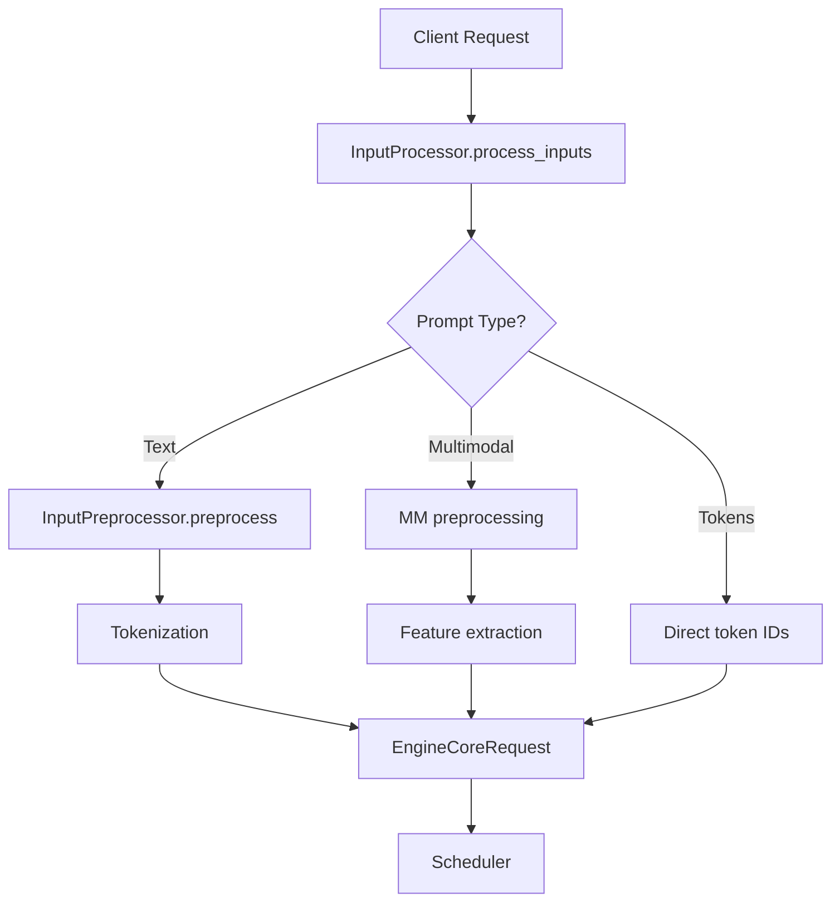

# Input Processor

The `InputProcessor` (`vllm/v1/engine/input_processor.py`) is the front door for all incoming requests. It validates parameters, tokenizes prompts, preprocesses multimodal inputs, and constructs `EngineCoreRequest` objects that the scheduler can consume.

## Architecture



## InputProcessor Class

```python
class InputProcessor:
    def __init__(
        self,
        vllm_config: VllmConfig,
        renderer: BaseRenderer | None = None,
        *,
        mm_registry: MultiModalRegistry = MULTIMODAL_REGISTRY,
    ) -> None:
```

The `InputProcessor` is initialized once per engine and holds references to:

- `input_preprocessor` — handles tokenization and multimodal preprocessing
- `renderer` — converts chat templates and structured prompts to raw text
- `mm_registry` — multimodal registry for feature extraction
- Configuration objects (`model_config`, `scheduler_config`, etc.)

## The `process_inputs()` Method

The primary entry point for processing a new request:

```python
def process_inputs(
    self,
    request_id: str,
    prompt: PromptType | ProcessorInputs,
    params: SamplingParams | PoolingParams,
    supported_tasks: tuple[SupportedTask, ...],
    arrival_time: float | None = None,
    lora_request: LoRARequest | None = None,
    tokenization_kwargs: dict[str, Any] | None = None,
    trace_headers: Mapping[str, str] | None = None,
    priority: int = 0,
    data_parallel_rank: int | None = None,
    resumable: bool = False,
) -> EngineCoreRequest:
```

### Processing Steps

1. **Parameter validation** — checks `SamplingParams` or `PoolingParams` against model capabilities
2. **LoRA validation** — verifies LoRA is enabled if a LoRA request is provided
3. **Request ID assignment** — appends 8 random characters to ensure uniqueness
4. **Prompt preprocessing** — tokenizes text or processes multimodal inputs
5. **Prompt length validation** — checks against `max_model_len`
6. **EngineCoreRequest construction** — assembles the final request object

## Parameter Validation

```python
def _validate_params(
    self,
    params: SamplingParams | PoolingParams,
    supported_tasks: tuple[SupportedTask, ...],
) -> None:
    if isinstance(params, SamplingParams):
        supported_generation_tasks = [
            task for task in supported_tasks if task in GENERATION_TASKS
        ]
        if not supported_generation_tasks:
            raise ValueError("This model does not support generation")
        params.verify(
            self.model_config,
            self.speculative_config,
            self.structured_outputs_config,
            self.tokenizer,
        )
    elif isinstance(params, PoolingParams):
        ...
```

`SamplingParams.verify()` checks:
- Temperature, top-p, top-k ranges
- Beam search compatibility
- Structured output backend availability
- Speculative decoding compatibility

## Tokenization

Tokenization is delegated to `InputPreprocessor`, which wraps the HuggingFace tokenizer:

```python
self.input_preprocessor = InputPreprocessor(
    vllm_config,
    renderer=renderer,
    mm_registry=mm_registry,
)
```

The preprocessor handles:
- **Text prompts**: Tokenized using the model's tokenizer
- **Token ID prompts**: Passed through directly (no tokenization needed)
- **Embedding prompts**: Stored as tensors, bypassing tokenization
- **Chat templates**: Rendered via the `renderer` before tokenization

### Truncation Side

The tokenizer's truncation side is set based on the runner type:

```python
if runner_type == "generate" or runner_type == "draft":
    kwargs["truncation_side"] = "left"   # Keep the end of long prompts
elif runner_type == "pooling":
    kwargs["truncation_side"] = "right"  # Keep the beginning
```

## Multimodal Preprocessing

For multimodal models, the input processor extracts features from images, audio, and video:

```python
self.supports_mm_inputs = mm_registry.supports_multimodal_inputs(model_config)
if self.supports_mm_inputs:
    mm_budget = MultiModalBudget(vllm_config, mm_registry)
    self.mm_encoder_cache_size = mm_budget.encoder_cache_size
```

### Encoder Cache Size Validation

Each multimodal item is validated against the encoder cache size:

```python
for modality, mm_positions in decoder_mm_positions.items():
    for mm_position in mm_positions:
        embed_length = mm_position.get_num_embeds()
        if embed_length > self.mm_encoder_cache_size:
            raise ValueError(
                f"The {prompt_type} prompt contains a(n) {modality} item "
                f"with length {embed_length}, which exceeds the "
                f"pre-allocated encoder cache size "
                f"{self.mm_encoder_cache_size}. Please reduce the input "
                f"size or increase the encoder cache size "
                f"by setting --limit-mm-per-prompt at startup."
            )
```

### Multimodal Position Sorting

Multimodal items are sorted by their position in the prompt to ensure correct ordering:

```python
from vllm.multimodal.utils import argsort_mm_positions
```

## Request ID Uniqueness

To prevent duplicate request ID collisions in multi-client deployments, the input processor appends 8 random characters to each request ID:

```python
@staticmethod
def assign_request_id(request: EngineCoreRequest):
    request.external_req_id = request.request_id
    if not envs.VLLM_DISABLE_REQUEST_ID_RANDOMIZATION:
        request.request_id = f"{request.external_req_id}-{random_uuid():.8}"
```

The original client-provided ID is preserved as `external_req_id` for response correlation.

## Encoder-Decoder Models

For encoder-decoder models (e.g., BART, T5), the input processor splits the prompt into encoder and decoder inputs:

```python
from vllm.inputs.parse import split_enc_dec_inputs

encoder_inputs, decoder_inputs = split_enc_dec_inputs(prompt_inputs)
```

Both encoder and decoder inputs are validated separately.

## Prompt Length Validation

```python
def _validate_prompt_len(self, prompt_len: int, prompt_type: str) -> None:
    if not self.skip_prompt_length_check:
        if prompt_len > self.model_config.max_model_len:
            raise ValueError(
                f"This model's maximum context length is "
                f"{self.model_config.max_model_len} tokens. "
                f"However, you requested {prompt_len} tokens "
                f"({prompt_type} prompt)."
            )
```

Multimodal models may skip this check (`skip_prompt_length_check = True`) when the effective prompt length depends on the encoder output size.

## Vocabulary Validation

Token IDs are validated against the model's vocabulary:

```python
max_input_id = max(prompt_ids, default=0)
model_vocab_size = model_config.get_vocab_size()
if max_input_id > max(tokenizer.max_token_id, model_vocab_size - 1):
    raise ValueError(f"Token id {max_input_id} is out of vocabulary")
```

> **Note**: The check uses `max(tokenizer.max_token_id, model_vocab_size - 1)` to handle models like Qwen3 where the language model has extra tokens not in the tokenizer vocabulary.

## EngineCoreRequest

The output of `process_inputs()` is an `EngineCoreRequest`:

```python
@dataclass
class EngineCoreRequest:
    request_id: str
    external_req_id: str | None
    prompt_token_ids: list[int] | None
    prompt_embeds: torch.Tensor | None
    mm_features: list[MultiModalFeatureSpec]
    sampling_params: SamplingParams | None
    pooling_params: PoolingParams | None
    arrival_time: float
    lora_request: LoRARequest | None
    cache_salt: str | None
    priority: int
    trace_headers: Mapping[str, str] | None
    resumable: bool
    reasoning_ended: bool | None
    client_index: int
    data_parallel_rank: int | None
```

This object is serialized and sent to the engine core process (in multi-process deployments) or used directly (in single-process mode).

## Related Pages

- [Output Processor](output-processor.md) — processing model outputs
- [Tokenizer Internals](tokenizer-internals.md) — tokenizer caching and fast tokenizers
- [Multimodal Support](../10-multimodal/README.md) — multimodal input handling
