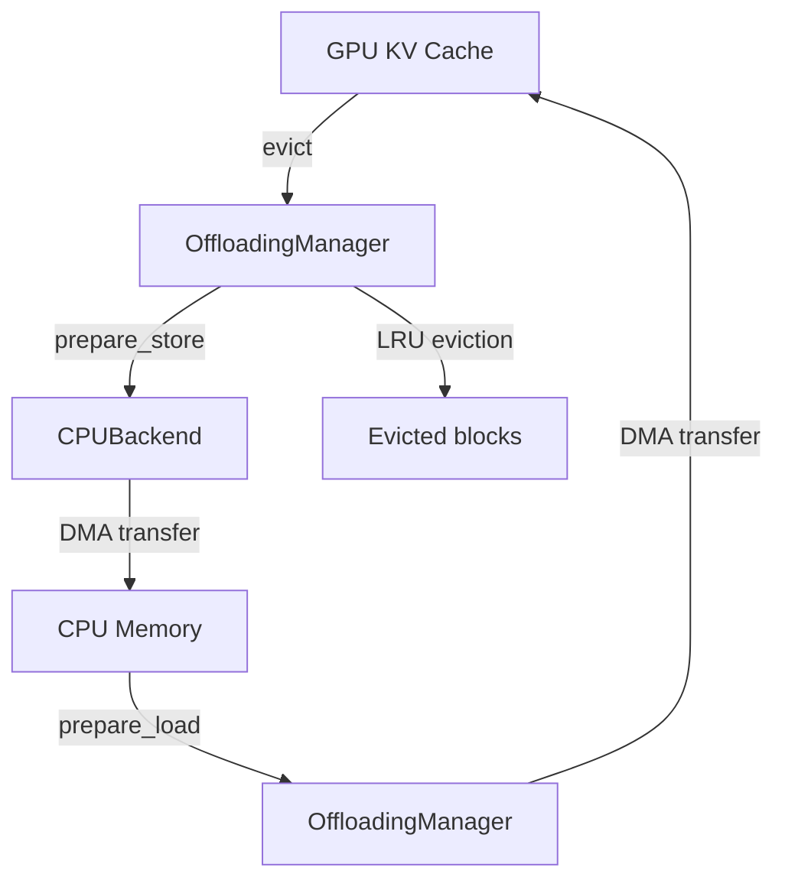

# KV Offloading

KV offloading extends the effective KV cache capacity by spilling GPU KV blocks to CPU memory (or other storage media). This enables serving long-context requests that would otherwise exceed GPU memory limits.

**Source**: `vllm/v1/kv_offload/`

## Overview



The KV offloading system operates at the block level. Each block contains the KV tensors for `block_size` tokens. When the GPU KV cache is full, the least-recently-used blocks are offloaded to CPU memory. When a request needs those blocks again, they are loaded back to GPU.

## Core Abstractions

### OffloadingManager

`OffloadingManager` (`vllm/v1/kv_offload/abstract.py`) is the scheduler-side interface for managing offloaded blocks:

```python
class OffloadingManager(ABC):
    @abstractmethod
    def lookup(self, block_hashes: Iterable[BlockHash]) -> int | None:
        """Find how many consecutive blocks (from the start) are offloaded.
        Returns None if the lookup should be retried later."""

    @abstractmethod
    def prepare_load(self, block_hashes: Iterable[BlockHash]) -> LoadStoreSpec:
        """Prepare blocks for reading. Protects them from eviction."""

    def touch(self, block_hashes: Iterable[BlockHash]):
        """Mark blocks as recently used (update LRU position)."""

    def complete_load(self, block_hashes: Iterable[BlockHash]):
        """Mark blocks as done loading (re-allow eviction)."""

    @abstractmethod
    def prepare_store(
        self, block_hashes: Iterable[BlockHash]
    ) -> PrepareStoreOutput | None:
        """Prepare blocks for writing. Returns None if cannot store."""

    def complete_store(self, block_hashes: Iterable[BlockHash], success: bool = True):
        """Mark blocks as stored. Makes them loadable."""

    def take_events(self) -> Iterable[OffloadingEvent]:
        """Yield new offloading events since last call."""
```

### LoadStoreSpec

`LoadStoreSpec` is an abstract metadata object that encapsulates how a worker should read or write KV blocks:

```python
class LoadStoreSpec(ABC):
    @staticmethod
    @abstractmethod
    def medium() -> str:
        """Returns the storage medium type ('CPU', 'GPU', etc.)."""
```

Concrete implementations:

```python
class CPULoadStoreSpec(BlockIDsLoadStoreSpec):
    @staticmethod
    def medium() -> str:
        return "CPU"

class GPULoadStoreSpec(BlockIDsLoadStoreSpec):
    @staticmethod
    def medium() -> str:
        return "GPU"
```

Both carry a `block_ids` numpy array identifying which physical blocks to read/write.

### PrepareStoreOutput

```python
@dataclass
class PrepareStoreOutput:
    block_hashes_to_store: list[BlockHash]  # Blocks that need writing
    store_spec: LoadStoreSpec               # Where/how to write them
    block_hashes_evicted: list[BlockHash]   # Blocks evicted to make room
```

## LRU Eviction Policy

`LRUOffloadingManager` (`vllm/v1/kv_offload/lru_manager.py`) implements LRU eviction using an `OrderedDict`:

```python
class LRUOffloadingManager(OffloadingManager):
    def __init__(self, backend: Backend, enable_events: bool = False):
        self.backend: Backend = backend
        # block_hash -> BlockStatus (ordered by recency)
        self.blocks: OrderedDict[BlockHash, BlockStatus] = OrderedDict()
```

### Lookup

```python
def lookup(self, block_hashes: Iterable[BlockHash]) -> int | None:
    hit_count = 0
    for block_hash in block_hashes:
        block = self.blocks.get(block_hash)
        if block is None or not block.is_ready:
            break
        hit_count += 1
    return hit_count
```

Returns the number of consecutive blocks (from the start) that are offloaded and ready to load.

### Store with Eviction

```python
def prepare_store(
    self, block_hashes: Iterable[BlockHash]
) -> PrepareStoreOutput | None:
    block_hashes_list = list(block_hashes)

    # Filter out already-stored blocks
    block_hashes_to_store = [
        bh for bh in block_hashes_list if bh not in self.blocks
    ]

    # Evict LRU blocks to make room
    num_blocks_to_evict = (
        len(block_hashes_to_store) - self.backend.get_num_free_blocks()
    )
    # ... evict oldest blocks from self.blocks ...
```

## ARC Eviction Policy

`ARCOffloadingManager` (`vllm/v1/kv_offload/arc_manager.py`) implements the Adaptive Replacement Cache (ARC) algorithm, which adapts between recency-based and frequency-based eviction:

```python
class ARCOffloadingManager(OffloadingManager):
    """
    ARC maintains four lists:
    - T1: Recently accessed once
    - T2: Frequently accessed (accessed 2+ times)
    - B1: Ghost entries for recently evicted T1 blocks
    - B2: Ghost entries for recently evicted T2 blocks
    """
```

ARC is particularly effective for workloads with mixed access patterns (some blocks accessed once, others repeatedly).

## CPU Backend

`CPUBackend` (`vllm/v1/kv_offload/backends/cpu.py`) manages a pool of pinned CPU memory blocks:

```python
class CPUBackend(Backend):
    def __init__(self, block_size: int, num_blocks: int):
        self.block_size = block_size
        self.medium = "CPU"
        # Allocate pinned memory pool
        ...

    def get_num_free_blocks(self) -> int:
        """Returns available CPU blocks."""

    def allocate_blocks(self, block_hashes: list[BlockHash]) -> list[BlockStatus]:
        """Allocate CPU memory for blocks."""

    def free(self, block: BlockStatus):
        """Return block to the free pool."""
```

Pinned (page-locked) CPU memory enables fast DMA transfers between CPU and GPU.

## CPU Offloading Configuration

CPU offloading is configured via `CPUOffloadingSpec` (`vllm/v1/kv_offload/cpu.py`):

```python
class CPUOffloadingSpec(OffloadingSpec):
    def __init__(self, vllm_config: VllmConfig, kv_cache_config: KVCacheConfig):
        cpu_bytes_to_use = self.extra_config.get("cpu_bytes_to_use")
        if not cpu_bytes_to_use:
            raise Exception(
                "cpu_bytes_to_use must be specified in kv_connector_extra_config"
            )
        # Calculate number of blocks from byte budget
        self.num_blocks = int(cpu_bytes_to_use) // kv_bytes_per_offloaded_block

        self.eviction_policy: str = self.extra_config.get("eviction_policy", "lru")
```

### Enabling CPU Offloading

CPU offloading is enabled via the KV transfer config:

```bash
vllm serve meta-llama/Llama-3.1-8B-Instruct \
  --kv-transfer-config '{"kv_connector": "cpu_offload", "kv_connector_extra_config": {"cpu_bytes_to_use": 10737418240, "eviction_policy": "lru"}}'
```

The `cpu_bytes_to_use` parameter specifies how many bytes of CPU memory to use for the offload pool (10 GB in the example above).

## Worker-Side Offloading

The worker side handles the actual DMA transfers between GPU and CPU:

```python
class CpuGpuOffloadingHandlers(OffloadingHandler):
    """Handles CPU-GPU KV block transfers on the worker side."""

    def handle_load(self, load_spec: CPULoadStoreSpec) -> None:
        """Copy KV blocks from CPU to GPU."""

    def handle_store(self, store_spec: CPULoadStoreSpec) -> None:
        """Copy KV blocks from GPU to CPU."""
```

Transfers are performed asynchronously using CUDA streams to overlap computation and data movement.

## Block Status

`BlockStatus` tracks the state of each offloaded block:

```python
class BlockStatus(ctypes.Structure):
    _fields_ = [("ref_cnt", ctypes.c_int32)]

    def __init__(self):
        super().__init__()
        self.ref_cnt = -1  # -1 = not ready (being written)

    @property
    def is_ready(self) -> bool:
        return self.ref_cnt >= 0  # 0+ = ready to read
```

- `ref_cnt = -1`: Block is being written (not yet readable)
- `ref_cnt = 0`: Block is ready and not being read
- `ref_cnt > 0`: Block is being read by `ref_cnt` concurrent transfers

## Offloading Events

The offloading manager can emit events for monitoring:

```python
@dataclass
class OffloadingEvent:
    block_hashes: list[BlockHash]
    block_size: int
    medium: str
    removed: bool  # True = evicted, False = stored
```

Events are consumed by the KV events system for observability.

## Integration with Scheduler

The scheduler integrates with the offloading manager through the KV connector interface. When a request's blocks are found in the offload cache:

1. `lookup()` returns the number of offloaded blocks
2. `prepare_load()` marks them as in-use and returns a `LoadStoreSpec`
3. The scheduler sets the request to `WAITING_FOR_REMOTE_KVS` status
4. The worker loads the blocks from CPU to GPU
5. `complete_load()` releases the blocks for potential eviction

## Performance Considerations

| Factor | Impact |
|--------|--------|
| CPU memory size | More offload capacity = fewer recomputes |
| PCIe bandwidth | Limits load/store throughput |
| Block size | Larger blocks = fewer transfers but more waste |
| Eviction policy | LRU vs ARC depends on access pattern |
| Pinned memory | Required for fast DMA transfers |

> **Tip**: Use `cpu_bytes_to_use` to allocate as much CPU memory as available without impacting the OS. A typical starting point is 50-80% of available CPU RAM.

## Related Pages

- [Scheduler Algorithm](scheduler-algorithm.md) — how the scheduler interacts with offloading
- [KV Transfer](../07-distributed/kv-transfer.md) — P/D disaggregation KV transfer
- [Cache Configuration](../06-configuration/cache-config.md) — KV cache configuration
