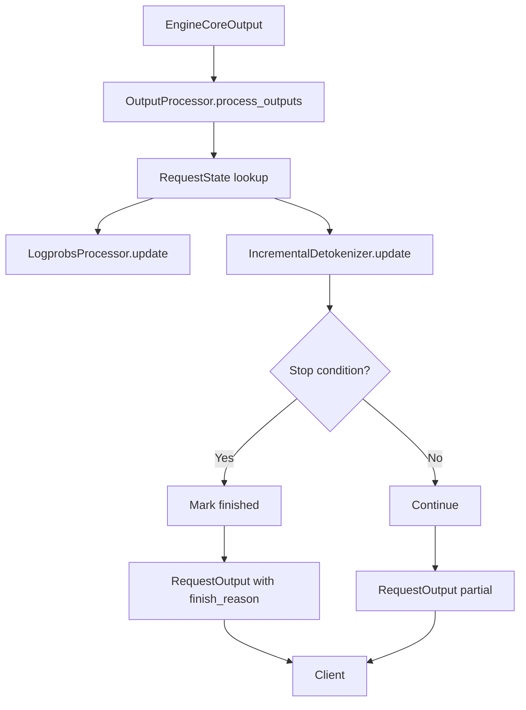

# Output Processor

The `OutputProcessor` (`vllm/v1/engine/output_processor.py`) bridges the engine core and the client-facing API. It receives raw token IDs from the model runner, computes logprobs, checks stop conditions, runs incremental detokenization, and assembles `RequestOutput` objects for delivery to clients.

## Architecture



## RequestState

Each active request is tracked by a `RequestState` object that accumulates output tokens, manages detokenization, and tracks statistics:

```python
class RequestState:
    def __init__(
        self,
        request_id: str,
        external_req_id: str,
        parent_req: ParentRequest | None,
        request_index: int,
        lora_request: LoRARequest | None,
        output_kind: RequestOutputKind,
        prompt: str | None,
        prompt_token_ids: list[int] | None,
        prompt_embeds: torch.Tensor | None,
        logprobs_processor: LogprobsProcessor | None,
        detokenizer: IncrementalDetokenizer | None,
        max_tokens_param: int | None,
        arrival_time: float,
        queue: RequestOutputCollector | None,
        log_stats: bool,
        stream_interval: int,
        top_p: float | None = None,
        n: int | None = None,
        temperature: float | None = None,
        stream_input: bool = False,
    ):
```

### Key Fields

| Field | Description |
|-------|-------------|
| `logprobs_processor` | Accumulates logprob data from engine core |
| `detokenizer` | Incremental detokenizer instance |
| `output_kind` | `CUMULATIVE`, `DELTA`, or `FINAL_ONLY` |
| `is_prefilling` | True until first output token is generated |
| `stream_interval` | Emit output every N tokens (for streaming) |
| `sent_tokens_offset` | Tracks how many tokens have been sent |

## Output Kinds

The `RequestOutputKind` enum controls how outputs are streamed:

```python
class RequestOutputKind(Enum):
    CUMULATIVE = 0   # Return full output so far in every RequestOutput
    DELTA = 1        # Return only new text since last RequestOutput
    FINAL_ONLY = 2   # Do not return intermediate outputs
```

`DELTA` mode is the most efficient for streaming, as it avoids re-sending the entire output text on every token.

## Stop Condition Checking

Stop conditions are evaluated in `check_stop()` (`vllm/v1/core/sched/utils.py`):

```python
def check_stop(request: Request, max_model_len: int) -> bool:
    sampling_params = request.sampling_params

    # 1. Respect min_tokens
    if request.num_output_tokens < sampling_params.min_tokens:
        return False

    # 2. EOS token
    last_token_id = request.output_token_ids[-1]
    if last_token_id == sampling_params.eos_token_id:
        request.status = RequestStatus.FINISHED_STOPPED
        return True

    # 3. Stop token IDs
    if last_token_id in (sampling_params.stop_token_ids or ()):
        request.status = RequestStatus.FINISHED_STOPPED
        request.stop_reason = last_token_id
        return True

    # 4. Length cap
    if (
        request.num_tokens >= max_model_len
        or request.num_output_tokens >= request.max_tokens
    ):
        request.status = RequestStatus.FINISHED_LENGTH_CAPPED
        return True

    # 5. Repetition detection
    if repetition_detection is not None and check_sequence_repetition(...):
        request.status = RequestStatus.FINISHED_REPETITION
        request.stop_reason = "repetition_detected"
        return True

    return False
```

### Stop String Detection

Stop strings are checked in the detokenizer after each token is decoded. The `check_stop_strings()` function searches for stop strings in the newly generated text:

```python
def check_stop_strings(
    output_text: str,
    new_char_count: int,
    stop: list[str],
    include_in_output: bool,
) -> tuple[str, int] | None:
    for stop_str in stop:
        stop_index = output_text.find(stop_str, 1 - new_char_count - len(stop_str))
        if stop_index == -1:
            continue
        if include_in_output:
            stop_index += len(stop_str)
            if stop_index >= len(output_text):
                return stop_str, -1  # No truncation needed
        return stop_str, stop_index  # Truncate at this position
    return None
```

### Repetition Detection

The scheduler can detect repetitive N-gram patterns and terminate generation early:

```python
@dataclass
class RepetitionDetectionParams:
    max_pattern_size: int = 0   # Maximum N-gram size to check
    min_pattern_size: int = 0   # Minimum N-gram size to check
    min_count: int = 0          # Minimum repetitions to trigger
```

Example: `RepetitionDetectionParams(max_pattern_size=5, min_count=3)` detects any 1-5 token pattern repeated 3+ times.

## Logprob Computation

`LogprobsProcessor` (`vllm/v1/engine/logprobs.py`) accumulates logprob data from the engine core:

```python
@dataclass
class LogprobsProcessor:
    tokenizer: TokenizerLike | None
    logprobs: SampleLogprobs | None
    prompt_logprobs: PromptLogprobs | None
    cumulative_logprob: float | None
    num_logprobs: int | None
    num_prompt_logprobs: int | None
```

### Logprob Modes

The sampler supports three logprob modes (configured via `LogprobsMode`):

| Mode | Description |
|------|-------------|
| `raw_logprobs` | Log-softmax of raw logits (default) |
| `raw_logits` | Raw logits before softmax |
| `processed_logprobs` | Log-softmax after penalties/temperature |
| `processed_logits` | Logits after penalties/temperature |

### Flat Logprobs

For high-throughput scenarios, `flat_logprobs=True` in `SamplingParams` returns logprobs in a flattened format with significantly lower GC overhead:

```python
flat_logprobs: bool = False
"""Whether to return logprobs in flatten format (i.e. FlatLogprob)
for better performance."""
```

## RequestOutputCollector

For async streaming, each request has a `RequestOutputCollector` that buffers outputs between the producer (engine) and consumer (client coroutine):

```python
class RequestOutputCollector:
    def __init__(self, output_kind: RequestOutputKind, request_id: str):
        self.aggregate = output_kind == RequestOutputKind.DELTA
        self.output: RequestOutput | PoolingRequestOutput | Exception | None = None
        self.ready = asyncio.Event()

    def put(self, output: ...) -> None:
        """Non-blocking put. Merges delta outputs if producer is ahead."""
        if self.output is None or isinstance(output, Exception):
            self.output = output
            self.ready.set()
        elif isinstance(self.output, RequestOutput) and isinstance(output, RequestOutput):
            self.output.add(output, aggregate=self.aggregate)

    async def get(self) -> RequestOutput | PoolingRequestOutput:
        """Blocking get. Waits for output to be available."""
        while (output := self.output) is None:
            await self.ready.wait()
        self.output = None
        self.ready.clear()
        if isinstance(output, Exception):
            raise output
        return output
```

When the producer gets ahead of the consumer in `DELTA` mode, outputs are merged rather than dropped, ensuring no tokens are lost.

## Stream Interval

The `stream_interval` parameter controls how frequently outputs are emitted during streaming:

```python
if self.stream_interval > 1:
    # Only emit output every stream_interval tokens
    if (self.sent_tokens_offset + self.stream_interval
            <= detokenizer.num_output_tokens()):
        # Emit output
        self.sent_tokens_offset += self.stream_interval
```

This reduces the overhead of frequent output delivery for high-throughput scenarios.

## Streaming Input (Resumable Requests)

For streaming input scenarios, `RequestState` supports incremental prompt updates:

```python
def apply_streaming_update(self, update: StreamingUpdate) -> None:
    self.streaming_input = not update.final
    if update.prompt:
        self.prompt = (self.prompt + update.prompt) if self.prompt else update.prompt
    if self.prompt_token_ids:
        self.prompt_token_ids.extend(update.prompt_token_ids or ())
    self.prompt_len = len(self.prompt_token_ids)
    self.is_prefilling = True
```

## Finish Reasons

When a request completes, the finish reason is mapped from `RequestStatus`:

```python
_FINISHED_REASON_MAP = {
    RequestStatus.FINISHED_STOPPED: FinishReason.STOP,
    RequestStatus.FINISHED_LENGTH_CAPPED: FinishReason.LENGTH,
    RequestStatus.FINISHED_ABORTED: FinishReason.ABORT,
    RequestStatus.FINISHED_IGNORED: FinishReason.LENGTH,
    RequestStatus.FINISHED_ERROR: FinishReason.ERROR,
    RequestStatus.FINISHED_REPETITION: FinishReason.REPETITION,
}
```

These map to the OpenAI API finish reason strings (`stop`, `length`, `abort`, etc.).

## Pooling Outputs

For embedding/pooling models, the output processor handles `PoolingRequestOutput` instead of `RequestOutput`:

```python
# Shared empty CPU tensor used as placeholder pooling output
EMPTY_CPU_TENSOR = torch.empty(0, device="cpu")
```

Pooling outputs contain the embedding vector rather than generated text.

## OpenTelemetry Tracing

The output processor emits OpenTelemetry spans for completed requests:

```python
attributes = {
    SpanAttributes.GEN_AI_LATENCY_TIME_TO_FIRST_TOKEN: ttft,
    SpanAttributes.GEN_AI_LATENCY_TIME_PER_OUTPUT_TOKEN: tpot,
    SpanAttributes.GEN_AI_LATENCY_E2E: e2e_time,
    SpanAttributes.GEN_AI_USAGE_INPUT_TOKENS: num_prompt_tokens,
    SpanAttributes.GEN_AI_USAGE_OUTPUT_TOKENS: num_output_tokens,
    SpanAttributes.GEN_AI_REQUEST_ID: req_state.external_req_id,
}
```

## Related Pages

- [Detokenizer](detokenizer.md) — incremental detokenization details
- [Sampling](sampling.md) — how logprobs are computed during sampling
- [Observability](../11-observability/tracing.md) — OpenTelemetry integration
