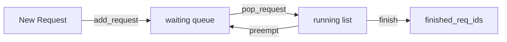

# Request Queue

The request queue manages the ordering of waiting requests before they are promoted to the running state by the scheduler. vLLM v1 supports two scheduling policies: **First-Come-First-Served (FCFS)** and **Priority**.

**Source**: `vllm/v1/core/sched/request_queue.py`

## Scheduling Policies

```python
class SchedulingPolicy(Enum):
    FCFS = "fcfs"
    PRIORITY = "priority"
```

The policy is configured via `SchedulerConfig.policy` and selected at startup:

```python
self.policy = SchedulingPolicy(self.scheduler_config.policy)
self.waiting = create_request_queue(self.policy)
```

## RequestQueue Abstract Interface

All queue implementations share a common abstract interface:

```python
class RequestQueue(ABC):
    @abstractmethod
    def add_request(self, request: Request) -> None:
        """Add a request according to the policy."""

    @abstractmethod
    def pop_request(self) -> Request:
        """Remove and return the next request."""

    @abstractmethod
    def peek_request(self) -> Request:
        """View the next request without removing it."""

    @abstractmethod
    def prepend_request(self, request: Request) -> None:
        """Add a request to the front of the queue."""

    @abstractmethod
    def prepend_requests(self, requests: RequestQueue) -> None:
        """Prepend all requests from another queue."""

    @abstractmethod
    def remove_request(self, request: Request) -> None:
        """Remove a specific request."""

    @abstractmethod
    def remove_requests(self, requests: Iterable[Request]) -> None:
        """Remove multiple specific requests."""
```

## FCFS Queue

`FCFSRequestQueue` extends Python's `deque` to implement first-come-first-served ordering. Requests are appended to the tail and consumed from the head.

```python
class FCFSRequestQueue(deque[Request], RequestQueue):
    def add_request(self, request: Request) -> None:
        self.append(request)  # Add to tail

    def pop_request(self) -> Request:
        return self.popleft()  # Remove from head

    def prepend_request(self, request: Request) -> None:
        self.appendleft(request)  # Add to head (for preempted requests)

    def prepend_requests(self, requests: RequestQueue) -> None:
        self.extendleft(requests)  # Prepend multiple (reversed order)
```

### FCFS Ordering

Under FCFS, requests are processed strictly in arrival order. The `arrival_time` field on each `Request` object records when the request was received:

```python
self.arrival_time = arrival_time if arrival_time is not None else time.time()
```

**Preempted requests** are re-inserted at the **front** of the FCFS queue via `prepend_request()`, giving them priority over newly arriving requests. This prevents starvation of preempted requests.

## Priority Queue

`PriorityRequestQueue` uses a min-heap to order requests by `(priority, arrival_time)`. Lower numeric priority values are processed first; ties are broken by arrival time (earlier = higher priority).

```python
class PriorityRequestQueue(RequestQueue):
    def __init__(self) -> None:
        self._heap: list[Request] = []

    def add_request(self, request: Request) -> None:
        heapq.heappush(self._heap, request)

    def pop_request(self) -> Request:
        return heapq.heappop(self._heap)

    def peek_request(self) -> Request:
        return self._heap[0]
```

### Priority Ordering

The `Request` class implements comparison operators based on `(priority, arrival_time)`:

```python
# Requests with lower priority value are processed first.
# Ties broken by earlier arrival_time.
priority: int = 0  # Default priority
arrival_time: float  # Set at request creation
```

**Preemption with priority scheduling**: When KV cache is full, the scheduler preempts the **lowest-priority** running request (highest `priority` value, latest `arrival_time`):

```python
if self.policy == SchedulingPolicy.PRIORITY:
    preempted_req = max(
        self.running,
        key=lambda r: (r.priority, r.arrival_time),
    )
    self.running.remove(preempted_req)
```

In the priority queue, `prepend_request()` is equivalent to `add_request()` — there is no concept of "front" in a heap, so preempted requests are simply re-inserted by priority.

## Queue Operations Summary

| Operation | FCFS | Priority |
|-----------|------|----------|
| `add_request` | Append to tail | Heap push |
| `pop_request` | Pop from head | Heap pop (min) |
| `peek_request` | View head | View heap[0] |
| `prepend_request` | Append to head | Heap push |
| `remove_request` | Linear scan + remove | Linear scan + heapify |
| `remove_requests` | Filter + rebuild | Filter + heapify |
| Ordering | Arrival time | (priority, arrival_time) |

## Factory Function

```python
def create_request_queue(policy: SchedulingPolicy) -> RequestQueue:
    if policy == SchedulingPolicy.PRIORITY:
        return PriorityRequestQueue()
    elif policy == SchedulingPolicy.FCFS:
        return FCFSRequestQueue()
    else:
        raise ValueError(f"Unknown scheduling policy: {policy}")
```

## Scheduler Queue Architecture

The scheduler maintains two queues:

```python
self.waiting = create_request_queue(self.policy)  # Waiting requests
self.running: list[Request] = []                   # Currently running requests
```

The `running` list is ordered by scheduling time (FCFS within a step). For priority scheduling, preemption selects the lowest-priority running request regardless of position in the list.



## Configuring the Scheduling Policy

Set the scheduling policy via the CLI or `SchedulerConfig`:

```bash
# FCFS (default)
vllm serve meta-llama/Llama-3.1-8B-Instruct --scheduling-policy fcfs

# Priority
vllm serve meta-llama/Llama-3.1-8B-Instruct --scheduling-policy priority
```

When using priority scheduling, set the `priority` field in `SamplingParams`:

```python
from vllm import LLM, SamplingParams

llm = LLM(model="meta-llama/Llama-3.1-8B-Instruct", scheduling_policy="priority")

# Lower priority value = higher priority
high_priority = SamplingParams(temperature=0.8, priority=0)
low_priority = SamplingParams(temperature=0.8, priority=10)
```

> **Note**: Priority scheduling is most useful in multi-tenant deployments where different request classes (e.g., interactive vs. batch) need differentiated service levels.

## Related Pages

- [Scheduler Algorithm](scheduler-algorithm.md) — how the queue feeds into scheduling decisions
- [Configuration Reference](../06-configuration/scheduler-config.md) — scheduler configuration options
