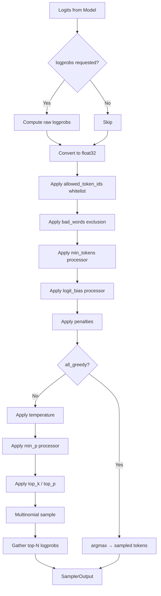

# Sampling

vLLM's v1 sampler (`vllm/v1/sample/sampler.py`) converts model logits into sampled token IDs. It supports greedy decoding, temperature scaling, top-k/top-p filtering, repetition penalties, and logprob computation — all batched across all requests in a single forward pass.

## SamplingParams Reference

`SamplingParams` (`vllm/sampling_params.py`) is the primary user-facing configuration for controlling generation behavior:

```python
class SamplingParams(msgspec.Struct):
    n: int = 1                          # Number of output sequences
    presence_penalty: float = 0.0       # Penalize tokens already present
    frequency_penalty: float = 0.0      # Penalize tokens by frequency
    repetition_penalty: float = 1.0     # Penalize repeated tokens
    temperature: float = 1.0            # Sampling temperature
    top_p: float = 1.0                  # Nucleus sampling threshold
    top_k: int = 0                      # Top-k sampling (0 = disabled)
    min_p: float = 0.0                  # Min probability relative to top token
    seed: int | None = None             # Random seed for reproducibility
    stop: str | list[str] | None = None # Stop strings
    stop_token_ids: list[int] | None = None  # Stop token IDs
    ignore_eos: bool = False            # Ignore EOS token
    max_tokens: int | None = 16         # Maximum output tokens
    min_tokens: int = 0                 # Minimum output tokens
    logprobs: int | None = None         # Number of logprobs to return
    prompt_logprobs: int | None = None  # Prompt logprobs
    flat_logprobs: bool = False         # Flat logprob format
    detokenize: bool = True             # Whether to detokenize output
    skip_special_tokens: bool = True    # Skip special tokens in output
    spaces_between_special_tokens: bool = True
    include_stop_str_in_output: bool = False
    output_kind: RequestOutputKind = RequestOutputKind.CUMULATIVE
    structured_outputs: StructuredOutputsParams | None = None
    logit_bias: dict[int, float] | None = None
    allowed_token_ids: list[int] | None = None
    bad_words: list[str] | None = None
    repetition_detection: RepetitionDetectionParams | None = None
```

### Key Parameters Explained

| Parameter | Range | Description |
|-----------|-------|-------------|
| `temperature` | [0, ∞) | 0 = greedy, 1 = unscaled, >1 = more random |
| `top_p` | (0, 1] | Nucleus sampling: keep tokens summing to top_p probability |
| `top_k` | 0 or positive | Keep only top-k tokens (0 = disabled) |
| `min_p` | [0, 1] | Minimum probability relative to most likely token |
| `presence_penalty` | (-∞, ∞) | >0 discourages repetition, <0 encourages |
| `frequency_penalty` | (-∞, ∞) | Like presence but scales with frequency |
| `repetition_penalty` | (0, ∞) | >1 discourages, <1 encourages repetition |
| `n` | ≥1 | Number of independent output sequences |

## Sampler Architecture



## The Sampler Class

```python
class Sampler(nn.Module):
    def __init__(self, logprobs_mode: LogprobsMode = "raw_logprobs"):
        super().__init__()
        self.topk_topp_sampler = TopKTopPSampler(logprobs_mode)
        self.pin_memory = is_pin_memory_available()
        self.logprobs_mode = logprobs_mode
```

### Forward Pass

```python
def forward(
    self,
    logits: torch.Tensor,
    sampling_metadata: SamplingMetadata,
    predict_bonus_token: bool = False,
    logprobs_mode_override: LogprobsMode | None = None,
) -> SamplerOutput:
```

The sampler processes all requests in the batch simultaneously using `SamplingMetadata` tensors.

## SamplingMetadata

`SamplingMetadata` (`vllm/v1/sample/metadata.py`) holds batched sampling parameters as tensors:

```python
@dataclass
class SamplingMetadata:
    temperature: torch.Tensor | None    # Per-request temperature
    all_greedy: bool                    # True if all requests use greedy
    all_random: bool                    # True if all requests use sampling

    top_p: torch.Tensor | None          # Per-request top-p
    top_k: torch.Tensor | None          # Per-request top-k

    generators: dict[int, torch.Generator]  # Per-request RNG generators

    max_num_logprobs: int | None        # Maximum logprobs to return

    no_penalties: bool                  # True if no penalties needed
    prompt_token_ids: torch.Tensor | None
    frequency_penalties: torch.Tensor
    presence_penalties: torch.Tensor
    repetition_penalties: torch.Tensor

    output_token_ids: list[list[int]]   # Per-request output history

    allowed_token_ids_mask: torch.Tensor | None  # Whitelist mask
    bad_words_token_ids: dict[int, list[list[int]]]

    logitsprocs: LogitsProcessors       # Loaded logits processors
    spec_token_ids: list[list[int]] | None  # Speculative token IDs
```

## Temperature Scaling

Temperature is applied in-place to avoid creating new tensors:

```python
@staticmethod
def apply_temperature(
    logits: torch.Tensor,
    temp: torch.Tensor,
    all_random: bool,
) -> torch.Tensor:
    if not all_random:
        temp = torch.where(temp < _SAMPLING_EPS, 1.0, temp)
    return logits.div_(temp.unsqueeze(dim=1))
```

`_SAMPLING_EPS = 1e-5` — temperatures below this threshold are treated as greedy (temperature = 0).

## Greedy Sampling

When `temperature = 0` (or `all_greedy = True`), the sampler uses `argmax`:

```python
@staticmethod
def greedy_sample(logits: torch.Tensor) -> torch.Tensor:
    return logits.argmax(dim=-1).view(-1)
```

## Top-K / Top-P Sampling

The `TopKTopPSampler` module handles nucleus and top-k filtering:

```python
class TopKTopPSampler(nn.Module):
    def __init__(self, logprobs_mode: LogprobsMode = "raw_logprobs") -> None:
        super().__init__()
        # Select implementation based on platform
        if current_platform.is_cuda() and envs.VLLM_USE_FLASHINFER_SAMPLER:
            self.forward = self.forward_cuda    # FlashInfer
        elif current_platform.is_cpu():
            self.forward = self.forward_cpu     # CPU-optimized
        elif rocm_aiter_ops.is_enabled():
            self.forward = self.forward_hip     # ROCm aiter
        else:
            self.forward = self.forward_native  # PyTorch native
```

### Platform-Specific Implementations

| Platform | Implementation | Notes |
|----------|---------------|-------|
| CUDA + FlashInfer | `forward_cuda` | Opt-in via `VLLM_USE_FLASHINFER_SAMPLER=1` |
| CUDA (default) | `forward_native` | PyTorch-based Triton kernel |
| CPU | `forward_cpu` | CPU-optimized path |
| ROCm | `forward_hip` | aiter ops when available |

### Triton Kernel

For CUDA without FlashInfer, a Triton kernel (`vllm/v1/sample/ops/topk_topp_triton.py`) is used:

```python
if HAS_TRITON:
    from vllm.v1.sample.ops.topk_topp_triton import apply_top_k_top_p_triton
```

## Penalties

Three types of penalties are applied before sampling:

### Repetition Penalty

Divides logits of tokens that appear in the prompt or output by the repetition penalty:

```python
# tokens that appear get logit / repetition_penalty (if > 1)
# or logit * repetition_penalty (if < 1)
```

### Frequency Penalty

Subtracts `frequency_penalty * count` from logits, where `count` is how many times the token has appeared:

```python
# logit -= frequency_penalty * token_count
```

### Presence Penalty

Subtracts `presence_penalty` from logits of any token that has appeared at least once:

```python
# logit -= presence_penalty (if token appeared)
```

All three penalties are applied together in `apply_all_penalties()` (`vllm/v1/sample/ops/penalties.py`).

## Min-P Sampling

`min_p` filters tokens whose probability is below `min_p * max_probability`:

```python
# Keep only tokens where P(token) >= min_p * P(most_likely_token)
```

This is applied as an argmax-invariant logits processor (after temperature, before top-k/p).

## Logprob Computation

When `logprobs` is set in `SamplingParams`, the sampler gathers logprobs for the top-N tokens plus the sampled token:

```python
if num_logprobs is None:
    logprobs_tensors = None
elif num_logprobs == -1:
    # Return full unsorted logprobs (all vocab)
    logprobs_tensors = LogprobsTensors(
        torch.empty(0), raw_logprobs, torch.empty(0)
    )
else:
    # Gather top-N logprobs and sampled token logprob
    logprobs_tensors = self.gather_logprobs(
        raw_logprobs, num_logprobs, token_ids=sampled
    )
```

### Logprob Modes

| Mode | When Computed | Description |
|------|--------------|-------------|
| `raw_logprobs` | Before penalties | `log_softmax(raw_logits)` |
| `raw_logits` | Before penalties | Raw logits (no softmax) |
| `processed_logprobs` | After penalties/temperature | `log_softmax(processed_logits)` |
| `processed_logits` | After penalties/temperature | Processed logits |

## Beam Search

> **Note**: vLLM v1 does not currently support beam search. The `best_of` parameter from the OpenAI API is handled by running `n` independent sequences and selecting the best.

## Allowed Token IDs

The `allowed_token_ids` parameter creates a whitelist mask applied before sampling:

```python
allowed_token_ids_mask: torch.Tensor | None
# Shape: (max_batch_size, vocab_size)
# True = allowed, False = masked out
```

## Bad Words

The `bad_words` parameter prevents specific word sequences from being generated:

```python
bad_words_token_ids: dict[int, list[list[int]]]
# req_index -> list of token sequences to block
```

Applied via `apply_bad_words()` (`vllm/v1/sample/ops/bad_words.py`).

## SamplerOutput

The sampler returns a `SamplerOutput` containing sampled token IDs and optional logprobs:

```python
@dataclass
class SamplerOutput:
    sampled_token_ids: torch.Tensor  # Shape: (num_requests, 1), dtype=int32
    logprobs_tensors: LogprobsTensors | None
```

Token IDs are stored as `int32` to reduce tensor size (vs. `int64`).

## Logits Processors

Custom logits processors can be registered via `SamplingParams`:

```python
# Built-in processors (applied in order):
# 1. min_tokens processor (not argmax-invariant)
# 2. logit_bias processor (not argmax-invariant)
# 3. min_p processor (argmax-invariant, applied after temperature)
```

The `LogitsProcessors` class (`vllm/v1/sample/logits_processor/`) separates processors into argmax-invariant (safe to apply after temperature) and non-argmax-invariant (must apply before temperature).

## Usage Example

```python
from vllm import LLM, SamplingParams

llm = LLM(model="meta-llama/Llama-3.1-8B-Instruct")

# Greedy decoding
greedy = SamplingParams(temperature=0.0, max_tokens=100)

# Nucleus sampling
nucleus = SamplingParams(
    temperature=0.8,
    top_p=0.95,
    max_tokens=200,
    logprobs=5,  # Return top-5 logprobs per token
)

# Top-k sampling with penalties
topk = SamplingParams(
    temperature=1.0,
    top_k=50,
    presence_penalty=0.5,
    frequency_penalty=0.3,
    max_tokens=150,
)

outputs = llm.generate(["Hello, world!"], sampling_params=nucleus)
```

## Related Pages

- [Output Processor](output-processor.md) — how logprobs are assembled into RequestOutput
- [Speculative Decoding](../10-speculative-decoding/README.md) — draft token sampling
- [Structured Output](../08-features/structured-output/overview.md) — grammar-constrained sampling
