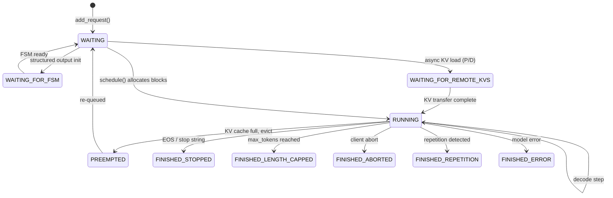

# Scheduler Algorithm

The vLLM v1 scheduler (`vllm/v1/core/sched/scheduler.py`) is the central decision-maker for every inference step. It determines which requests to process, how many tokens to compute for each, and how to handle resource contention through preemption.

## Design Philosophy

> **Key insight**: The v1 scheduler has no explicit "prefill phase" or "decode phase". Every request simply has a `num_computed_tokens` counter that must catch up to `num_tokens_with_spec`. This unified model naturally handles chunked prefills, prefix caching, speculative decoding, and future optimizations like jump decoding.

Each scheduling step corresponds to one forward pass of the model. The scheduler produces a `{req_id → num_tokens}` dictionary specifying how many tokens to process per request.

## Scheduler State Machine



## Request Status Lifecycle

Defined in `vllm/v1/request.py`:

```python
class RequestStatus(enum.IntEnum):
    WAITING = enum.auto()
    WAITING_FOR_FSM = enum.auto()          # Waiting for structured output FSM
    WAITING_FOR_REMOTE_KVS = enum.auto()   # Waiting for P/D KV transfer
    WAITING_FOR_STREAMING_REQ = enum.auto()
    RUNNING = enum.auto()
    PREEMPTED = enum.auto()
    # Finished states (anything > PREEMPTED)
    FINISHED_STOPPED = enum.auto()
    FINISHED_LENGTH_CAPPED = enum.auto()
    FINISHED_ABORTED = enum.auto()
    FINISHED_IGNORED = enum.auto()
    FINISHED_ERROR = enum.auto()
    FINISHED_REPETITION = enum.auto()
```

## The `schedule()` Method

The main scheduling loop in `Scheduler.schedule()` runs in two phases:

### Phase 1: Schedule Running Requests

The scheduler first iterates over all currently `RUNNING` requests and tries to allocate KV cache blocks for their next tokens:

```python
req_index = 0
while req_index < len(self.running) and token_budget > 0:
    request = self.running[req_index]

    num_new_tokens = (
        request.num_tokens_with_spec
        + request.num_output_placeholders
        - request.num_computed_tokens
    )
    # Apply chunked prefill threshold
    if 0 < self.scheduler_config.long_prefill_token_threshold < num_new_tokens:
        num_new_tokens = self.scheduler_config.long_prefill_token_threshold
    num_new_tokens = min(num_new_tokens, token_budget)
    ...
```

**Token budget**: The total number of tokens that can be scheduled in one step is bounded by `max_num_scheduled_tokens` (or `max_num_batched_tokens`). This is the primary throughput knob.

### Phase 2: Schedule Waiting Requests

After running requests are handled, the scheduler promotes requests from the `waiting` queue into `running`:

```python
while self.waiting and token_budget > 0 and len(self.running) < self.max_num_running_reqs:
    request = self.waiting.peek_request()
    ...
    new_blocks = self.kv_cache_manager.allocate_slots(request, num_new_tokens, ...)
    if new_blocks is not None:
        self.running.append(request)
```

## Prefill Scheduling

When a new request enters the `RUNNING` state for the first time, its entire prompt (or a chunk of it) is scheduled for prefill. The number of tokens scheduled is:

```
num_new_tokens = request.num_tokens - request.num_computed_tokens
```

For a brand-new request with no prefix cache hits, `num_computed_tokens = 0`, so the full prompt is scheduled (subject to the token budget).

### Prefix Cache Hits

If prefix caching is enabled, the KV cache manager may find that some prefix blocks are already cached. In that case, `num_computed_tokens` is set to the number of cached tokens, and only the remaining tokens need to be computed:

```
num_new_tokens = prompt_len - num_cached_tokens
```

This dramatically reduces prefill cost for repeated or similar prompts.

## Decode Scheduling

Once a request has finished its prefill (all prompt tokens computed), it enters the decode phase. Each decode step schedules exactly 1 new token (or more with speculative decoding):

```
num_new_tokens = num_tokens_with_spec - num_computed_tokens
```

For standard autoregressive decoding without speculation, this is always 1.

## Chunked Prefill

Chunked prefill allows long prompts to be processed across multiple scheduling steps, preventing a single large request from monopolizing the GPU for an entire step.

**Enabling chunked prefill**:
```python
# In SchedulerConfig
enable_chunked_prefill: bool = True
long_prefill_token_threshold: int = 0  # 0 = no limit per chunk
```

When `long_prefill_token_threshold > 0`, any prefill exceeding this threshold is split:

```python
if 0 < self.scheduler_config.long_prefill_token_threshold < num_new_tokens:
    num_new_tokens = self.scheduler_config.long_prefill_token_threshold
```

Without chunked prefill enabled, a waiting request that exceeds the token budget causes scheduling to stop for that request:

```python
if (
    not self.scheduler_config.enable_chunked_prefill
    and num_new_tokens > token_budget
):
    break  # Stop scheduling new requests
```

### Mamba Block-Aligned Chunking

For hybrid models with Mamba layers, chunked prefill must be block-aligned to enable proper Mamba state caching:

```python
if self.need_mamba_block_aligned_split:
    num_new_tokens = self._mamba_block_aligned_split(request, num_new_tokens)
```

The `_mamba_block_aligned_split()` method ensures that `num_new_tokens` is a multiple of `block_size` during prefill, so that Mamba states can be cached at block boundaries.

## Preemption

When the KV cache is full and a new request needs blocks, the scheduler preempts the lowest-priority running request:

```python
while True:
    new_blocks = self.kv_cache_manager.allocate_slots(request, num_new_tokens, ...)
    if new_blocks is not None:
        break  # Success

    # Preempt the lowest-priority request
    if self.policy == SchedulingPolicy.PRIORITY:
        preempted_req = max(self.running, key=lambda r: (r.priority, r.arrival_time))
        self.running.remove(preempted_req)
    else:
        preempted_req = self.running.pop()  # FCFS: pop last (lowest priority)

    self._preempt_request(preempted_req, scheduled_timestamp)
    preempted_reqs.append(preempted_req)
    if preempted_req == request:
        break  # Cannot schedule this request
```

**Preemption mechanics** (`_preempt_request`):
1. The request's KV cache blocks are freed
2. The request status is set to `PREEMPTED`
3. The request is re-added to the `waiting` queue
4. `request.num_computed_tokens` is reset to 0 (full recompute required)

> **Note**: vLLM v1 uses **recompute-based preemption** — preempted requests lose their KV cache and must recompute from scratch when rescheduled. Swap-based preemption (moving KV blocks to CPU) is handled separately via the KV offloading infrastructure.

## Scheduling Constraints

| Constraint | Source | Description |
|-----------|--------|-------------|
| `max_num_running_reqs` | `scheduler_config.max_num_seqs` | Maximum concurrent requests |
| `max_num_scheduled_tokens` | `scheduler_config.max_num_scheduled_tokens` | Token budget per step |
| `max_model_len` | `model_config.max_model_len` | Maximum sequence length |
| `encoder_compute_budget` | `mm_budget.encoder_compute_budget` | Multimodal encoder token budget |

## Pause States

The scheduler supports pause states for coordinated operations (e.g., weight updates):

```python
class PauseState(enum.IntEnum):
    UNPAUSED = 0      # Normal operation
    PAUSED_NEW = 1    # No new requests, running requests continue
    PAUSED_ALL = 2    # No requests scheduled at all
```

When `PAUSED_ALL`, the token budget is set to 0:

```python
if self._pause_state == PauseState.PAUSED_ALL:
    token_budget = 0
```

## Async Scheduling

In async scheduling mode, the scheduler can overlap the scheduling of step N+1 with the execution of step N. This requires careful handling of output placeholders:

```python
if (
    request.num_output_placeholders > 0
    and request.num_computed_tokens + 2 - request.num_output_placeholders
    >= request.num_prompt_tokens + request.max_tokens
):
    # Skip: previous step already reached max_tokens
    req_index += 1
    continue
```

## Speculative Decoding Integration

When speculative decoding is active, the scheduler tracks draft token IDs and allocates lookahead blocks:

```python
new_blocks = self.kv_cache_manager.allocate_slots(
    request,
    num_new_tokens,
    num_lookahead_tokens=self.num_lookahead_tokens,
)
```

Draft tokens are tracked in `scheduled_spec_decode_tokens` and included in the `SchedulerOutput`.

## Related Pages

- [SchedulerOutput](scheduler-output.md) — data structures produced by each step
- [Request Queue](request-queue.md) — FCFS and priority queue implementations
- [KV Offloading](kv-offloading.md) — CPU offload for long-context KV caches
- [Configuration Reference](../06-configuration/scheduler-config.md) — scheduler configuration options
