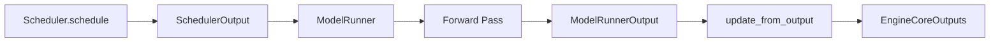

# SchedulerOutput

`SchedulerOutput` is the primary data structure produced by `Scheduler.schedule()` at each inference step. It encapsulates everything the model runner needs to execute a forward pass, including which requests to process, how many tokens to compute, and metadata for KV cache management.

**Source**: `vllm/v1/core/sched/output.py`

## SchedulerOutput Dataclass

```python
@dataclass
class SchedulerOutput:
    # New requests being scheduled for the first time
    scheduled_new_reqs: list[NewRequestData]
    # Requests already known to workers (send only diffs)
    scheduled_cached_reqs: CachedRequestData

    # req_id -> num_scheduled_tokens
    num_scheduled_tokens: dict[str, int]
    # Sum of all num_scheduled_tokens values
    total_num_scheduled_tokens: int
    # req_id -> spec_token_ids (only for spec-decode requests)
    scheduled_spec_decode_tokens: dict[str, list[int]]
    # req_id -> encoder input indices to process this step
    scheduled_encoder_inputs: dict[str, list[int]]
    # Number of common prefix blocks per KV cache group (for cascade attention)
    num_common_prefix_blocks: list[int]

    # Request IDs finished since the previous step
    finished_req_ids: set[str]
    # Encoder cache entries to free
    free_encoder_mm_hashes: list[str]

    # Preempted request IDs (v2 model runner only)
    preempted_req_ids: set[str] | None = None

    # Structured output flags
    has_structured_output_requests: bool = False
    pending_structured_output_tokens: bool = False

    # Spec decode acceptance rate adjustment
    num_invalid_spec_tokens: dict[str, int] | None = None

    # KV connector metadata (P/D disaggregation)
    kv_connector_metadata: KVConnectorMetadata | None = None
    # EC connector metadata
    ec_connector_metadata: ECConnectorMetadata | None = None
```

## Data Flow



## NewRequestData

`NewRequestData` carries the full request payload for requests being scheduled for the **first time**. Workers cache this data locally, so it only needs to be sent once.

```python
@dataclass
class NewRequestData:
    req_id: str
    prompt_token_ids: list[int] | None
    mm_features: list[MultiModalFeatureSpec]
    sampling_params: SamplingParams | None
    pooling_params: PoolingParams | None
    block_ids: tuple[list[int], ...]      # KV cache block IDs per group
    num_computed_tokens: int              # Prefix cache hits
    lora_request: LoRARequest | None
    prompt_embeds: torch.Tensor | None    # For embedding-based prompts
    prefill_token_ids: list[int] | None   # v2 model runner only
```

### Construction

`NewRequestData` is constructed from a `Request` object:

```python
@classmethod
def from_request(
    cls,
    request: Request,
    block_ids: tuple[list[int], ...],
    prefill_token_ids: list[int] | None = None,
) -> "NewRequestData":
    return cls(
        req_id=request.request_id,
        prompt_token_ids=request.prompt_token_ids,
        mm_features=request.mm_features,
        sampling_params=request.sampling_params,
        pooling_params=request.pooling_params,
        block_ids=block_ids,
        num_computed_tokens=request.num_computed_tokens,
        lora_request=request.lora_request,
        prompt_embeds=request.prompt_embeds,
        prefill_token_ids=prefill_token_ids,
    )
```

The `block_ids` field is a tuple of lists — one list per KV cache group. For most models there is a single group, but hybrid models (e.g., Mamba + attention) may have multiple groups.

## CachedRequestData

`CachedRequestData` carries only the **diff** for requests that workers already know about. This minimizes inter-process communication overhead.

```python
@dataclass
class CachedRequestData:
    req_ids: list[str]
    # IDs of requests being resumed after preemption
    resumed_req_ids: set[str]
    # New token IDs (only used with pipeline parallelism)
    new_token_ids: list[list[int]]
    # All token IDs for requests not scheduled in the last step
    all_token_ids: dict[str, list[int]]
    # New KV block IDs allocated this step (None if no new blocks)
    new_block_ids: list[tuple[list[int], ...] | None]
    num_computed_tokens: list[int]
    num_output_tokens: list[int]
```

### Resumed vs. Cached Requests

The `resumed_req_ids` set distinguishes between two cases:

- **Normal cached request**: `new_block_ids` are **appended** to the worker's existing block list
- **Resumed request** (after preemption): `new_block_ids` **replace** the worker's block list entirely

```python
# In CachedRequestData:
def is_context_phase(self, req_id: str) -> bool:
    """Returns True if this request is still in the prefill phase."""
    num_output_tokens = self._req_id_to_num_output_tokens.get(req_id)
    return num_output_tokens is not None and num_output_tokens == 0
```

## Scheduled Tokens

The `num_scheduled_tokens` dictionary maps each scheduled request ID to the number of tokens being processed in this step:

| Request State | Typical `num_scheduled_tokens` |
|--------------|-------------------------------|
| New prefill (no cache) | Full prompt length |
| Chunked prefill | `long_prefill_token_threshold` |
| Prefix cache hit | `prompt_len - num_cached_tokens` |
| Decode step | 1 (or N with spec decoding) |
| Spec decode verification | `1 + num_spec_tokens` |

## Encoder Inputs

For multimodal models, `scheduled_encoder_inputs` maps request IDs to the indices of encoder inputs (e.g., images) that need to be processed this step:

```python
# Example: request has 2 images, both need encoding this step
scheduled_encoder_inputs = {
    "req-abc": [0, 1]  # Process image 0 and image 1
}
```

The encoder cache manager tracks which encoder outputs are already cached to avoid redundant computation.

## Common Prefix Blocks

`num_common_prefix_blocks` is a list with one entry per KV cache group, indicating how many blocks at the start of the sequence are shared by all currently running requests. This enables **cascade attention** optimizations where the common prefix is computed once and reused.

## Finished Request IDs

`finished_req_ids` contains the IDs of requests that completed **between the previous step and this step**. Workers use this to free cached states (KV blocks, LoRA adapters, etc.) for those requests.

> **Important**: This set is flushed at the end of each scheduling step. Workers must process it before the next step begins.

## Empty SchedulerOutput

The scheduler can produce an empty output when there are no requests to process:

```python
@classmethod
def make_empty(cls) -> "SchedulerOutput":
    return cls(
        scheduled_new_reqs=[],
        scheduled_cached_reqs=CachedRequestData.make_empty(),
        num_scheduled_tokens={},
        total_num_scheduled_tokens=0,
        scheduled_spec_decode_tokens={},
        scheduled_encoder_inputs={},
        num_common_prefix_blocks=[],
        finished_req_ids=set(),
        free_encoder_mm_hashes=[],
    )
```

## GrammarOutput

For structured output requests, the scheduler also produces a `GrammarOutput` alongside the `SchedulerOutput`:

```python
@dataclass
class GrammarOutput:
    # IDs of structured output requests
    structured_output_request_ids: list[str]
    # Bitmask ordered as structured_output_request_ids
    grammar_bitmask: npt.NDArray[np.int32]
```

The grammar bitmask is applied during sampling to constrain token selection to valid grammar continuations.

## Related Pages

- [Scheduler Algorithm](scheduler-algorithm.md) — how the scheduler produces this output
- [Input Processor](input-processor.md) — how requests are prepared before scheduling
- [Output Processor](output-processor.md) — how model outputs are processed after scheduling
