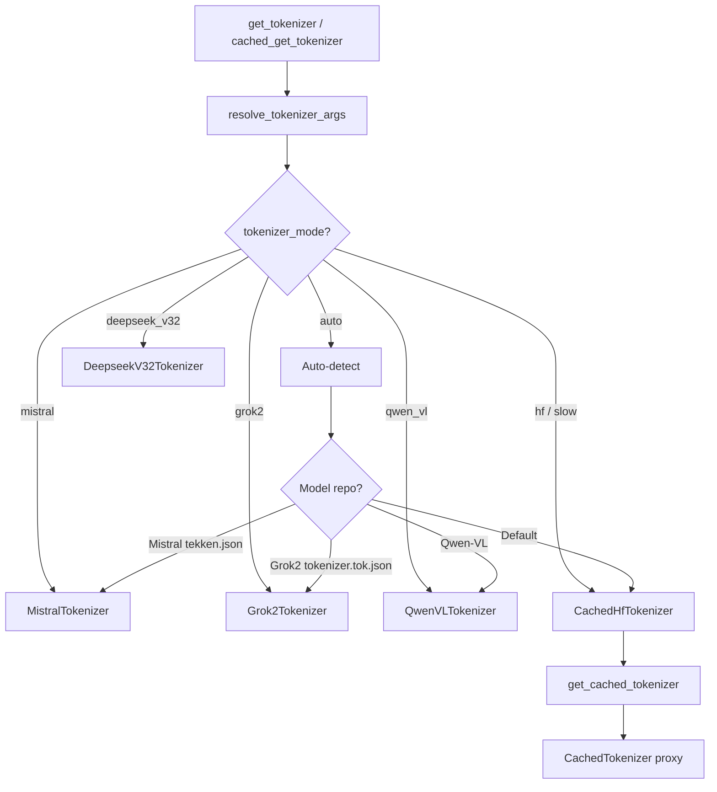

# Tokenizer Internals

vLLM's tokenizer subsystem (`vllm/tokenizers/`) provides a unified interface for loading, caching, and using tokenizers across different model families. It wraps HuggingFace tokenizers with performance optimizations and supports model-specific tokenizer implementations.

## Architecture



## TokenizerLike Protocol

All tokenizers implement the `TokenizerLike` protocol (`vllm/tokenizers/protocol.py`), providing a consistent interface:

```python
class TokenizerLike(Protocol):
    @classmethod
    def from_pretrained(cls, path_or_repo_id, *args, **kwargs) -> "TokenizerLike":
        ...

    def encode(self, text: str, **kwargs) -> list[int]:
        ...

    def decode(self, token_ids: list[int], **kwargs) -> str:
        ...

    @property
    def is_fast(self) -> bool:
        ...

    @property
    def max_token_id(self) -> int:
        ...
```

## Tokenizer Registry

The `TokenizerRegistry` (`vllm/tokenizers/registry.py`) maps tokenizer modes to their implementations:

```python
_VLLM_TOKENIZERS = {
    "deepseek_v32": ("deepseek_v32", "DeepseekV32Tokenizer"),
    "grok2":        ("grok2",        "Grok2Tokenizer"),
    "hf":           ("hf",           "CachedHfTokenizer"),
    "mistral":      ("mistral",      "MistralTokenizer"),
    "qwen_vl":      ("qwen_vl",      "QwenVLTokenizer"),
}
```

Custom tokenizers can be registered via:

```python
TokenizerRegistry.register(
    tokenizer_mode="my_custom",
    module="my_package.tokenizer",
    class_name="MyTokenizer",
)
```

## Auto-Detection Logic

When `tokenizer_mode="auto"` (the default), vLLM inspects the model repository to select the appropriate tokenizer:

```python
def resolve_tokenizer_args(tokenizer_name, *args, tokenizer_mode="auto", **kwargs):
    # 1. Mistral: check for tekken.json or tokenizer.model.v*
    if (
        tokenizer_mode == "auto"
        and is_mistral_model_repo(model_name_or_path=str(tokenizer_name), ...)
        and any_pattern_in_repo_files(..., allow_patterns=["tekken.json", "tokenizer.model.v*"])
    ):
        tokenizer_mode = "mistral"

    # 2. Grok2: check for tokenizer.tok.json
    if tokenizer_mode == "auto" and any_pattern_in_repo_files(
        ..., allow_patterns=["tokenizer.tok.json"]
    ):
        tokenizer_mode = "grok2"

    # 3. Qwen-VL: check model name
    if tokenizer_mode == "auto" and "/Qwen-VL" in str(tokenizer_name):
        tokenizer_mode = "qwen_vl"

    # 4. Default: HuggingFace tokenizer
    if tokenizer_mode == "auto":
        tokenizer_mode = "hf"
```

## CachedHfTokenizer

The `CachedHfTokenizer` (`vllm/tokenizers/hf.py`) wraps HuggingFace's `AutoTokenizer` with a caching proxy that avoids expensive property recomputation:

```python
class CachedHfTokenizer(TokenizerLike):
    @classmethod
    def from_pretrained(cls, path_or_repo_id, *args, **kwargs) -> HfTokenizer:
        tokenizer = AutoTokenizer.from_pretrained(
            path_or_repo_id,
            trust_remote_code=trust_remote_code,
            revision=revision,
            cache_dir=download_dir,
            **kwargs,
        )
        return get_cached_tokenizer(tokenizer)
```

### The `get_cached_tokenizer()` Function

HuggingFace tokenizers recompute several properties on every access (e.g., `all_special_ids`, `get_vocab()`). The `get_cached_tokenizer()` function creates a proxy class that caches these:

```python
def get_cached_tokenizer(tokenizer: HfTokenizer) -> HfTokenizer:
    # Pre-compute expensive properties
    tokenizer_all_special_ids = tokenizer.all_special_ids
    tokenizer_all_special_tokens = tokenizer.all_special_tokens
    tokenizer_vocab = tokenizer.get_vocab()
    tokenizer_len = len(tokenizer)
    max_token_id = max(tokenizer_vocab.values())
    max_chars_per_token = max(len(tok) for tok in tokenizer_vocab)

    class CachedTokenizer(tokenizer.__class__):
        @property
        def all_special_ids(self) -> list[int]:
            return tokenizer_all_special_ids  # Cached

        @property
        def all_special_tokens(self) -> list[str]:
            return tokenizer_all_special_tokens  # Cached

        @property
        def max_token_id(self) -> int:
            return max_token_id  # Cached

        @property
        def max_chars_per_token(self) -> int:
            return max_chars_per_token  # Cached

        def get_vocab(self) -> dict[str, int]:
            return tokenizer_vocab  # Cached

        def __len__(self) -> int:
            return tokenizer_len  # Cached

    CachedTokenizer.__name__ = f"Cached{tokenizer.__class__.__name__}"
    cached_tokenizer.__class__ = CachedTokenizer
    return cached_tokenizer
```

This proxy is transparent — it inherits all methods from the original tokenizer class while caching the expensive properties.

## Global Tokenizer Cache

The `cached_get_tokenizer` function uses `lru_cache` to avoid loading the same tokenizer multiple times:

```python
cached_get_tokenizer = lru_cache(get_tokenizer)
```

This is particularly important in multi-process deployments where multiple workers might request the same tokenizer.

Similarly, `resolve_tokenizer_args` is cached:

```python
cached_resolve_tokenizer_args = lru_cache(resolve_tokenizer_args)
```

## Truncation Side

The truncation side is set based on the model's runner type:

```python
if runner_type == "generate" or runner_type == "draft":
    kwargs["truncation_side"] = "left"   # Keep end of prompt (most recent context)
elif runner_type == "pooling":
    kwargs["truncation_side"] = "right"  # Keep beginning of prompt
```

For generation models, left truncation preserves the most recent context when prompts exceed `max_model_len`.

## Fast vs. Slow Tokenizers

vLLM strongly prefers fast tokenizers (backed by the Rust `tokenizers` library):

```python
if not tokenizer.is_fast:
    logger.warning(
        "Using a slow tokenizer. This might cause a significant "
        "slowdown. Consider using a fast tokenizer instead."
    )
```

The `tokenizer_mode="slow"` option forces the slow Python tokenizer:

```python
if tokenizer_mode == "slow":
    if kwargs.get("use_fast", False):
        raise ValueError("Cannot use the fast tokenizer in slow tokenizer mode.")
    tokenizer_mode = "hf"
    kwargs["use_fast"] = False
```

## Model-Specific Tokenizers

### MistralTokenizer

Handles Mistral's custom tokenizer format (tekken.json, tokenizer.model.v*). Mistral uses a different tokenization scheme than standard HuggingFace tokenizers.

### DeepseekV32Tokenizer

`DeepseekV32Tokenizer` (`vllm/tokenizers/deepseek_v32.py`) handles DeepSeek V3.2's custom tokenizer with special encoding requirements.

### Grok2Tokenizer

`Grok2Tokenizer` (`vllm/tokenizers/grok2.py`) handles xAI's Grok-2 model tokenizer format (tokenizer.tok.json).

### QwenVLTokenizer

`QwenVLTokenizer` (`vllm/tokenizers/qwen_vl.py`) handles Qwen-VL's multimodal tokenizer, which includes special tokens for image placeholders.

## GGUF Tokenizer Support

For GGUF model files, the tokenizer path is extracted from the GGUF file:

```python
if is_gguf(tokenizer_name):
    if check_gguf_file(tokenizer_name):
        kwargs["gguf_file"] = Path(tokenizer_name).name
        tokenizer_name = Path(tokenizer_name).parent
    elif is_remote_gguf(tokenizer_name):
        tokenizer_name, quant_type = split_remote_gguf(tokenizer_name)
        gguf_file = get_gguf_file_path_from_hf(tokenizer_name, quant_type, ...)
        kwargs["gguf_file"] = gguf_file
```

## ModelScope Support

For Chinese model hub ModelScope, tokenizers are downloaded via the ModelScope API:

```python
if envs.VLLM_USE_MODELSCOPE:
    from modelscope.hub.snapshot_download import snapshot_download
    tokenizer_path = snapshot_download(
        model_id=str(tokenizer_name),
        cache_dir=download_dir,
        ignore_file_pattern=[".*.pt", ".*.safetensors", ".*.bin"],
    )
    tokenizer_name = tokenizer_path
```

## Detokenizer Utilities

`vllm/tokenizers/detokenizer_utils.py` provides low-level utilities for incremental detokenization:

```python
def convert_prompt_ids_to_tokens(
    tokenizer: TokenizerLike,
    prompt_ids: list[int],
    skip_special_tokens: bool = False,
) -> tuple[list[str], int, int]:
    """Convert prompt token IDs to string tokens for incremental decoding.
    Returns (tokens, prefix_offset, read_offset)."""

def detokenize_incrementally(
    tokenizer: TokenizerLike,
    all_input_ids: list[int],
    prev_tokens: list[str],
    prefix_offset: int,
    read_offset: int,
    skip_special_tokens: bool = False,
    spaces_between_special_tokens: bool = True,
) -> tuple[list[str], str, int, int]:
    """Incrementally decode the next token."""
```

These functions maintain a sliding window (`prefix_offset`, `read_offset`) to correctly handle multi-token characters in byte-pair encoding.

## Configuration

Tokenizer behavior is controlled by `ModelConfig`:

```python
# In ModelConfig
tokenizer: str                    # Tokenizer path or HF repo ID
tokenizer_mode: str = "auto"      # "auto", "slow", "mistral", etc.
tokenizer_revision: str | None    # Git revision for tokenizer
trust_remote_code: bool = False   # Allow custom tokenizer code
skip_tokenizer_init: bool = False # Skip tokenizer loading entirely
```

## Usage Example

```python
from vllm.tokenizers.registry import get_tokenizer, cached_get_tokenizer

# Load tokenizer (cached after first call)
tokenizer = cached_get_tokenizer(
    "meta-llama/Llama-3.1-8B-Instruct",
    tokenizer_mode="auto",
    trust_remote_code=False,
)

# Encode text
token_ids = tokenizer.encode("Hello, world!")

# Decode tokens
text = tokenizer.decode(token_ids, skip_special_tokens=True)
```

## Related Pages

- [Detokenizer](detokenizer.md) — incremental detokenization using these tokenizers
- [Input Processor](input-processor.md) — how tokenizers are used during input processing
- [Model Configuration](../06-configuration/model-config.md) — tokenizer configuration options
