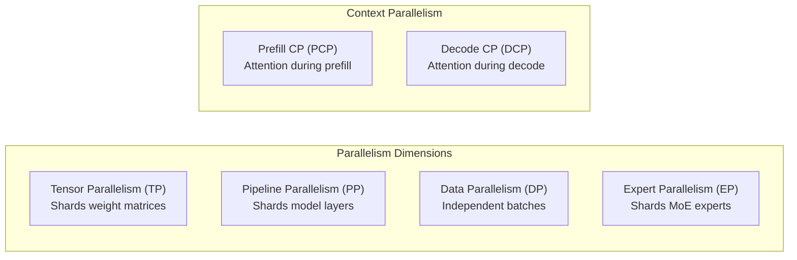

# Distributed Inference Design

This document describes the internal architecture of vLLM's distributed inference system — how parallelism groups are formed, how workers communicate, and how the execution pipeline is orchestrated across multiple GPUs and nodes.

## Overview

vLLM supports four orthogonal parallelism dimensions that can be combined freely:



| Dimension | Abbreviation | What it shards |
|-----------|-------------|----------------|
| Tensor Parallelism | TP | Individual weight matrices (columns/rows) |
| Pipeline Parallelism | PP | Model layers across stages |
| Data Parallelism | DP | Independent request batches |
| Expert Parallelism | EP | MoE expert weights across GPUs |

Additionally, two context-parallelism variants exist for long-context workloads:

| Dimension | Abbreviation | Scope |
|-----------|-------------|-------|
| Prefill Context Parallelism | PCP | Attention during prefill |
| Decode Context Parallelism | DCP | Attention during decode |

The global rank layout follows the order **ExternalDP × DP × PP × PCP × TP**, which determines how process groups are sliced from the flat rank space.

---

## Process Group Architecture

### GroupCoordinator

All distributed communication in vLLM is mediated by the `GroupCoordinator` class (`vllm/distributed/parallel_state.py`). Each `GroupCoordinator` wraps a pair of PyTorch `ProcessGroup` objects:

- **`device_group`** — uses the configured backend (NCCL for CUDA, Gloo for CPU) for GPU-to-GPU tensor operations.
- **`cpu_group`** — always uses Gloo; used for metadata exchange, barrier synchronisation, and object broadcasts that must not touch GPU memory.

```
GroupCoordinator
├── device_group  (NCCL / XPU / custom backend)
├── cpu_group     (Gloo)
└── device_communicator  (DeviceCommunicatorBase subclass)
    ├── CudaCommunicator   — custom all-reduce, PyNCCL, symmetric memory
    ├── XpuCommunicator
    └── CpuCommunicator
```

The `DeviceCommunicatorBase` abstraction allows platform-specific optimisations (e.g., custom all-reduce kernels, DeepEP all-to-all) to be swapped in without changing the calling code.

### Named Groups

Seven named singleton groups are maintained as module-level globals:

| Global | Accessor | Purpose |
|--------|----------|---------|
| `_WORLD` | `get_world_group()` | All ranks; used for global barriers |
| `_TP` | `get_tp_group()` | Tensor-parallel peers |
| `_PP` | `get_pp_group()` | Pipeline stages |
| `_DP` | `get_dp_group()` | Data-parallel replicas |
| `_EP` | `get_ep_group()` | Expert-parallel peers (MoE only) |
| `_EPLB` | `get_eplb_group()` | EPLB rebalancing (separate from EP to avoid deadlocks) |
| `_PCP` | `get_pcp_group()` | Prefill context parallelism |
| `_DCP` | `get_dcp_group()` | Decode context parallelism |

### Initialisation Sequence

```
init_distributed_environment()          # torch.distributed.init_process_group
    └── init_world_group()              # _WORLD GroupCoordinator

initialize_model_parallel(tp, pp, pcp, dcp)
    ├── _TP  = init_model_parallel_group(tp_group_ranks)
    ├── _DCP = init_model_parallel_group(dcp_group_ranks)
    ├── _PCP = init_model_parallel_group(pcp_group_ranks)
    ├── _PP  = init_model_parallel_group(pp_group_ranks)
    ├── _DP  = init_model_parallel_group(dp_group_ranks)
    └── _EP  = init_model_parallel_group(ep_group_ranks)  # MoE only
        └── _EPLB = init_model_parallel_group(ep_group_ranks)  # if EPLB enabled
```

Group ranks are computed by reshaping a `torch.arange(world_size)` tensor and transposing the appropriate dimensions. For example, with `world_size=8`, `TP=4`, `PP=2`:

```
all_ranks = arange(8).reshape(1, 1, 2, 1, 4)
#                              ^  ^  ^  ^  ^
#                              |  |  |  |  TP
#                              |  |  |  PCP
#                              |  |  PP
#                              |  DP
#                              ExternalDP

TP groups:  [0,1,2,3], [4,5,6,7]
PP groups:  [0,4], [1,5], [2,6], [3,7]
```

### Rank Terminology

| Term | Meaning |
|------|---------|
| `rank` | Global rank across all processes |
| `local_rank` | GPU index on the current node |
| `rank_in_group` | Position within a specific parallel group |

For a 4-GPU, 2-node cluster with TP=4:

```
Process | Node | rank | local_rank | rank_in_group (TP)
   0    |  0   |  0   |     0      |        0
   1    |  0   |  1   |     1      |        1
   2    |  1   |  2   |     0      |        2
   3    |  1   |  3   |     1      |        3
```

---

## Communication Primitives

`GroupCoordinator` exposes the following collective and point-to-point operations:

### Collective Operations

| Method | Description |
|--------|-------------|
| `all_reduce(tensor)` | Sum tensors across the group |
| `all_gather(tensor, dim)` | Concatenate tensors along `dim` |
| `reduce_scatter(tensor, dim)` | Reduce and scatter along `dim` |
| `all_gatherv(tensor, dim, sizes)` | Variable-size all-gather |
| `reduce_scatterv(tensor, dim, sizes)` | Variable-size reduce-scatter |
| `broadcast(tensor, src)` | Broadcast from `src` rank |
| `broadcast_object(obj, src)` | Broadcast arbitrary Python object |
| `broadcast_tensor_dict(d, src)` | Broadcast mixed tensor/metadata dict |
| `barrier()` | CPU-side barrier (uses Gloo group) |

### Point-to-Point Operations

| Method | Description |
|--------|-------------|
| `send(tensor, dst)` | Blocking tensor send |
| `recv(size, dtype, src)` | Blocking tensor receive |
| `send_tensor_dict(d, dst)` | Send mixed tensor/metadata dict |
| `recv_tensor_dict(src)` | Receive mixed tensor/metadata dict |
| `isend_tensor_dict(d, dst)` | Non-blocking send (returns handles) |
| `irecv_tensor_dict(src)` | Non-blocking receive (returns handles + postprocess fns) |

### Custom Op Registration

For CUDA graph compatibility, `all_reduce`, `all_gather`, and `reduce_scatter` are registered as custom PyTorch ops via `direct_register_custom_op`. This allows them to be captured inside `torch.compile` and CUDA graph regions. The ops dispatch through `group_name` string lookup rather than passing the `GroupCoordinator` object directly (which Dynamo cannot handle).

### Pipeline Parallelism Communication

Pipeline stages exchange `IntermediateTensors` (activations) between consecutive PP ranks using `send_tensor_dict` / `recv_tensor_dict`. The `all_gather_group` optimisation allows each TP rank to send only its local slice; the receiver reconstructs the full tensor via an all-gather, reducing inter-node bandwidth.

---

## Executor Backends

vLLM provides two executor backends that manage worker lifecycle and dispatch:

### MultiprocExecutor

`vllm/v1/executor/multiproc_executor.py`

The multiprocessing executor is the default for single-node deployments. It spawns one worker process per GPU using Python's `multiprocessing` module.

**Architecture:**

```
Engine Process
├── MultiprocExecutor
│   ├── rpc_broadcast_mq  (MessageQueue — SchedulerOutput → workers)
│   ├── response_mqs[]    (MessageQueue — ModelRunnerOutput ← workers)
│   └── workers[]         (WorkerProc handles)
│       ├── WorkerProc[0]  (local_rank=0)
│       ├── WorkerProc[1]  (local_rank=1)
│       └── ...
└── WorkerMonitor thread  (detects dead worker processes)
```

**Communication flow:**

1. `collective_rpc(method, args)` serialises the call with cloudpickle and enqueues it on `rpc_broadcast_mq`.
2. All worker processes dequeue the message and execute the method.
3. Each worker enqueues its result on its `worker_response_mq`.
4. The executor reads from `response_mqs[output_rank]` (TP rank 0 of the last PP stage).

**Multi-node multiprocessing:**

For multi-node deployments, the executor runs on each node independently. The head node's executor is the "leader" (`node_rank_within_dp == 0`) and owns the `rpc_broadcast_mq`. Worker nodes connect to the leader's message queue. The `distributed_init_method` uses TCP (`tcp://<head_ip>:<port>`) to bootstrap `torch.distributed`.

**Worker process lifecycle:**

```
WorkerProc.make_worker_process()
    → spawn/fork new process
    → WorkerProc.__init__()
        → init_worker(vllm_config, local_rank, rank, distributed_init_method)
        → init_device()
        → load_model()
    → send READY signal via ready_pipe
    → enter RPC loop (dequeue from rpc_broadcast_mq)
```

Workers are monitored by a daemon thread that waits on process sentinels. If any worker dies unexpectedly, the executor shuts down and invokes the registered `FailureCallback`.

### RayDistributedExecutor

`vllm/v1/executor/ray_executor.py`

The Ray executor is required for multi-node deployments and is the only option for TPU/XPU platforms.

**Architecture:**

```
Engine Process
└── RayDistributedExecutor
    ├── workers[]          (Ray actor handles — RayWorkerWrapper)
    ├── pp_tp_workers[][]  (indexed by [pp_rank][tp_rank])
    └── forward_dag        (Ray Compiled DAG — built lazily)
```

**Worker placement:**

Workers are placed using Ray placement groups. The executor sorts workers so that:
1. Workers on the driver node come first.
2. Workers on nodes with fewer workers come before those on busier nodes.
3. Ties are broken by IP address.

This sorting ensures that rank 0 is on the driver node, which simplifies distributed initialisation.

**Execution via Compiled DAG:**

For inference, vLLM uses Ray's Compiled DAG (cgraph) feature, which pre-compiles the execution graph for low-overhead dispatch:

```
InputNode (SchedulerOutput)
    ↓ [PP stage 0]
    worker[0].execute_model_ray.bind(input)
    worker[1].execute_model_ray.bind(input)
    ...
    ↓ [PP stage 1]
    worker[4].execute_model_ray.bind(stage0_output)
    ...
    ↓
MultiOutputNode([last_stage_outputs])
```

Inter-PP-stage tensors are transferred via NCCL (default) or shared memory, controlled by `VLLM_USE_RAY_COMPILED_DAG_CHANNEL_TYPE`.

**Environment variable propagation:**

The executor copies environment variables from the driver to all workers, excluding worker-specific vars (`CUDA_VISIBLE_DEVICES`, `LOCAL_RANK`, etc.). Each worker receives `CUDA_VISIBLE_DEVICES` set to all GPUs on its node; the worker uses `local_rank` to index into this list.

---

## Parallelism Configuration

`ParallelConfig` (`vllm/config/parallel.py`) is the single source of truth for all parallelism settings.

### Key Parameters

| Parameter | Default | Description |
|-----------|---------|-------------|
| `tensor_parallel_size` | 1 | GPUs for tensor parallelism |
| `pipeline_parallel_size` | 1 | Pipeline stages |
| `data_parallel_size` | 1 | Independent replicas |
| `prefill_context_parallel_size` | 1 | Context parallelism during prefill |
| `decode_context_parallel_size` | 1 | Context parallelism during decode (≤ TP size) |
| `enable_expert_parallel` | False | Use EP instead of TP for MoE layers |
| `enable_eplb` | False | Enable expert load balancing |
| `enable_elastic_ep` | False | Enable elastic EP (dynamic scaling) |
| `distributed_executor_backend` | auto | `"ray"`, `"mp"`, `"uni"`, or `"external_launcher"` |
| `all2all_backend` | `"allgather_reducescatter"` | MoE all-to-all implementation |

### Derived Properties

| Property | Formula |
|----------|---------|
| `world_size` | `TP × PP` |
| `world_size_across_dp` | `TP × PP × DP` |
| `ep_size` | `TP × DP` (when EP enabled) |
| `local_world_size` | `world_size / nnodes_within_dp` |

### Backend Selection Logic

```
distributed_executor_backend = "auto"
    → world_size <= num_local_gpus  →  "mp"  (multiprocessing)
    → world_size >  num_local_gpus  →  "ray" (requires Ray cluster)
    → TPU / XPU                     →  "ray" (always)
```

---

## MoE Expert Parallelism

For Mixture-of-Experts models, vLLM supports expert parallelism where each GPU holds a subset of expert weights.

### EP Group Formation

With `TP=2, DP=4` (8 GPUs total), the EP group spans all 8 GPUs:

```
EP group = [0, 1, 2, 3, 4, 5, 6, 7]  (size = TP × DP = 8)
```

Each GPU holds `num_experts / ep_size` experts. The `expert_placement_strategy` controls assignment:

- **`linear`**: GPU 0 gets experts [0..k-1], GPU 1 gets [k..2k-1], etc.
- **`round_robin`**: GPU 0 gets experts [0, ep_size, 2×ep_size, ...], GPU 1 gets [1, ep_size+1, ...].

### All-to-All Backends

Expert parallelism requires routing tokens to the GPU holding the selected expert. vLLM supports multiple all-to-all implementations:

| Backend | Description | Best For |
|---------|-------------|----------|
| `allgather_reducescatter` | Default; uses AG+RS primitives | General purpose |
| `deepep_high_throughput` | DeepEP grouped GEMM | Prefill-heavy workloads |
| `deepep_low_latency` | DeepEP with CUDA graph support | Decode-heavy workloads |
| `flashinfer_all2allv` | FlashInfer alltoallv for MNNVL | Multi-node NVLink systems |
| `naive` | Broadcast-based | Debugging only |

### Sequence Parallelism for MoE

When `use_sequence_parallel_moe` is True (EP + TP + DP all > 1 with certain backends), the input to expert layers is kept in sequence-parallel form to avoid redundant computation from replicated tokens.

---

## Stateless Process Groups (Elastic EP)

For elastic expert parallelism, vLLM uses `StatelessGroupCoordinator` — a variant that does not rely on a pre-existing `torch.distributed` world group. Each stateless group is bootstrapped via a dedicated TCP store, allowing groups to be created and destroyed dynamically without affecting other groups.

Port allocation for stateless groups is handled by `ParallelConfig.allocate_elastic_ep_ports()`, which pre-allocates all required ports after `ray.init()` to avoid conflicts with Ray's worker pool.

---

## CUDA Graph Capture

vLLM captures CUDA graphs for the model forward pass to eliminate Python overhead during inference. The `graph_capture` context manager coordinates graph capture across TP and PP groups:

```python
with graph_capture(device):
    # All CUDA operations in this block are captured
    # on a dedicated stream, separate from the default stream
    model_forward(...)
```

Custom collective ops (`all_reduce`, `all_gather`, `reduce_scatter`) are registered as PyTorch custom ops so they can be captured inside CUDA graphs and replayed efficiently.

---

## Message Queue (Shared Memory IPC)

The `MessageQueue` class (`vllm/distributed/device_communicators/shm_broadcast.py`) provides low-latency IPC between the engine process and worker processes using shared memory. It is used for:

- Broadcasting `SchedulerOutput` from the engine to all workers.
- Returning `ModelRunnerOutput` from workers to the engine.

The message queue supports chunked transfers for large payloads (controlled by `VLLM_MQ_MAX_CHUNK_BYTES_MB`) and both blocking and non-blocking modes.

---

## Teardown

Distributed resources are released in reverse order:

```
destroy_model_parallel()
    → destroy TP, PP, DP, EP, EPLB, PCP, DCP groups

destroy_distributed_environment()
    → torch.distributed.destroy_process_group()
```

The `_replace_active_groups()` function allows atomic replacement of DP/EP/WORLD groups during elastic scaling without disrupting TP/PP groups.

---

## See Also

- [Multi-Node Setup](../deployment/multi_node.md) — practical deployment guide
- [Ray Cluster Configuration](../deployment/ray_cluster.md) — Ray-specific setup
- [Elastic Expert Parallelism](../deployment/elastic_ep.md) — dynamic EP scaling
- [Disaggregated Prefill/Decode](../features/disagg_prefill.md) — P/D disaggregation
