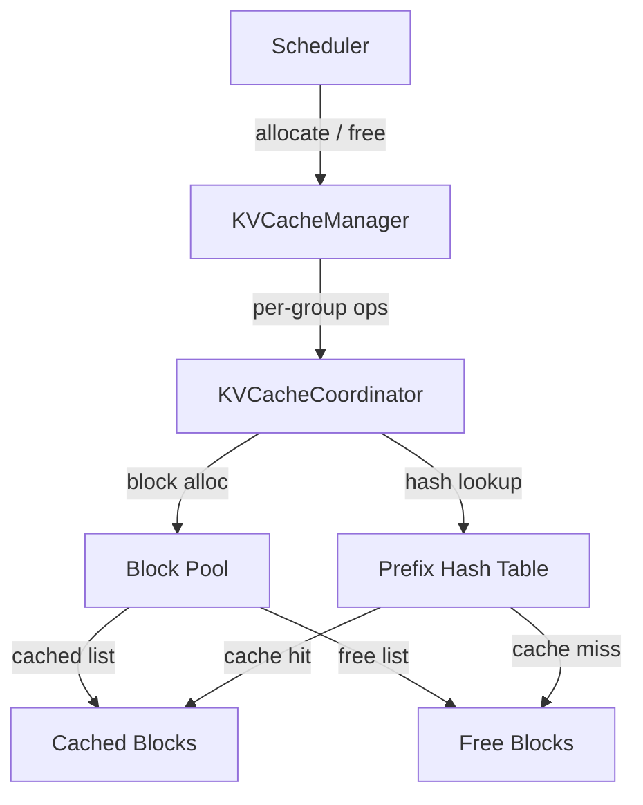

# KV Cache Management

This document provides a deep dive into vLLM's V1 KV cache management system,
covering the block pool, prefix caching, allocation strategies, eviction policy,
and support for hybrid model architectures.

[TOC]

## Overview

The KV cache is the central memory resource in an LLM inference engine. Every
token processed by the model produces a key-value pair for each attention layer,
and these pairs must be stored in GPU memory for the duration of the request.
Efficient KV cache management is critical for:

- **Throughput** — maximizing the number of concurrent requests.
- **Memory efficiency** — avoiding fragmentation and waste.
- **Latency** — reusing cached computations via prefix caching.

vLLM's V1 KV cache management is implemented across three files:

| File | Role |
|---|---|
| `vllm/v1/core/kv_cache_manager.py` | High-level manager: scheduler interface |
| `vllm/v1/core/kv_cache_utils.py` | Block data structures, hashing, config utilities |
| `vllm/v1/core/kv_cache_coordinator.py` | Per-group block allocation and caching logic |



---

## Core Concepts

### Blocks

The KV cache is divided into fixed-size **blocks** (also called pages). Each
block stores the key and value tensors for a fixed number of tokens
(`block_size`, default 16) across all attention layers in a KV cache group.

```
Block layout (one block, one KV cache group):
┌─────────────────────────────────────────────────────────┐
│  Layer 0: K[0..15], V[0..15]                            │
│  Layer 1: K[0..15], V[0..15]                            │
│  ...                                                    │
│  Layer N: K[0..15], V[0..15]                            │
└─────────────────────────────────────────────────────────┘
```

Blocks are the unit of allocation, caching, and eviction. A request's KV cache
is represented as an ordered list of block IDs (the **block table**).

### KVCacheBlock

The `KVCacheBlock` dataclass is the metadata object for a single block:

```python
@dataclass(slots=True)
class KVCacheBlock:
    block_id: int                          # Physical block index (0..num_blocks-1)
    ref_cnt: int = 0                       # Number of requests using this block
    _block_hash: BlockHashWithGroupId | None = None  # Hash (set when block is full)
    prev_free_block: KVCacheBlock | None = None  # Doubly-linked free list
    next_free_block: KVCacheBlock | None = None
    is_null: bool = False                  # Null block (never cached)
```

Key design decisions:

- **Pre-allocated pool** — all `KVCacheBlock` objects are created at startup.
  No Python object allocation occurs during inference, eliminating GC pressure.
- **Embedded linked list** — the `prev_free_block`/`next_free_block` pointers
  are embedded directly in `KVCacheBlock`, enabling O(1) removal from the
  middle of the free queue without a separate wrapper object.

### KV Cache Groups

Modern models may have multiple types of attention layers with different KV
cache requirements (e.g., full attention + sliding window attention in a hybrid
model). vLLM organizes layers into **KV cache groups**, where all layers in a
group share the same block table.

```
Model with full attention (layers 0,3,6,...) and sliding window (layers 1,2,4,5,...):

KV Cache Group 0: [layer_0, layer_3, layer_6, ...]  ← full attention
KV Cache Group 1: [layer_1, layer_4, layer_7, ...]  ← sliding window
KV Cache Group 2: [layer_2, layer_5, layer_8, ...]  ← sliding window
```

The `KVCacheBlocks` dataclass wraps a tuple of block lists, one per group:

```python
@dataclass
class KVCacheBlocks:
    blocks: tuple[Sequence[KVCacheBlock], ...]
    # blocks[group_id][block_index] → KVCacheBlock
```

---

## Block Pool and Free Queue

### Block Pool

At startup, `KVCacheManager` creates a flat pool of `num_gpu_blocks`
`KVCacheBlock` objects. This pool is shared across all requests.

### FreeKVCacheBlockQueue

The free block queue is a **doubly linked list** of unallocated blocks,
ordered by eviction priority (LRU at the front):

```
fake_head ↔ block_7 ↔ block_3 ↔ block_1 ↔ block_9 ↔ fake_tail
              ↑ LRU (evict first)              ↑ MRU (evict last)
```

Operations:

| Operation | Complexity | Description |
|---|---|---|
| `popleft()` | O(1) | Allocate the LRU free block |
| `popleft_n(n)` | O(n) | Allocate n free blocks |
| `append(block)` | O(1) | Return a block to the free queue (MRU position) |
| `remove(block)` | O(1) | Remove a specific block (e.g., when "touching" a cached block) |

The O(1) `remove()` is the key advantage of the doubly linked list over a
standard `deque`. It is used during prefix cache hits to "touch" cached blocks
(move them from the free queue to the active set) without scanning the queue.

### Eviction Order

When a request finishes, its blocks are returned to the free queue in
**reverse order** (tail block first):

```python
# Free blocks in reverse order so tail blocks are evicted first
for block in reversed(request_blocks):
    free_queue.append(block)
```

This heuristic is based on the observation that tail blocks (containing the
most recently generated tokens) are less likely to be reused by future requests
than head blocks (containing the prompt prefix). By placing tail blocks at the
front of the free queue, they are evicted first, preserving the more reusable
prefix blocks.

---

## Prefix Caching

Prefix caching avoids recomputing KV cache for tokens that have been processed
before. When a new request arrives with a prompt that shares a prefix with a
previously processed request, the cached KV blocks for that prefix can be
reused directly.

### Block Hashing

Each full block is identified by a **content hash** computed from:

1. **Parent block hash** — the hash of the preceding block (or a random seed
   for the first block).
2. **Token IDs** — the exact token IDs in this block.
3. **Extra keys** — additional context-specific identifiers:
   - **Multimodal hash** — for requests with image/audio/video inputs.
   - **LoRA name** — for requests using a LoRA adapter.
   - **Cache salt** — for per-tenant cache isolation.

```python
block_hash = hash_function((
    parent_block_hash,
    tuple(curr_block_token_ids),
    extra_keys,  # None if no extra context
))
```

This chained hashing scheme ensures that two blocks with identical token IDs
but different prefixes produce different hashes, preventing incorrect cache
hits.

### Hash Algorithms

The hashing algorithm is configurable via `--prefix-caching-hash-algo`:

| Algorithm | Library | Properties |
|---|---|---|
| `sha256` (default) | Python stdlib | Cryptographically secure, non-reproducible across Python versions |
| `sha256_cbor` | `cbor2` | Reproducible across environments, cross-language compatible |
| `xxhash` | `xxhash` | Fast, non-cryptographic, not collision-resistant |
| `xxhash_cbor` | `cbor2` + `xxhash` | Fast + reproducible |

!!! warning
    Non-cryptographic hash functions (`xxhash`, `xxhash_cbor`) increase the
    theoretical risk of hash collisions. In multi-tenant environments, a hash
    collision could cause one tenant's cached KV data to be served to another
    tenant. Evaluate your security requirements before using these algorithms.

### Cache Lookup

When a new request is scheduled, `get_computed_blocks()` performs a prefix
cache lookup:

```python
def get_computed_blocks(request):
    # Walk the request's block hashes from left to right
    # Find the longest prefix that matches cached blocks
    computed_blocks, num_cached_tokens = coordinator.find_longest_cache_hit(
        request.block_hashes,
        max_cache_hit_length=request.num_tokens - 1  # must recompute last token
    )
    return computed_blocks, num_cached_tokens
```

The `max_cache_hit_length = num_tokens - 1` constraint ensures that at least
one token is always recomputed. This is required to produce the logits for the
next token prediction.

### Cache Insertion

A block is inserted into the cache when it becomes **full** (all `block_size`
token slots are occupied):

```python
def cache_blocks(request, num_computed_tokens):
    # Cache all full blocks up to num_computed_tokens
    for block in request_blocks[:num_full_blocks]:
        if block.block_hash is None:
            block.block_hash = compute_hash(block)
            cached_blocks[block.block_hash] = block
```

Blocks are cached eagerly — as soon as they are full — so that other requests
in the same batch can benefit from the cached blocks immediately.

### Cache Eviction (LRU)

When a cached block needs to be allocated for a new request, it is **evicted**:

1. The block is popped from the front of the free queue (LRU position).
2. Its hash is removed from the `cached_blocks` dictionary.
3. Its `block_hash` is reset to `None`.
4. The block is now available for new content.

```python
def popleft():  # FreeKVCacheBlockQueue
    block = free_queue.popleft()
    if block.block_hash is not None:
        # Evict from cache
        del cached_blocks[block.block_hash]
        block.reset_hash()
    return block
```

### Touching Cached Blocks

When a prefix cache hit is found, the matched blocks must be "touched" to
prevent them from being evicted before the request can use them:

```python
def touch(computed_blocks):
    for block in computed_blocks:
        if block.ref_cnt == 0:
            # Block is in the free queue; remove it to prevent eviction
            free_queue.remove(block)
        block.ref_cnt += 1
```

The O(1) `remove()` operation on the doubly linked list is essential here —
without it, touching would require O(n) scanning of the free queue.

---

## Slot Allocation

`allocate_slots()` is the main allocation entry point, called by the scheduler
for each request at each step.

### Block Layout

The blocks allocated for a request are organized as follows:

```
┌──────────┬────────────┬──────────────┬──────────┬─────────────┐
│  comp    │  new_comp  │   ext_comp   │   new    │  lookahead  │
└──────────┴────────────┴──────────────┴──────────┴─────────────┘
│← already computed ──►│← to be allocated ──────────────────────►│
│← prefix cached ─────►│
```

- **comp** (`request.num_computed_tokens`) — already computed, blocks already
  allocated.
- **new_comp** (`num_new_computed_tokens`) — newly discovered prefix cache hits
  from local cache.
- **ext_comp** (`num_external_computed_tokens`) — tokens whose KV cache was
  loaded from a remote engine (P/D disaggregation).
- **new** (`num_new_tokens`) — tokens to be computed in this step.
- **lookahead** (`num_lookahead_tokens`) — speculative tokens that need KV
  cache space pre-allocated.

### Allocation Steps

1. **Free skipped blocks** — for sliding window attention, blocks outside the
   window are freed and replaced with null blocks.
2. **Check free block count** — if insufficient free blocks exist, return
   `None` (scheduler will preempt another request).
3. **Allocate computed blocks** — touch/allocate blocks for prefix cache hits.
4. **Allocate new blocks** — pop blocks from the free queue for new tokens.
5. **Cache full blocks** — immediately cache any newly full blocks.

### Sliding Window Attention

For models with sliding window attention, blocks outside the attention window
are no longer needed and can be freed:

```python
def remove_skipped_blocks(request_id, total_computed_tokens):
    # Free blocks that are outside the sliding window
    # Replace them with null_block (a sentinel that is never cached)
    for i, block in enumerate(request_blocks):
        if is_outside_window(i, total_computed_tokens):
            free_block(block)
            request_blocks[i] = null_block
```

This allows long-context requests with sliding window attention to run
indefinitely without consuming unbounded KV cache memory.

---

## KV Cache Configuration

### Memory Sizing

The number of KV cache blocks is determined at startup by:

```python
num_blocks = int(available_memory // page_size_bytes // num_layers)
```

Where:
- `available_memory` = total GPU memory × `gpu_memory_utilization` − model
  weight memory − activation memory (measured by profiling).
- `page_size_bytes` = bytes per token per layer = `2 × num_kv_heads × head_size × dtype_size`.
- `num_layers` = number of attention layers in the model.

### Hybrid Model KV Cache Groups

For hybrid models (e.g., full attention + sliding window), the KV cache
configuration must account for different memory requirements per layer type.

vLLM uses a **uniform page size** constraint: all KV cache groups must have
the same physical memory per block. This simplifies memory management by
avoiding fragmentation from blocks of different sizes.

If layers have different page sizes, vLLM automatically adjusts block sizes
to achieve a uniform page size:

```python
def unify_kv_cache_spec_page_size(kv_cache_spec):
    max_page_size = max(spec.page_size_bytes for spec in kv_cache_spec.values())
    for layer_name, spec in kv_cache_spec.items():
        if spec.page_size_bytes < max_page_size:
            ratio = max_page_size // spec.page_size_bytes
            new_block_size = spec.block_size * ratio
            kv_cache_spec[layer_name] = replace(spec, block_size=new_block_size)
```

### Auto-fit Max Model Length

If the available GPU memory is insufficient to serve even a single request at
the configured `max_model_len`, vLLM uses binary search to find the largest
`max_model_len` that fits:

```python
def estimate_max_model_len(vllm_config, kv_cache_spec, available_memory):
    # Binary search for the largest max_model_len that fits
    left, right = 1, original_max_model_len
    while left <= right:
        mid = (left + right) // 2
        if fits_in_memory(mid):
            result = mid
            left = mid + 1
        else:
            right = mid - 1
    return result
```

---

## KV Cache Events

When `enable_kv_cache_events=True`, the block pool emits events for external
consumers (e.g., KV cache offloading systems):

| Event Type | Description |
|---|---|
| `KVCacheStored` | A block was cached (hash assigned) |
| `KVCacheRemoved` | A block was evicted (hash cleared) |

These events are collected via `take_events()` and included in the
`SchedulerOutput` for downstream processing.

---

## Common Prefix Detection

The scheduler can detect the **longest common prefix** shared by all running
requests. This is used to enable **cascade attention** — an optimization where
the common prefix is computed once and shared across all requests in the batch:

```python
def get_num_common_prefix_blocks(running_request_id):
    # Walk the blocks of any running request
    # Count blocks where ref_cnt == num_requests_with_allocated_kv_cache
    # (i.e., all requests share this block)
    ...
```

---

## Metrics and Observability

The KV cache manager tracks the following metrics:

| Metric | Description |
|---|---|
| `gpu_cache_usage_perc` | Percentage of KV cache blocks in use |
| `prefix_cache_hit_rate` | Fraction of prompt tokens served from cache |
| `prefix_cache_queries` | Total tokens queried against the cache |
| `prefix_cache_hits` | Total tokens found in the cache |
| `num_preemptions` | Requests preempted due to KV cache pressure |

These are exposed via Prometheus and logged at configurable intervals.

---

## Source Files

| File | Description |
|---|---|
| [`vllm/v1/core/kv_cache_manager.py`](../../vllm/v1/core/kv_cache_manager.py) | `KVCacheManager` and `KVCacheBlocks` |
| [`vllm/v1/core/kv_cache_utils.py`](../../vllm/v1/core/kv_cache_utils.py) | `KVCacheBlock`, `FreeKVCacheBlockQueue`, hashing utilities |
| [`vllm/v1/core/kv_cache_coordinator.py`](../../vllm/v1/core/kv_cache_coordinator.py) | Per-group allocation and caching coordinator |
| [`vllm/v1/kv_cache_interface.py`](../../vllm/v1/kv_cache_interface.py) | `KVCacheConfig`, `KVCacheSpec`, `KVCacheGroupSpec` |
| [`vllm/v1/core/encoder_cache_manager.py`](../../vllm/v1/core/encoder_cache_manager.py) | Encoder output cache for encoder-decoder models |

## See Also

- [Prefix Caching](prefix_caching.md) — end-to-end prefix caching workflow
  with worked examples.
- [Paged Attention](paged_attention.md) — the GPU kernel that implements
  paged KV cache attention.
- [V1 Engine Architecture](v1_engine.md) — how the KV cache manager fits into
  the broader engine architecture.
