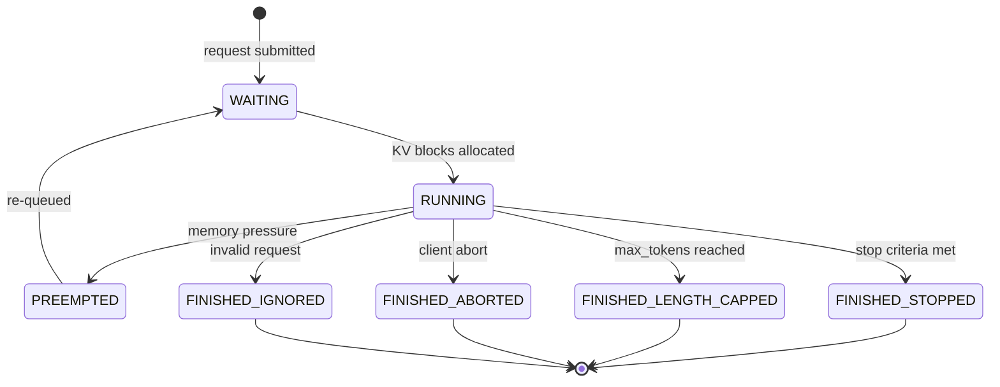

# Scheduler Design

This document describes the V1 scheduler in vLLM, covering its unified
scheduling algorithm, continuous batching, chunked prefill, speculative
decoding integration, and preemption policy.

[TOC]

## Overview

The V1 scheduler (`vllm/v1/core/sched/scheduler.py`) is responsible for
deciding, at each engine step, which requests to run and how many tokens each
request should process. It is designed around a single, unified model of
computation that eliminates the traditional distinction between a "prefill
phase" and a "decode phase".

### Design Philosophy

> *"There's no 'decoding phase' nor 'prefill phase' in the scheduler. Each
> request just has `num_computed_tokens` and `num_tokens_with_spec`.
> At each step, the scheduler tries to assign tokens to the requests so that
> each request's `num_computed_tokens` can catch up its
> `num_tokens_with_spec`."*
>
> — Source comment in `scheduler.py`

This unified model naturally handles:

- **Standard prefill** — a new request with many prompt tokens.
- **Standard decode** — a running request generating one token per step.
- **Chunked prefill** — a long prompt split across multiple steps.
- **Speculative decoding** — draft tokens appended to `num_tokens_with_spec`.
- **Resumed preempted requests** — treated identically to new requests.

---

## Request States

Each request moves through the following states:



Additional transient states for advanced features:

| State | Description |
|---|---|
| `WAITING_FOR_REMOTE_KVS` | Waiting for async KV transfer from a remote engine (P/D disaggregation) |
| `WAITING_FOR_FSM` | Waiting for structured output FSM compilation to complete |
| `WAITING_FOR_STREAMING_REQ` | Waiting for the next chunk of a streaming input |

---

## Scheduling Algorithm

The `schedule()` method runs once per engine step and produces a
`SchedulerOutput` that tells the model executor exactly what to compute.

### Token Budget

Each step has a **token budget** — the maximum number of tokens that can be
processed in a single forward pass:

```python
token_budget = max_num_scheduled_tokens  # or max_num_batched_tokens
```

The scheduler allocates this budget across requests in two phases:

1. **Running requests first** — requests already in the running queue are
   scheduled before any new requests are admitted.
2. **Waiting requests second** — new requests are admitted from the waiting
   queue until the budget is exhausted or `max_num_running_reqs` is reached.

### Phase 1: Schedule Running Requests

For each running request, the scheduler computes:

```python
num_new_tokens = (
    request.num_tokens_with_spec        # prompt + output + spec tokens
    + request.num_output_placeholders   # async scheduling lookahead
    - request.num_computed_tokens       # already processed
)
num_new_tokens = min(num_new_tokens, token_budget)
```

If the request cannot be scheduled (e.g., no free KV blocks), the scheduler
**preempts** the lowest-priority request to free blocks. Preempted requests are
moved back to the waiting queue with `num_computed_tokens` reset to 0.

#### Long Prefill Throttling

To prevent a single very long prefill from monopolizing the token budget and
starving decode requests, the scheduler supports a
`long_prefill_token_threshold`:

```python
if 0 < long_prefill_token_threshold < num_new_tokens:
    num_new_tokens = long_prefill_token_threshold
```

This caps the number of tokens a single prefill can consume per step, ensuring
decode requests continue to make progress.

### Phase 2: Schedule Waiting Requests

After scheduling running requests, the scheduler admits new requests from the
waiting queue:

```python
while waiting_queue and token_budget > 0:
    if len(running) == max_num_running_reqs:
        break

    request = waiting_queue.peek()

    # 1. Check prefix cache for locally cached blocks
    computed_blocks, num_cached_tokens = kv_cache_manager.get_computed_blocks(request)

    # 2. Check external KV connector (P/D disaggregation)
    if connector:
        ext_tokens, load_async = connector.get_num_new_matched_tokens(request, ...)

    # 3. Compute tokens to schedule
    num_new_tokens = request.num_tokens - num_computed_tokens
    if not enable_chunked_prefill and num_new_tokens > token_budget:
        break  # Cannot schedule without chunking

    # 4. Allocate KV blocks
    new_blocks = kv_cache_manager.allocate_slots(request, num_new_tokens, ...)

    # 5. Move to running queue
    running.append(request)
```

#### Chunked Prefill

When `enable_chunked_prefill=True`, a new request's prompt can be split across
multiple steps. This allows decode requests to interleave with long prefills,
reducing time-to-first-token for already-running requests.

Without chunked prefill, a new request must be scheduled in its entirety or not
at all. If the prompt is longer than the remaining token budget, the request
waits until a step with sufficient budget.

With chunked prefill, the scheduler can schedule `min(num_new_tokens, token_budget)`
tokens, and the request will continue in subsequent steps.

```
Without chunked prefill:
  Step 1: [Decode A] [Decode B] [Decode C]
  Step 2: [Prefill X (1024 tokens)]          ← entire budget consumed
  Step 3: [Decode X] [Decode A] [Decode B]

With chunked prefill:
  Step 1: [Decode A] [Decode B] [Decode C] [Prefill X chunk 1 (256 tokens)]
  Step 2: [Decode A] [Decode B] [Decode C] [Prefill X chunk 2 (256 tokens)]
  Step 3: [Decode A] [Decode B] [Decode C] [Prefill X chunk 3 (256 tokens)]
  Step 4: [Decode A] [Decode B] [Decode C] [Prefill X chunk 4 (256 tokens)]
  Step 5: [Decode A] [Decode B] [Decode C] [Decode X]
```

---

## Continuous Batching

vLLM uses **continuous batching** (also called iteration-level scheduling):
the scheduler makes a new scheduling decision at every engine step, rather than
waiting for an entire batch to finish before admitting new requests.

This means:

- A request that finishes mid-step frees its KV blocks immediately.
- New requests can be admitted in the very next step.
- The batch composition changes dynamically every step.

Continuous batching is the key mechanism that allows vLLM to achieve high GPU
utilization even with variable-length requests.

---

## Preemption

When the KV cache is full and a new block is needed, the scheduler must
**preempt** a running request to free blocks.

### Preemption Policy

The preemption target depends on the scheduling policy:

| Policy | Preemption Target |
|---|---|
| FCFS (default) | The last request in the running queue (lowest priority by arrival order) |
| PRIORITY | The request with the highest priority value (numerically largest = lowest priority) |

Preempted requests:

1. Have their KV blocks freed immediately.
2. Are moved back to the front of the waiting queue.
3. Have `num_computed_tokens` reset to 0 (full recomputation required).
4. Have their `num_preemptions` counter incremented.

!!! note
    vLLM V1 uses **recompute-based preemption** exclusively. There is no
    swap-to-CPU mechanism. Preempted requests must recompute their KV cache
    from scratch when rescheduled. Prefix caching can mitigate this cost if
    the prompt was previously cached.

---

## Scheduling Policies

The waiting queue supports two scheduling policies, configured via
`--scheduling-policy`:

### FCFS (First-Come, First-Served)

The default policy. Requests are scheduled in the order they arrive. This
provides fairness and predictable latency for most workloads.

```python
class FCFSRequestQueue(deque[Request], RequestQueue):
    def add_request(self, request):
        self.append(request)  # append to tail
```

### Priority

Requests are scheduled by a user-specified priority value (lower value = higher
priority). Requests with equal priority are ordered by arrival time (FCFS
within a priority level).

```python
class PriorityRequestQueue(RequestQueue):
    # Uses a min-heap ordered by (priority, arrival_time)
```

Priority scheduling is useful for multi-tenant deployments where different
request classes have different SLA requirements.

---

## Speculative Decoding Integration

The scheduler has first-class support for speculative decoding (e.g., EAGLE).

### Draft Token Scheduling

When a request has pending draft tokens (`request.spec_token_ids`), the
scheduler includes them in `num_tokens_with_spec`:

```python
num_new_tokens = (
    request.num_tokens_with_spec
    + request.num_output_placeholders
    - request.num_computed_tokens
)
```

The draft tokens are scheduled alongside the verified tokens, allowing the
model to verify multiple tokens in a single forward pass.

### Lookahead Allocation

The KV cache manager allocates extra blocks for speculative tokens
(`num_lookahead_tokens`) so that accepted draft tokens have KV cache space
ready without requiring a new allocation step.

### Draft Token ID Updates

After each step, the scheduler calls `update_draft_token_ids()` to receive
new draft token proposals from the speculative decoding proposer (e.g., the
EAGLE draft model). These are stored on the request and included in the next
scheduling step.

---

## Encoder-Decoder Support

For encoder-decoder models (e.g., Whisper, BART), the scheduler manages a
separate **encoder cache** alongside the KV cache:

- **Encoder compute budget** — limits the number of encoder input tokens
  processed per step.
- **Encoder cache manager** — tracks which encoder outputs are cached and
  available for cross-attention.
- **Encoder input scheduling** — `_try_schedule_encoder_inputs()` determines
  which encoder inputs need to be computed in the current step.

---

## Mamba / Hybrid Model Support

For hybrid models that combine attention layers with Mamba (SSM) layers, the
scheduler supports **block-aligned splitting**:

```python
if need_mamba_block_aligned_split:
    num_new_tokens = _mamba_block_aligned_split(request, num_new_tokens)
```

This ensures that Mamba state caching works correctly by aligning chunk
boundaries to block boundaries. Without this alignment, the Mamba state cache
would be invalidated on every step.

---

## SchedulerOutput

The `SchedulerOutput` dataclass is the contract between the scheduler and the
model executor. It contains everything the executor needs to run a forward pass:

```python
@dataclass
class SchedulerOutput:
    # New requests being scheduled for the first time
    scheduled_new_reqs: list[NewRequestData]

    # Requests that were preempted and are now resuming
    scheduled_cached_reqs: list[CachedRequestData]

    # Number of tokens to process per request
    num_scheduled_tokens: dict[str, int]

    # Total tokens across all requests
    total_num_scheduled_tokens: int

    # Speculative decode token IDs per request
    scheduled_spec_decode_tokens: dict[str, list[int]]

    # Encoder inputs to process per request
    scheduled_encoder_inputs: dict[str, list[int]]

    # Common prefix blocks (for cascade attention optimization)
    num_common_prefix_blocks: list[int]

    # Requests that finished since the last step
    finished_req_ids: set[str]

    # Requests preempted in this step
    preempted_req_ids: set[str]

    # KV connector metadata (P/D disaggregation)
    kv_connector_metadata: KVConnectorMetadata | None
```

---

## update_from_output

After the model executor completes a forward pass, the scheduler calls
`update_from_output(scheduler_output, model_output)` to:

1. **Advance `num_computed_tokens`** for each scheduled request.
2. **Append new output tokens** to each request's token list.
3. **Check stop conditions** — max tokens, stop strings, EOS token.
4. **Handle speculative decoding** — accept or reject draft tokens, adjust
   `num_computed_tokens` accordingly.
5. **Free finished requests** — release KV blocks and move to finished state.
6. **Build `EngineCoreOutputs`** — package new tokens and finish reasons for
   the API server.

---

## Statistics and Observability

The scheduler tracks detailed statistics for monitoring and debugging:

| Metric | Description |
|---|---|
| `num_running_reqs` | Current number of running requests |
| `num_waiting_reqs` | Current number of waiting requests |
| `gpu_cache_usage` | KV cache utilization (0.0–1.0) |
| `prefix_cache_hit_rate` | Fraction of prompt tokens served from cache |
| `num_preemptions` | Total preemptions since last stats reset |
| `spec_decode_draft_acceptance_rate` | Fraction of draft tokens accepted |

These are collected in `SchedulerStats` and emitted to Prometheus and log files
at configurable intervals.

---

## Source Files

| File | Description |
|---|---|
| [`vllm/v1/core/sched/scheduler.py`](../../vllm/v1/core/sched/scheduler.py) | Main scheduler implementation |
| [`vllm/v1/core/sched/interface.py`](../../vllm/v1/core/sched/interface.py) | `SchedulerInterface` abstract base |
| [`vllm/v1/core/sched/output.py`](../../vllm/v1/core/sched/output.py) | `SchedulerOutput` and related dataclasses |
| [`vllm/v1/core/sched/request_queue.py`](../../vllm/v1/core/sched/request_queue.py) | FCFS and priority queue implementations |
| [`vllm/v1/core/sched/utils.py`](../../vllm/v1/core/sched/utils.py) | Stop-condition checking utilities |
| [`vllm/v1/request.py`](../../vllm/v1/request.py) | `Request` dataclass and `RequestStatus` enum |
