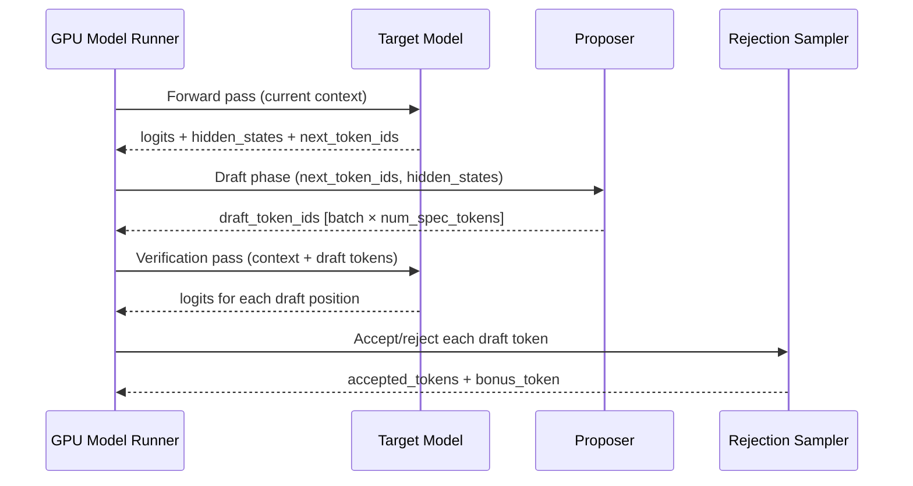

# Speculative decoding — internal design

This document describes the internal architecture of speculative decoding in
vLLM v1. It is intended for contributors who want to understand how the system
works, add new proposer methods, or debug existing ones.

For user-facing documentation, see the
[speculative decoding overview](../features/speculative_decoding/README.md).

---

## Table of contents

1. [High-level architecture](#1-high-level-architecture)
2. [Configuration — SpeculativeConfig](#2-configuration--speculativeconfig)
3. [Proposer class hierarchy](#3-proposer-class-hierarchy)
4. [EAGLE proposer internals](#4-eagle-proposer-internals)
5. [N-gram proposer internals](#5-n-gram-proposer-internals)
6. [Medusa proposer internals](#6-medusa-proposer-internals)
7. [Rejection sampling and verification](#7-rejection-sampling-and-verification)
8. [Metadata and data flow](#8-metadata-and-data-flow)
9. [CUDA graph support](#9-cuda-graph-support)
10. [Metrics and observability](#10-metrics-and-observability)
11. [Adding a new proposer](#11-adding-a-new-proposer)

---

## 1. High-level architecture

Speculative decoding in vLLM v1 is implemented as a two-phase loop inside the
GPU model runner:



```
┌─────────────────────────────────────────────────────────────────┐
│  GPU Model Runner — one iteration                               │
│                                                                 │
│  1. Target model forward pass                                   │
│     ├── Produces: logits, hidden_states                         │
│     └── Samples: next_token_ids (one per request)               │
│                                                                 │
│  2. Proposer (draft phase)                                      │
│     ├── Input: next_token_ids, hidden_states, attn_metadata     │
│     └── Output: draft_token_ids [batch, num_speculative_tokens] │
│                                                                 │
│  3. Target model verification pass                              │
│     ├── Input: draft_token_ids appended to context              │
│     └── Output: logits for each draft position                  │
│                                                                 │
│  4. Rejection sampling                                          │
│     ├── Accept/reject each draft token                          │
│     └── Emit accepted tokens + one bonus token                  │
└─────────────────────────────────────────────────────────────────┘
```

The proposer is selected at startup based on `SpeculativeConfig.method` and
runs inside the same GPU worker process as the target model.

---

## 2. Configuration — SpeculativeConfig

All speculative decoding configuration lives in
`vllm/config/speculative.py` as the `SpeculativeConfig` dataclass.

### Key fields

| Field | Type | Description |
|---|---|---|
| `method` | `SpeculativeMethod` | Proposer method: `"eagle"`, `"eagle3"`, `"ngram"`, `"ngram_gpu"`, `"medusa"`, `"mlp_speculator"`, `"draft_model"`, `"mtp"`, `"suffix"`. |
| `model` | `str \| None` | Hugging Face model ID or local path of the draft model / head. |
| `num_speculative_tokens` | `int` | Number of draft tokens to generate per step. |
| `draft_tensor_parallel_size` | `int \| None` | TP size for the draft model. Must be `1` or equal to target TP size. |
| `speculative_token_tree` | `str \| None` | Tree structure for multi-path drafting, as a Python list-of-tuples literal. |
| `parallel_drafting` | `bool` | Generate all draft tokens in one parallel pass. |
| `prompt_lookup_min` | `int \| None` | Minimum n-gram length (ngram methods only). |
| `prompt_lookup_max` | `int \| None` | Maximum n-gram length (ngram methods only). |
| `use_local_argmax_reduction` | `bool` | Use vocab-parallel local argmax for draft token selection. |
| `disable_padded_drafter_batch` | `bool` | Disable input padding for the draft batch. |
| `draft_model_config` | `ModelConfig` | Auto-populated draft model config (internal). |
| `draft_parallel_config` | `ParallelConfig` | Auto-populated draft parallel config (internal). |

### Method auto-detection

`SpeculativeConfig.__post_init__` auto-detects the method from the draft
model's `config.json` when `method` is not explicitly set:

- `model_type == "medusa"` → `method = "medusa"`
- `model_type == "mlp_speculator"` → `method = "mlp_speculator"`
- `"eagle-"` in model name → `method = "eagle"`
- `"eagle3"` in model name → `method = "eagle3"`
- `model_type` in `MTPModelTypes` → `method = "mtp"`
- Otherwise → `method = "draft_model"`

### Token tree generation

When `speculative_token_tree` is not set, `__post_init__` generates a linear
chain:

```python
# num_speculative_tokens = 3 → [(0,), (0, 0), (0, 0, 0)]
speculative_token_tree = str(
    [(i + 1) * (0,) for i in range(num_speculative_tokens)]
)
```

When `speculative_token_tree` is set, it is sorted breadth-first:

```python
tree_choices = ast.literal_eval(speculative_token_tree)
speculative_token_tree = str(
    sorted(tree_choices, key=lambda t: (len(t), t))
)
```

---

## 3. Proposer class hierarchy

All proposers live in `vllm/v1/spec_decode/`:

```
SpecDecodeBaseProposer          (eagle.py)
├── EagleProposer               (eagle.py)
│   └── pass_hidden_states_to_model = True
└── DraftModelProposer          (draft_model.py)
    └── pass_hidden_states_to_model = False

MedusaProposer                  (medusa.py)
NgramProposer                   (ngram_proposer.py)
NgramProposerGPU                (ngram_proposer_gpu.py)
SuffixDecodingProposer          (suffix_decoding.py)
```

### SpecDecodeBaseProposer

`SpecDecodeBaseProposer` is the base class for all neural-network-based
proposers. It handles:

- Persistent GPU buffers (`input_ids`, `positions`, `hidden_states`,
  `inputs_embeds`).
- Position encoding variants (standard RoPE, M-RoPE, xDRoPE).
- Slot mapping management for KV cache.
- CUDA graph dispatch via `CudagraphDispatcher`.
- Tree structure parsing and precomputation.
- Parallel drafting support.
- Embedding sharing with the target model.

### EagleProposer vs. DraftModelProposer

The key difference is `pass_hidden_states_to_model`:

- `EagleProposer` sets `pass_hidden_states_to_model = True`. The target
  model's hidden states are passed to the draft model as an additional input.
- `DraftModelProposer` sets `pass_hidden_states_to_model = False`. The draft
  model is a standalone LLM that does not receive hidden states.

This flag also controls whether the input batch needs to be expanded with extra
slots per request (`needs_extra_input_slots`).

---

## 4. EAGLE proposer internals

### Propose method

The `propose` method in `SpecDecodeBaseProposer` implements the full draft
generation loop:

```
propose(target_token_ids, target_positions, target_hidden_states,
        next_token_ids, common_attn_metadata, sampling_metadata)
    │
    ├── set_inputs_first_pass()
    │   ├── Shift input_ids by one position
    │   ├── Insert next_token_ids at the last slot per request
    │   └── Copy hidden_states to buffer
    │
    ├── Build per-layer attention metadata
    │
    ├── Run draft model forward pass (first draft token)
    │
    ├── If num_speculative_tokens == 1 or parallel_drafting:
    │   └── Return argmax of hidden states
    │
    └── Loop for remaining draft tokens:
        ├── Update input_ids, positions, hidden_states
        ├── Run draft model forward pass
        └── Append argmax to draft_token_ids_list
```

### Input preparation — standard path

For EAGLE (no extra input slots needed), `set_inputs_first_pass` shifts the
input token IDs by one position and inserts the newly sampled token:

```python
# Before: [a1, b1, b2, c1, c2, c3]
# After:  [a2, b2, b3, c2, c3, c4]
self.input_ids[:num_tokens - 1] = target_token_ids[1:]
self.input_ids[token_indices_to_sample] = next_token_ids
```

### Input preparation — padded drafter batch path

For draft models and parallel drafting (`needs_extra_input_slots = True`),
a custom Triton kernel (`copy_and_expand_eagle_inputs_kernel`) expands the
input batch by inserting extra slots per request. This allows the draft model
to process all requests in a single padded batch even when they have different
numbers of rejected tokens.

### Tree attention

When `num_speculative_tokens > 1` and the attention backend supports
`TreeAttentionMetadata`, `propose_tree` is called instead of the sequential
loop. The tree attention backend evaluates all nodes in the draft tree in a
single forward pass per tree level.

Tree structure precomputation in `__init__`:

```python
# Parse tree_choices from speculative_token_tree
self.tree_choices = ast.literal_eval(spec_token_tree)
tree_depth = len(self.tree_choices[-1])

# Precompute per-level draft counts
num_drafts_per_level = [0] * tree_depth
for node in self.tree_choices:
    num_drafts_per_level[len(node) - 1] += 1

# Cumulative draft counts per level
self.cu_drafts_per_level = [num_drafts_per_level[0]]
for level in range(1, tree_depth):
    self.cu_drafts_per_level.append(
        self.cu_drafts_per_level[-1] + num_drafts_per_level[level]
    )
```

### Embedding sharing

`_maybe_share_embeddings` detects whether the EAGLE draft model has its own
embedding weights or should share the target model's:

1. If `model.has_own_embed_tokens` is `False` → share unconditionally.
2. If the draft model's `embed_tokens.weight` is identical to the target's
   (checked via `torch.equal`) → share to save memory.
3. Otherwise → keep separate weights.

Similarly, `_maybe_share_lm_head` shares the LM head when the draft model
does not have its own.

### EAGLE3 auxiliary hidden states

For `method == "eagle3"`, the target model is configured to return auxiliary
hidden states from intermediate layers (via `extract_hidden_states` or
`eagle3` mode). The `propose` method calls:

```python
target_hidden_states = self.model.combine_hidden_states(target_hidden_states)
```

This concatenates the auxiliary hidden states with the final hidden state
before passing them to the draft model.

---

## 5. N-gram proposer internals

### CPU implementation (NgramProposer)

`NgramProposer` in `ngram_proposer.py` uses Numba-JIT compiled code for fast
CPU-side lookup. The core algorithm is implemented in
`_find_longest_matched_ngram_and_propose_tokens`:

1. Reverse the token sequence (so suffix matching becomes prefix matching).
2. Compute the KMP failure function (LPS array) for the reversed sequence,
   capped at `max_ngram` length.
3. Find the earliest position where the reversed prefix matches the reversed
   suffix.
4. Extract `k` tokens starting after the match.

The algorithm runs in O(n) time per request using the KMP failure function.

**Threading:** Numba parallel processing is used when the total token count
exceeds `num_tokens_threshold` (8192). The number of threads is capped at
`min(1, cpu_count // 2) // tp_size` to avoid contention with other components.

**Warm-up:** The proposer triggers Numba JIT compilation at startup with a
dummy batch of 1024 sequences to avoid first-call latency.

### GPU implementation (NgramProposerGPU)

`NgramProposerGPU` in `ngram_proposer_gpu.py` uses fully vectorized PyTorch
operations compiled with `torch.compile`. The core algorithm is in
`NgramGPUKernel._find_first_and_extract_all_n_parallel`:

1. For each n-gram length from `min_n` to `max_n`:
   - Use `torch.unfold` to create sliding windows of size `n` (O(1) view).
   - Extract the trailing suffix of each sequence.
   - Find the earliest window that matches the suffix using `argmax`.
   - Store the match position.
2. Select the longest n-gram with a valid match.
3. Extract `k` draft tokens starting after the match.
4. Mask out invalid positions (no match, or beyond sequence end).

The GPU implementation avoids data-dependent branching to be compatible with
`torch.compile` and CUDA graphs.

**Compilation config:** `NgramProposerGPU` uses a dedicated `CompilationConfig`
with `max_autotune=True`, `aggressive_fusion=True`, and
`coordinate_descent_tuning=True` for maximum performance.

---

## 6. Medusa proposer internals

`MedusaProposer` in `medusa.py` is the simplest proposer. It:

1. Receives the target model's final hidden states.
2. Passes them to the Medusa model (a collection of MLP heads).
3. Computes logits for each head.
4. Takes the argmax of each head's logits.
5. Stacks the results into a `[batch_size, num_heads]` tensor.

```python
def propose(self, target_hidden_states, sampling_metadata, ...):
    blocks = self.model(target_hidden_states)
    logits = self.model.compute_logits(blocks)
    draft_tokens = torch.stack(
        [logit.argmax(dim=-1) for logit in logits], dim=1
    )
    return draft_tokens
```

The Medusa model is loaded with `get_model` using the draft model config. The
model tag `"medusa_head"` is set during loading for compilation isolation.

---

## 7. Rejection sampling and verification

After the proposer generates draft tokens, the GPU model runner:

1. Appends the draft tokens to each request's context.
2. Runs the target model on the expanded batch (one forward pass).
3. Collects logits at each draft position.
4. Applies rejection sampling:
   - For greedy requests: accept if the draft token equals the target argmax.
   - For random requests: apply the standard speculative sampling correction.
5. Emits accepted tokens plus one *bonus token* (the target model's own
   prediction at the last accepted position).

### SpecDecodeMetadata

`SpecDecodeMetadata` (in `metadata.py`) carries the information needed for
the verification pass:

| Field | Shape | Description |
|---|---|---|
| `draft_token_ids` | `[num_tokens]` | Flattened draft token IDs. |
| `num_draft_tokens` | `[batch_size]` | Number of draft tokens per request. |
| `cu_num_draft_tokens` | `[batch_size]` | Cumulative draft token counts. |
| `cu_num_sampled_tokens` | `[batch_size]` | Cumulative sampled token counts. |
| `target_logits_indices` | `[num_tokens]` | Indices into target logits for draft positions. |
| `bonus_logits_indices` | `[batch_size]` | Indices into target logits for bonus positions. |
| `logits_indices` | `[num_tokens + batch_size]` | Combined indices for all logits. |

---

## 8. Metadata and data flow

### CommonAttentionMetadata

`CommonAttentionMetadata` is the primary data structure passed between the
scheduler, the target model, and the proposer. It contains:

- `query_start_loc` — cumulative query lengths (GPU tensor).
- `seq_lens` — sequence lengths per request (GPU tensor).
- `slot_mapping` — KV cache slot assignments (GPU tensor).
- `block_table_tensor` — block table for paged attention.
- `num_actual_tokens` — total number of tokens in the batch.
- `max_query_len` — maximum query length in the batch.

### Data flow for EAGLE

```
Scheduler
  │ SchedulerOutput (req_ids, num_scheduled_tokens, ...)
  ▼
GPU Model Runner
  │
  ├── Target model forward pass
  │   Input:  input_ids, positions, attn_metadata
  │   Output: logits, hidden_states
  │
  ├── Sampler
  │   Input:  logits, sampling_metadata
  │   Output: next_token_ids (one per request)
  │
  ├── EagleProposer.propose()
  │   Input:  target_token_ids, target_positions, target_hidden_states,
  │           next_token_ids, common_attn_metadata
  │   Output: draft_token_ids [batch, num_speculative_tokens]
  │
  ├── Target model verification pass
  │   Input:  draft_token_ids appended to context
  │   Output: logits at each draft position
  │
  └── Rejection sampler
      Input:  draft_token_ids, target_logits, draft_probs
      Output: accepted_token_ids, num_accepted_tokens
```

### Slot mapping for draft KV cache

The EAGLE draft model has its own KV cache (separate from the target model's).
`_get_slot_mapping` manages a shared buffer for the draft attention layers'
slot mappings:

```python
def _get_slot_mapping(self, num_tokens, slot_mapping=None):
    if slot_mapping is not None:
        self._slot_mapping_buffer[:num_actual].copy_(slot_mapping)
        # Fill remaining slots with PADDING_SLOT_ID
        self._slot_mapping_buffer[num_actual:num_tokens].fill_(PADDING_SLOT_ID)
    return {name: self._slot_mapping_buffer[:num_tokens]
            for name in self._draft_attn_layer_names}
```

---

## 9. CUDA graph support

### Target model

The target model uses the standard vLLM CUDA graph mechanism (`FULL` or
`PIECEWISE` mode) controlled by `CUDAGraphMode`.

### EAGLE draft model

The EAGLE draft model uses `PIECEWISE` CUDA graphs only, managed by
`CudagraphDispatcher`. This is because the draft model's batch size varies
per step (it depends on how many tokens were accepted in the previous step).

`initialize_cudagraph_keys` is called after `adjust_cudagraph_sizes_for_spec_decode`
to set up the dispatch table:

```python
def initialize_cudagraph_keys(self, cudagraph_mode):
    if not enforce_eager and cudagraph_mode.mixed_mode() in [PIECEWISE, FULL]:
        eagle_cudagraph_mode = CUDAGraphMode.PIECEWISE
    else:
        eagle_cudagraph_mode = CUDAGraphMode.NONE
    self.cudagraph_dispatcher.initialize_cudagraph_keys(eagle_cudagraph_mode)
```

### N-gram GPU

`NgramProposerGPU` uses `torch.compile` with `CUDAGraphMode.NONE` (no CUDA
graphs) because the GPU kernel is already compiled and optimized by
`torch.compile`.

---

## 10. Metrics and observability

### Per-step stats (SpecDecodingStats)

`SpecDecodingStats` in `metrics.py` accumulates per-step statistics:

| Field | Description |
|---|---|
| `num_spec_tokens` | Configured number of speculative tokens. |
| `num_drafts` | Number of draft attempts in this step. |
| `num_draft_tokens` | Total draft tokens generated. |
| `num_accepted_tokens` | Total draft tokens accepted. |
| `num_accepted_tokens_per_pos` | Accepted tokens broken down by draft position. |

### Logging (SpecDecodingLogging)

`SpecDecodingLogging` aggregates stats over a time window and logs:

- Mean acceptance length (including bonus token): `1 + accepted / drafts`
- Accepted throughput (tokens/s)
- Drafted throughput (tokens/s)
- Per-position acceptance rate vector

### Prometheus (SpecDecodingProm)

`SpecDecodingProm` exposes the following counters:

| Metric | Description |
|---|---|
| `vllm:spec_decode_num_drafts` | Total draft attempts. |
| `vllm:spec_decode_num_draft_tokens` | Total draft tokens generated. |
| `vllm:spec_decode_num_accepted_tokens` | Total accepted tokens. |
| `vllm:spec_decode_num_accepted_tokens_per_pos{position=N}` | Accepted tokens at position N. |

---

## 11. Adding a new proposer

To add a new speculative decoding method:

### Step 1: Add the method name to SpeculativeConfig

In `vllm/config/speculative.py`, add the new method name to `SpeculativeMethod`:

```python
SpeculativeMethod = Literal[
    "ngram",
    "medusa",
    "mlp_speculator",
    "draft_model",
    "suffix",
    "my_new_method",   # ← add here
    EagleModelTypes,
    NgramGPUTypes,
]
```

### Step 2: Implement the proposer class

Create a new file in `vllm/v1/spec_decode/`. Your proposer must implement:

```python
class MyNewProposer:
    def __init__(self, vllm_config: VllmConfig, device: torch.device):
        ...

    def propose(
        self,
        # Method signature depends on proposer type.
        # See existing proposers for examples.
        ...
    ) -> torch.Tensor | list[list[int]]:
        # Return draft_token_ids: [batch_size, num_speculative_tokens]
        # or list[list[int]] for variable-length proposals.
        ...

    def load_model(self, target_model: nn.Module) -> None:
        # Load any model weights needed.
        ...
```

### Step 3: Register the proposer

In the GPU model runner's proposer factory (search for `EagleProposer` in
`vllm/v1/worker/gpu_model_runner.py`), add a branch for your new method:

```python
elif spec_config.method == "my_new_method":
    proposer = MyNewProposer(vllm_config, device)
```

### Step 4: Handle configuration

In `SpeculativeConfig.__post_init__`, add any method-specific validation and
default-value logic.

### Step 5: Add tests

Add end-to-end tests in `tests/v1/spec_decode/` that verify:

- Greedy sampling with your method produces the same output as without
  speculative decoding.
- The proposer handles edge cases (empty batch, max model length, etc.).

---

## See also

- [Speculative decoding overview](../features/speculative_decoding/README.md)
- [EAGLE guide](../features/speculative_decoding/eagle.md)
- [Medusa guide](../features/speculative_decoding/medusa.md)
- [N-gram guide](../features/speculative_decoding/ngram.md)
- [SpeculativeConfig source](../../vllm/config/speculative.py)
- [EAGLE source](../../vllm/v1/spec_decode/eagle.py)
- [N-gram CPU source](../../vllm/v1/spec_decode/ngram_proposer.py)
- [N-gram GPU source](../../vllm/v1/spec_decode/ngram_proposer_gpu.py)
- [Medusa source](../../vllm/v1/spec_decode/medusa.py)
- [Metrics source](../../vllm/v1/spec_decode/metrics.py)
