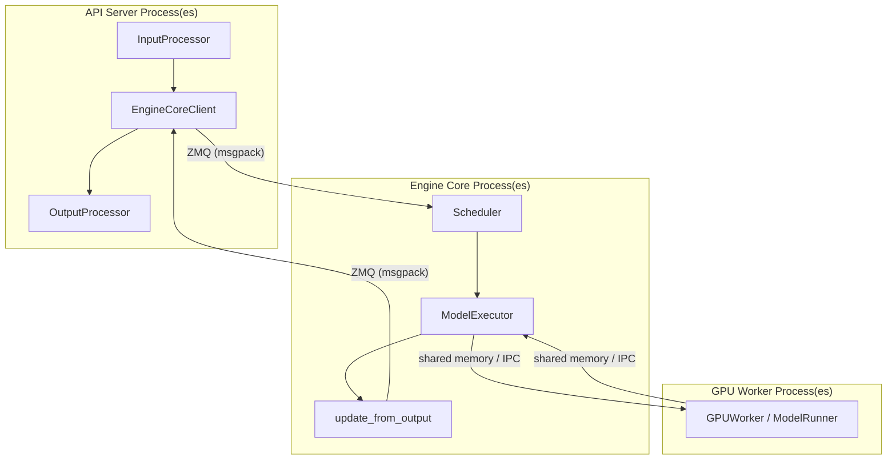

# V1 Engine Architecture

This document describes the internal architecture of vLLM's V1 engine, covering
the `AsyncLLM` front-end, the `EngineCore` inner loop, and the `EngineCoreClient`
communication layer that connects them.

[TOC]

## Overview

The V1 engine is a ground-up redesign of vLLM's inference stack. Its primary
goals are:

- **Throughput**: Eliminate Python-level bottlenecks by separating scheduling
  from I/O and model execution.
- **Scalability**: Support data parallelism, tensor parallelism, and pipeline
  parallelism through a clean multi-process architecture.
- **Simplicity**: Provide a single, unified scheduling loop that handles
  prefill, decode, chunked prefill, and speculative decoding without special
  cases.

The V1 engine is composed of three major layers:



```
┌─────────────────────────────────────────────────────────────┐
│                    API Server Process(es)                    │
│  ┌──────────────────────────────────────────────────────┐   │
│  │                      AsyncLLM                        │   │
│  │  InputProcessor ──► EngineCoreClient ──► OutputProc  │   │
│  └──────────────────────────────────────────────────────┘   │
└───────────────────────────┬─────────────────────────────────┘
                            │ ZMQ (msgpack)
┌───────────────────────────▼─────────────────────────────────┐
│                  Engine Core Process(es)                     │
│  ┌──────────────────────────────────────────────────────┐   │
│  │                     EngineCore                       │   │
│  │  Scheduler ──► ModelExecutor ──► update_from_output  │   │
│  └──────────────────────────────────────────────────────┘   │
└───────────────────────────┬─────────────────────────────────┘
                            │ shared memory / IPC
┌───────────────────────────▼─────────────────────────────────┐
│                    GPU Worker Process(es)                    │
│  ┌──────────────────────────────────────────────────────┐   │
│  │              GPUWorker / ModelRunner                 │   │
│  └──────────────────────────────────────────────────────┘   │
└─────────────────────────────────────────────────────────────┘
```

---

## AsyncLLM

`AsyncLLM` (defined in `vllm/v1/engine/async_llm.py`) is the primary
asynchronous front-end for the V1 engine. It implements the `EngineClient`
protocol and is used by the OpenAI-compatible API server.

### Responsibilities

| Responsibility | Component |
|---|---|
| Tokenization and input pre-processing | `InputProcessor` |
| Routing requests to the engine core | `EngineCoreClient` |
| Decoding token IDs back to text | `OutputProcessor` |
| Streaming results to callers | `asyncio` generators |
| Metrics and statistics logging | `StatLoggerManager` |

### Lifecycle

```
AsyncLLM.generate(prompt, sampling_params)
    │
    ├─► InputProcessor.process_inputs()
    │       Tokenize, validate, build EngineCoreRequest
    │
    ├─► EngineCoreClient.add_request(request)
    │       Send request to EngineCore via ZMQ
    │
    └─► output_loop (asyncio task)
            Poll EngineCoreClient.get_output_async()
            OutputProcessor.process_outputs()
            Yield RequestOutput to caller
```

### Input Processing

`InputProcessor` converts a raw `PromptType` (text, token IDs, or multimodal
content) into an `EngineCoreRequest`. This includes:

1. **Tokenization** — converting text to token IDs using the model's tokenizer.
2. **Multimodal pre-processing** — encoding images, audio, or video into
   feature tensors and computing their content hashes for prefix caching.
3. **Sampling parameter validation** — checking that `SamplingParams` are
   within model limits.
4. **Structured output initialization** — compiling finite-state machines (FSMs)
   for guided decoding in a background thread so compilation does not block the
   main loop.

### Output Processing

`OutputProcessor` converts `EngineCoreOutputs` (raw token IDs and finish
reasons from the engine core) into `RequestOutput` objects suitable for
streaming to API clients. It handles:

- **Incremental detokenization** — converting new token IDs to text without
  re-decoding the entire sequence.
- **Stop-string detection** — checking generated text against user-specified
  stop strings.
- **Logprob formatting** — converting raw log-probability tensors into the
  structured format expected by the API.
- **Parallel sampling** — fanning out a single `EngineCoreRequest` to multiple
  independent output streams when `n > 1`.

### Engine Loop

`AsyncLLM` runs a single `asyncio` background task (`_run_output_handler`) that
continuously polls the `EngineCoreClient` for new outputs and dispatches them to
waiting callers. This design keeps the hot path free of Python `await` overhead
for each individual token.

---

## EngineCore

`EngineCore` (defined in `vllm/v1/engine/core.py`) is the inner loop of the
V1 engine. It runs in a dedicated background process and owns the scheduler,
KV cache manager, and model executor.

### Class Hierarchy

```
EngineCore
└── EngineCoreProc          # ZMQ wrapper for background-process mode
    └── DPEngineCoreProc    # Data-parallel variant (MoE models)
```

`EngineCore` itself is used in in-process mode (e.g., the `LLM` class for
offline inference). `EngineCoreProc` adds ZMQ socket I/O and background threads
for use in the multi-process API server.

### Initialization Sequence

```
EngineCore.__init__()
    │
    ├─ 1. Load plugins
    ├─ 2. Create ModelExecutor (spawns GPU worker processes)
    ├─ 3. _initialize_kv_caches()
    │       ├─ get_kv_cache_specs()     # query workers for layer specs
    │       ├─ determine_available_memory()  # profile GPU memory
    │       ├─ get_kv_cache_configs()   # compute block counts
    │       └─ initialize_from_config() # allocate GPU tensors + warmup
    ├─ 4. Create StructuredOutputManager
    ├─ 5. Create Scheduler
    └─ 6. Set up batch queue (pipeline parallelism)
```

### KV Cache Initialization

The KV cache initialization is a critical startup step:

1. **Memory profiling** — the executor runs a dummy forward pass to measure
   peak GPU memory usage. The remaining memory (after model weights, activations,
   and a configurable `gpu_memory_utilization` headroom) is available for KV
   cache.
2. **Block count calculation** — `get_kv_cache_configs()` divides available
   memory by the per-block memory footprint to determine how many blocks to
   allocate. The block size is configurable (default 16 tokens).
3. **Tensor allocation** — workers allocate contiguous GPU tensors for the KV
   cache and register them with the model runner.
4. **Warmup** — a CUDA graph capture pass is run to pre-compile common batch
   shapes.

### The Step Loop

The core of `EngineCore` is the `step()` method, called repeatedly by the busy
loop:

```python
def step(self):
    if not self.scheduler.has_requests():
        return {}, False

    # 1. Schedule: decide which requests to run and how many tokens each gets
    scheduler_output = self.scheduler.schedule()

    # 2. Execute: dispatch to GPU workers (non-blocking)
    future = self.model_executor.execute_model(scheduler_output, non_block=True)

    # 3. Grammar bitmask (structured output)
    grammar_output = self.scheduler.get_grammar_bitmask(scheduler_output)

    # 4. Wait for model output
    model_output = future.result()

    # 5. Process aborts that arrived during execution
    self._process_aborts_queue()

    # 6. Update scheduler state from model output
    engine_core_outputs = self.scheduler.update_from_output(
        scheduler_output, model_output
    )
    return engine_core_outputs, scheduler_output.total_num_scheduled_tokens > 0
```

### Batch Queue (Pipeline Parallelism)

When pipeline parallelism is enabled (`pipeline_parallel_size > 1`), the engine
uses a **batch queue** to overlap scheduling with execution and eliminate
pipeline bubbles:

```
step_with_batch_queue():
    ├─ Schedule next batch → push future to batch_queue
    ├─ If queue not full → return immediately (schedule more)
    └─ If queue full → block on oldest future → process output
```

The batch queue depth equals `max_concurrent_batches`, which is determined by
the pipeline depth. This allows the scheduler to stay ahead of the GPU pipeline,
keeping all pipeline stages busy.

### Async Scheduling

When `async_scheduling=True`, the scheduler runs concurrently with the model
forward pass. The scheduler computes the next batch while the GPU is executing
the current one, reducing scheduling latency from the critical path.

### Sleep / Wake

`EngineCore` supports a tiered sleep mechanism for resource management:

| Level | Effect |
|---|---|
| 0 | Pause scheduling only; GPU memory unchanged |
| 1 | Offload model weights to CPU; discard KV cache |
| 2 | Release all GPU memory |

This is used by elastic serving deployments to reclaim GPU resources when a
model is idle.

---

## EngineCoreProc (Background Process Mode)

`EngineCoreProc` extends `EngineCore` with ZMQ-based inter-process
communication. It runs the engine in a dedicated OS process and communicates
with the API server via ZMQ sockets.

### Thread Architecture

```
EngineCoreProc (main thread)
    │
    ├─ input_thread  ──► process_input_sockets()
    │       Receives EngineCoreRequests from ZMQ
    │       Puts them on input_queue
    │
    ├─ output_thread ──► process_output_sockets()
    │       Takes EngineCoreOutputs from output_queue
    │       Sends them via ZMQ to API server(s)
    │
    └─ main thread   ──► run_busy_loop()
            _process_input_queue()   # drain input_queue
            _process_engine_step()   # call step()
```

The input and output threads release the Python GIL during ZMQ socket
operations, allowing them to overlap with the main thread's GPU execution.

### Startup Handshake

Before the busy loop starts, `EngineCoreProc` performs a startup handshake with
the API server:

1. **HELLO** — engine sends its identity and capabilities.
2. **INIT** — API server responds with ZMQ socket addresses and configuration.
3. **READY** — engine confirms it is ready, including the number of GPU blocks
   allocated.

This handshake ensures the API server knows the engine's address before
accepting client requests.

### Serialization

All messages between the API server and engine core are serialized using
**msgpack** via the `msgspec` library. This is significantly faster than
Python's `pickle` and produces compact binary payloads. The
`MsgpackEncoder`/`MsgpackDecoder` classes handle custom types such as numpy
arrays and PyTorch tensors.

---

## EngineCoreClient

`EngineCoreClient` (defined in `vllm/v1/engine/core_client.py`) is the
client-side abstraction used by `AsyncLLM` to communicate with `EngineCore`.
It has three concrete implementations:

### InprocClient

Used when `multiprocess_mode=False` (e.g., the `LLM` class for offline
inference). The engine core runs in the same process as the caller. No ZMQ
sockets are used; method calls are direct Python function calls.

```
AsyncLLM / LLM
    └─► InprocClient
            └─► EngineCore (same process)
```

### SyncMPClient

Used by the synchronous `LLM` class when `multiprocess_mode=True`. Communicates
with `EngineCoreProc` via ZMQ using blocking socket calls. A background thread
handles output polling.

```
LLM
    └─► SyncMPClient
            ├─► ZMQ PUSH socket (requests)
            └─► ZMQ PULL socket (outputs, background thread)
```

### AsyncMPClient

Used by `AsyncLLM` (the API server). Communicates with `EngineCoreProc` via
ZMQ using `asyncio`-compatible non-blocking sockets.

```
AsyncLLM
    └─► AsyncMPClient
            ├─► zmq.asyncio PUSH socket (requests)
            └─► zmq.asyncio PULL socket (outputs)
```

### Data Parallel Variants

When data parallelism is enabled (`data_parallel_size > 1`), specialized client
variants handle load balancing:

| Client | Load Balancing Mode |
|---|---|
| `DPLBAsyncMPClient` | Internal — client balances across all DP ranks |
| `DPAsyncMPClient` | External — one client per DP rank |

---

## Data Flow: End-to-End Request Lifecycle

The following diagram shows the complete lifecycle of a single request through
the V1 engine:

```
Client HTTP Request
        │
        ▼
API Server (FastAPI)
        │
        ▼
AsyncLLM.generate()
        │
        ├─► InputProcessor
        │       Tokenize → build EngineCoreRequest
        │
        ├─► EngineCoreClient.add_request()
        │       Serialize → ZMQ PUSH → EngineCoreProc.input_queue
        │
        │   [EngineCore busy loop]
        │       ├─ Scheduler.schedule()
        │       │       Prefix cache lookup
        │       │       KV block allocation
        │       │       Build SchedulerOutput
        │       │
        │       ├─ ModelExecutor.execute_model()
        │       │       Dispatch to GPU workers
        │       │       Forward pass
        │       │       Sample tokens
        │       │
        │       └─ Scheduler.update_from_output()
        │               Update request state
        │               Build EngineCoreOutputs
        │
        ├─► EngineCoreProc.output_queue
        │       ZMQ PUSH → AsyncMPClient
        │
        ├─► OutputProcessor.process_outputs()
        │       Detokenize → build RequestOutput
        │
        └─► AsyncGenerator yields RequestOutput
                Stream to HTTP client
```

---

## Configuration Reference

Key configuration parameters that affect V1 engine behavior:

| Parameter | Config Class | Description |
|---|---|---|
| `max_num_seqs` | `SchedulerConfig` | Maximum concurrent requests |
| `max_num_batched_tokens` | `SchedulerConfig` | Maximum tokens per step |
| `enable_chunked_prefill` | `SchedulerConfig` | Allow splitting prefills across steps |
| `gpu_memory_utilization` | `CacheConfig` | Fraction of GPU memory for KV cache |
| `block_size` | `CacheConfig` | Tokens per KV cache block |
| `enable_prefix_caching` | `CacheConfig` | Enable automatic prefix caching |
| `tensor_parallel_size` | `ParallelConfig` | Number of tensor parallel shards |
| `pipeline_parallel_size` | `ParallelConfig` | Number of pipeline stages |
| `data_parallel_size` | `ParallelConfig` | Number of data parallel replicas |

---

## Source Files

| File | Description |
|---|---|
| [`vllm/v1/engine/async_llm.py`](../../vllm/v1/engine/async_llm.py) | `AsyncLLM` front-end |
| [`vllm/v1/engine/core.py`](../../vllm/v1/engine/core.py) | `EngineCore` and `EngineCoreProc` |
| [`vllm/v1/engine/core_client.py`](../../vllm/v1/engine/core_client.py) | `EngineCoreClient` variants |
| [`vllm/v1/engine/input_processor.py`](../../vllm/v1/engine/input_processor.py) | Input tokenization and validation |
| [`vllm/v1/engine/output_processor.py`](../../vllm/v1/engine/output_processor.py) | Output detokenization |
| [`vllm/v1/engine/coordinator.py`](../../vllm/v1/engine/coordinator.py) | DP coordinator process |
| [`vllm/v1/engine/utils.py`](../../vllm/v1/engine/utils.py) | ZMQ address management |
