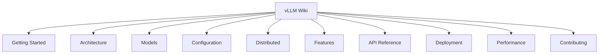
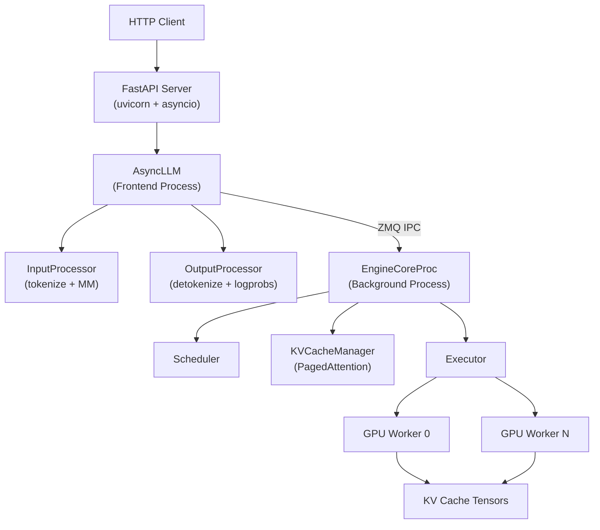

# vLLM Documentation

vLLM is a fast, flexible, and easy-to-use library for large language model (LLM) inference and serving. Built around **PagedAttention**, **continuous batching**, and the **V1 engine**, vLLM delivers state-of-the-art throughput and memory efficiency for production LLM deployments — from a single GPU to multi-node clusters.

```bash
pip install vllm
vllm serve meta-llama/Llama-3.1-8B-Instruct
```

---

## What's New

### V1 Engine — Complete Redesign

The V1 engine (`vllm/v1/`) is a ground-up redesign of vLLM's inference core, now the default for all deployments:

- **Dual-process architecture** — The API frontend (`AsyncLLM`) and the engine core (`EngineCoreProc`) run in separate OS processes connected via **ZeroMQ IPC**, keeping the asyncio event loop non-blocking while the engine runs a tight synchronous loop.
- **Unified scheduler** — A single scheduler handles prefill, decode, and chunked prefill in one pass, with O(1) KV cache block allocation via a doubly-linked LRU free list.
- **Piecewise `torch.compile`** — The model graph is split around attention ops and compiled in pieces, enabling CUDA graph capture for every subgraph while preserving dynamic attention kernels.
- **Async output processing** — Detokenization and logprob assembly run concurrently with the next scheduling step, hiding CPU overhead.

### Elastic Expert Parallelism (EPLB)

Dynamic load balancing for Mixture-of-Experts models. The EPLB algorithm redistributes expert replicas across GPUs at runtime based on observed routing statistics, eliminating expert hotspots without restarting the server. See [Elastic Expert Parallelism](07-distributed/elastic-ep.md) and [Deployment: Elastic EP](15-deployment/elastic-ep.md).

### Multi-Token Prediction (MTP)

Native support for models with built-in multi-token prediction heads (DeepSeek-V3, Ernie 4.5). MTP achieves speculative decoding speedups without a separate draft model — the target model itself proposes multiple tokens per step. See [MTP Speculative Decoding](10-speculative-decoding/mtp.md).

### MXFP4 Quantization

Microscaling FP4 quantization for MoE models, delivering 2× memory reduction over FP8 with minimal accuracy loss. Supported on SM80+ (Ampere and newer). See [MXFP4 Quantization](14-quantization/mxfp4.md).

### FlashInfer as Default on Blackwell

FlashInfer is now the default attention backend on NVIDIA Blackwell (SM100) GPUs, with CUTLASS MLA support for DeepSeek-style multi-head latent attention. See [Attention Backends](14-attention-backends/README.md).

---

## Quick Start

### Offline Inference

```python
from vllm import LLM, SamplingParams

llm = LLM(model="meta-llama/Llama-3.1-8B-Instruct")
sampling_params = SamplingParams(temperature=0.7, max_tokens=256)

outputs = llm.generate(["Tell me about PagedAttention."], sampling_params)
for output in outputs:
    print(output.outputs[0].text)
```

### Online Serving (OpenAI-Compatible)

```bash
# Start the server
vllm serve meta-llama/Llama-3.1-8B-Instruct --port 8000

# Chat completion
curl http://localhost:8000/v1/chat/completions \
  -H "Content-Type: application/json" \
  -d '{
    "model": "meta-llama/Llama-3.1-8B-Instruct",
    "messages": [{"role": "user", "content": "What is vLLM?"}],
    "max_tokens": 200
  }'
```

### Multi-GPU Serving

```bash
# 4-GPU tensor parallelism
vllm serve meta-llama/Llama-3.1-70B-Instruct --tensor-parallel-size 4

# 8-GPU with expert parallelism (MoE models)
vllm serve deepseek-ai/DeepSeek-V3 \
  --tensor-parallel-size 8 \
  --enable-expert-parallel

# Speculative decoding with EAGLE
vllm serve meta-llama/Llama-3.1-8B-Instruct \
  --speculative-model yuhuili/EAGLE-LLaMA3.1-Instruct-8B \
  --num-speculative-tokens 5
```

---

## Documentation Sections



| Section | Description |
|---------|-------------|
| [01 — Overview](01-overview/README.md) | What vLLM is, core innovations, design philosophy |
| [02 — Getting Started](02-getting-started/README.md) | Installation, quickstart, first API calls |
| [03 — Architecture](03-architecture/README.md) | V1 engine, ZMQ IPC, PagedAttention, scheduler |
| [04 — Models](04-models/README.md) | 150+ supported architectures, registry, adding new models |
| [05 — Serving](05-serving/README.md) | API server setup, OpenAI compatibility, performance tuning |
| [06 — Configuration](06-configuration/README.md) | All `VllmConfig` options, environment variables |
| [07 — Distributed Inference](07-distributed/README.md) | TP, PP, EP, DP, CP, disaggregated prefill |
| [08 — Features](08-features/README.md) | Structured output, tool calling, prefix caching |
| [09 — Hardware Support](09-hardware/README.md) | CUDA, ROCm, XPU, CPU, TPU, alternative architectures |
| [10 — Compilation](10-compilation/README.md) | `torch.compile`, piecewise compilation, CUDA graphs |
| [10 — Speculative Decoding](10-speculative-decoding/README.md) | EAGLE, Medusa, MTP, n-gram, suffix decoding |
| [10 — LoRA Adapters](10-lora/README.md) | Multi-LoRA serving, Punica kernels, dynamic loading |
| [10 — Multimodal](10-multimodal/README.md) | Images, audio, video, encoder budget, EVS |
| [11 — Observability](11-observability/README.md) | Prometheus metrics, OpenTelemetry tracing, logging |
| [12 — API Reference](12-api-reference/README.md) | OpenAI, Anthropic, gRPC, SageMaker, pooling endpoints |
| [13 — Contributing](13-contributing/README.md) | Dev environment, CI/CD, PR process, release |
| [14 — Attention Backends](14-attention-backends/README.md) | FlashAttention, FlashInfer, Triton, MLA, Mamba |
| [14 — Quantization](14-quantization/README.md) | FP8, AWQ, GPTQ, GGUF, MXFP4, BitsAndBytes |
| [15 — Benchmarking](15-benchmarking/README.md) | Serving benchmarks, kernel benchmarks, auto-tune |
| [15 — Deployment](15-deployment/README.md) | Docker, Kubernetes, SageMaker, multi-node, SSL |
| [15 — Engine & Scheduler](15-engine-scheduler/README.md) | Scheduler algorithm, sampling, detokenizer, KV offload |

---

## Quick Reference

### Common CLI Flags

| Flag | Default | Description |
|------|---------|-------------|
| `--model` | *(required)* | HuggingFace model ID or local path |
| `--tensor-parallel-size` / `-tp` | `1` | Number of GPUs for tensor parallelism |
| `--pipeline-parallel-size` / `-pp` | `1` | Number of pipeline stages |
| `--data-parallel-size` / `-dp` | `1` | Number of data-parallel replicas |
| `--enable-expert-parallel` | `false` | Enable MoE expert parallelism |
| `--gpu-memory-utilization` | `0.90` | Fraction of GPU memory to use for KV cache |
| `--max-model-len` | *(from config)* | Maximum sequence length (prompt + output) |
| `--max-num-seqs` | `256` | Maximum concurrent sequences |
| `--max-num-batched-tokens` | `8192` | Maximum tokens per scheduling step |
| `--enable-chunked-prefill` | `true` | Split long prefills across steps |
| `--quantization` / `-q` | `null` | Quantization method (`fp8`, `awq`, `gptq`, etc.) |
| `--kv-cache-dtype` | `auto` | KV cache dtype (`auto`, `fp8`) |
| `--speculative-model` | `null` | Draft model for speculative decoding |
| `--num-speculative-tokens` | `null` | Number of draft tokens per step |
| `--enable-lora` | `false` | Enable LoRA adapter support |
| `--max-loras` | `1` | Maximum concurrent LoRA adapters |
| `--max-lora-rank` | `16` | Maximum LoRA rank |
| `--port` | `8000` | HTTP server port |
| `--host` | `0.0.0.0` | HTTP server host |
| `--api-key` | `null` | Bearer token for authentication |
| `--dtype` | `auto` | Model weight dtype (`auto`, `float16`, `bfloat16`, `float32`) |
| `--device` | `auto` | Target device (`auto`, `cuda`, `rocm`, `cpu`, `tpu`, `xpu`) |
| `--distributed-executor-backend` | `mp` | Executor backend (`mp`, `ray`, `uni`) |
| `--compilation-config` | `{"mode": 3}` | Compilation mode (0=none, 3=full vLLM compile) |
| `--enable-prefix-caching` | `true` | Enable automatic prefix caching |
| `--otlp-traces-endpoint` | `null` | OpenTelemetry traces export endpoint |
| `--collect-detailed-traces` | `null` | Trace categories (`model`, `worker`, `all`) |

### Key Environment Variables

| Variable | Description |
|----------|-------------|
| `VLLM_WORKER_MULTIPROC_METHOD` | Worker spawn method (`spawn` or `fork`) |
| `VLLM_LOGGING_LEVEL` | Log level (`DEBUG`, `INFO`, `WARNING`, `ERROR`) |
| `VLLM_LOGGING_CONFIG_PATH` | Path to Python logging config JSON |
| `VLLM_TRACE_FUNCTION` | Enable function-level tracing (`1` to enable) |
| `VLLM_ATTENTION_BACKEND` | Override attention backend selection |
| `VLLM_USE_TRITON_FLASH_ATTN` | Force Triton flash attention (`1` to enable) |
| `VLLM_USE_FLASHINFER_SAMPLER` | Use FlashInfer sampler (`1` to enable) |
| `VLLM_TORCH_COMPILE_LEVEL` | Override compilation level (0–3) |
| `VLLM_CACHE_ROOT` | Root directory for compilation cache |
| `VLLM_CPU_KVCACHE_SPACE` | CPU KV cache space in GB (CPU backend) |
| `VLLM_CPU_OMP_THREADS_BIND` | CPU thread binding for OpenMP |
| `VLLM_XPU_KVCACHE_SPACE` | XPU KV cache space in GB |
| `VLLM_ALLOW_RUNTIME_LORA_UPDATING` | Enable runtime LoRA load/unload API |
| `VLLM_SERVER_DEV_MODE` | Enable dev-only endpoints (cache reset, sleep/wake, RLHF) |
| `VLLM_NCCL_SO_PATH` | Custom NCCL shared library path |
| `VLLM_USE_RAY_SPMD_WORKER` | Use Ray SPMD worker mode |
| `VLLM_ENABLE_V1_MULTIPROCESSING` | Enable V1 multiprocessing engine |
| `VLLM_PLUGINS` | Comma-separated list of vLLM plugins to load |
| `VLLM_COMMIT` | Git commit hash (set at build time) |
| `VLLM_VERSION` | Package version string |

### Key API Endpoints

| Endpoint | Method | Description |
|----------|--------|-------------|
| `/v1/chat/completions` | POST | OpenAI chat completions |
| `/v1/completions` | POST | OpenAI text completions |
| `/v1/responses` | POST | OpenAI Responses API |
| `/v1/models` | GET | List available models |
| `/v1/embeddings` | POST | Text embeddings |
| `/v1/audio/transcriptions` | POST | Audio transcription (Whisper) |
| `/v1/messages` | POST | Anthropic Messages API |
| `/embed` | POST | Embedding endpoint |
| `/classify` | POST | Classification endpoint |
| `/score` | POST | Cross-encoder scoring |
| `/rerank` | POST | Reranking endpoint |
| `/tokenize` | POST | Tokenize text |
| `/detokenize` | POST | Detokenize token IDs |
| `/health` | GET | Health check |
| `/version` | GET | Server version |
| `/metrics` | GET | Prometheus metrics |
| `/v1/load_lora_adapter` | POST | Load LoRA adapter at runtime |
| `/v1/unload_lora_adapter` | POST | Unload LoRA adapter at runtime |
| `/reset_prefix_cache` | POST | Clear prefix cache (dev mode) |
| `/start_profile` | POST | Start PyTorch profiler |
| `/stop_profile` | POST | Stop PyTorch profiler |
| `/sleep` | POST | Offload weights to CPU (dev mode) |
| `/wake_up` | POST | Reload weights to GPU (dev mode) |
| `/update_weights` | POST | RLHF weight update (dev mode) |
| `/scale_elastic_ep` | POST | Scale elastic expert parallelism |

---

## Architecture at a Glance



The V1 engine separates the API-facing frontend from the compute-intensive engine core into two OS processes. The frontend handles tokenization, multimodal preprocessing, and detokenization asynchronously, while the engine core runs a tight synchronous loop of schedule → execute → update. See [Architecture Overview](03-architecture/README.md) for the full deep-dive.

---

## Feature Highlights

### PagedAttention

vLLM's core memory management innovation. KV cache is managed as a pool of fixed-size blocks (pages), eliminating fragmentation and enabling flexible memory sharing between requests. Prefix caching reuses blocks for common prompt prefixes, dramatically reducing compute for repeated system prompts.

### Continuous Batching

Requests are added to and removed from the active batch dynamically — there is no fixed batch boundary. This maximizes GPU utilization by ensuring the hardware is always processing the maximum number of tokens that fit in memory.

### Speculative Decoding

Multiple speculative decoding strategies are supported: [EAGLE](10-speculative-decoding/eagle.md) (neural draft model), [Medusa](10-speculative-decoding/medusa.md) (parallel prediction heads), [MTP](10-speculative-decoding/mtp.md) (built-in multi-token prediction), [n-gram](10-speculative-decoding/ngram.md) (prompt lookup), and [suffix decoding](10-speculative-decoding/suffix-decoding.md). All methods use rejection sampling to guarantee output distribution equivalence.

### Structured Output

Constrained generation with JSON Schema, regex, grammar, and choice constraints via [xgrammar](08-features/structured-output/backend-xgrammar.md), [outlines](08-features/structured-output/backend-outlines.md), [guidance](08-features/structured-output/backend-guidance.md), and [lm-format-enforcer](08-features/structured-output/backend-lm-format-enforcer.md) backends.

### Multi-LoRA Serving

Serve multiple LoRA adapters simultaneously from a single base model. Each request selects its adapter via the `model` field. Adapters are cached with LRU eviction and can be loaded/unloaded at runtime. See [LoRA Adapters](10-lora/README.md).

### Quantization

Comprehensive quantization support: [FP8](14-quantization/fp8.md) (W8A8/W8A16), [AWQ](14-quantization/awq.md), [GPTQ](14-quantization/gptq.md), [GGUF](14-quantization/gguf.md), [BitsAndBytes](14-quantization/bitsandbytes.md), [compressed-tensors](14-quantization/compressed-tensors.md), [MXFP4](14-quantization/mxfp4.md), [TorchAO](14-quantization/torchao.md), and [ModelOpt](14-quantization/modelopt.md).

### Distributed Inference

Five orthogonal parallelism strategies: [Tensor Parallelism](07-distributed/tensor-parallelism.md), [Pipeline Parallelism](07-distributed/pipeline-parallelism.md), [Expert Parallelism](07-distributed/expert-parallelism.md), [Data Parallelism](07-distributed/data-parallelism.md), and [Context Parallelism](07-distributed/context-parallelism.md). Disaggregated prefill/decode via [KV Transfer](07-distributed/kv-transfer.md).

---

## Cross-Reference Guide

| If you want to… | See… |
|-----------------|------|
| Install vLLM | [Installation](02-getting-started/installation.md) |
| Run your first inference | [Quickstart](02-getting-started/quickstart.md) |
| Understand the engine internals | [Architecture](03-architecture/README.md) |
| Find supported models | [Supported Models](04-models/supported-models.md) |
| Add a new model | [Adding a New Model](04-models/adding-new-model.md) |
| Configure memory and batching | [CacheConfig](06-configuration/cache-config.md), [SchedulerConfig](06-configuration/scheduler-config.md) |
| Scale to multiple GPUs | [Distributed Inference](07-distributed/README.md) |
| Enable speculative decoding | [Speculative Decoding](10-speculative-decoding/README.md) |
| Use LoRA adapters | [LoRA Adapters](10-lora/README.md) |
| Quantize a model | [Quantization](14-quantization/README.md) |
| Process images/audio/video | [Multimodal Support](10-multimodal/README.md) |
| Monitor with Prometheus | [Observability](11-observability/README.md) |
| Deploy with Docker | [Docker Deployment](15-deployment/docker.md) |
| Deploy on Kubernetes | [Kubernetes](15-deployment/kubernetes.md) |
| Deploy on AWS SageMaker | [SageMaker](15-deployment/sagemaker.md) |
| Benchmark performance | [Benchmarking](15-benchmarking/README.md) |
| Tune for throughput | [Performance Tuning](15-benchmarking/performance-tuning.md) |
| Contribute to vLLM | [Contributing](13-contributing/README.md) |
| Use the REST API | [API Reference](12-api-reference/README.md) |
| Use gRPC | [gRPC API](12-api-reference/grpc-api.md) |
| Enable structured output | [Structured Output](08-features/structured-output/overview.md) |
| Understand attention backends | [Attention Backends](14-attention-backends/README.md) |
| Use `torch.compile` | [Compilation](10-compilation/README.md) |
| Set up observability | [Observability](11-observability/README.md) |
| Understand the scheduler | [Engine & Scheduler](15-engine-scheduler/README.md) |

---

## License

vLLM is licensed under the **Apache 2.0** license. See [Contributing](13-contributing/README.md) for contribution guidelines.
